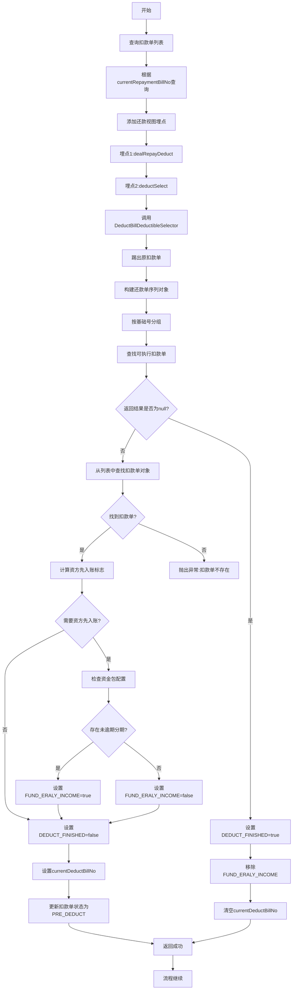
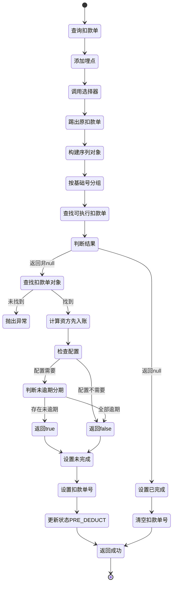

# PH170015 - 选择扣款单执行扣款

## 节点信息

| 属性 | 值 |
|------|------|
| **处理器代码** | PH170015 |
| **节点名称** | 选择扣款单执行扣款 |
| **节点类型** | PROCESS |
| **所属流程** | [[重资产分期制还款异步子流程V401]] |
| **执行阶段** | 扣款单选择阶段 |
| **实现类** | RepayApplyBizFlowPH170015ServiceImpl |
| **优先级** | P0（核心节点） |

## 功能说明

从当前还款单的扣款单列表中选择下一个待执行的扣款单,判断是否需要资方先入账回灌,设置扣款完成标志,并更新扣款单状态为PRE_DEDUCT。

### 核心职责
1. **查询扣款单列表**: 根据currentRepaymentBillNo查询所有扣款单
2. **添加还款视图埋点**: 记录扣款处理和扣款选择事件
3. **选择待执行扣款单**: 调用DeductBillDeductibleSelector选择器
4. **判断资方先入账**: 计算是否需要资方先入账回灌客账
5. **设置扣款完成标志**: 判断是否所有扣款单都已处理完成
6. **更新扣款单状态**: 将选中的扣款单状态更新为PRE_DEDUCT

### 适用场景

- **所有扣款流程**: 每次扣款前都需要选择扣款单
- **顺序扣款**: 按照扣款单序号顺序执行
- **失败跳过**: 跳过已成功和已废弃的扣款单

## 输入参数

| 参数名 | 参数代码 | 类型 | 来源 | 说明 |
|--------|----------|------|------|------|
| 当前还款单号 | currentRepaymentBillNo | String | RepayApplyBo | 当前处理的还款单号 |
| 还款申请Bo | repayApplyBo | RepayApplyBo | RepayContext | 包含所有还款信息 |
| 用户ID | uid | String | RepayContext | 用户唯一标识 |
| 业务流水号 | bizSerial | String | RepayContext | 还款生命周期Token |

## 输出参数

| 参数名 | 参数代码 | 类型 | 说明 |
|--------|----------|------|------|
| 扣款完成标志 | BIZ_FACTS_KEY_DEDUCT_FINISHED | Boolean | true表示所有扣款单已处理完成 |
| 资方先入账标志 | BIZ_FACTS_KEY_FUND_ERALY_INCOME | Boolean | true表示需要资方先入账回灌 |
| 当前扣款单号 | currentDeductBillNo | String | 下一个待执行的扣款单号 |

## 处理流程




## 核心业务逻辑

### 1. 查询扣款单列表

**查询接口**: `deductBillService.getByRepaymentBillNo(repaymentBillNo)`

**查询条件**: 根据当前还款单号查询

**返回结果**: 该还款单的所有扣款单列表

### 2. 还款视图埋点

**埋点位置**: `initFacts()` 方法

**埋点调用**:
1. `repayFlowTraceProxy.dealRepayDeduct()` - 扣款处理埋点
2. `repayFlowTraceProxy.deductSelect()` - 扣款选择埋点

**埋点数据**:
- `uid`: 用户ID
- `repayLifeToken`: 还款生命周期标识(主流程bizSerial)

**用途**: 记录还款视图中的扣款处理和扣款选择事件

### 3. 扣款单选择器

**选择器**: `DeductBillDeductibleSelector.calcDeductBillSeqStorageDeductible()`

**输入参数**: `deductBillList` - 扣款单列表

**返回结果**: `DeductBillSeqStorage` 或 `null`

**选择逻辑**:

#### 3.1 踢出原扣款单
- 如果存在Payment兜底扣款单,需要踢出原扣款单
- 判断条件: `paymentDeductFlag == true`
- 提取原扣款单号: `originDeductBillNo`
- 从列表中移除原扣款单

#### 3.2 构建还款单序列对象
为每个扣款单构建 `RepaymentBillSeqStorage`:
- 解析还款单号: `repaymentBillNo` 拆分为 `baseRepaymentBillNo` 和 `seq`
- 构建扣款单序列对象: `DeductBillSeqStorage`
  - `deductBillNo`: 扣款单号
  - `seq`: 扣款序号
  - `deductStatus`: 扣款状态

#### 3.3 按基础号分组
将还款单序列对象按 `baseRepaymentBillNo` 分组

#### 3.4 查找可执行扣款单
遍历每个分组,查找第一个可执行的扣款单:

**排序规则**: 
1. 还款单按 `seq` 升序,再按 `repaymentBillNo` 升序
2. 扣款单按 `seq` 升序,再按 `deductBillNo` 升序

**选择规则**:
1. 跳过已成功的扣款单 (`DEDUCT_SUCCESS`)
2. 跳过已废弃的扣款单 (`ABORTED`)
3. 返回第一个非成功非废弃的扣款单

**返回状态**: 只返回 `INIT` 或 `PRE_DEDUCT` 状态的扣款单

### 4. 资方先入账判断

**判断方法**: `calFundEarlyIncome()`

**判断条件**:
1. 资金包配置检查: `configFunctions.needFundIncomeEarly(assetBank, assetId)`
2. 存在未逾期分期

**未逾期分期判断**:
- 获取当前还款单的所有分期计划
- 筛选还款日期 >= 当前时间的分期
- 统计数量 > 0 则存在未逾期分期

**业务含义**:
- 某些资金包要求资方先入账,再回灌客账
- 只有存在未逾期分期时才需要资方先入账
- 已逾期分期直接客账入账即可

**返回结果**: Boolean
- `true`: 需要资方先入账回灌
- `false`: 不需要,直接客账入账

### 5. 扣款完成判断

**判断条件**: `deductBillSeqStorage == null`

**完成时操作**:
1. 设置 `DEDUCT_FINISHED = true`
2. 移除 `FUND_ERALY_INCOME`
3. 清空 `currentDeductBillNo`

**未完成时操作**:
1. 设置 `DEDUCT_FINISHED = false`
2. 设置 `FUND_ERALY_INCOME` (根据判断结果)
3. 设置 `currentDeductBillNo` 为选中的扣款单号

### 6. 更新扣款单状态

**更新接口**: `deductBillService.updateStatus()`

**更新参数**:
- `deductBillNo`: 扣款单号
- `newStatus`: `PRE_DEDUCT` (预扣款)
- `statusDesc`: "PRE_DEDUCT"
- `source`: "REPAY_ENGINE"

**业务含义**:
- 标记扣款单即将被执行
- 防止重复选择
- 便于监控和追踪

## 状态流转



## 上游节点

- [[PH160090]] - 保存扣款单

## 下游节点

- [[PH170018]] - 资方扣款指令 (条件: DEDUCT_FINISHED == false)
- [[PH170030]] - 扣款后置处理 (条件: DEDUCT_FINISHED == true)

## 异常处理

| 异常场景 | 错误码 | 处理方式 | 影响 |
|----------|--------|----------|------|
| 扣款单不存在 | REPAY_APPLY_NOT_DEDUCT_BILL | 抛出异常 | 流程中断 |
| 扣款单查询失败 | - | 抛出异常 | 流程中断 |
| 状态更新失败 | - | 抛出异常 | 流程中断 |

## 数据结构

### RepaymentBillSeqStorage (还款单序列存储器)

**核心字段**:
- `baseRepaymentBillNo`: 还款单基础号
- `repaymentBillNo`: 还款单号
- `seq`: 还款单序号
- `deductBillSeqStorageList`: 扣款单序列列表

### DeductBillSeqStorage (扣款单序列存储器)

**核心字段**:
- `deductBillNo`: 扣款单号
- `seq`: 扣款序号
- `deductStatus`: 扣款状态

## 扣款状态说明

**可执行状态**:
- `INIT`: 初始状态,待执行
- `PRE_DEDUCT`: 预扣款,即将执行

**跳过状态**:
- `DEDUCT_SUCCESS`: 扣款成功,跳过
- `ABORTED`: 已废弃,跳过

**其他状态**:
- `DEDUCT_FAILED`: 扣款失败,返回该扣款单
- `RECORD_FAILED`: 记账失败,返回该扣款单
- `PROCESSING`: 处理中,返回该扣款单

## 实现位置

```bash
repayengine-service/src/main/java/cn/caijiajia/repayengine/service/
├── repay/process/heavyasset/
│   └── RepayApplyBizFlowPH170015ServiceImpl.java  # 节点处理器 (129行)
├── deduct/util/
│   └── DeductBillDeductibleSelector.java          # 扣款单选择器 (131行)
├── bill/
│   └── IDeductBillService.java                    # 扣款单服务
├── flowtrace/
│   └── RepayFlowTraceProxy.java                   # 埋点代理
└── impl/function/
    └── ConfigFunctions.java                       # 配置函数
```

## 监控指标

- **扣款单选择成功率**: 成功次数 / 总次数
- **扣款完成比例**: DEDUCT_FINISHED=true次数 / 总次数
- **资方先入账比例**: FUND_ERALY_INCOME=true次数 / 总次数
- **选择器耗时**: P50/P95/P99
- **状态更新成功率**: 成功次数 / 总次数

## 设计考虑

### 1. 为什么要按序号顺序执行扣款单?

**原因**:
- 保证扣款顺序的确定性
- 便于追踪和排查问题
- 符合业务逻辑(先扣本金,后扣费用)

### 2. 为什么要跳过已成功和已废弃的扣款单?

**原因**:
- 已成功的扣款单不需要重复执行
- 已废弃的扣款单不应该执行
- 提高执行效率

### 3. 为什么要踢出原扣款单?

**原因**:
- Payment兜底扣款单是对原扣款单的替换
- 原扣款单已失败,不应再执行
- 避免重复扣款

### 4. 为什么需要资方先入账?

**原因**:
- 某些资金包的合规要求
- 资方需要先确认收款
- 再回灌客账完成对账

### 5. 为什么只有未逾期分期需要资方先入账?

**原因**:
- 未逾期分期资方有收款权
- 已逾期分期可能已代偿,资方无收款权
- 已逾期分期直接客账入账即可

### 6. 为什么要更新状态为PRE_DEDUCT?

**原因**:
- 标记扣款单即将被执行
- 防止重复选择(幂等性)
- 便于监控和追踪扣款进度

## 相关文档

- [[重资产分期制还款异步子流程V401]] - 所属流程
- [[扣款单选择器]] - DeductBillDeductibleSelector详细设计
- [[扣款单序号规则]] - 序号生成和排序规则
- [[Payment兜底机制]] - 兜底扣款单处理
- [[扣款单状态机]] - 扣款单状态流转
- [[资方先入账机制]] - 资方先入账业务逻辑

## 标签

#节点 #扣款单选择 #顺序执行 #资方先入账 #PH170015
