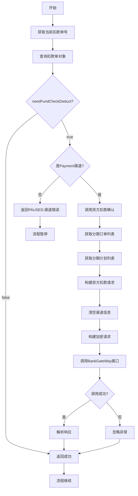
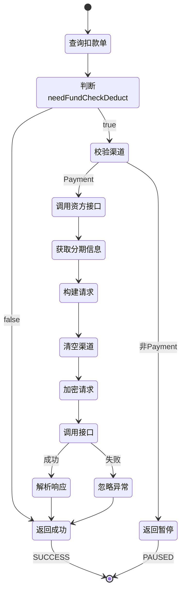

# PH170018 - 资方扣款指令

## 节点信息

| 属性 | 值 |
|------|------|
| **处理器代码** | PH170018 |
| **节点名称** | 资方扣款指令 |
| **节点类型** | PROCESS |
| **所属流程** | [[重资产分期制还款异步子流程V401]] |
| **执行阶段** | 扣款前通知阶段 |
| **实现类** | RepayApplyBizFlowPH170018ServiceImpl |
| **优先级** | P1（重要节点） |

## 功能说明

在Payment渠道扣款前,调用资方扣款确认接口,通知资方即将进行扣款操作。该节点是资方扣款的前置通知环节,不执行实际扣款,仅建立调用链路。

### 核心职责
1. **条件判断**: 检查是否需要资方确认扣款
2. **渠道校验**: 验证是否为Payment渠道
3. **资方通知**: 调用资方扣款确认接口
4. **链路建立**: 建立资方调用链路,方便问题排查
5. **结果忽略**: 不关注资方返回结果

### 适用场景

- **Payment渠道扣款**: 仅对Payment渠道的扣款单执行
- **需要资方确认**: 扣款单标记了needFundCheckDeduct=true
- **扣款前通知**: 在实际扣款前通知资方

## 输入参数

| 参数名 | 参数代码 | 类型 | 来源 | 说明 |
|--------|----------|------|------|------|
| 当前扣款单号 | currentDeductBillNo | String | RepayApplyBo | 当前处理的扣款单号 |
| 还款方式 | repayWay | RepayWay | RepayApplyBo | 主动还款/被动还款 |

## 输出参数

| 参数名 | 参数代码 | 类型 | 说明 |
|--------|----------|------|------|
| 无 | - | - | 该节点不修改上下文数据 |

## 处理流程



## 核心业务逻辑

### 1. 查询扣款单

**查询接口**: `deductBillService.getByDeductBillNo(currentDeductBillNo)`

**查询条件**: 根据当前扣款单号查询

**返回结果**: DeductBill对象

### 2. 条件判断 - needFundCheckDeduct

**判断字段**: `deductBill.fetchExtInfo().getNeedFundCheckDeduct()`

**判断逻辑**:
- 如果为false或null,直接返回成功,跳过资方通知
- 如果为true,继续执行资方通知

**业务含义**:
- 某些资金包要求扣款前通知资方
- 通过配置控制是否需要通知
- 不需要通知的直接跳过,提高效率

### 3. 渠道校验

**校验方法**: `deductBill.getPayChannel().isPayment()`

**校验逻辑**:
- 如果不是Payment渠道,返回PAUSED状态
- 错误信息: "渠道错误,请排查"

**业务含义**:
- 资方扣款指令仅适用于Payment渠道
- 其他渠道(如支付宝SDK、微信支付)不需要此步骤
- 渠道错误说明配置或流程有问题,需要人工排查

### 4. 调用资方扣款确认

**调用接口**: `bankGateWayRepayPerformer.checkFundDeduct(deductBill, repayWay)`

**调用参数**:
- `deductBill`: 扣款单对象
- `repayWay`: 还款方式

**调用流程**:

#### 4.1 获取分期信息
- 获取分期订单列表: `fetchBillStageOrderList(repaymentBillNo)`
- 获取分期计划列表: `fetchBillStagePlanList(repaymentBillNo)`

#### 4.2 构建资方扣款请求
构建RepayReq对象:
- `uid`: 用户ID
- `bank`: 资产银行
- `orderNoList`: 分期订单号列表
- `stagePlanNoList`: 分期计划号列表
- `repayLiftToken`: 还款申请号
- `repayAmount`: 扣款金额
- `ext.deductBillNo`: 扣款单号
- `ext.channel`: **设置为null** (关键:不执行实际扣款)

#### 4.3 构建加密请求
- 计算业务编码: `bizCodeGather.calcBizCodeV2(deductBill, repayReq)`
- 构建CipherRequest对象
- 设置bizCode和加密数据

#### 4.4 调用资方接口
- 调用: `bankGateWayClient.repay(request)`
- 返回: CipherResponse
- 解析响应(但不关注结果)

**关键点 - 不执行实际扣款**:
- 将channel设置为null
- 资方接收到请求后不会执行扣款
- 仅建立调用链路,记录日志

### 5. 结果处理

**成功处理**: 返回SUCCESS

**异常处理**:
- 捕获异常但不抛出
- 记录警告日志
- 返回SUCCESS

**业务含义**:
- 资方接口调用结果不影响后续流程
- 即使资方接口失败,也继续执行扣款
- 该节点的主要目的是通知和链路建立,不是强依赖

## 状态流转



## 上游节点

- [[PH170015]] - 选择扣款单执行扣款

## 下游节点

- [[PH170020V1]] - 清分试算
- [[PH170021]] - 执行扣款

## 异常处理

| 异常场景 | 错误码 | 处理方式 | 影响 |
|----------|--------|----------|------|
| 渠道错误 | - | 返回PAUSED | 流程暂停,需人工排查 |
| 资方接口异常 | - | 忽略异常,记录日志 | 无影响,继续执行 |
| 网络超时 | - | 忽略异常,记录日志 | 无影响,继续执行 |
| 扣款单查询失败 | - | 抛出异常 | 流程中断 |

## 配置说明

### needFundCheckDeduct配置

**配置位置**: `DeductBillExtInfo.needFundCheckDeduct`

**配置值**:
- `true`: 需要资方确认,执行本节点
- `false`: 不需要资方确认,跳过本节点

**配置来源**: 在扣款单生成时根据资金包配置设置

### 资方接口配置

**接口地址**: BankGateWay.repay()

**加密方式**: CipherRequest/CipherResponse

**业务编码**: 通过bizCodeGather计算

## 实现位置

```bash
repayengine-service/src/main/java/cn/caijiajia/repayengine/service/
├── repay/process/heavyasset/
│   └── RepayApplyBizFlowPH170018ServiceImpl.java  # 节点处理器 (60行)
├── performer/impl/
│   └── BankGateWayRepayPerformerImpl.java         # 资方扣款执行器
└── bill/
    └── IDeductBillService.java                    # 扣款单服务
```

## 监控指标

- **资方确认调用次数**: 总调用次数
- **资方确认成功次数**: 接口返回成功次数
- **资方确认失败次数**: 接口返回失败次数
- **资方确认超时次数**: 接口超时次数
- **渠道错误次数**: 非Payment渠道次数(应为0)
- **跳过次数**: needFundCheckDeduct=false次数

## 设计考虑

### 1. 为什么需要资方扣款指令?

**原因**:
- 链路追踪: 建立完整的扣款调用链路,方便问题排查
- 资方感知: 让资方提前感知扣款操作,做好准备
- 风控需求: 部分资方要求扣款前通知
- 日志记录: 记录扣款前的资方交互日志

### 2. 为什么不关注资方返回结果?

**原因**:
- 该节点仅为通知,不是强依赖
- 资方接口可能不稳定,不应阻塞扣款流程
- 实际扣款在后续节点执行,有独立的结果处理
- 提高系统可用性和容错性

### 3. 为什么要清空channel信息?

**原因**:
- 防止资方执行实际扣款
- 该节点仅为通知,不是真正扣款
- 通过channel=null明确告知资方这是预通知
- 实际扣款在PH170021节点执行

### 4. 为什么只支持Payment渠道?

**原因**:
- Payment渠道走资方扣款流程
- 其他渠道(支付宝SDK、微信支付)走第三方支付流程
- 第三方支付不需要资方预通知
- 渠道错误说明配置有问题,需要暂停排查

### 5. 为什么渠道错误要返回PAUSED?

**原因**:
- 渠道错误说明配置或流程有问题
- 需要人工介入排查
- 不应该继续执行,避免错误扩散
- PAUSED状态便于监控和告警

## 与实际扣款的区别

| 维度 | 资方扣款指令(PH170018) | 实际扣款(PH170021) |
|------|----------------------|-------------------|
| 目的 | 通知资方 | 执行扣款 |
| 渠道信息 | channel=null | channel=实际渠道 |
| 结果依赖 | 不关注结果 | 必须关注结果 |
| 异常处理 | 忽略异常 | 抛出异常 |
| 重试机制 | 无重试 | 有重试 |
| 幂等性 | 可重复执行 | 需要幂等控制 |

## 相关文档

- [[重资产分期制还款异步子流程V401]] - 所属流程
- [[PH170015]] - 选择扣款单执行扣款
- [[PH170021]] - 执行扣款
- [[BankGateWay接口文档]] - 资方接口说明
- [[Payment渠道扣款流程]] - Payment渠道详细说明

## 标签

#节点 #资方扣款 #扣款前通知 #Payment渠道 #PH170018
