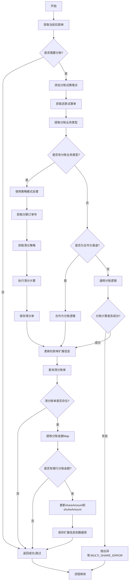
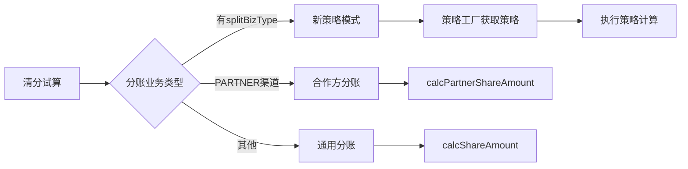
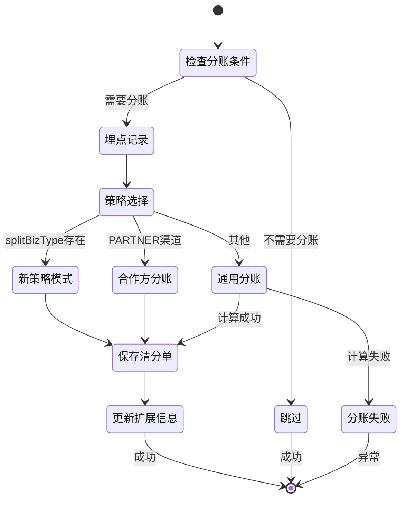

# PH170020V1 - 清分试算

## 节点信息

| 属性 | 值 |
|------|------|
| **处理器代码** | PH170020V1 |
| **节点名称** | 清分试算 |
| **节点类型** | PROCESS |
| **所属流程** | [[重资产分期制还款异步子流程V401]] |
| **执行阶段** | 扣款执行阶段 |
| **实现类** | RepayApplyBizFlowPH170020V1ServiceImpl |
| **优先级** | P0（核心节点） |

## 功能说明

在扣款后进行清分试算,计算扣款金额在各参与方(银行、数禾等)之间的分账金额。该节点是多方分账场景的核心逻辑,确保扣款金额能够正确分配给各参与方。

### 核心职责
1. **分账判断**: 判断是否需要进行分账计算
2. **埋点记录**: 记录分账试算流程埋点
3. **策略选择**: 根据分账业务类型选择清分策略
4. **清分计算**: 执行具体的清分算法
5. **清分单保存**: 保存清分试算结果到数据库
6. **扩展信息更新**: 更新扣款单的分账金额(兼容旧逻辑)

## 输入参数

| 参数名 | 参数代码 | 类型 | 来源 | 说明 |
|--------|----------|------|------|------|
| 当前扣款单号 | currentDeductBillNo | String | 流程变量 | 当前处理的扣款单 |
| 还款试算单号 | currentRepaymentBaseBillNo | String | 流程变量 | 试算单编号 |
| 还款账单号 | currentRepaymentBillNo | String | 流程变量 | 还款账单编号 |
| 用户ID | uid | String | 流程变量 | 用户唯一标识 |
| 生命周期Token | repayLifeToken/bizSerial | String | 流程变量 | 还款流程追踪标识 |

## 输出参数

| 参数名 | 参数代码 | 类型 | 说明 |
|--------|----------|------|------|
| 清分单 | ClearingBill | Object | 保存到数据库,无返回值 |

## 处理流程

## 核心业务逻辑

### 1. 分账判断逻辑

**判断方法**: `checkNeedShare(DeductBill currentDeductBill)`

**判断条件** (所有条件必须同时满足):
1. `extInfo.multiShare = true` (需要多方分账)
2. 支付类型为 `DEBIT_CARD` 或 `ALIPAY_API`
3. 支付渠道为 `PAYMENT` 或 `PARTNER`

**实现逻辑**:
- 先检查 multiShare 标志,如果为 false 或 null,直接返回 false
- 再检查支付类型,必须是借记卡或支付宝API
- 最后检查支付渠道,必须是 Payment 或 Partner

**不满足条件**: 直接返回成功,跳过分账计算

**业务含义**:
- 只有标记为多方分账的扣款单才需要清分
- 只支持借记卡和支付宝API扣款
- 只支持Payment和Partner渠道

### 2. 清分策略选择

**策略分类**:

**策略优先级**:
1. **策略模式** (最高优先级): 如果 `splitBizType != null`
2. **合作方分账**: 如果 `payChannel == PARTNER`
3. **通用分账**: 其他场景

### 3. 策略模式处理 (新逻辑)

**判断条件**: `splitBizType != null`

**处理方法**: `processWithStrategy(DeductBill, RepayTrialBill, SplitBizType)`

**处理步骤**:
1. 从试算单提取分期订单号
   - 获取路径: `repayTrialBill.getTrialResultComponent().getStageOrderRepayComponentList().get(0).getStageOrderNo()`
   - 取第一个分期订单号
2. 通过策略工厂获取对应策略
   - 调用: `clearingTrialStrategyFactory.getStrategy(splitBizType)`
   - 返回: AbstractClearingTrialStrategy 实现类
3. 执行清分计算
   - 调用: `strategy.calculateClearing(currentDeductBill, repayTrialBill, stageOrderNo)`
   - 返回: ClearingBill 清分单对象
4. 保存清分单
   - 调用: `clearingBillRepository.insertBatch(Collections.singletonList(clearingBill))`
   - 批量插入清分单到数据库

**策略接口**:
- `AbstractClearingTrialStrategy`: 抽象清分策略
- 不同的 `splitBizType` 对应不同的策略实现

**优势**:
- 扩展性强,新增分账类型只需添加新策略
- 职责清晰,策略内部处理具体算法
- 符合开闭原则

### 4. 合作方分账逻辑

**适用场景**: `payChannel == PARTNER`

**调用接口**: `iClearingService.calcPartnerShareAmount(currentDeductBill, repayTrialBill)`

**调用参数**:
- `currentDeductBill`: 当前扣款单对象
- `repayTrialBill`: 还款试算单对象

**特点**:
- 专门处理合作方渠道的分账
- 分账规则可能与普通渠道不同
- 内部会保存清分单到数据库

### 5. 通用分账逻辑

**适用场景**: 不满足上述两种情况

**调用接口**: `iClearingService.calcShareAmount(repayTrialBill, currentDeductBill)`

**调用参数**:
- `repayTrialBill`: 还款试算单对象
- `currentDeductBill`: 当前扣款单对象

**返回值**: boolean
- `true`: 分账计算成功
- `false`: 分账计算失败,抛出 `MULTI_SHARE_ERROR` 异常

**异常处理**:
- 如果返回 false,使用 REExceptionUtils 抛出客户端异常
- 错误码: ErrorCode.MULTI_SHARE_ERROR
- 流程中断,触发重试机制

### 6. 扩展信息更新 (兼容旧逻辑)

**调用方法**: `saveExtendForDeprecatedShareAmount(DeductBill deductBill)`

**目的**: 在扣款单中记录分账金额,便于快速查询

**处理步骤**:
1. 查询清分账单列表
   - 调用: `iClearingService.selectByRepaymentBill(deductBill.getRepaymentBillNo())`
   - 按还款账单号查询
2. 检查清分账单是否存在
   - 如果列表为空,直接返回
3. 提取第一个清分账单的分账结果Map
   - 获取: `clearingBillList.get(0).getClearingAmountResult()`
   - 返回: Map<String, Integer>
4. 获取银行分账金额
   - 获取: `shareMap.get("BANK")`
   - 如果为 null,直接返回
5. 计算数禾分账金额
   - 公式: `shuheAmount = deductAmount - bankShareAmount`
   - 扣款金额减去银行分账金额
6. 更新扣款单扩展信息
   - 设置: `deductBill.fetchExtInfo().setShareAmount(bankShareAmount)`
   - 设置: `deductBill.fetchExtInfo().setShuheAmount(shuheAmount)`
   - 调用: `deductBillService.updateExtInfo(repayApplyNo, deductBillNo, extInfo, REPAY_ENGINE)`

**注意**:
- 这是临时数据,分账金额会随时间变化
- RepayEngine 本不需要关心分账明细
- 仅为兼容旧逻辑保留
- 方法注释明确标注为 "Deprecated"

## 清分单数据结构

### ClearingBill

**核心字段**:
- `clearingBillNo`: 清分单编号
- `deductBillNo`: 扣款单编号
- `repaymentBillNo`: 还款账单编号
- `stageOrderNo`: 分期订单编号
- `clearingAmountResult`: 清分金额结果 (Map<String, Integer>)
  - Key: 分账方代码 (如 "BANK", "SHUHE")
  - Value: 分账金额 (单位:分)

**extend 扩展字段**:
- `stageOrderV3Resp`: 清分详细结果 (StageOrderV3Resp)

## 分账方类型

**常见分账方代码**:
- `BANK`: 银行/资金方
- `SHUHE`: 数禾平台
- `SERVICE`: 服务方
- `GUARANTEE`: 担保方
- `PLATFORM`: 平台方

## 状态流转

## 上游节点

- [[PH170015]] - 扣款执行

## 下游节点

- [[PH170021]] - 扣款结果处理

## 异常处理

| 异常场景 | 错误码 | 处理方式 | 影响 |
|----------|--------|----------|------|
| 不需要分账 | - | 返回成功 | 无,正常跳过 |
| 试算单过滤失败 | - | 正常处理 | 无 |
| 通用分账计算失败 | MULTI_SHARE_ERROR | 抛出异常 | 流程中断 |
| 策略获取失败 | - | 抛出异常 | 流程中断 |
| 清分单保存失败 | - | 抛出异常 | 流程中断 |

## 埋点记录

**埋点调用**: `repayFlowTraceProxy.deductSplitTrial()`

**埋点数据**:
- `uid`: 用户ID
- `repayLifeToken`: 还款生命周期标识

**用途**: 记录还款视图中的分账试算事件,用于数据分析

## 数据库表

### t_clearing_bill (清分账单表)

**核心字段**:
- `clearing_bill_no`: 清分单编号 (主键)
- `deduct_bill_no`: 扣款单编号
- `repayment_bill_no`: 还款账单编号
- `stage_order_no`: 分期订单编号
- `clearing_amount_result`: 清分金额结果 (JSON)
- `extend`: 扩展信息 (JSON)

**索引**:
- `idx_deduct_bill_no`: 扣款单编号
- `idx_repayment_bill_no`: 还款账单编号

### t_deduct_bill.ext_info (扣款单扩展信息)

**分账相关字段**:
- `multiShare`: 是否多方分账
- `splitBizType`: 分账业务类型
- `shareAmount`: 银行分账金额
- `shuheAmount`: 数禾分账金额

## 实现位置

**主处理器**:
- `RepayApplyBizFlowPH170020V1ServiceImpl.java`
- 路径: `repayengine-service/src/main/java/cn/caijiajia/repayengine/service/repay/process/heavyasset/`
- 行数: 175 行

**核心方法**:
- `process()`: 主处理流程 (82-119行)
- `checkNeedShare()`: 分账判断 (143-152行)
- `processWithStrategy()`: 策略模式处理 (128-140行)
- `saveExtendForDeprecatedShareAmount()`: 扩展信息更新 (157-173行)

**依赖服务**:
- `IDeductBillService`: 扣款单服务
- `IRepayCommonTrialService`: 试算服务
- `IClearingService`: 清分服务
- `ClearingTrialStrategyFactory`: 策略工厂
- `IClearingBillRepository`: 清分单仓储
- `RepayFlowTraceProxy`: 埋点代理

**策略相关**:
- `AbstractClearingTrialStrategy`: 清分策略抽象类
- `ClearingTrialStrategyFactory`: 策略工厂
- 路径: `repayengine-service/src/main/java/cn/caijiajia/repayengine/service/clearing/strategy/`

## 监控指标

- **分账执行率**: 执行分账次数 / 总扣款次数
- **分账成功率**: 分账成功次数 / 分账执行次数
- **策略分布**: 各策略使用次数统计
- **分账金额准确性**: 分账金额总和 vs 扣款金额
- **分账耗时**: P50/P95/P99

## 重要设计考虑

### 1. 为什么有三种分账逻辑?

**演进历史**:
1. **通用分账**: 最早的实现,处理普通场景
2. **合作方分账**: 针对Partner渠道的特殊逻辑
3. **策略模式**: 新架构,支持更灵活的扩展

**未来方向**: 逐步迁��到策略模式,统一分账逻辑

### 2. 为什么需要更新扣款单扩展信息?

**原因**:
- 历史兼容性:旧代码依赖 `shareAmount` 字段
- 快速查询:避免每次都关联查询清分表
- 临时过渡:最终应该完全依赖清分表

### 3. 为什么分账金额会变化?

**原因**:
- 提前结清减免
- 费用调整
- 对账差异修正

**应对**: 清分表保存完整历史,扩展信息仅供参考

## 相关文档

- [[清分系统设计]] - 清分业务架构
- [[清分策略模式]] - 策略模式详细设计
- [[多方分账规则]] - 各类分账计算规则
- [[合作方分账逻辑]] - Partner渠道特殊处理

## 标签

#节点 #清分试算 #分账 #策略模式 #PH170020V1
