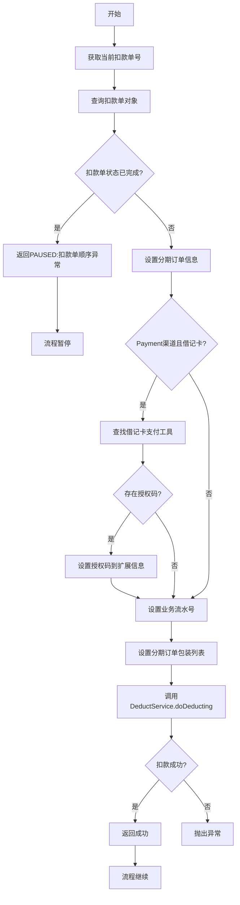
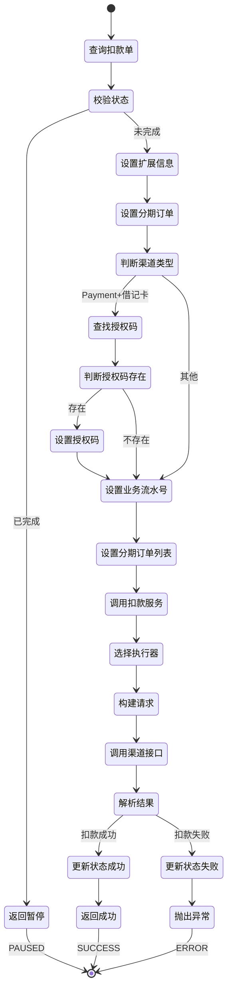

# PH170021 - 执行扣款

## 节点信息

| 属性 | 值 |
|------|------|
| **处理器代码** | PH170021 |
| **节点名称** | 执行扣款 |
| **节点类型** | PROCESS |
| **所属流程** | [[重资产分期制还款异步子流程V401]] |
| **执行阶段** | 扣款执行阶段 |
| **实现类** | RepayApplyBizFlowPH170021ServiceImpl |
| **优先级** | P0（核心节点） |

## 功能说明

核心扣款执行节点,调用DeductService执行实际的资金扣款操作。根据不同的支付渠道和支付方式,调用对应的扣款执行器完成扣款。

### 核心职责
1. **状态校验**: 检查扣款单是否已完成,避免重复扣款
2. **扩展信息设置**: 设置分期订单信息、授权码、业务流水号
3. **调用扣款服务**: 调用DeductService.doDeducting()执行扣款
4. **异常处理**: 处理扣款异常,返回暂停或失败状态

### 适用场景

- **所有扣款流程**: 所有需要执行扣款的场景
- **多种支付方式**: 支持Payment、支付宝SDK、微信支付、银行卡等
- **同步扣款**: 同步调用扣款接口,等待返回结果

## 输入参数

| 参数名 | 参数代码 | 类型 | 来源 | 说明 |
|--------|----------|------|------|------|
| 当前扣款单号 | currentDeductBillNo | String | RepayApplyBo | 当前处理的扣款单号 |
| 分期订单包装列表 | stageOrderWrapperList | List | RepayContext | 分期订单信息 |
| 支付工具列表 | payToolItemList | List | RepayApplyBo | 用户选择的支付工具 |
| 业务流水号 | bizSerial | String | RepayContext | 还款生命周期Token |

## 输出参数

| 参数名 | 参数代码 | 类型 | 说明 |
|--------|----------|------|------|
| 无 | - | - | 扣款结果由DeductService更新到扣款单 |

## 处理流程




## 核心业务逻辑

### 1. 查询扣款单

**查询接口**: `deductBillService.getDeductBillByDeductBillNo(currentDeductBillNo)`

**查询条件**: 根据当前扣款单号查询

**返回结果**: BaseDeductBill对象

### 2. 状态校验

**校验方法**: `currentDeductBill.getDeductStatus().isDeductFinished()`

**校验逻辑**:
- 如果扣款单状态已完成(成功或失败),返回PAUSED状态
- 错误信息: "扣款单顺序异常: {deductBillNo}"

**业务含义**:
- 防止重复扣款
- 扣款单应该按序执行,已完成的不应再次执行
- 状态异常说明流程有问题,需要暂停排查

**已完成状态**:
- `DEDUCT_SUCCESS`: 扣款成功
- `DEDUCT_FAILED`: 扣款失败
- `ABORTED`: 已废弃

### 3. 设置扩展信息

#### 3.1 设置分期订单信息
**设置操作**: `currentDeductBill.fetchExtInfo().setStageOrderWrapperList(stageOrderWrapperList)`

**数据来源**: `repayContext.getStageOrderWrapperList()`

**用途**: 扣款执行器需要分期订单信息来构建扣款请求

#### 3.2 设置授权码(Payment渠道+借记卡)
**判断条件**:
1. `payChannel.isPayment()`: 是Payment渠道
2. `payType == DEBIT_CARD`: 是借记卡支付

**获取授权码**:
- 从支付工具列表中查找借记卡支付工具
- 提取扩展信息中的AUTH_CODE

**设置操作**: `currentDeductBill.fetchExtInfo().setAuthCode(authCode)`

**业务含义**:
- Payment渠道的借记卡扣款需要授权码
- 授权码由用户在前端输入或通过短信验证获取
- 授权码用于验证用户身份和扣款授权

#### 3.3 设置业务流水号
**设置操作**: `currentDeductBill.fetchExtInfo().setBizSerial(bizSerial)`

**数据来源**: `repayContext.getBizSerial()`

**用途**: 关联还款流程,便于追踪和排查

### 4. 调用扣款服务

**调用接口**: `deductService.doDeducting(currentDeductBill)`

**调用参数**: BaseDeductBill对象(包含所有扣款信息和扩展信息)

**执行逻辑**:
DeductService会根据扣款单的支付渠道和支付类型,选择对应的扣款执行器:
- **Payment渠道**: 调用PaymentRepayPerformer
- **Partner渠道**: 调用PartnerRepayPerformer  
- **Docking渠道**: 调用BankGateWayRepayPerformer

**扣款流程**:
1. 构建扣款请求
2. 调用渠道接口
3. 解析扣款结果
4. 更新扣款单状态
5. 记录扣款流水

**同步调用**: 该方法是同步调用,会等待扣款结果返回

### 5. 结果处理

**成功处理**: 返回SUCCESS,流程继续

**失败处理**: 
- DeductService内部会更新扣款单状态为失败
- 抛出异常,流程中断
- 触发重试机制

## 状态流转



## 上游节点

- [[PH170018]] - 资方扣款指令
- [[PH170020V1]] - 清分试算

## 下游节点

- [[PH170030]] - 获取扣款结果

## 异常处理

| 异常场景 | 错误码 | 处理方式 | 影响 |
|----------|--------|----------|------|
| 扣款单已完成 | DEDUCT_BILL_SEQUENCES_EXCEPTION | 返回PAUSED | 流程暂停,需排查 |
| 扣款单查询失败 | - | 抛出异常 | 流程中断 |
| 扣款失败 | - | DeductService抛出异常 | 流程中断,触发重试 |
| 网络超时 | - | DeductService抛出异常 | 流程中断,触发重试 |
| 渠道异常 | - | DeductService抛出异常 | 流程中断,触发重试 |

## 扣款执行器说明

### PaymentRepayPerformer (Payment渠道)

**支持的支付类型**:
- `DEBIT_CARD`: 借记卡
- `CREDIT_CARD`: 信用卡

**扣款流程**:
1. 构建Payment扣款请求
2. 调用Payment接口
3. 解析Payment响应
4. 更新扣款单状态

### PartnerRepayPerformer (Partner渠道)

**支持的支付类型**:
- `ALIPAY_SDK`: 支付宝SDK
- `WECHAT_PAY`: 微信支付

**扣款流程**:
1. 构建第三方支付请求
2. 调用第三方支付接口
3. 解析支付响应
4. 更新扣款单状态

### BankGateWayRepayPerformer (Docking渠道)

**支持的支付类型**:
- 资方扣款

**扣款流程**:
1. 构建资方扣款请求
2. 调用BankGateWay接口
3. 解析资方响应
4. 更新扣款单状态

## 数据结构

### BaseDeductBill (扣款单对象)

**核心字段**:
- `deductBillNo`: 扣款单号
- `repaymentBillNo`: 还款单号
- `deductAmount`: 扣款金额
- `deductStatus`: 扣款状态
- `payChannel`: 支付渠道
- `payType`: 支付类型
- `extInfo`: 扩展信息

### DeductBillExtInfo (扣款单扩展信息)

**核心字段**:
- `stageOrderWrapperList`: 分期订单包装列表
- `authCode`: 授权码(Payment借记卡)
- `bizSerial`: 业务流水号
- `assetId`: 资产ID
- `needFundCheckDeduct`: 是否需要资方确认

## 实现位置

```bash
repayengine-service/src/main/java/cn/caijiajia/repayengine/service/
├── repay/process/heavyasset/
│   └── RepayApplyBizFlowPH170021ServiceImpl.java  # 节点处理器 (74行)
├── deduct/
│   ├── DeductService.java                         # 扣款服务接口
│   └── impl/
│       └── DeductServiceImpl.java                 # 扣款服务实现
├── performer/impl/
│   ├── PaymentRepayPerformerImpl.java             # Payment执行器
│   ├── PartnerRepayPerformerImpl.java             # Partner执行器
│   └── BankGateWayRepayPerformerImpl.java         # BankGateWay执行器
└── bill/
    └── IDeductBillService.java                    # 扣款单服务
```

## 监控指标

- **扣款成功率**: 成功次数 / 总次数
- **扣款耗时**: P50/P95/P99
- **渠道成功率**: 按支付渠道分类统计
- **支付方式成功率**: 按支付类���分类统计
- **状态异常次数**: 扣款单已完成次数(应为0)
- **授权码缺失次数**: Payment借记卡无授权码次数

## 设计考虑

### 1. 为什么要校验扣款单状态?

**原因**:
- 防止重复扣款
- 扣款单应该按序执行
- 状态异常说明流程有问题
- 及时发现并暂停异常流程

### 2. 为什么Payment借记卡需要授权码?

**原因**:
- 银行监管要求
- 验证用户身份
- 确认用户授权扣款
- 防止未授权扣款

### 3. 为什么要设置分期订单信息?

**原因**:
- 扣款执行器需要分期订单信息
- 构建扣款请求需要订单号
- 资方扣款需要分期计划信息
- 便于对账和追踪

### 4. 为什么是同步调用?

**原因**:
- 需要立即获取扣款结果
- 根据结果决定后续流程
- 同步调用简化流程控制
- 异步回调增加复杂度

### 5. 为什么扣款失败要抛出异常?

**原因**:
- 触发流程重试机制
- 记录异常日志
- 便于监控和告警
- 避免静默失败

## 相关文档

- [[重资产分期制还款异步子流程V401]] - 所属流程
- [[DeductService详细设计]] - 扣款服务实现
- [[Payment渠道扣款流程]] - Payment渠道详细说明
- [[扣款执行器设计]] - 各执行器实现细节
- [[扣款单状态机]] - 扣款单状态流转

## 标签

#节点 #扣款执行 #核心节点 #同步扣款 #PH170021
