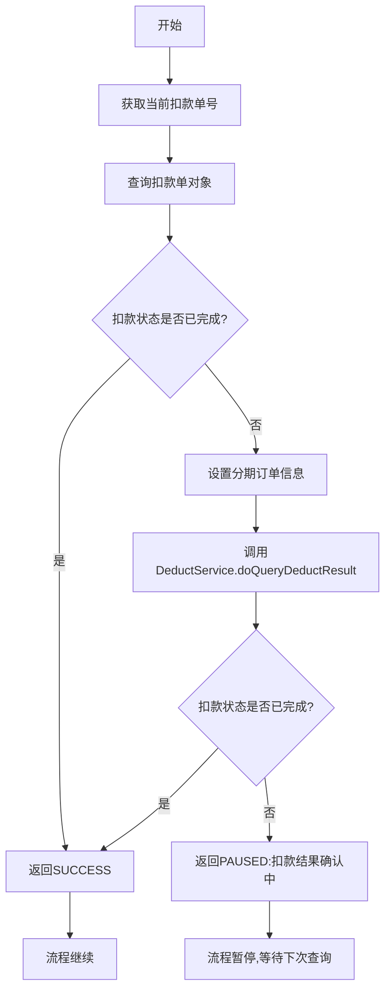
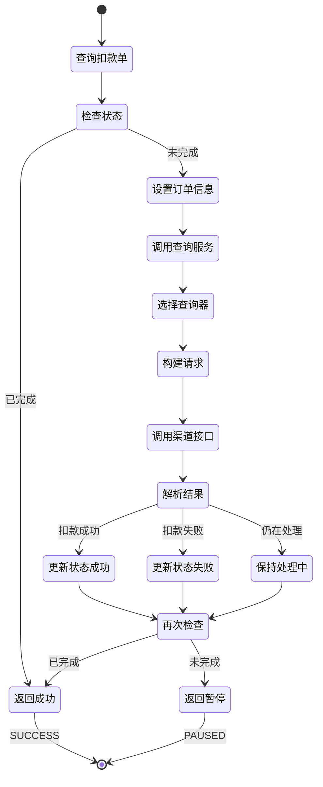

# PH170030 - 获取扣款结果

## 节点信息

| 属性 | 值 |
|------|------|
| **处理器代码** | PH170030 |
| **节点名称** | 获取扣款结果 |
| **节点类型** | PROCESS |
| **所属流程** | [[重资产分期制还款异步子流程V401]] |
| **执行阶段** | 扣款结果查询阶段 |
| **实现类** | RepayApplyBizFlowPH170030ServiceImpl |
| **优先级** | P0（核心节点） |

## 功能说明

查询并获取扣款执行的结果,判断扣款是否已完成(成功或失败),如果仍在处理中则暂停流程等待。该节点是扣款结果确认的关键环节,确保扣款状态明确后再继续后续流程。

### 核心职责
1. **查询扣款单**: 获取当前扣款单对象
2. **状态检查**: 检查扣款单是否已达到终态
3. **结果查询**: 如果未完成,调用DeductService查询扣款结果
4. **流程控制**: 根据扣款状态决定继续或暂停流程

### 适用场景

- **所有扣款流程**: 扣款执行后必须查询结果
- **异步扣款**: 支持异步扣款的结果轮询
- **状态确认**: 确保扣款状态明确后再继续

## 输入参数

| 参数名 | 参数代码 | 类型 | 来源 | 说明 |
|--------|----------|------|------|------|
| 当前扣款单号 | currentDeductBillNo | String | RepayApplyBo | 当前处理的扣款单号 |
| 分期订单包装列表 | stageOrderWrapperList | List | RepayContext | 分期订单信息 |

## 输出参数

| 参数名 | 参数代码 | 类型 | 说明 |
|--------|----------|------|------|
| 无 | - | - | 扣款结��由DeductService更新到扣款单 |

## 处理流程



## 核心业务逻辑

### 1. 查询扣款单

**查询接口**: `deductBillService.getByDeductBillNo(currentDeductBillNo)`

**查询条件**: 根据当前扣款单号查询

**返回结果**: DeductBill对象

### 2. 状态检查 - isFinishedStatus

**检查方法**: `currentDeductBill.getDeductStatus().isFinishedStatus()`

**终态判断**:
- 如果扣款单状态已是终态(成功或失败),直接返回SUCCESS
- 如果扣款单状态未完成,继续查询结果

**终态定义**:
- `DEDUCT_SUCCESS`: 扣款成功
- `DEDUCT_FAILED`: 扣款失败
- `ABORTED`: 已废弃

**非终态**:
- `INIT`: 初始状态
- `PRE_DEDUCT`: 预扣款
- `PROCESSING`: 处理中

### 3. 设置分期订单信息

**设置操作**: `currentDeductBill.fetchExtInfo().setStageOrderWrapperList(stageOrderWrapperList)`

**数据来源**: `repayContext.getStageOrderWrapperList()`

**用途**: DeductService查询结果时需要分期订单信息

### 4. 调用扣款结果查询

**调用接口**: `deductService.doQueryDeductResult(currentDeductBill)`

**调用参数**: DeductBill对象(包含扣款信息和分期订单信息)

**执行逻辑**:
DeductService会根据扣款单的支付渠道和支付类型,调用对应的查询接口:
- **Payment渠道**: 调用PaymentRepayPerformer查询接口
- **Partner渠道**: 调用PartnerRepayPerformer查询接口
- **Docking渠道**: 调用BankGateWayRepayPerformer查询接口

**查询流程**:
1. 构建查询请求
2. 调用渠道查询接口
3. 解析查询结果
4. 更新扣款单状态
5. 记录查询日志

**同步调用**: 该方法是同步调用,会等待查询结果返回

### 5. 结果处理

**已完成处理**: 返回SUCCESS,流程继续

**未完成处理**:
- 返回PAUSED状态
- 暂停原因: "扣款结果确认中"
- 流程暂停,等待下次Event触发重新查询

**业务含义**:
- 扣款可能是异步的,需要轮询查询结果
- 通过PAUSED状态实现轮询机制
- 避免长时间阻塞流程

## 状态流转



## 上游节点

- [[PH170021]] - 执行扣款

## 下游节点

- [[PH170036V1]] - 扣款后置处理 (条件: 扣款已完成)
- 自身 (条件: 扣款未完成,通过Event重新触发)

## 异常处理

| 异常场景 | 错误码 | 处理方式 | 影响 |
|----------|--------|----------|------|
| 扣款单查询失败 | - | 抛出异常 | 流程中断 |
| 渠道查询超时 | - | 保持处理中状态 | 返回PAUSED,等待下次查询 |
| 渠道返回错误 | - | 记录日志,保持处理中 | 返回PAUSED,等待下次查询 |
| 状态更新失败 | - | DeductService抛出异常 | 流程中断,触发重试 |

## 扣款状态说明

### 终态 (isFinishedStatus = true)

**成功状态**:
- `DEDUCT_SUCCESS`: 扣款成功

**失败状态**:
- `DEDUCT_FAILED`: 扣款失败
- `ABORTED`: 已废弃

### 非终态 (isFinishedStatus = false)

**待处理状态**:
- `INIT`: 初始状态
- `PRE_DEDUCT`: 预扣款

**处理中状态**:
- `PROCESSING`: 处理中

## 渠道结果查询说明

### Payment渠道查询

**查询接口**: PaymentRepayPerformer.queryDeductResult()

**支持的支付类型**:
- `DEBIT_CARD`: 借记卡
- `CREDIT_CARD`: 信用卡

**查询流程**:
1. 构建Payment查询请求
2. 调用Payment查询接口
3. 解析Payment响应
4. 更新扣款单状态

### Partner渠道查询

**查询接口**: PartnerRepayPerformer.queryDeductResult()

**支持的支付类型**:
- `ALIPAY_SDK`: 支付宝SDK
- `WECHAT_PAY`: 微信支付

**查询流程**:
1. 构建第三方支付查询请求
2. 调用第三方支付查询接口
3. 解析支付响应
4. 更新扣款单状态

### Docking渠道查询

**查询接口**: BankGateWayRepayPerformer.queryDeductResult()

**支持的支付类型**:
- 资方扣款

**查询流程**:
1. 构建资方查询请求
2. 调用BankGateWay查询接口
3. 解析资方响应
4. 更新扣款单状态

## 实现位置

```bash
repayengine-service/src/main/java/cn/caijiajia/repayengine/service/
├── repay/process/heavyasset/
│   └── RepayApplyBizFlowPH170030ServiceImpl.java  # 节点处理器 (60行)
├── deduct/
│   ├── DeductService.java                         # 扣款服务接口
│   └── impl/
│       └── DeductServiceImpl.java                 # 扣款服务实现
├── performer/impl/
│   ├── PaymentRepayPerformerImpl.java             # Payment查询器
│   ├── PartnerRepayPerformerImpl.java             # Partner查询器
│   └── BankGateWayRepayPerformerImpl.java         # BankGateWay查询器
└── bill/
    └── IDeductBillService.java                    # 扣款单服务
```

## 监控指标

- **查询成功率**: 成功查询到结果的次数 / 总查询次数
- **查询耗时**: P50/P95/P99
- **暂停次数**: 返回PAUSED的次数
- **平均查询轮次**: 从扣款到确认的平均查询次数
- **渠道查询成功率**: 按支付渠道分类统计

## 设计考虑

### 1. 为什么要检查两次isFinishedStatus?

**原因**:
- 第一次检查:避免不必要的查询调用
- 第二次检查:确认查询后的最新状态
- 提高效率,减少渠道调用

### 2. 为什么未完成要返回PAUSED?

**原因**:
- 扣款可能是异步的,需要轮询
- PAUSED状态会触发Event重新执行
- 避免长时间阻塞流程
- 支持超时和重试机制

### 3. 为什么要设置分期订单信息?

**原因**:
- 查询接口需要分期订单信息
- 构建查询请求需要订单号
- 资方查询需要分期计划信息
- 便于对账和追踪

### 4. 为什么是同步调用?

**原因**:
- 需要立即获取查询结果
- 根据结果决定是否暂停流程
- 同步调用简化流程控制
- 查询操作通常较快

### 5. 为什么查询失败不抛出异常?

**原因**:
- 查询失败可能是临时网络问题
- 保持处理中状态,等待下次查询
- 避免频繁重试导致流程中断
- 提高系统容错性

## 轮询机制

### 轮询触发

**触发方式**: Event机制

**触发条件**: 节点返回PAUSED状态

**触发间隔**: 由Event配置决定(通常20秒)

### 轮询终止

**终止条件**:
1. 扣款状态变为终态(成功或失败)
2. 达到最大重试次数
3. 流程超时

### 轮询优化

**优化策略**:
- 第一次检查避免不必要的查询
- 查询失败不立即重试
- 支持渠道侧主动回调

## 相关文档

- [[重资产分期制还款异步子流程V401]] - 所属流程
- [[DeductService详细设计]] - 扣款服务实现
- [[扣款单状态机]] - 扣款单状态流转
- [[Event重试机制]] - 流程重试机制
- [[渠道查询接口]] - 各渠道查询接口说明

## 标签

#节点 #扣款结果查询 #状态轮询 #流程控制 #PH170030
