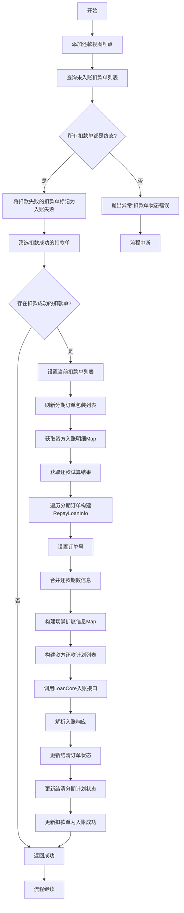
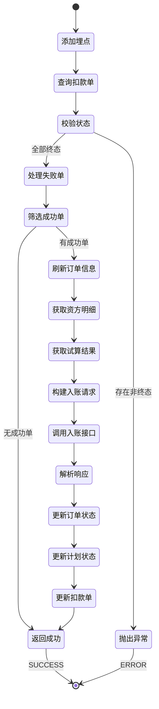

# PH170036V1 - 客账入账

## 节点信息

| 属性        | 值                                      |
| --------- | -------------------------------------- |
| **处理器代码** | PH170036V1                             |
| **节点名称**  | 客账入账                                   |
| **节点类型**  | PROCESS                                |
| **所属流程**  | [[重资产分期制还款异步子流程V401]]                  |
| **执行阶段**  | 入账处理阶段                                 |
| **实现类**   | RepayApplyBizFlowPH170036V1ServiceImpl |
| **优先级**   | P0（核心节点）                               |

## 功能说明

核心入账节点,将扣款成功的资金记入客户账户,完成还款的账务处理。该节点是还款流程的关键环节,负责将扣款结果转化为账务记录,并触发后续的订单状态更新和额度恢复。

### 核心职责
1. **埋点记录**: 记录还款视图入账事件
2. **扣款单筛选**: 筛选未入账的扣款单
3. **状态校验**: 校验扣款单状态是否为终态
4. **失败处理**: 将扣款失败的扣款单标记为入账失败
5. **成功入账**: 调用LoanCore入账接口完成客账入账
6. **订单状态更新**: 更新结清订单和分期计划状态
7. **扣款单状态更新**: 更新扣款单为入账成功

### 适用场景

- **所有扣款成功场景**: 扣款成功后必须入账
- **多扣款单场景**: 支持一个还款单对应多个扣款单
- **资方入账场景**: 支持资方先入账后回灌客账

## 输入参数

| 参数名 | 参数代码 | 类型 | 来源 | 说明 |
|--------|----------|------|------|------|
| 当前还款单号 | currentRepaymentBillNo | String | RepayApplyBo | 当前处理的还款单号 |
| 还款申请号 | repayApplyNo | String | RepayApplyBo | 还款申请唯一标识 |
| 用户ID | uid | String | RepayApplyBo | 用户唯一标识 |
| 业务流水号 | bizSerial | String | RepayContext | 还款生命周期Token |
| 分期订单包装列表 | stageOrderWrapperList | List | RepayContext | 分期订单信息 |
| 资方入账明细 | stagePlanRepayComponentList | List | RepayApplyBo | 资方入账成分明细(可选) |
| 还款试算单基础号 | currentRepaymentBaseBillNo | String | RepayApplyBo | 试算单编号 |
| 扩展信息Map | extInfoMap | Map | RepayApplyBo | 扩展信息(如免费还款标志) |

## 输出参数

| 参数名 | 参数代码 | 类型 | 说明 |
|--------|----------|------|------|
| 无 | - | - | 入账结果由LoanCore返回并更新到扣款单 |

## 处理流程



## 核心业务逻辑

### 1. 添加还款视图埋点

**埋点调用**: `repayFlowTraceProxy.dealRepayIncome()`

**埋点数据**:
- `uid`: 用户ID
- `repayLifeToken`: 还款生命周期标识

**用途**: 记录还款视图中的入账处理事件,用于数据分析

### 2. 查询未入账扣款单

**查询接口**: `deductBillService.getByRepaymentBillNo(currentRepaymentBillNo)`

**过滤条件**: `!deductStatus.isRepayFinished()`

**返回结果**: 未入账的扣款单列表

**未入账状态**:
- `INIT`: 初始状态
- `PRE_DEDUCT`: 预扣款
- `PROCESSING`: 处理中
- `DEDUCT_SUCCESS`: 扣款成功
- `DEDUCT_FAILED`: 扣款失败

### 3. 状态校验

**校验逻辑**: 所有未入账扣款单必须是终态

**终态定义**:
- `DEDUCT_SUCCESS`: 扣款成功
- `DEDUCT_FAILED`: 扣款失败

**非终态**:
- `INIT`: 初始状态
- `PRE_DEDUCT`: 预扣款
- `PROCESSING`: 处理中

**异常处理**: 如果存在非终态扣款单,抛出 `REPAY_DEDUCT_BILL_STATUS_ERROR` 异常

**业务含义**:
- 入账前必须确认所有扣款单状态明确
- 避免扣款中的订单进行入账
- 保证账务数据准确性

### 4. 处理扣款失败的扣款单

**处理方法**: `updateDeductFailedBill()`

**处理逻辑**:
1. 筛选扣款失败的扣款单
2. 按扣款序号排序
3. 调用 `repayDataService.repayDeductBillFailure()` 标记为入账失败

**业务含义**:
- 扣款失败的订单不需要入账
- 直接标记为入账失败,便于统计和追踪
- 不影响扣款成功的订单入账

### 5. 筛选扣款成功的扣款单

**筛选条件**: `deductStatus == DEDUCT_SUCCESS`

**排序规则**: 按 `deductSeqNo` 升序

**返回结果**: 扣款成功的扣款单列表

**空列表处理**: 如果没有扣款成功的订单,直接返回成功

### 6. 刷新分期订单包装列表

**刷新方法**: `refreshStageOrderWrapperByRepaymentBillNo()`

**刷新流程**:
1. 查询还款单对应的分期计划项
2. 构建StagePlanItem列表
3. 按订单号分组
4. 构建StageOrderWrapper列表

**用途**: 获取最新的分期订单和计划信息,用于入账

### 7. 获取资方入账明细

**数据来源**: `repayApplyBo.getStagePlanRepayComponentList()`

**数据结构**: `Map<String, List<StagePlanRepayComponent>>`
- Key: 分期订单号
- Value: 该订单的资方入账成分列表

**用途**: 资方先入账场景需要资方入账明细

### 8. 获取还款试算结果

**查询方法**: `repayTrialService.filterCurrRepatTrialBill()`

**查询参数**:
- 试算单基础号: `currentRepaymentBaseBillNo`
- 当前还款单号: `currentRepaymentBillNo`

**返回结果**: RepayTrialBill对象,包含试算结果成分

**用途**: 构建入账请求需要试算结果

### 9. 构建RepayLoanInfo列表

**构建逻辑**: 遍历每个分期订单,构建对应的RepayLoanInfo

**核心字段**:
- `billNo`: 分期订单号
- `repayTermInfos`: 还款期数信息列表
- `repaySceneExtInfoMap`: 场景扩展信息Map
- `bankRepayPlans`: 资方还款计划列表

#### 9.1 合并还款期数信息

**方法**: `mergeRepayTermInfo()`

**构建逻辑**:
1. 检查是否为免费还款(extInfoMap中FREE_REPAY=Y)
2. 如果是免费还款,返回空列表
3. 否则遍历分期计划,构建RepayTermInfo

**RepayTermInfo字段**:
- `termId`: 分期计划号
- `termNo`: 期数

#### 9.2 构建场景扩展信息Map

**方法**: `buildExtInfoMap()`

**构建策略**:

**策略1 - 回灌场景**: `PayType.isSuccessRecharge() || PayChannel.PARTNER`
- 调用 `reBuildDefaultExtInfo()` 构建默认场景信息
- 只包含场景和充值类型,不包含资方入账明细

**策略2 - 灵活还款场景**: `stagePlanRepayComponentList != null`
- 按还款场景分组
- 每个场景构建OrderExtInfoByScene
- 包含资方还款计划和充值类型

**策略3 - 不需要资方明细**: `!needFundIncomeDetail() || PayType.AO_OFFLINE_PAY`
- 调用 `reBuildDefaultExtInfo()` 构建默认场景信息

**策略4 - 数禾扣款**: `PayChannel.PAYMENT || PayChannel.PARTNER`
- 调用 `reBuildDefaultExtInfo()` 构建默认场景信息

**策略5 - 资方扣款**: 其他场景
- 调用BankGateWay查询资方入账明细
- 组装资方还款计划
- 查询入账单获取还款场景
- 构建OrderExtInfoByScene

**OrderExtInfoByScene字段**:
- `bankRepayPlans`: 资方还款计划列表
- `rechargeTypeEnum`: 充值类型

#### 9.3 构建资方还款计划��表

**方法**: `buildBankRepayPlanList()`

**构建条件**: 仅回灌场景需要

**构建逻辑**:
1. 检查是否为回灌场景
2. 如果不是,返回null
3. 如果是,检查资方入账明细是否为空
4. 调用 `repayTrialV3Tool.assembleBankStagePlansV3()` 组装

**异常处理**: 回灌场景资方入账明细为空时抛出异常

### 10. 调用LoanCore入账接口

**调用接口**: `loanCoreRepayService.packageRepayIncome()`

**调用参数**:
- `repayApply`: 还款申请对象
- `deductSuccessBillList`: 扣款成功的扣款单列表
- `emptyList`: 空列表(历史参数)
- `repayLoanInfoList`: 还款贷款信息列表
- `currentRepaymentBaseBillNo`: 还款单基础号

**返回结果**: RepayIncomeV2RespFeign对象

**返回字段**:
- `settleLoanList`: 结清的贷款订单号列表
- `settleTermList`: 结清的分期计划号列表

### 11. 更新结清订单状态

**更新逻辑**:
1. 从入账响应中提取结清订单号集合
2. 遍历分期计划项列表
3. 如果订单号在结清集合中,更新订单状态为 `PAY_OFF`

**订单状态**: `StageOrderStatus.PAY_OFF`

### 12. 更新结清分期计划状态

**更新逻辑**:
1. 从入账响应中提取结清分期计划号集合
2. 遍历分期计划项列表
3. 如果计划号在结清集合中,更新计划状态为 `PAY_OFF`

**计划状态**: `StagePlanStatus.PAY_OFF`

### 13. 更新扣款单为入账成功

**更新方法**: `repayDataService.repayDeductBillSuccessful()`

**更新逻辑**: 遍历扣款成功的扣款单列表,逐个更新为入账成功

**更新状态**: `RECORD_SUCCESS`

## 状态流转



## 上游节点

- [[PH170030]] - 获取扣款结果
- [[PH170131]] - 客账入账前通知资方入账 (条件: 需要资方先入账)
- [[PH170132]] - 获取资方入账明细 (条件: 需要资方先入账)

## 下游节点

- [[PH170037]] - 获取客账入账结果
- [[PH170241]] - 小贷无担保入账后同步扣款

## 异常处理

| 异常场景 | 错误码 | 处理方式 | 影响 |
|----------|--------|----------|------|
| 扣款单状态错误 | REPAY_DEDUCT_BILL_STATUS_ERROR | 抛出异常 | 流程中断 |
| 入账单状态错误 | INCOME_BILL_STATUS_ERROR | 抛出异常 | 流程中断 |
| 充值类型错误 | RECHARGE_TYPE_STATUS_ERROR | 抛出异常 | 流程中断 |
| 资方入账明细查询失败 | REPAY_QUERY_LOANCORE_INCOME_DETAIL_ERROR | 抛出异常 | 流程中断 |
| 资方成分金额错误 | REPAY_COMPONENT_ERROR | 抛出异常 | 流程中断 |
| LoanCore入账失败 | - | 抛出异常 | 流程中断,触发重试 |

## 扣款单状态说明

### 终态 (DEDUCT_FINISH_SET)

**成功状态**:
- `DEDUCT_SUCCESS`: 扣款成功

**失败状态**:
- `DEDUCT_FAILED`: 扣款失败

### 入账后状态

**入账成功**:
- `RECORD_SUCCESS`: 入账成功

**入账失败**:
- `RECORD_FAILED`: 入账失败

## 场景扩展信息说明

### OrderExtInfoByScene

**核心字段**:
- `bankRepayPlans`: 资方还款计划列表 (List<BankStagePlan>)
- `rechargeTypeEnum`: 充值类型 (String)

**使用场景**:
- 资方扣款: 包含完整的资方还款计划
- 数禾扣款: 只包含充值类型
- 回灌场景: 包含资方还款计划

### 充值类型 (RechargeType)

**计算方法**: `calRechargeType()`

**计算逻辑**:
1. 从试算结果中提取所有充值类型
2. 去重后检查是否唯一
3. 如果不唯一或为空,抛出异常
4. 返回唯一的充值类型

**业务含义**: 一个还款场景只能有一种充值类型

## 实现位置

```bash
repayengine-service/src/main/java/cn/caijiajia/repayengine/service/
├── repay/process/heavyasset/
│   └── RepayApplyBizFlowPH170036V1ServiceImpl.java  # 节点处理器 (402行)
├── repay/persistence/
│   └── IRepayDataService.java                       # 还款数据服务
├── loan/
│   └── LoanCoreRepayService.java                    # LoanCore入账服务
├── repaytrial/
│   └── IRepayCommonTrialService.java                # 试算服务
├── repaymentbill/
│   └── IRepaymentIncomeBillService.java             # 入账单服务
├── repay/repaytrialformer/
│   └── RepayTrialV3Tool.java                        # 试算工具类
└── impl/function/
    └── ConfigFunctions.java                         # 配置函数
```

## 监控指标

- **入账成功率**: 成功入账数 / 总入账数
- **入账耗时**: P50/P95/P99
- **扣款单入账比例**: 入账扣款单数 / 扣款成功单数
- **结清订单数**: 入账后结清的订单数
- **资方明细查询成功率**: 成功查询次数 / 总查询次数

## 设计考虑

### 1. 为什么要校验扣款单状态?

**原因**:
- 入账前必须确认扣款状态明确
- 避免扣款中的订单进行入账
- 保证账务数据准确性
- 防止重复入账

### 2. 为什么扣款失败也要处理?

**原因**:
- 扣款失败的订单需要标记为入账失败
- 便于统计和追踪
- 保持数据完整性
- 不影响扣款成功的订单入账

### 3. 为什么要刷新分期订单信息?

**原因**:
- 获取最新的分期订单和计划信息
- 入账需要准确的订单数据
- 避免使用过期数据
- 保证入账准确性

### 4. 为什么有多种场景扩展信息构建策略?

**原因**:
- 不同扣款渠道需要不同的入账信息
- 资方扣款需要资方入账明细
- 数禾扣款不需要资方明细
- 回灌场景需要特殊处理
- 灵活还款有多个还款场景

### 5. 为什么要更新结清状态?

**原因**:
- 入账后可能导致订单结清
- 需要及时更新订单和计划状态
- 触发后续的结清流程
- 便于用户查询和统计

### 6. 为什么要按扣款序号排序?

**原因**:
- 保证入账顺序的确定性
- 便于追踪和排查问题
- 符合业务逻辑
- 避免乱序入账

## 相关文档

- [[重资产分期制还款异步子流程V401]] - 所属流程
- [[LoanCore入账接口]] - 入账接口说明
- [[资方入账明细查询]] - 资方明细查询逻辑
- [[扣款单状态机]] - 扣款单状态流转
- [[订单结清流程]] - 订单结清处理

## 标签

#节点 #客账入账 #账务处理 #核心节点 #PH170036V1
