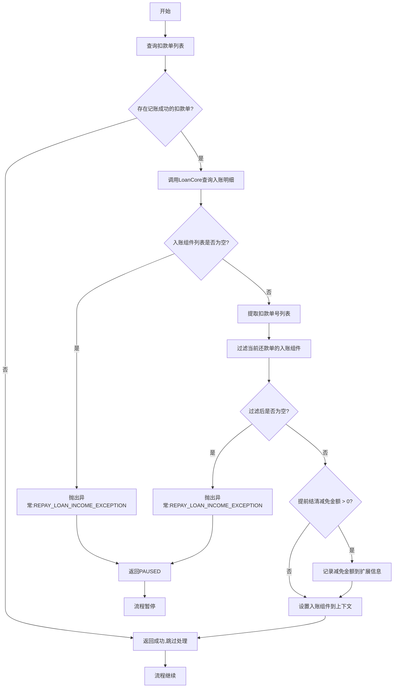
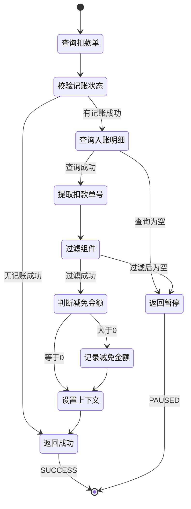

# PH170037 - 获取客账入账明细

## 节点信息

| 属性 | 值 |
|------|------|
| **处理器代码** | PH170037 |
| **节点名称** | 获取客账入账明细 |
| **节点类型** | PROCESS |
| **所属流程** | [[重资产分期制还款异步子流程V401]] |
| **执行阶段** | 入账明细查询阶段 |
| **实现类** | RepayApplyBizFlowPH170037ServiceImpl |
| **优先级** | P1（重要节点） |

## 功能说明

查询当前还款申请的客账入账明细数据,为后续资方入账通知和额度恢复提供数据基础。该节点从LoanCore查询入账组件,包含各分期计划的还款成分明细和提前结清减免金额。

### 核心职责
1. **扣款单校验**: 检查是否存在记账成功的扣款单
2. **入账明细查询**: 从LoanCore查询入账组件列表
3. **数据过滤**: 筛选出当前还款单关联的入账组件
4. **提前结清金额处理**: 记录提前结清减免金额到扩展信息
5. **数据传递**: 将入账组件写入流程上下文供下游使用

### 适用场景

- **所有入账成功场景**: 入账成功后必须查询明细
- **资方入账通知**: 为资方入账通知提供数据
- **额度恢复**: 为额度恢复提供还款明细
- **提前结清**: 记录提前结清减免金额

## 输入参数

| 参数名 | 参数代码 | 类型 | 来源 | 说明 |
|--------|----------|------|------|------|
| 还款申请号 | repayApplyNo | String | RepayApplyBo | 还款申请唯一标识 |
| 当前还款单号 | currentRepaymentBillNo | String | RepayApplyBo | 当前处理的还款单号 |

## 输出参数

| 参数名 | 参数代码 | 类型 | 说明 |
|--------|----------|------|------|
| 入账组件列表 | inComeComponentList | List | 当前还款单的入账明细组件 |

## 处理流程



## 核心业务逻辑

### 1. 查询扣款单列表

**查询接口**: `deductBillService.getByRepaymentBillNo(currentRepaymentBillNo)`

**查询条件**: 根据当前还款单号查询

**返回结果**: 该还款单的所有扣款单列表

### 2. 扣款单校验

**校验方法**: `deductBillList.stream().noneMatch(item -> DeductStatus.RECORD_SUCCESS == item.getDeductStatus())`

**校验逻辑**:
- 检查是否至少有一个扣款单状态为 `RECORD_SUCCESS`
- 如果没有记账成功的扣款单,直接返回成功

**业务含义**:
- 只有入账成功的扣款单才需要查询明细
- 避免不必要的查询调用
- 提高执行效率

### 3. 查询入账明细

**查询接口**: `loanCoreQueryService.queryIncomeDetailsByRepayApplyNo(repayApplyNo, earlySettleAmtTotal)`

**查询参数**:
- `repayApplyNo`: 还款申请号
- `earlySettleAmtTotal`: AtomicInteger对象,用于接收提前结清减免总额

**返回结果**: `List<StagePlanRepayComponent>`

**StagePlanRepayComponent包含**:
- `stageOrderNo`: 分期订单号
- `stagePlanNo`: 分期计划号
- `deductBillNo`: 扣款单号
- `repayComponentInfoList`: 还款成分明细列表
  - 本金 (PRINCIPAL)
  - 利息 (INTEREST)
  - 罚息 (PENALTY)
  - 费用 (FEE)
- `repayScene`: 还款场景

**异常处理**: 如果查询结果为空,抛出 `REPAY_LOAN_INCOME_EXCEPTION` 异常

### 4. 数据过滤

**过滤逻辑**:
1. 提取当前还款单所有扣款单号列表
2. 从入账组件列表中筛选 `deductBillNo` 在扣款单号列表中的组件
3. 得到当前还款单的入账组件列表

**过滤目的**: 确保只处理当前还款单关联的入账数据

**异常处理**: 如果过滤后为空,抛出 `REPAY_LOAN_INCOME_EXCEPTION` 异常

**业务含义**:
- 一个还款申请可能有多个还款单
- 每个还款单独立处理
- 避免数据混淆

### 5. 提前结清金额处理

**判断条件**: `earlySettleAmtTotal.get() > 0`

**处理方法**: `repayApplyService.addExtInfoReduceAmount()`

**处理参数**:
- `repayApplyNo`: 还款申请号
- `key`: `REPAY_DEDUCTED_AMOUNT`
- `value`: 减免金额

**业务含义**:
- 提前结清时会有减免金额
- 记录到还款申请扩展信息中
- 用于后续账务处理和统计

### 6. 数据传递

**设置操作**: `repayContext.getBo().setInComeComponentList(currStagePlanRepayComponentList)`

**用途**: 后续节点可通过 `getBo().getInComeComponentList()` 获取入账明细

**使用节点**:
- [[PH170039]] - 恢复额度
- [[PH170041V1]] - 通知资方入账

### 7. 异常处理

**异常捕获**: 捕获所有异常

**异常处理**:
- 记录警告日志
- 返回PAUSED状态
- 暂停原因: 异常消息

**业务含义**:
- 入账明细查询失败不应中断流程
- 通过PAUSED状态等待重试
- 避免频繁重试导致流程中断

## 状态流转



## 上游节点

- [[PH170036V1]] - 客账入账

## 下游节点

- [[PH170039]] - 恢复额度
- [[PH170041V1]] - 通知资方入账

## 异常处理

| 异常场景 | 错误码 | 处理方式 | 影响 |
|----------|--------|----------|------|
| 无记账成功扣款单 | - | 返回成功 | 无影响,正常跳过 |
| 查询入账组件为空 | REPAY_LOAN_INCOME_EXCEPTION | 返回PAUSED | 流程暂停,等待重试 |
| 过滤后组件为空 | REPAY_LOAN_INCOME_EXCEPTION | 返回PAUSED | 流程暂停,等待重试 |
| 查询异常 | - | 返回PAUSED | 流程暂停,等待重试 |
| 扣款单查询失败 | - | 抛出异常 | 流程中断 |

## 数据结构

### StagePlanRepayComponent (分期计划还款组件)

**核心字段**:
- `stageOrderNo`: 分期订单号
- `stagePlanNo`: 分期计划号
- `deductBillNo`: 扣款单号
- `repayScene`: 还款场景
- `repayComponentInfoList`: 还款成分明细列表

**还款成分类型**:
- `PRINCIPAL`: 本金
- `INTEREST`: 利息
- `PENALTY`: 罚息
- `FEE`: 费用
- `OVERDUE_INTEREST`: 逾期利息
- `OVERDUE_PENALTY`: 逾期罚息

### AtomicInteger earlySettleAmtTotal

**用途**: 接收提前结清减免总额

**传递方式**: 作为出参传入查询方法

**单位**: 分

## 实现位置

```bash
repayengine-service/src/main/java/cn/caijiajia/repayengine/service/
├── repay/process/heavyasset/
│   └── RepayApplyBizFlowPH170037ServiceImpl.java  # 节点处理器 (90行)
├── loan/
│   └── LoanCoreQueryService.java                  # LoanCore查询服务
├── bill/
│   └── IDeductBillService.java                    # 扣款单服务
└── repayapply/
    └── IRepayApplyService.java                    # 还款申请服务
```

## 监控指标

- **查询成功率**: 成功查询入账组件 / 总调用次数
- **过滤后为空率**: 过滤后为空次数 / 查询成功次数
- **提前结清比例**: 有减免金额次数 / 总处理次数
- **查询耗时**: P50/P95/P99
- **暂停次数**: 返回PAUSED的次数

## 设计考虑

### 1. 为什么要校验记账成功状态?

**原因**:
- 只有入账成功的扣款单才有明细
- 避免不必要的查询调用
- 提高执行效率
- 减少LoanCore压力

### 2. 为什么查询失败返回PAUSED而不是抛出异常?

**原因**:
- 查询失败可能是临时问题
- 通过PAUSED状态等待重试
- 避免频繁重试导致流程中断
- 提高系统容错性

### 3. 为什么要过滤入账组件?

**原因**:
- 一个还款申请可能有多个还款单
- 每个还款单独立处理
- 避免数据混淆
- 保证数据准确性

### 4. 为什么要记录提前结清减免金额?

**原因**:
- 提前结清时会有减免金额
- 需要记录到扩展信息中
- 用于后续账务处理
- 便于统计和对账

### 5. 为什么使用AtomicInteger传递减免金额?

**原因**:
- 作为出参接收查询结果
- 避免返回多个值
- 简化接口设计
- Java不支持多返回值

## 相关文档

- [[重资产分期制还款异步子流程V401]] - 所属流程
- [[LoanCore入账明细查询]] - 入账组件查询逻辑
- [[提前结清减免计算]] - 减免金额计算规则
- [[扣款单状态机]] - 扣款单状态流转
- [[分期计划还款组件]] - StagePlanRepayComponent结构

## 标签

#节点 #获取入账明细 #LoanCore查询 #提前结清 #PH170037
