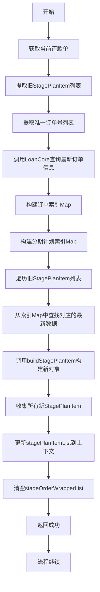
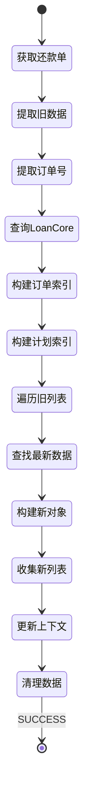

# PH170038 - 入账后更新订单信息

## 节点信息

| 属性 | 值 |
|------|------|
| **处理器代码** | PH170038 |
| **节点名称** | 入账后更新订单信息 |
| **节点类型** | PROCESS |
| **所属流程** | [[重资产分期制还款异步子流程V401]] |
| **执行阶段** | 入账后置阶段 |
| **实现类** | RepayApplyBizFlowPH170038ServiceImpl |
| **优先级** | P1（重要节点） |

## 功能说明

在客账入账成功后,从LoanCore查询最新的订单和分期计划信息,刷新上下文中的StagePlanItem列表,确保后续节点能够使用最新的订单状态数据。该节点是入账后数据同步的关键环节,特别是为结清返现和优惠返现提供准确的状态信息。

### 核心职责
1. **获取当前还款单**: 从还款单列表中获取当前处理的还款单
2. **提取旧数据**: 提取旧的StagePlanItem列表作为映射基准
3. **提取订单号**: 提取唯一的分期订单号列表
4. **查询最新数据**: 从LoanCore查询最新的订单和分期计划信息
5. **构建索引**: 构建订单和分期计划的索引Map
6. **重建列表**: 使用最新数据重建StagePlanItem列表
7. **更新上下文**: 更新上下文中的stagePlanItemList
8. **清理数据**: 清空stageOrderWrapperList释放内存

### 适用场景

- **入账后数据刷新**: 入账完成后订单状态发生变化需要刷新
- **结清状态同步**: 入账后可能导致订单结清,需要同步最新状态
- **后续节点依赖**: 结清返现、优惠返现依赖最新的lendStatus和orderStatus

## 输入参数

| 参数名 | 参数代码 | 类型 | 来源 | 说明 |
|--------|----------|------|------|------|
| 当前还款单号 | currentRepaymentBillNo | String | RepayApplyBo | 当前处理的还款单号 |
| 还款单列表 | repaymentBillList | List | RepayApplyBo | 所有还款单列表 |
| 用户ID | uid | String | RepayContext | 用户唯一标识 |

## 输出参数

| 参数名 | 参数代码 | 类型 | 说明 |
|--------|----------|------|------|
| 分期计划项列表 | stagePlanItemList | List | 更新为最新的分期计划项列表 |
| 分期订单包装列表 | stageOrderWrapperList | List | 清空为null |

## 处理流程



## 核心业务逻辑

### 1. 获取当前还款单

**获取方法**: `RepaymentBillUtils.safetyBaseRepaymentBill()`

**获取参数**:
- `currentRepaymentBillNo`: 当前还款单号
- `repaymentBillList`: 还款单列表

**返回结果**: BaseRepaymentBill对象

**用途**: 获取当前还款单的分期订单项列表

### 2. 提取旧StagePlanItem列表

**提取逻辑**:
1. 从还款单获取stageOrderItemList
2. 遍历每个StageOrderItem
3. 提取每个订单的stagePlanItemList
4. 使用flatMap展平为一维列表

**用途**: 作为映射基准,确保新旧数据一一对应

### 3. 提取唯一订单号列表

**提取逻辑**:
1. 从还款单获取stageOrderItemList
2. 提取每个订单的stageOrderNo
3. 去重(distinct)
4. 收集为列表

**用途**: 作为LoanCore查询参数

### 4. 查询最新订单信息

**查询接口**: `loanCoreQueryService.listStageOrderWrapper()`

**查询参数**:
- `uid`: 用户ID
- `stageOrderNoList`: 订单号列表
- `null`: 分期计划号列表(不限制)
- `ContractQueryRangeEnum.BNP.getRange()`: 查询范围(账单、通知、计划)
- `null`: 其他参数

**返回结果**: `List<StageOrderWrapper>`

**StageOrderWrapper包含**:
- 订单基本信息: stageOrderNo, bank, assetId, billStatus, orderStatus等
- 分期计划列表: stagePlanList

**查询范围说明**:
- `BNP`: Bill + Notification + Plan
- 包含账单、通知、分期计划的完整信息

### 5. 构建订单索引Map

**构建逻辑**: 使用Stream API将订单列表转换为Map

**Map结构**:
- Key: stageOrderNo (订单号)
- Value: StageOrderWrapper (订单对象)

**用途**: 快速查找订单信息

### 6. 构建分期计划索引Map

**构建逻辑**:
1. 从每个订单提取stagePlanList
2. 使用flatMap展平为一维列表
3. 转换为Map

**Map结构**:
- Key: stagePlanNo (分期计划号)
- Value: StageOrderWrapper.StagePlan (分期计划对象)

**用途**: 快速查找分期计划信息

### 7. 重建StagePlanItem列表

**重建逻辑**:
1. 遍历旧StagePlanItem列表
2. 从订单索引Map中查找对应的最新订单
3. 从分期计划索引Map中查找对应的最新分期计划
4. 调用buildStagePlanItem构建新对象
5. 收集所有新对象为列表

**映射关系**: 以旧列表为基准,确保数量一致

### 8. buildStagePlanItem方法

**构建逻辑**: 使用Builder模式构建StagePlanItem对象

**字段来源**:

**从StageOrderWrapper获取**:
- `stageOrderNo`: 分期订单号
- `assetBank`: 资方银行(bank字段)
- `assetId`: 资产包ID
- `billStatus`: 账单状态
- `orderStatus`: 订单状态(是否结清)
- `businessType`: 业务类型
- `product`: 产品信息
- `channel`: 渠道
- `firstInterestDate`: 首个计息日
- `amcCode`: AMC编码

**从StagePlan获取**:
- `stagePlanNo`: 分期计划号
- `stageNo`: 期数(转换为short)
- `lendStatus`: 放款/还款状态(是否结清)
- `exceedStatus`: 逾期状态
- `repaymentDate`: 应还款日

### 9. 更新上下文

**更新操作**:
1. 设置新的stagePlanItemList到RepayApplyBo
2. 清空stageOrderWrapperList(设为null)

**清空原因**:
- stageOrderWrapperList是大对象
- 后续节点不再需要
- 释放内存,避免长期占用

## 状态流转



## 上游节点

- [[PH170036V1]] - 客账入账
- [[PH170037]] - 获取客账入账明细

## 下游节点

- [[PH170069]] - 结清返现记录 (依赖最新orderStatus)
- [[PH170075]] - 优惠返现记录 (依赖最新lendStatus)

## 异常处理

| 异常场景 | 错误码 | 处理方式 | 影响 |
|----------|--------|----------|------|
| 还款单查询失败 | - | 抛出异常 | 流程中断 |
| LoanCore查询异常 | - | 抛出异常 | 流程中断,触发重试 |
| 订单数据为空 | - | 抛出NPE | 流程中断 |
| 分期计划数据为空 | - | 抛出NPE | 流程中断 |
| 数据映射失败 | - | 抛出异常 | 流程中断 |

## StagePlanItem字段说明

### 订单级别字段

**来源**: StageOrderWrapper

- `stageOrderNo`: 分期订单号
- `assetBank`: 资方银行
- `assetId`: 资产包ID
- `billStatus`: 账单状态
- `orderStatus`: 订单状态(是否结清) - **关键字段**
- `businessType`: 业务类型
- `product`: 产品信息
- `channel`: 渠道
- `firstInterestDate`: 首个计息日
- `amcCode`: AMC编码

### 分期计划级别字段

**来源**: StageOrderWrapper.StagePlan

- `stagePlanNo`: 分期计划号
- `stageNo`: 期数
- `lendStatus`: 放款/还款状态(是否结清) - **关键字段**
- `exceedStatus`: 逾期状态
- `repaymentDate`: 应还款日

### 关键状态字段

**orderStatus**: 订单级别的结清状态
- 用于判断整个订单是否结清
- 结清返现依赖此字段

**lendStatus**: 分期计划级别的结清状态
- 用于判断单个分期是否结清
- 优惠返现依赖此字段

## 实现位置

```bash
repayengine-service/src/main/java/cn/caijiajia/repayengine/service/
├── repay/process/heavyasset/
│   └── RepayApplyBizFlowPH170038ServiceImpl.java  # 节点处理器 (120行)
├── loan/
│   └── LoanCoreQueryService.java                  # LoanCore查询服务
└── repaymentbill/util/
    └── RepaymentBillUtils.java                    # 还款单工具类
```

## 监��指标

- **查询成功率**: 成功查询次数 / 总调用次数
- **查询耗时**: P50/P95/P99
- **数据映射成功率**: 成功映射次数 / 总映射次数
- **订单数量**: 平均每次查询的订单数量
- **分期计划数量**: 平均每次查询的分期计划数量

## 设计考虑

### 1. 为什么要刷新订单信息?

**原因**:
- 入账后订单状态可能发生变化
- 特别是结清状态需要及时同步
- 后续节点依赖最新状态
- 保证数据准确性

### 2. 为什么要清空stageOrderWrapperList?

**原因**:
- stageOrderWrapperList是大对象
- 包含大量详细信息
- 后续节点不再需要
- 释放内存,避免长期占用
- 提高系统性能

### 3. 为什么要构建索引Map?

**原因**:
- 提高查找效率
- 避免嵌套循环
- 时间复杂度从O(n²)降到O(n)
- 代码更简洁

### 4. 为什么以旧列表为基准映射?

**原因**:
- 保证数量一致
- 保持原有顺序
- 避免数据丢失
- 确保映射关系正确

### 5. 为什么使用BNP查询范围?

**原因**:
- B(Bill): 账单信息
- N(Notification): 通知信息
- P(Plan): 分期计划信息
- 获取完整的订单数据
- 满足后续节点需求

### 6. 为什么异常要向上抛出?

**原因**:
- 数据刷新失败不应继续
- 避免使用过期数据
- 触发流程重试机制
- 保证数据准确性

## 相关文档

- [[重资产分期制还款异步子流程V401]] - 所属流程
- [[LoanCore订单查询]] - 订单查询接口说明
- [[StagePlanItem数据结构]] - StagePlanItem字段说明
- [[结清状态判断]] - orderStatus和lendStatus说明
- [[PH170069]] - 结清返现记录
- [[PH170075]] - 优惠返现记录

## 标签

#节点 #入账后处理 #订单状态更新 #数据刷新 #PH170038
