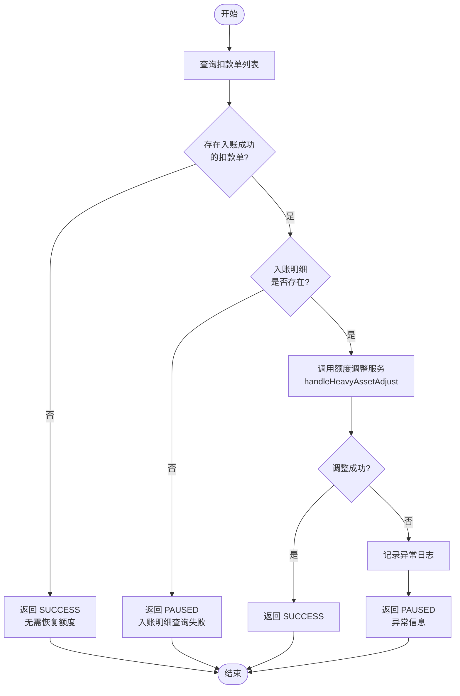
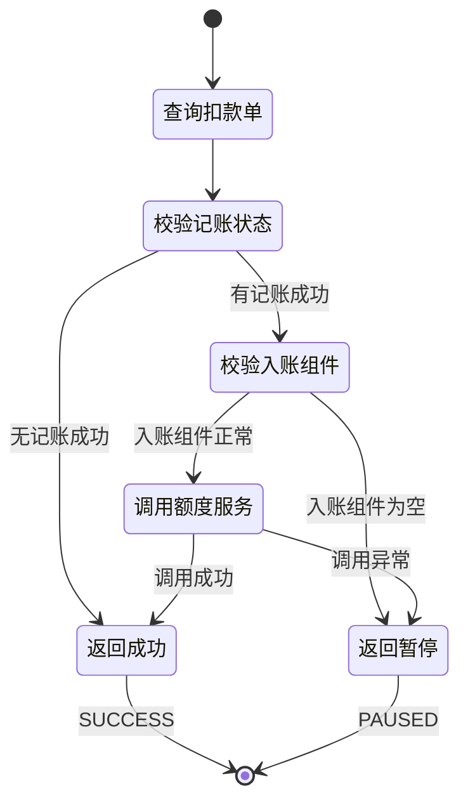

# PH170039 - 恢复额度

## 节点信息

| 属性 | 值 |
|------|------|
| **处理器代码** | PH170039 |
| **节点名称** | 恢复额度 |
| **节点类型** | PROCESS |
| **所属流程** | [[重资产分期制还款异步子流程V401]] |
| **执行阶段** | 入账后置阶段 |
| **实现类** | RepayApplyBizFlowPH170039ServiceImpl |
| **优先级** | P1（重要节点） |

## 功能说明

在客账入账成功后,根据还款金额恢复用户的可用授信额度,维护额度的实时准确性。该节点通过重资产额度调整服务完成额度恢复,并具备完善的异常处理和幂等控制机制。

### 核心职责
1. **扣款单校验**: 检查是否存在记账成���的扣款单
2. **入账组件校验**: 校验入账组件列表是否有效
3. **额度调整**: 调用重资产额度调整服务恢复额度
4. **异常处理**: 处理额度恢复失败场景

### 适用场景

- **所有入账成功场景**: 入账成功后必须恢复额度
- **重资产分期**: 专门处理重资产分期的额度恢复
- **部分还款**: 支持部分还款的额度渐进恢复
- **提前结清**: 支持提前结清时的完整额度恢复

## 输入参数

| 参数名 | 参数代码 | 类型 | 来源 | 说明 |
|--------|----------|------|------|------|
| 还款申请号 | repayApplyNo | String | RepayApplyBo | 还款申请唯一标识 |
| 当前还款单号 | currentRepaymentBillNo | String | RepayApplyBo | 当前处理的还款单号 |
| 用户ID | uid | String | RepayContext | 用户唯一标识 |
| 入账组件列表 | inComeComponentList | List | RepayApplyBo | 来自PH170037的入账明细 |

## 输出参数

| 参数名 | 参数代码 | 类型 | 说明 |
|--------|----------|------|------|
| 无 | - | - | 额度恢复结果由HeavyAssetAdjustmentService处理 |

## 处理流程

## 核心业务逻辑

### 1. 查询扣款单列表

根据当前还款单号查询所有扣款单,用于判断是否需要恢复额度。

### 2. 扣款单校验

检查是否至少有一个扣款单状态为 `RECORD_SUCCESS`:
- 若无记账成功的扣款单,直接返回 SUCCESS
- 只有成功记账的扣款才需要恢复额度

### 3. 入账组件校验

检查上下文中的 `inComeComponentList` 是否为空:
- 若为空,返回 PAUSED (错误码: `REPAY_QUERY_LOANCORE_INCOME_DETAIL_ERROR`)
- 入账组件是额度恢复的数据基础,无法计算恢复金额时需等待重试

### 4. 调用重资产额度调整服务

调用 `heavyAssetAdjustmentService.handleHeavyAssetAdjust()` 执行额度恢复:

**传入参数**:
- 还款申请号 (`repayApplyNo`)
- 还款单号 (`currentRepaymentBillNo`)
- 用户ID (`uid`)
- 入账组件列表 (`inComeComponentList`)

**服务职责**:
1. 解析入账组件,提取本金还款金额
2. 计算可恢复额度 (仅本金恢复额度)
3. 调用额度系统恢复额度
4. 记录额度变更日志
5. 处理幂等性控制

**异常处理**:
- 捕获所有异常并记录警告日志
- 返回 PAUSED 状态,流程暂停等待重试

## 状态流转

## 上游节点

- [[PH170037]] - 获取客账入账明细

## 下游节点

- [[PH170041V1]] - 通知资方入账

## 异常处理

| 异常场景 | 错误码 | 处理方式 | 影响 |
|----------|--------|----------|------|
| 无记账成功扣款单 | - | 返回SUCCESS | 无,正常跳过 |
| 入账组件为空 | REPAY_QUERY_LOANCORE_INCOME_DETAIL_ERROR | 返回PAUSED | 流程暂停,等待重试 |
| 额度服务调用失败 | - | 返回PAUSED | 流程暂停,等待重试 |
| 幂等性冲突 | - | 正常处理 | 无,跳过重复调用 |
| 网络超时 | - | 返回PAUSED | 流程暂停,等待重试 |

## 核心服务说明

### HeavyAssetAdjustmentService.handleHeavyAssetAdjust()

**核心功能**:

1. **额度计算**: 从入账组件中提取本金还款金额,仅本金还款恢复额度 (利息、罚息、费用不恢复)
2. **幂等控制**: 检查还款申请是否已处理,防止重复恢复额度,使用数据库唯一索引保证
3. **额度恢复**: 调用 CreditCore 或 LoanCore 额度接口,同步或异步恢复取决于配置
4. **日志记录**: 记录额度变更历史、恢复前后额度,用于对账和审计

## 额度恢复规则

### 本金恢复规则

**原则**: 还多少本金,恢复多少额度

**示例**:
- 用户授信额度 10000 元
- 已用额度 8000 元
- 本次还本金 2000 元
- 恢复后可用额度: 2000 + 2000 = 4000 元

### 利息/罚息/费用

**原则**: 不恢复额度

**原因**: 这些费用不占用授信额度

### 提前结清

**特殊处理**:
- 提前结清减免金额已在PH170037记录
- 额度恢复基于实际还款金额
- 不包含减免部分

### 部分还款

**处理逻辑**:
- 按实际还款本金金额恢复
- 支持多次部分还款累计恢复
- 每次恢复都有独立记录

## 实现位置

**节点处理器**: `RepayApplyBizFlowPH170039ServiceImpl.java` (73行)
- 路径: `repayengine-service/.../repay/process/heavyasset/`

**核心服务**:
- `HeavyAssetAdjustmentService` - 重资产额度调整服务
- `IDeductBillService` - 扣款单查询服务

## 监控指标

- **额度恢复成功率**: 成功次数 / 总调用次数
- **额度恢复金额**: 总恢复金额统计
- **异常率**: 异常次数 / 总调用次数
- **幂等拦截率**: 幂等拦截次数 / 总调用次数
- **恢复耗时**: P50/P95/P99
- **暂停次数**: 返回PAUSED的次数

## 设计考虑

### 1. 为什么只有本金才恢复额度?

**原因**:
- 授信额度是借款额度
- 利息/罚息/费用不占用授信额度
- 还款本金才代表偿还了借款
- 符合金融逻辑

### 2. 为什么额度调整失败返回PAUSED?

**原因**:
- 额度恢复是重要操作
- 失败可能是临时问题
- 通过PAUSED等待重试
- 避免额度数据不一致

### 3. 为什么需要幂等控制?

**原因**:
- 流程可能重试
- 避免重复恢复额度
- 保证数据准确性
- 防止额度异常增加

### 4. 为什么要校验入账组件?

**原因**:
- 入账组件是额度恢复的数据基础
- 没有入账组件无法计算恢复金额
- 及早发现问题
- 避免错误的额度恢复

### 5. 为什么无记账成功扣款单要跳过?

**原因**:
- 没有成功记账就没有还款
- 不需要恢复额度
- 避免不必要的调用
- 提高执行效率

## 相关文档

- [[重资产分期制还款异步子流程V401]] - 所属流程
- [[重资产额度管理]] - 额度系统设计
- [[额度恢复规则]] - 详细恢复规则
- [[HeavyAssetAdjustmentService]] - 服务实现文档
- [[额度幂等控制]] - 幂等性设计

## 标签

#节点 #额度恢复 #重资产 #幂等控制 #PH170039
