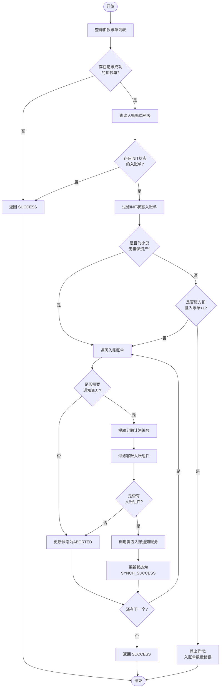
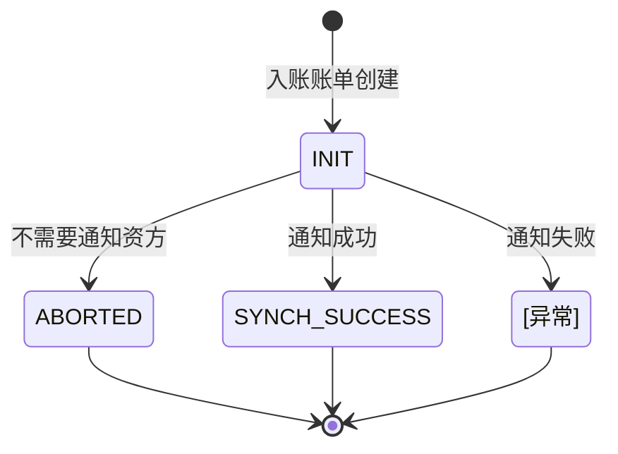

# PH170041V1 - 通知资方入账

## 节点信息

| 属性 | 值 |
|------|------|
| **处理器代码** | PH170041V1 |
| **节点名称** | 通知资方入账 |
| **节点类型** | PROCESS |
| **所属流程** | [[重资产分期制还款异步子流程V401]] |
| **执行阶段** | 入账后置阶段 |
| **实现类** | RepayApplyBizFlowPH170041V1ServiceImpl |
| **优先级** | P1（重要节点） |

## 功能说明

在客账入账完成后,通知资金方系统进行入账处理,完成资金的最终清分。该节点负责筛选待通知的入账账单,校验资方配置,组装通知数据并调用资方接口。

### 核心职责
1. **入账单筛选**: 过滤出待通知的入账账单
2. **资方校验**: 检查资方是否需要通知入账
3. **数据构建**: 组装资方入账通知数据
4. **调用资方接口**: 通过 BankGateway 通知资方系统
5. **状态更新**: 更新入账账单同步状态

### 适用场景

- **资方扣款场景**: 资方代扣后需要通知入账结果
- **小贷无担保资产**: 支持多还款场景的入账通知
- **联合贷款**: 需要同步入账信息给资方
- **资方对账**: 保证资方账务数据一致性

## 输入参数

| 参数名 | 参数代码 | 类型 | 来源 | 说明 |
|--------|----------|------|------|------|
| 还款申请编号 | repayApplyNo | String | RepayApplyBo | 还款申请单号 |
| 还款账单编号 | currentRepaymentBillNo | String | RepayApplyBo | 当前还款账单号 |
| 入账组件列表 | inComeComponentList | List | RepayApplyBo | 客账入账成功的组件 |

## 输出参��

| 参数名 | 参数代码 | 类型 | 说明 |
|--------|----------|------|------|
| 无 | - | - | 仅更新数据库状态 |

## 处理流程

## 核心业务逻辑

### 1. 查询扣款账单列表

根据还款账单号查询所有��款单,筛选出 `RECORD_SUCCESS` 状态的扣款单:
- 若无记账成功的扣款单,直接返回 SUCCESS
- 记账成功的扣款单用于后续资方通知

### 2. 查询入账账单列表

根据还款账单号查询所有入账账单,筛选出 `INIT` 状态的入账单:
- 若无待入账账单,直接返回 SUCCESS
- `INIT` 状态表示待通知资方

### 3. 小贷无担保资产检查

检查所有入账账单是否都属于小贷无担保资产:
- 通过 `grayApiConfigs.getXdUnsecuredAssetList()` 判断
- 小贷无担保资产允许多入账单场景 (支持多还款场景)

### 4. 资方扣场景校验

对于资方扣款场景 (`payChannel.isDocking()`):
- 非小贷无担保资产时,入账单数量必须为 1
- 若入账单 > 1,抛出 `INCOME_BILL_SIZE_ERROR` 异常
- 资方扣场景下只能有一种还款场景

### 5. 遍历入账账单处理

对每个入账账单执行以下步骤:

#### 5.1 资方通知判断

调用 `configFunctions.noneIncomeNotify(assetBank, assetId)` 判断:
- 返回 `true`: 不需要通知,更新状态为 `ABORTED`
- 返回 `false`: 继续通知流程

#### 5.2 提取分期计划编号

从入账账单的 `incomeOrderList` 中提取所有分期计划编号:
- 遍历订单列表
- 提取计划信息列表
- 收集所有计划编号并去重

#### 5.3 过滤客账入账组件

从上下文的 `inComeComponentList` 中过滤出对应的入账组件:
- 根据分期计划编号匹配
- 若无匹配的入账组件,更新状态为 `ABORTED`

#### 5.4 调用资方入账通知服务

调用 `fundInComeNotifyService.incomeNotifyToFund()`:

**传入参数**:
- `repayApply`: 还款申请对象
- `notifiedDeductBillList`: 记账成功的扣款单列表
- `incomeBill`: 当前入账账单
- `hbInComeComponentList`: 客账入账组件列表

**服务职责**:
1. 查询分期订单包装对象
2. 构建分期计划 Map
3. 判断是否需要放款金额
4. 构建通知计划列表
5. 按还款订单号分组
6. 遍历分期订单构建通知对象
7. 通过 BankGateway 发送通知

#### 5.5 更新入账账单状态

通知成功后,更新入账账单状态为 `SYNCH_SUCCESS`

### 6. 异常处理

捕获所有异常并记录警告日志,然后向上抛出异常触发流程重试

## 状态流转

**状态说明**:
- `INIT`: 初始状态,等待通知
- `ABORTED`: 已放弃,不需要通知
- `SYNCH_SUCCESS`: 同步成功

## 上游节点

- [[PH170039]] - 恢复额度

## 下游节点

- [[PH170045]] - 入账结果推送台账

## 异常处理

| 异常场景 | 处理方式 | 错误码 |
|----------|----------|--------|
| 无记账成功的扣款单 | 直接返回成功 | - |
| 无待入账账单 | 直接返回成功 | - |
| 资方扣场景入账单>1(非小贷) | 抛出异常 | INCOME_BILL_SIZE_ERROR |
| 无入账组件数据 | 更新状态为ABORTED | - |
| 资方通知调用异常 | 记录警告日志,抛出异常 | - |

## 灰度配置

### 小贷无担保资产列表

通过 `GrayApiConfigs.xdUnsecuredAssetList` 配置:
- 用于判断是否允许多入账单场景
- 支持动态灰度切换

### 资方通知开关

通过 `ConfigFunctions` 控制:
- `noneIncomeNotify(assetBank, assetId)`: 判断是否跳过通知
- `incomeNotifyNeedLendAmt(assetBank, assetId)`: 判断是否需要放款金额

## 数据库表

### t_deduct_bill (扣款账单表)

**关键字段**:
- `repayment_bill_no`: 关联还款账单
- `deduct_status`: 扣款状态(筛选 RECORD_SUCCESS)
- `pay_channel`: 支付渠道 (判断是否资方扣)
- `pay_type`: 支付方式
- `pay_instrument_no`: 支付工具编号

### t_repayment_income_bill (入账账单表)

**关键字段**:
- `income_bill_no`: 入账账单编号
- `repayment_bill_no`: 关联还款账单
- `synch_status`: 同步状态(INIT/SYNCH_SUCCESS/ABORTED)
- `asset_bank`: 资产银行
- `asset_id`: 资产编号
- `income_order_list`: 入账订单列表 (JSON)

## 实��位置

**节点处理器**: `RepayApplyBizFlowPH170041V1ServiceImpl.java` (196行)
- 路径: `repayengine-service/.../repay/process/heavyasset/`

**核心服务**:
- `FundInComeNotifyService` - 资方入账通知服务
- `IRepaymentIncomeBillService` - 入账账单服务
- `IDeductBillService` - 扣款账单服务
- `ConfigFunctions` - 配置函数服务

## 监控指标

- **入账单通知率**: 通知成功数 / 总待通知数
- **资方通知耗时**: P50/P95/P99
- **异常率**: 异常次数 / 总调用次数
- **ABORTED比例**: 跳过通知数 / 总入账单数
- **小贷无担保资产占比**: 小贷资产数 / 总资产数

## 设计考虑

### 1. 为什么小贷无担保资产允许多入账单?

**原因**:
- 小贷无担保资产支持多种还款场景
- 可能同时存在正常还款和提前结清
- 需要分别通知资方不同场景的入账
- 符合小贷业务特性

### 2. 为什么资方扣场景只能有一个入账单?

**原因**:
- 资方扣款时只有一种还款场景
- 多个入账单表示数据异常
- 及早发现问题避免数据错误
- 保证资方账务准确性

### 3. 为什么无入账组件要更新为ABORTED?

**原因**:
- 无入账组件无法通知资方
- 标记为ABORTED避免重复处理
- 便于排查和统计
- 不影响其他入账单处理

### 4. 为什么通知失败要抛出异常?

**原因**:
- 资方入账通知是重要操作
- 失败可能导致资方账务不一致
- 通过异常触发流程重试
- 保证最终一致性

### 5. 为什么需要配置函数控制通知?

**原因**:
- 不同资方有不同的通知需求
- 支持灰度切换和降级
- 便于运营配置和调整
- 提高系统灵活性

## 相关文档

- [[重资产分期制还款异步子流程V401]] - 所属流程
- [[资方系统对接]] - BankGateway 资方接口文档
- [[客账入账流程]] - 上游入账处理
- [[入账账单管理]] - 入账账单生命周期
- [[配置函数说明]] - ConfigFunctions 配置规则
- [[FundInComeNotifyService]] - 资方通知服务实现

## 标签

#节点 #资方入账 #通知资方 #PH170041V1 #BankGateway
