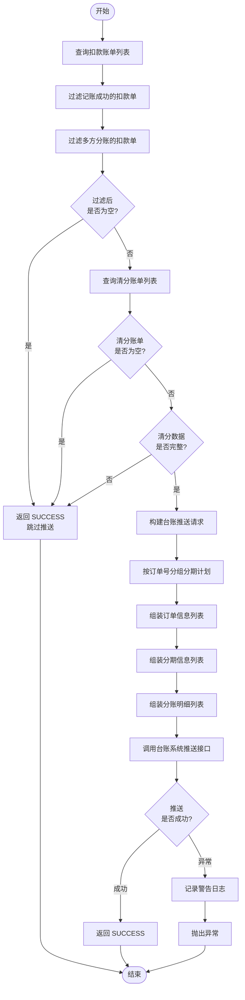
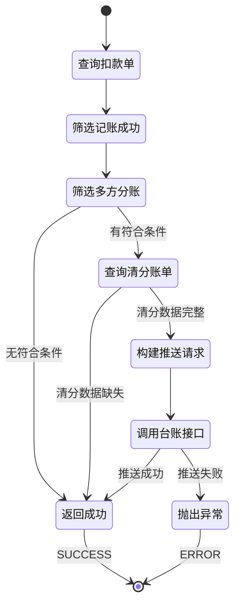

# PH170045 - 入账结果推送台账

## 节点信息

| 属性 | 值 |
|------|------|
| **处理器代码** | PH170045 |
| **节点名称** | 入账结果推送台账 |
| **节点类型** | PROCESS |
| **所属流程** | [[重资产分期制还款异步子流程V401]] |
| **执行阶段** | 入账后置阶段 |
| **实现类** | RepayApplyBizFlowPH170045ServiceImpl |
| **优先级** | P2（可选节点） |

## 功能说明

将还款入账结果及分账信息推送到台账系统,用于资金清分和对账。该节点仅处理需要多方分账的场景,将 FeeClearing 生成的分账数据透传给台账系统。

### 核心职责
1. **扣款单筛选**: 筛选需要多方分账的扣款单
2. **分账数据查询**: 从清分服务获取分账明细
3. **数据组装**: 构建台账推送请求
4. **台账推送**: 调用台账系统接口推送数据
5. **数据透传**: 透传 FeeClearing 生成的分账数据

### 适用场景

- **多方分账场景**: 助贷模式、联合贷、担保模式等
- **资金清分**: 需要按规则分配资金给各方
- **对账需求**: 需要记录分账明细用于对账
- **台账管理**: 需要生成清分指令

## 输入参数

| 参数名 | 参数代码 | 类型 | 来源 | 说明 |
|--------|----------|------|------|------|
| 还款账单编号 | currentRepaymentBillNo | String | RepayApplyBo | 当前还款账单号 |
| 分期计划列表 | stagePlanItemList | List | RepayApplyBo | 分期计划信息 |

## 输出参数

| 参数名 | 参数代码 | 类型 | 说明 |
|--------|----------|------|------|
| 无 | - | - | 仅推送数据,无返回值 |

## 处理流程



## 核心业务逻辑

### 1. 扣款单筛选

筛选需要推送台账的扣款单,需同时满足两个条件:
1. 扣款状态 = `RECORD_SUCCESS` (记账成功)
2. 扩展信息中 `multiShare = true` (需要多方分账)

**业务含义**:
- 只有记账成功的扣款才有入账结果
- 只有多方分账的订单才需要推送台账
- 单方账户直接入账,无需台���分账

### 2. 清分账单查询

根据还款账单编号列表查询清分账单:
- 提取扣款单的还款账单号并去重
- 调用 `clearingService.selectByRepaymentBillList()` 查询

**数据完整性校验**:
1. 清分账单列表不为空
2. 每个清分账单的 `extend` 不为空
3. 每个清分账单的 `extend.stageOrderV3Resp` 不为空

**校验失败**: 跳过推送,直接返回成功

**业务含义**: 清分数据是台账推送的基础,缺失则无法推送

### 3. 台账请求构建

构建 `BankSplitProfitsReq` 对象,包含以下层级结构:

**数据层级**:
```
BankSplitProfitsReq
└── orderInfoReqList (订单列表)
    └── OrderInfoReq (单个订单)
        ├── orderNo (订单号)
        ├── bank (资方银行)
        ├── assetId (资产ID)
        └── stageList (分期列表)
            └── StageReq (单个分期)
                ├── stage (期数)
                └── splitAmountDtoList (分账列表)
                    └── SplitAmountReq (单个分账)
                        ├── shareCode (分账方代码)
                        ├── actualAmount (实际分账金额)
                        └── dueAmount (应分账金额)
```

**数据组装流程**:
1. 按 `stageOrderNo` 分组分期计划
2. 遍历清分账单的 `StageOrderV3Resp`
3. 为每个订单构建 `OrderInfoReq`
4. 为每个分期构建 `StageReq`
5. 为每个分账方构建 `SplitAmountReq`

### 4. 数据映射关系

**OrderInfoReq 数据来源**:
- `orderNo`: 从 `StagePlanItem.stageOrderNo` 获取
- `bank`: 从 `StagePlanItem.assetBank` 获取
- `assetId`: 从 `StagePlanItem.assetId` 获取
- `stageList`: 从 `StageOrderV3Resp.stagePlanV3Resps` 转换

**StageReq 数据来源**:
- `stage`: 从 `StagePlanV3Resp.stage` 获取
- `splitAmountDtoList`: 从 `StagePlanV3Resp.splitAmounts` 转换

**SplitAmountReq 数据来源** (透传):
- `shareCode`: 分账方代码
- `actualAmount`: 实际分账金额
- `dueAmount`: 应分账金额

**重要说明**: 分账数据由 FeeClearing 服务生成, RepayEngine 仅负责透传

### 5. 台账系统推送

调用 `standingBookClient.pushClearingResult()` 推送数据:

**推送内容**:
- 订单基础信息
- 分期还款信息
- 分账明细数据

**推送成功**: 台账系统记录入账和分账结果

**推送失败**: 抛出异常,流程中断

### 6. 异常处理

捕获所有异常并记录警告日志,然后向上抛出异常触发流程重试

## 分账逻辑

### multiShare 标识

**设置时机**: 扣款单创建或更新时

**设置条件**:
- 资产类型支持多方分账
- 订单配置了分账规则
- 存在多个分账方

**典型场景**:
- 助贷模式: 资金方 + 平台 + 服务方
- 联合贷: 多个资金方
- 担保模式: 担保方 + 资金方

### 分账方类型 (shareCode)

**常见分账方**:
- `FUND`: 资金方
- `PLATFORM`: 平台方
- `SERVICE`: 服务方
- `GUARANTEE`: 担保方
- `CHANNEL`: 渠道方

### 分账金额计算

**actualAmount** (实际分账金额):
- 基于实际入账金额计算
- 考虑减免、优惠等因素
- FeeClearing 服务计算

**dueAmount** (应分账金额):
- 基于应还金额计算
- 不考虑减免
- 用于对账

## 状态流转



## 上游节点

- [[PH170041V1]] - 通知资方入账

## 下游节点

- 流程结束

## 异常处理

| 异常场景 | 处理方式 | 影响 |
|----------|----------|------|
| 无记账成功扣款单 | 跳过推送,返回成功 | 无 |
| 无多方分账扣款单 | 跳过推送,返回成功 | 无 |
| 清分账单为空 | 跳过推送,返回成功 | 无 |
| 清分数据不完整 | 跳过推送,返回成功 | 无 |
| 台账推送异常 | 记录警告日志,抛出异常 | 流程中断 |

**设计原则**:
- 数据缺失不阻塞流程(静默跳过)
- 推送失败阻塞流程(需要重试)
- 保证台账数据完整性

## 数据依赖

### 1. 扣款账单表

**表名**: `t_deduct_bill`

**关键字段**:
- `deduct_status`: 扣款状态
- `ext_info.multiShare`: 是否多方分账
- `repayment_bill_no`: 还款账单号

### 2. 清分账单表

**表名**: `t_clearing_bill`

**关键字段**:
- `repayment_bill_no`: 还款账单号
- `extend.stageOrderV3Resp`: 清分结果数据

### 3. StageOrderV3Resp (清分结果)

**数据结构**:
- `orderNo`: 订单号
- `stagePlanV3Resps`: 分期清分列表
  - `stage`: 分期序号
  - `splitAmounts`: 分账明细列��
    - `shareCode`: 分账方代码
    - `actualAmount`: 实际分账金额
    - `dueAmount`: 应分账金额

## 实现位置

**节点处理器**: `RepayApplyBizFlowPH170045ServiceImpl.java` (148行)
- 路径: `repayengine-service/.../repay/process/heavyasset/`

**核心服务**:
- `IClearingService` - 清分服务
- `StandingBookClient` - 台账客户端
- `IDeductBillService` - 扣款账单服务

## 相关系统

### FeeClearing (清分系统)

**职责**:
- 计算分账金额
- 生成分账明细
- 存储清分结果

**数据生成**: `StageOrderV3Resp`

### StandingBook (台账系统)

**职责**:
- 接收入账结果
- 记录分账明细
- 提供对账数据
- 生成清分指令

**接口**: `pushClearingResult()`

## 监控指标

- **推送成功率**: 成功推��次数 / 总调用次数
- **跳过率**: 跳过推送次数 / 总调用次数
- **多方分账比例**: 多方分账扣款单 / 总扣款单
- **推送耗时**: P50/P95/P99
- **异常率**: 异常次数 / 推送次数

## 对账要点

### 1. 金额一致性

- `actualAmount` 之和 = 实际入账金额
- `dueAmount` 之和 = 应还金额

### 2. 分账方完整性

- 所有配置的分账方都有记录
- 分账比例符合配置规则

### 3. 时效性

- 入账后实时推送
- 台账数据及时更新

## 设计考虑

### 1. 为什么只推送多方分账场景?

**原因**:
- 单方账户直接入账,无需分账
- 多方分账需要台账记录分配规则
- 减少不必要的系统调用
- 提高系统性能

### 2. 为什么数据缺失不阻塞流程?

**原因**:
- 台账推送是辅助功能
- 不影响核心还款流程
- 避免因台账问题阻塞还款
- 可通过补偿机制处理

### 3. 为什么推送失败要抛出异常?

**原因**:
- 推送失败可能是临时问题
- 通过重试保证最终一致性
- 避免台账数据缺失
- 保证对账准确性

### 4. 为什么只透传分账数据?

**原因**:
- 分账计算由 FeeClearing 负责
- RepayEngine 不关心分账规则
- 职责分离,降低耦合
- 便于独立演进

### 5. 为什么需要校验清分数据完整性?

**原因**:
- 不完整的数据无法推送
- 及早发现数据问题
- 避免推送无效数据
- 保证台账数据质量

## 相关文档

- [[重资产分期制还款异步子流程V401]] - 所属流程
- [[清分系统设计]] - FeeClearing 架构
- [[台账系统设计]] - StandingBook 架构
- [[多方分账规则]] - 分账配置和计算
- [[资金清分流程]] - 清分业务流程

## 标签

#节点 #台账推送 #分账 #清分 #PH170045
