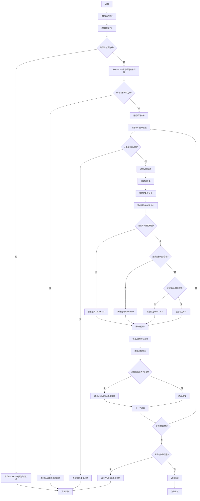
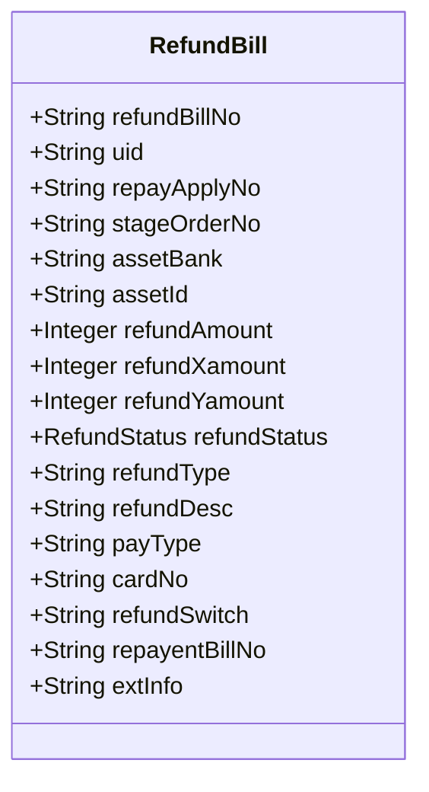
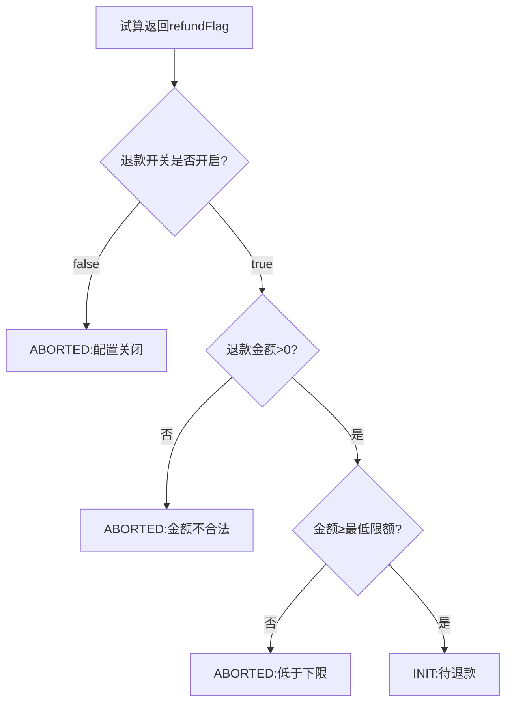
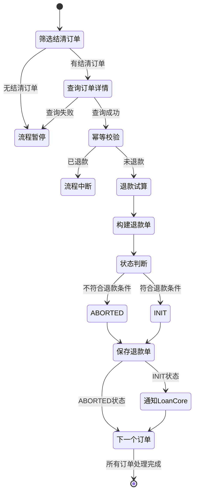

# PH170069 - 结清返现记录

## 节点信息

| 属性        | 值                                    |
| --------- | ------------------------------------ |
| **处理器代码** | PH170069                             |
| **节点名称**  | 结清返现记录                               |
| **节点类型**  | PROCESS                              |
| **所属流程**  | [[重资产分期制还款异步子流程V401]]                |
| **执行阶段**  | 入账后处理阶段                              |
| **实现类**   | RepayApplyBizFlowPH170069ServiceImpl |
| **优先级**   | P1（重要节点）                             |

## 功能说明

处理订单结清后的利息返现逻辑,包括返现金额试算、退款单生成、退款卡绑定和通知LoanCore更新应退款金额。

### 核心职责
1. **结清订单筛选**: 提取本次还款导致结清的订单
2. **退款幂等校验**: 防止重复退款
3. **退款试算**: 调用费用计算器试算返现金额
4. **退款单生成**: 创建退款账单记录
5. **退款卡绑定**: 选择合适的退款银行卡
6. **通知LoanCore**: 同步应退款信息

### 业务场景

- **提前结清返现**: 用户提前还清订单,返还剩余未计利息
- **正常结清返现**: 按期还清,根据配置返现
- **分账返现**: X/Y款返现金额计算

## 输入参数

| 参数名 | 参数代码 | 类型 | 来源 | 说明 |
|--------|----------|------|------|------|
| 用户ID | uid | String | 流程变量 | 用户唯一标识 |
| 还款申请对象 | repayApplyBo | RepayApplyBo | 流程变量 | 包含分期计划列表 |
| 生命周期Token | bizSerial | String | 流程变量 | 还款流程追踪标�� |
| 当前还款账单号 | currentRepaymentBillNo | String | 流程变量 | 当前还款账单 |

## 输出参数

| 参数名 | 参数代码 | 类型 | 说明 |
|--------|----------|------|------|
| 无 | - | - | 退款单保存到数据库,异步处理 |

## 处理流程



## 核心业务逻辑

### 1. 结清订单筛选

**筛选逻辑**:
从 `stagePlanItemList` 中筛选 `orderStatus == PAY_OFF` 的订单

**提取订单号**: 去重后得到结清订单编号列表

**数量校验**:
- 列表为空: 返回PAUSED,错误码 `PAY_OFF_STAGE_ORDER_NOT_FOUND_BY_REPAY`
- 不为空: 继续处理

**业务含义**: 只有本次还款导致结清的订单才需要返现

### 2. 查询结清订单详情

**调用接口**: `LoanCoreQueryService.listStageOrderWrapper()`

**查询参数**:
- `uid`: 用户ID
- `stageOrderNoList`: 结清订单编号列表
- `orderStatusList`: 仅查询 `PAY_OFF` 状态

**返回数据**: `List<StageOrderWrapper>` 包含订单完整信息

**校验**: 列表为空返回PAUSED,错误码 `PAY_OFF_STAGE_ORDER_NOT_FOUND_FOR_REFUND`

### 3. 退款幂等校验

**接口**: `RefundBillService.isStageOrderRefunded()`

**校验逻辑**: 查询退款单表,检查订单是否已创建退款单

**失败处理**: 抛出异常 `STAGE_ORDER_CAN_NOT_REFUND_REPEATED`

**目的**: 防止重复创建退款单,避免重复返现

### 4. 退款试算

**调用接口**: `FeecalculatorClient.refundTrialV2()`

**构建试算请求** (RefundTrialOrderV2):
- `orderNo`: 分期订单号
- `annualFeeRate`: 年化费率(需除以100)
- `firstInterestDate`: 起息日
- `repayDate`: 结清日期(payOffDate或当前时间)
- `totalStage`: 总期数
- `principal`: 本金
- `bank`: 资金方
- `assetId`: 资产ID
- `productCd`: 产品代码
- `originalStagePlans`: 原始分期计划
- `calculatorVersion`: 计算器版本
- `settleConfigs`: 结清配置
- `refundedAmount`: 已退款金额

**试算返回** (RefundTrialOrderResp):
- `refundAmount`: 总退款金额
- `throughInterestRefundAmount`: X款返现金额(计息)
- `notThroughInterestRefundAmount`: Y款返现金额(不计息)
- `refundFlag`: 退款开关
- `minRefundLimit`: 最低退款限额

### 5. 退款单构建

**RefundBill 字段**:



**初始值**:
- `refundBillNo`: UUID生成
- `refundXamount`: throughInterestRefundAmount
- `refundYamount`: notThroughInterestRefundAmount
- `refundType`: "REPAY_REFUND"
- `refundDesc`: "还款返现"
- `extInfo`: `{"LOAN_SUBJECT": "贷款主体"}`

### 6. 退款状态判断

**判断流程**:



**状态说明**:
- `INIT`: 待退款,后续异步处理
- `ABORTED`: 已废弃,不会退款

### 7. 退款卡选择

**选择优先级**:

1. **API订单**: 使用API渠道绑定卡
2. **还款卡**: 优先使用本次还款使用的银行卡
3. **默认卡**: 从CardEngine获取默认借记卡
4. **随机卡**: 随机取BALANCE_TRANSFER功能的绑卡

**获取还款卡**:
从扣款单列表中提取第一个卡类扣款的卡号

**获取默认卡**:
调用 `CardDataFeignClient.getDefaultDebitCardList()`

**获取随机卡**:
调用 `CardClient.getCardListByUid()`,取第一张卡

### 8. 保存退款单+Event

**接口**: `RefundBillService.initRefundBillEvent()`

**事务操作**:
1. 保存退款单到 `t_refund_bill` 表
2. 生成退款Event事件,触发异步退款流程

**Event作用**: 异步消费,调用支付引擎执行实际退款

### 9. 通知LoanCore

**条件**: 仅当 `refundStatus == INIT` 时通知

**调用接口**: `LoanClient.orderRefundIncome()`

**请求参数** (RefundIncomeReq):
- `requestSerial`: UUID
- `orderNo`: 分期订单号
- `refundAmount`: 退款金额
- `requestType`: "APPLY"(申请)
- `refundChannel`: "DEBIT_CARD"
- `repaySerNo`: 还款申请号

**用途**: 通知LoanCore更新订单的应退款金额,用于账务记录

**异常处理**: 捕获异常,记录警告日志,不阻塞流程

## 返现金额说明

### X款和Y款

**X款** (throughInterestRefundAmount):
- 定义: 计息部分的返现
- 计算: 基于已收利息计算
- 特点: 计入利息成本

**Y款** (notThroughInterestRefundAmount):
- 定义: 不计息部分的返现
- 计算: 基于优惠、补贴等
- 特点: 不计入利息成本

**总返现**: `refundAmount = refundXamount + refundYamount`

### 返现计算逻辑

由 FeeCalculator 服务计算:
1. 计算剩余未计息天数
2. 根据年化费率计算可退利息
3. 应用资金配置中心的返现规则
4. 扣除已退款金额
5. 判断是否满足最低限额

## 状态流转



## 上游节点

- [[PH170036V1]] - 客账入账 (确定订单结清)

## 下游节点

- 退款Event异步处理 (支付引擎执行退款)

## 异常处理

| 异常场景 | 错误码 | 处理方式 | 影响 |
|----------|--------|----------|------|
| 无结清订单 | PAY_OFF_STAGE_ORDER_NOT_FOUND_BY_REPAY | 返回PAUSED | 流程暂停 |
| 查询订单失败 | PAY_OFF_STAGE_ORDER_NOT_FOUND_FOR_REFUND | 返回PAUSED | 流程暂停 |
| 订单已退款 | STAGE_ORDER_CAN_NOT_REFUND_REPEATED | 抛出异常 | 流程中断 |
| 还款账单号未找到 | STAGE_ORDER_NOT_PAYED_BY_CURRENT_REPAY | 抛出异常 | 流程中断 |
| 退款试算异常 | - | 捕获记录,返回PAUSED | 流程暂停 |
| 通知LoanCore失败 | - | 记录警告,继续 | 无影响 |

## 监控与日志

### 埋点记录

**埋点调用**:
1. `repayFlowTraceProxy.dealRepayRefund()`: 开始处理返现
2. `repayFlowTraceProxy.repayRefund()`: 返现流程
3. `repayFlowTraceProxy.refundBill()`: 退款单创建

### 监控指标

**指标名**: `repayengine_refund_error`

**监控字段**:
- `repayApplyNo`: 还款申请号
- `refundMsg`: 错误信息

**记录时机**: 退款异常时记录

## 数据库表

### t_refund_bill (退款账单表)

**核心字段**:
- `refund_bill_no`: 退款单号(主键)
- `uid`: 用户ID
- `stage_order_no`: 分期订单号
- `repay_apply_no`: 还款申请号
- `repayent_bill_no`: 还款账单号
- `refund_amount`: 总退款金额
- `refund_xamount`: X款金额
- `refund_yamount`: Y款金额
- `refund_status`: 退款状态
- `refund_type`: 退款类型
- `pay_type`: 退款方式
- `card_no`: 退款卡号
- `refund_switch`: 退款开关
- `ext_info`: 扩展信息(JSON)

**索引**:
- `idx_stage_order_no`: 分期订单号
- `idx_repay_apply_no`: 还款申请号
- `idx_uid`: 用户ID

## 实现位置

```bash
repayengine-service/src/main/java/cn/caijiajia/repayengine/service/
├── repay/process/heavyasset/
│   └── RepayApplyBizFlowPH170069ServiceImpl.java  # 节点处理器
├── bill/
│   └── IRefundBillService.java                    # 退款单服务
└── client/feign/
    ├── FeecalculatorClient.java                   # 费用计算器
    ├── CardClient.java                            # 卡中心
    └── LoanClient.java                            # LoanCore
```

## 设计考虑

### 1. 为什么需要幂等校验?

**原因**:
- 还款流程可能重试
- 防止重复退款导致资金损失
- 保证数据一致性

### 2. 为什么退款是异步的?

**原因**:
- 退款调用第三方支付,耗时长
- 避免阻塞还款流程
- 支持失败重试

### 3. 为什么有X款和Y款?

**原因**:
- 会计核算要求
- 区分不同类型的返现
- 便于对账和统计

## 相关文档

- [[退款试算逻辑]] - FeeCalculator退款计算
- [[退款Event处理]] - 异步退款流程
- [[退款卡选择策略]] - 退款卡绑定规则
- [[X款Y款核算]] - 返现会计处理

## 标签

#节点 #结清返现 #退款试算 #异步退款 #PH170069
