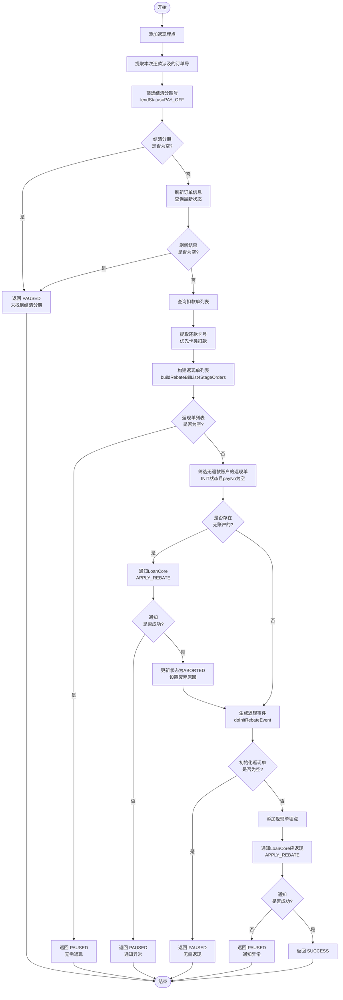
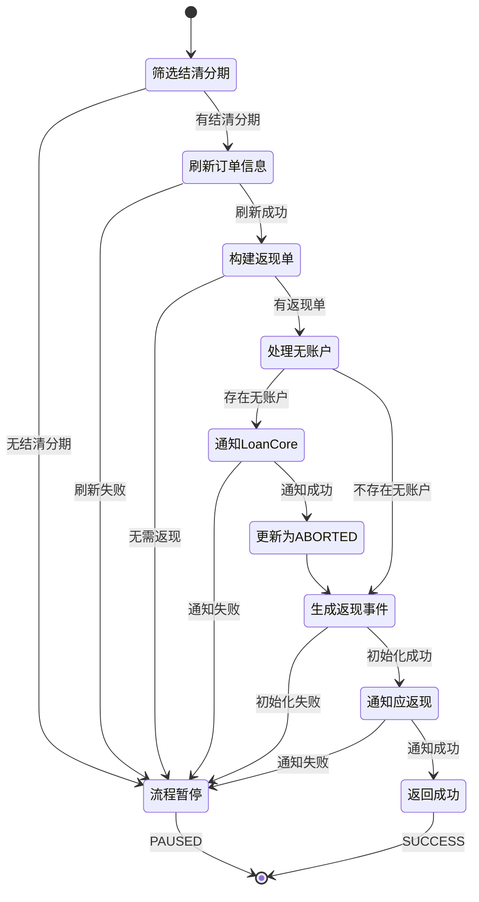

# PH170075 - 优惠返现记录

## 节点信息

| 属性 | 值 |
|------|------|
| **处理器代码** | PH170075 |
| **节点名称** | 优惠返现记录 |
| **节点类型** | PROCESS |
| **所属流程** | [[重资产分期制还款异步子流程V401]] |
| **执行阶段** | 入账后置阶段 |
| **实现类** | RepayApplyBizFlowPH170075ServiceImpl |
| **优先级** | P2（次要节点） |

## 功能说明

在分期还款导致分期结清时,为结清的分期计算并生成优惠返现单。该节点与 [[PH170069]] 配合,共同完成还款返现业务,PH170069 处理订单级别的结清返现,而本节点处理分期级别的优惠返现。

### 核心职责

1. **结清分期筛选**: 筛选本次还款导致结清的分期 (PAY_OFF 状态)
2. **订单信息刷新**: 查询最新的订单和分期信息
3. **返现单构建**: 为每个结清分期构建返现单
4. **返现账户校验**: 校验返现卡号或溢缴款账户是否有效
5. **返现事件生成**: 批量生成返现事件
6. **通知 LoanCore**: 通知 LoanCore 系统应返现金额
7. **幂等处理**: 避免同一分期重复生成返现单

### 适用场景

- **分期结清**: 用户还款导致某一分期结清
- **优惠返现**: 分期有优惠券或促销活动需要返现
- **多分期场景**: 一次还款可能导致多个分期结清,批量处理

## 输入参���

| 参数名 | 参数代码 | 类型 | 来源 | 说明 |
|--------|----------|------|------|------|
| 用户ID | uid | String | RepayContext | 用户唯一标识 |
| 还款申请编号 | repayApplyNo | String | RepayApplyBo | 还款申请单号 |
| 当前还款单编号 | currentRepaymentBillNo | String | RepayApplyBo | 当前还款账单号 |
| 分期计划项列表 | stagePlanItemList | List | RepayApplyBo | 来自PH170038的最新分期信息 |
| 业务流水号 | bizSerial | String | RepayContext | 还款生命周期Token |

## 输出参数

| 参数名 | 参数代码 | 类型 | 说明 |
|--------|----------|------|------|
| 无 | - | - | 返现单保存到数据库,异步处理 |

## 处理流程

## 核心业务逻辑

### 1. 提取本次还款涉及的订单号

从 `stagePlanItemList` 中提取所有订单号并去重:
- 用于后续查询订单详情
- 确保覆盖所有相关订单

### 2. 筛选结清分期号

从 `stagePlanItemList` 中筛选 `lendStatus = PAY_OFF` 的分期:
- 提取分期计划号并去重
- 若列表为空,返回 PAUSED (错误码: `STAGE_PLAN_NOT_FOUND_FOR_REBATE_BILL`)

**业务含义**: 只有本次还款导致结清的分期才需要返现

### 3. 刷新订单信息

调用 `rebateService.refreshStageOrderWrapperIfPayOff()` 查询最新订单信息:

**传入参数**:
- `uid`: 用户ID
- `stageOrderNoList`: 订单号列表
- `stagePlanNoList`: 结清分期号列表

**返回结果**: `List<StageOrderWrapper>` 包含订单和分期的完整信息

**校验**: 若列表为空,返回 PAUSED (错误码: `STAGE_PLAN_NOT_FOUND_FOR_REBATE_BILL`)

**业务含义**: 确保使用最新的订单状态数据

### 4. 查询扣款单并提取还款卡号

查询当前还款单的所有扣款单:
- 筛选卡类扣款 (`PayType.isCard()`)
- 提取第一个卡类扣款的卡号作为返现卡号
- 若无卡类扣款,返回空字符串

**用途**: 优先使用本次还款的银行卡作为返现账户

### 5. 构建返现单列表

调用 `rebateService.buildRebateBillList4StageOrders()` 构建返现单:

**传入参数**:
- `uid`: 用户ID
- `repayApplyNo`: 还款申请号
- `stageOrderWrapperList`: 订单包装列表
- `repayCardNo`: 还款卡号

**返回结果**: `List<RebateBill>` ���现单列表

**校验**: 若列表为空,返回 PAUSED (错误码: `REPAY_ORDER_NO_NEED_REBATE`)

**服务职责**:
1. 遍历每个结清分期
2. 调用费用计算器试算返现金额
3. 判断是否满足返现条件
4. 构建返现单对象
5. 选择返现账户 (卡号或溢缴款账户)

### 6. 处理无退款账户的返现单

筛选 `INIT` 状态且 `payNo` 为空的返现单:
- 若存在,先通知 LoanCore (请求类型: `APPLY_REBATE`)
- 通知失败返回 PAUSED
- 通知成功后,更新这些返现单状态为 `ABORTED`
- 设置废弃原因: "已记账,没有可用的退款账户,退款单自动废弃"

**业务含义**: 无退款账户的返现单无法执行,需要通知 LoanCore 并废弃

### 7. 生成返现事件

调用 `rebateService.doInitRebateEvent()` 批量生成返现事件:

**传入参数**:
- `uid`: 用户ID
- `rebateBillList`: 返现单列表

**返回结果**: `List<RebateBill>` 初始化成功的返现单列表

**校验**: 若列表为空,返回 PAUSED (错误码: `REPAY_ORDER_REBATE_BILLS_IS_NULL_NO_NEED_REBATE`)

**服务职责**:
1. 幂等校验 (检查分期是否已返现)
2. 保存返现单到数据库
3. 生成返现 Event 事件
4. 触发异步返现流程

### 8. 通知 LoanCore 应返现

调用 `rebateService.notifyRebateInfo2Loan()` 通知 LoanCore:

**传入参数**:
- `initRebateBills`: 初始化成功的返现单列表
- `requestType`: `APPLY_REBATE` (申请返现)

**异常处理**: 捕获异常返回 PAUSED ("优惠返现通知异常")

**用途**: 通知 LoanCore 更新分期的应返现金额,用于账务记录

## 返现单数据结构

### RebateBill 核心字段

| 字段 | 类型 | 说明 |
|------|------|------|
| rebateBillNo | String | 返现单编号 (UUID) |
| uid | String | 用户ID |
| stageOrderNo | String | 分期订单号 |
| stagePlanNo | String | 分期计划号 |
| repayApplyNo | String | 还款申请编号 |
| repaymentBillNo | String | 还款单编号 |
| rebateAmount | Integer | 应返现金额 (分) |
| rebateStatus | String | 返现状态 (INIT/ABORTED) |
| rebateSwitch | String | 返现开关 (true/false) |
| rebateType | String | 返现类型 |
| rebateDesc | String | 返现描述 |
| payType | String | 返现方式 (DEBIT_CARD/OVERPAY_ACCOUNT) |
| payNo | String | 返现账号 (卡号/溢缴款账户号) |
| assetBank | String | 资方银行 |
| assetId | String | 资产包ID |
| extInfo | String | 扩展信息 (JSON) |

### 返现状态说明

**INIT**: 待返现,后续异步处理

**ABORTED**: 已废弃,不会返现
- 返现开关关闭
- 返现金额不合法
- 低于最低限额
- 无可用退款账户

## 状态流转

## 上游节点

- [[PH170038]] - 入账后更新订单信息 (提供最新分期状态)

## 下游节点

- 返现 Event 异步处理 (支付引擎执行返现)

## 异常处理

| 异常场景 | 错误码 | 处理方式 | 影响 |
|----------|--------|----------|------|
| 无结清分期 | STAGE_PLAN_NOT_FOUND_FOR_REBATE_BILL | 返回PAUSED | 流程暂停 |
| 刷新订单失败 | STAGE_PLAN_NOT_FOUND_FOR_REBATE_BILL | 返回PAUSED | 流程暂停 |
| 无需返现 | REPAY_ORDER_NO_NEED_REBATE | 返回PAUSED | 流程暂停 |
| 初始化失败 | REPAY_ORDER_REBATE_BILLS_IS_NULL_NO_NEED_REBATE | 返回PAUSED | 流程暂停 |
| 通知LoanCore失败 | - | 返回PAUSED | 流程暂停 |

## 埋点记录

### 埋点调用

1. `repayFlowTraceProxy.repayRebate()`: 开始处理返现
2. `repayFlowTraceProxy.rebateBill()`: 返现单创建成功

## 数据库表

### t_rebate_bill (返现账单表)

**核心字段**:
- `rebate_bill_no`: 返现单号 (主键)
- `uid`: 用户ID
- `stage_order_no`: 分期订单号
- `stage_plan_no`: 分期计划号
- `repay_apply_no`: 还款申请号
- `repayment_bill_no`: 还款账单号
- `rebate_amount`: 返现金额
- `rebate_status`: 返现状态
- `rebate_type`: 返现类型
- `pay_type`: 返现方式
- `pay_no`: 返现账号
- `ext_info`: 扩展信息 (JSON)

**索引**:
- `idx_stage_plan_no`: 分期计划号 (幂等校验)
- `idx_repay_apply_no`: 还款申请号
- `idx_uid`: 用户ID

## 实现位置

**节点处理器**: `RepayApplyBizFlowPH170075ServiceImpl.java` (139行)
- 路径: `repayengine-service/.../repay/process/heavyasset/`

**核心服务**:
- `IRebateService` - 返现服务
- `IDeductBillService` - 扣款单服务
- `RepayFlowTraceProxy` - 埋点代理

## 设计考虑

### 1. 为什么要刷新订单信息?

**原因**:
- 确保使用最新的分期状态
- 入账后状态可能发生变化
- 避免使用过期数据导致返现错误
- 保证返现金额准确性

### 2. 为什么返现是异步的?

**原因**:
- 返现调用第三方支付,耗时长
- 避免阻塞还款流程
- 支持失败重试
- 提高系统吞吐量

### 3. 为什么无退款账户要废弃?

**原因**:
- 无账户无法执行返现
- 避免返现单长期挂起
- 及时通知 LoanCore 更新状态
- 便于后续人工处理

### 4. 为什么需要幂等校验?

**原因**:
- 还款流程可能重试
- 防止重复返现导致资金损失
- 保证数据一致性
- 避免用户重复收款

### 5. 为什么优先使用还款卡?

**原因**:
- 用户体验好,原路返回
- 减少卡号变更风险
- 符合用户预期
- 降低退款失败率

## 相关文档

- [[重资产分期制还款异步子流程V401]] - 所属流程
- [[PH170069]] - 结清返现记录 (订单级别)
- [[返现试算逻辑]] - FeeCalculator 返现计算
- [[返现Event处理]] - 异步返现流程
- [[返现账户选择策略]] - 返现账户绑定规则

## 标签

#节点 #优惠返现 #分期结清 #异步返现 #PH170075
