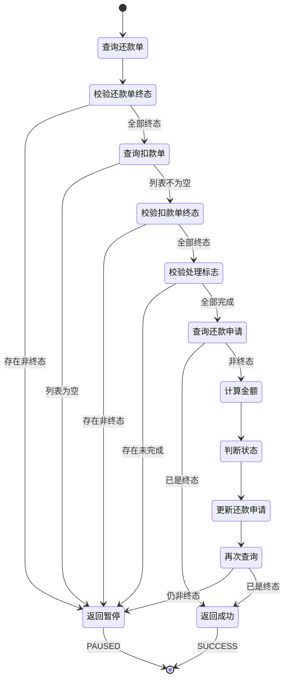

# PH170080 - 等待子流程结束

## 节点信息

| 属性 | 值 |
|------|------|
| **处理器代码** | PH170080 |
| **节点名称** | 等待子流程结束 |
| **节点类型** | PROCESS |
| **所属流程** | [[重资产分期制还款异步主流程V401]] |
| **执行阶段** | 子流程同步阶段 |
| **实现类** | RepayApplyBizFlowPH170080ServiceImpl |
| **优先级** | P0（核心节点） |

## 功能说明

等待所有异步子流程执行完成,校验还款单和扣款单状态,计算还款金额,更新还款申请状态。该节点是主流程与子流程的同步点,确保所有子流程处理完毕后才继续主流程。

### 核心职责

1. **还款单状态校验**: 校验所有还款单是否处于终态
2. **扣款单状态校验**: 校验所有扣款单是否处理完成
3. **金额计算**: 计算还款成功金额和失败金额
4. **状态判断**: 判断还款整体状态 (成功/失败/部分成功)
5. **数据更新**: 更新还款申请的金额和状态

### 适用场景

- **主流程同步点**: 主流程等待所有子流程完成
- **状态汇总**: 汇总所有还款单和扣款单的最终状态
- **金额统计**: 统计实际还款成功和失败金额
- **流程收敛**: 多个并行子流程的收敛点

## 输入参数

| 参数名 | 参数代码 | 类型 | 来源 | 说明 |
|--------|----------|------|------|------|
| 还款申请号 | repayApplyNo | String | RepayApplyBo | 还款申请标识 |
| 申请还款金额 | repayAmount | Integer | RepayReq | 用户申请的还款金额 |

## 输出参数

| 参数名 | 参数代码 | 类型 | 说明 |
|--------|----------|------|------|
| 还款状态 | repayStatus | RepayStatus | SUCCESS/FAILURE/PART_SUCCESS |
| 成功金额 | repaySuccessAmt | Integer | 实际还款成功金额 (分) |
| 失败金额 | repayFailureAmt | Integer | 还款失败金额 (分) |

## 处理流程

```mermaid
flowchart TD
    Start([开始]) --> QueryRepayBill[查询所有还款单]
    QueryRepayBill --> CheckRepayFinish{所有还款单<br/>都是终态?}

    CheckRepayFinish -->|否| ReturnPaused1[返回 PAUSED<br/>继续等待]
    CheckRepayFinish -->|是| QueryDeduct[查询所有扣款单]

    QueryDeduct --> CheckDeductEmpty{扣款单列表<br/>是否为空?}
    CheckDeductEmpty -->|是| ReturnPaused1

    CheckDeductEmpty -->|否| CheckDeductFinish{所有扣款单<br/>都处理完成?}
    CheckDeductFinish -->|否| ReturnPaused1

    CheckDeductFinish -->|是| CheckHandleFlag{所有扣款单<br/>handleFinished=true?}
    CheckHandleFlag -->|否| ReturnPaused1

    CheckHandleFlag -->|是| QueryRepayApply[查询还款申请]
    QueryRepayApply --> CheckApplyFinish{还款申请<br/>已是终态?}

    CheckApplyFinish -->|是| ReturnSuccess[返回 SUCCESS]
    CheckApplyFinish -->|否| CalcSuccess[计算还款成功金额<br/>sum(realDeductAmount)]

    CalcSuccess --> CalcFailure[计算还款失败金额<br/>申请金额 - 成功金额]
    CalcFailure --> JudgeStatus[判断还款状态]

    JudgeStatus --> UpdateApply[更新还款申请<br/>金额和状态]
    UpdateApply --> QueryAgain[再次查询还款申请]

    QueryAgain --> CheckFinal{更新后<br/>是否为终态?}
    CheckFinal -->|是| ReturnSuccess
    CheckFinal -->|否| ReturnPaused2[返回 PAUSED<br/>等待状态同步]

    ReturnPaused1 --> End([结束])
    ReturnPaused2 --> End
    ReturnSuccess --> End
```

## 核心业务逻辑

### 1. 校验还款单状态

查询所有还款单并检查是否都处于终态:
- 调用 `repaymentBillService.getByRepayApplyNo()` 查询
- 检查每个还款单的 `repayStatus.isFinished()` 是否为 true
- 若存在未完成的还款单,返回 PAUSED (错误码: `UNFINISHED_REPAY_OR_DEDUCT_STATUS`)

**还款单终态**:
- `SUCCESS`: ���款成功
- `FAILURE`: 还款失败
- `PART_SUCCESS`: 部分成功

**业务含义**: 只有所有还款单都处理完成,才能汇总最终��果

### 2. 校验扣款单状态

查询所有扣款单并进行两层校验:

#### 2.1 空值校验

若扣款单列表为空,返回 PAUSED (错误码: `UNFINISHED_REPAY_OR_DEDUCT_STATUS`)

#### 2.2 终态校验

检查所有扣款单的 `deductStatus.isRepayFinished()` 是否为 true:
- 统计未完成的扣款单数量
- 若存在未完成的,返回 PAUSED

**扣款单终态**:
- `RECORD_SUCCESS`: 入账成功
- `RECORD_FAILED`: 入账失败
- `ABORTED`: 已废弃

#### 2.3 处理标志校验

检查所有扣款单的 `extInfo.handleFinished` 标志:
- 统计 `handleFinished = true` 的扣款单数量
- 若数量不等于扣款单总数,返回 PAUSED

**handleFinished 标志**: 表示扣款单的后置处理 (入账、通知等) 已完成

**业务含义**: 确保扣款单不仅状态是终态,而且所有后置处理也已完成

### 3. 查询还款申请

查询还款申请对象:
- 调用 `repayApplyService.getByRepayApplyNo()` 查询
- 检查 `repayStatus.isFinished()` 是否为 true
- 若已是终态,直接返回 SUCCESS (可能被其他流程更新过)

### 4. 计算还款金额

#### 4.1 计算成功金额

汇总所有扣款单的实际扣款金额:
- 遍历扣款单列表
- 累加每个扣款单的 `realDeductAmount`
- 得到总成功金额

#### 4.2 计算失败金额

失败金额 = 申请还款金额 - 成功金额

**计算方法**: `IntegerUtil.add(repayAmount, -1 * repaySuccessAmt)`

### 5. 判断还款状态

根据成功金额和失败金额判断最终状态:

**判断逻辑**:
- 若成功金额 = 0: 状态为 `FAILURE` (全部失败)
- 若失败金额 = 0: 状态为 `SUCCESS` (全部成功)
- 其他情况: 状态为 `PART_SUCCESS` (部分成功)

### 6. 更新还款申请

调用 `repayApplyService.updateRepayApplyAmountAndStatus()` 更新:

**更新字段**:
- `repayAmount`: 申请还款金额 (不变)
- `repaySuccessAmt`: 实际成功金额
- `repayStatus`: 最终还款状态

### 7. 再次查询验证

更新后再次查询还款申请:
- 验证状态是否已更新为终态
- 若仍非终态,返回 PAUSED (等待状态同步)
- 若已是终态,返回 SUCCESS

**业务含义**: 确保状态更新成功,避免并发更新导致的状态不一致

## 状态流转



## 上游节点

- 所有异步子流程 (并行执行)

## 下游节点

- [[PH170090]] - 还款结果通知

## 异常处理

| 异常场景 | 错误码 | 处理方式 | 影响 |
|----------|--------|----------|------|
| 还款单未完成 | UNFINISHED_REPAY_OR_DEDUCT_STATUS | 返回PAUSED | 流程暂停,等待子流程 |
| 扣款单列表为空 | UNFINISHED_REPAY_OR_DEDUCT_STATUS | 返回PAUSED | 流程暂停,等待扣款 |
| 扣款单未完成 | UNFINISHED_REPAY_OR_DEDUCT_STATUS | 返回PAUSED | 流程暂停,等待处理 |
| 处理标志未完成 | UNFINISHED_REPAY_OR_DEDUCT_STATUS | 返回PAUSED | 流程暂停,等待后置处理 |
| 状态更新未同步 | UNFINISHED_REPAY_OR_DEDUCT_STATUS | 返回PAUSED | 流程暂停,等待同步 |

## 轮询机制

### 轮询触发

**触发方式**: Event 机制

**触发条件**: 节点返回 PAUSED 状态

**触发间隔**: 由 Event 配置决定 (通常 20 秒)

### 轮询终止

**终止条件**:
1. 所有还款单和扣款单都处于终态
2. 所有扣款单的 handleFinished 标志都为 true
3. 还款申请状态更新为终态
4. 达到最大重试次数
5. 流程超时

### 轮询优化

**优化策略**:
- 分层校验,及早返回
- 避免不必要的数据库查询
- 支持子流程主动通知

## 数据库表

### t_repay_apply (还款申请表)

**关键字段**:
- `repay_apply_no`: 还款申请号
- `repay_amount`: 申请还款金额
- `repay_success_amt`: 实际成功金额
- `repay_status`: 还款状态

### t_repayment_bill (还款单表)

**关键字段**:
- `repayment_bill_no`: 还款单号
- `repay_apply_no`: 还款申请号
- `repay_status`: 还款状态

### t_deduct_bill (扣款单表)

**关键字段**:
- `deduct_bill_no`: 扣款单号
- `repay_apply_no`: 还款申请号
- `deduct_status`: 扣款状态
- `real_deduct_amount`: 实际扣款金额
- `ext_info.handleFinished`: 处理完成标志

## 实现位置

**节点处理器**: `RepayApplyBizFlowPH170080ServiceImpl.java` (90行)
- 路径: `repayengine-service/.../repay/process/heavyasset/`

**核心服务**:
- `IRepayApplyService` - 还款申请服务
- `IRepaymentBillService` - 还款单服务
- `IDeductBillService` - 扣款单服务

## 监控指标

- **等待时长**: 从开始等待到所有子流程完成的时长
- **轮询次数**: 平均轮询次数
- **成功率**: 最终状态为 SUCCESS 的比例
- **部分成功率**: 最终状态为 PART_SUCCESS 的比例
- **失败率**: 最终状态为 FAILURE 的比例
- **超时率**: 等待超时的比例

## 设计考虑

### 1. 为什么需要等待子流程?

**原因**:
- 主流程需要汇总所有子流程的结果
- 确保所有还款单都处理完成
- 计算最终的还款金额和状态
- 保证数据一致性

### 2. 为什么要校验 handleFinished 标志?

**原因**:
- 扣款单状态是终态不代表后置处理完成
- 入账、通知等后置操作可能还在进行
- 确保所有处理都完成后才汇总结果
- 避免数据不完整

### 3. 为什么要再次查询验证?

**原因**:
- 可能存在并发更新
- 确保状态更新成功
- 避免状态不一致
- 提高数据可靠性

### 4. 为什么使用轮询而不是回调?

**原因**:
- 子流程数量不确定
- 回调机制复杂,难以维护
- 轮询简单可靠
- 支持超时控制

### 5. 为什么要分层校验?

**原因**:
- 及早发现未完成的子流程
- 减少不必要的数据库查询
- 提高性能
- 降低系统负载

## 相关文档

- [[重资产分期制还款异步主流程V401]] - 所属流程
- [[还款单状态机]] - 还款单状态流转
- [[扣款单状态机]] - 扣款单状态流转
- [[Event重试机制]] - 流程重试机制
- [[并发控制]] - 状态更新并发处理

## 标签

#节点 #同步点 #状态汇总 #金额计算 #PH170080