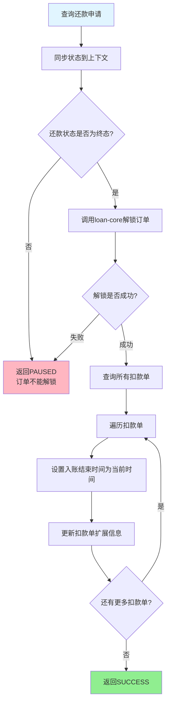

# PH170090 - 订单解锁

## 基本信息

| 属性 | 值 |
|------|-----|
| **处理器代码** | PH170090 |
| **处理器名称** | 订单解锁 |
| **节点类型** | PROCESS |
| **所属业务流** | [[重资产分期制还款异步主流程V401]] |
| **实现类** | RepayApplyBizFlowPH170090ServiceImpl |
| **代码位置** | repayengine-service/.../heavyasset/RepayApplyBizFlowPH170090ServiceImpl.java |

## 功能描述

子流程结束后，解锁还款订单，更新入账结束时间。该节点负责释放订单锁定状态，标记还款流程的最终完成时间。

### 核心功能
1. **状态同步**：同步还款申请的最新状态到上下文
2. **订单解锁**：调用loan-core解锁还款计划
3. **时间记录**：更新扣款单入账结束时间

## 输入参数

| 参数名 | 参数代码 | 类型 | 必填 | 说明 |
|--------|----------|------|------|------|
| 还款申请号 | repayApplyNo | String | 是 | 还款申请标识 |

## 输出参数

| 参数名 | 参数代码 | 类型 | 说明 |
|--------|----------|------|------|
| 解锁状态 | unlockStatus | Boolean | 订单解锁是否成功 |

## 业务处理流程



## 详细处理逻辑

### 步骤1：同步还款申请状态
- **查询**: 根据 `repayApplyNo` 查询最新的还款申请数据
- **同步到上下文**: 将以下字段更新到 `repayContext.getBo()`
  - `repayStatus`: 还款状态
  - `repayAmount`: 申请还款金额
  - `repaySuccessAmount`: 成功还款金额
  - `repayFailureAmount`: 失败还款金额
- **用途**: 确保后续节点使用最新的状态数据

### 步骤2：校验还款状态
- **判断**: 检查 `repayStatus.isFinished()` 是否为 true
- **未完成**: 返回 PAUSED，错误信息："订单由于还款状态未完成不能解锁"
- **已完成**: 继续执行解锁

**可能的未完成原因**：
- 前置节点 PH170080 执行异常
- 并发更新导致状态不一致
- 数据异常

### 步骤3：调用loan-core解锁
- **解锁凭证**: 使用 `repayApplyNo` 作为还款锁定流水号
- **调用服务**: `loanCoreRepayService.cancelRepayPlans(repayLockSerial)`
- **解锁效果**:
  - 释放还款计划锁定
  - 允许后续操作（如再次还款、展期等）
  - 更新loan-core侧的还款状态

**异常处理**：
- **异常类型**: `CjjClientException | CjjServerException | HttpClientException`
- **处理方式**: 捕获异常，返回 PAUSED，等待重试
- **错误信息**: 原始异常消息

### 步骤4：更新扣款单入账结束时间
- **查询**: 根据 `repayApplyNo` 查询所有扣款单
- **遍历更新**: 对每个扣款单执行以下操作
  1. 获取扣款单扩展信息 `extInfo`
  2. 设置 `recordEndedAt = LocalDateTime.now()` (入账结束时间)
  3. 调用 `deductBillService.updateExtInfo()` 更新数据库

**时间语义**：
- `recordEndedAt`: 入账结束时间，以订单解锁时间为准
- 标记还款流程的最终完成时刻
- 用于计算还款总耗时、生成还款记录

## 订单锁定机制

### 锁定流程
```
1. 用户发起还款请求
   ↓
2. 还款流程开始，调用 loan-core 锁定还款计划
   ↓
3. 执行扣款、入账等操作
   ↓
4. 本节点：调用 loan-core 解锁还款计划
   ↓
5. 订单恢复可操作状态
```

### 锁定作用
- **防并发**: 避免同一订单被重复还款
- **数据一致性**: 确保还款过程中订单数据不被修改
- **业务隔离**: 还款期间阻止其他操作（如展期、结清）

### 解锁时机
- **成功还款**: 扣款和入账都成功
- **失败还款**: 扣款或入账失败
- **部分成功**: 部分扣款成功

无论还款结果如何，都需要解锁订单。

## 异常处理

### 失败场景
1. **还款状态未完成**: 前置节点异常，状态未更新
2. **loan-core调用失败**:
   - 网络超时
   - loan-core服务异常
   - 订单不存在或已解锁
3. **扣款单查询失败**: 数据库异常

### 处理策略
- **返回状态**: PAUSED（暂停）
- **错误信息**: 携带具体异常消息
- **重试机制**: 继承全局重试策略（5次/30秒间隔）

### 幂等性
- **解锁操作**: loan-core侧支持幂等，重复解锁不会报错
- **时间更新**: 每次执行都会更新为最新时间（最后一次执行时间为准）

## 数据更新

### 扣款单扩展信息字段
| 字段名 | 字段含义 | 更新值 | 用途 |
|--------|----------|--------|------|
| recordEndedAt | 入账结束时间 | LocalDateTime.now() | 标记还款流程完成时刻 |

### 更新说明
- **更新来源**: `CommonConst.REPAY_ENGINE`
- **更新范围**: 所有扣款单（包括成功和失败的）
- **更新时机**: 订单解锁成功后

## 业务场景

### 场景1：正常还款成功
1. 扣款成功、入账成功
2. 还款状态 = SUCCESS
3. 解锁订单
4. 更新入账结束时间

### 场景2：还款失败
1. 扣款失败或入账失败
2. 还款状态 = FAILURE
3. 仍需解锁订单（释放锁定）
4. 更新入账结束时间

### 场景3：部分成功
1. 部分扣款成功、部分失败
2. 还款状态 = PART_SUCCESS
3. 解锁订单
4. 更新所有扣款单的入账结束时间

## 依赖服务

| 服务名 | 方法 | 用途 |
|--------|------|------|
| IRepayApplyService | getByRepayApplyNo | 查询还款申请 |
| LoanCoreRepayService | cancelRepayPlans | 解锁还款计划 |
| IDeductBillService | getByRepayApplyNo | 查询扣款单 |
| IDeductBillService | updateExtInfo | 更新扣款单扩展信息 |

## 前后置节点

| 节点名称 | 处理器 | 位置 | 说明 |
|----------|--------|------|------|
| 等待子流程结束 | [[PH170080]] | 前置 | 子流程完成，需要解锁 |
| 发送结果消息 | [[PH180050]] | 后置 | 解锁后通知结果 |

## 性能考虑

### 外部调用
- **loan-core解锁**: HTTP调用，可能存在网络延迟
- **超时时间**: 建议配置合理的超时时间
- **重试策略**: loan-core侧建议支持幂等

### 批量更新
- **扣款单数量**: 可能较多（提前还款场景）
- **更新方式**: 逐个更新（可优化为批量更新）
- **优化建议**: 考虑批量更新接口，减少数据库交互

## 监控指标

- 解锁成功率
- loan-core调用耗时
- 扣款单更新耗时
- 解锁失败原因分布

## 相关文档
- [[重资产分期制还款异步主流程V401]]
- [[PH170080]]
- [[PH180050]]
- [[LoanCoreRepayService]]

## 标签
#节点 #处理器 #订单解锁 #资源释放 #还款 #PH170090