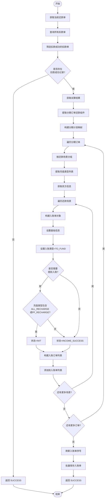

# PH170120 - 生成入账单

## 节点信息

| 属性 | 值 |
|------|------|
| **处理器代码** | PH170120 |
| **节点名称** | 生成入账单 |
| **节点类型** | PROCESS |
| **所属流程** | [[重资产分期制还款异步子流程V401]] |
| **执行阶段** | 扣款后处理阶段 |
| **实现类** | RepayApplyBizFlowPH170120ServiceImpl |
| **优先级** | P1（核心节点） |

## 功能说明

根据扣款成功结果和试算数据生成入账单，为后续客账入账和资方入账做准备。入账单按还款场景（RepayScene）分组生成，每个场景对应一个独立的入账单。

### 核心职责

1. **扣款结果筛选**：过滤出扣款成功的扣款单
2. **试算数据获取**：提取试算结果中的分期订单还款组件
3. **场景分组**：按还款场景（正常还款/提前还款等）对还款计划分组
4. **入账单构建**：为每个场景生成独立的入账单
5. **状态判断**：根据资方配置和充值类型决定入账状态
6. **批量持久化**：统一保存所有入账单到数据库

### 适用场景

- 至少存在一笔扣款成功的扣款单
- 支持多还款场景并行处理
- 需要向资方同步入账信息

## 输入参数

| 参数名 | 参数代码 | 类型 | 来源 | 说明 |
|--------|----------|------|------|------|
| 还款申请对象 | repayApplyBo | RepayApplyBo | 流程变量 | 包含所有还款相关信息 |
| 当前还款单号 | currentRepaymentBillNo | String | 流程变量 | 当前处理的还款单 |
| 当前还款单基础号 | currentRepaymentBaseBillNo | String | 流程变量 | 还款单元标识 |

## 输出参数

| 参数名 | 参数代码 | 类型 | 说明 |
|--------|----------|------|------|
| 无 | - | - | 入账单直接保存到数据库 |

## 业务流程

### 1. 前置校验

**扣款成功校验**
- 查询当前还款单的所有扣款单
- 过滤出状态为 `DEDUCT_SUCCESS` 的扣款单
- 若无扣款成功记录，直接返回成功（无需生成入账单）

### 2. 数据准备

**试算数据获取**
- 根据 `currentRepaymentBaseBillNo` 获取试算单
- 过滤出当前还款单对应的试算结果
- 提取 `StageOrderRepayComponent` 列表（分期订单还款组件）

**分期计划映射构建**
- 从还款单中提取分期订单列表
- 构建 `订单号 -> 分期计划列表` 的映射关系
- 用于后续获取资方信息（assetBank、assetId）

### 3. 入账单生成（双层循环）

**外层循环：遍历分期订单**

对每个分期订单执行以下操作：

1. **场景分组**
   - 将该订单的还款计划按 `repayScene` 分组
   - 每个场景对应一个独立的入账单

2. **充值类型提取**
   - 提取该订单所有计划的 `rechargeType`
   - 去重后用于判断入账状态

3. **资方信息获取**
   - 从分期计划映射中获取第一个计划
   - 提取 `assetBank` 和 `assetId`

**内层循环：遍历还款场景**

对每个场景生成入账单：

1. **基础信息设置**
   - `incomeBillNo`：UUID 生成
   - `repayApplyNo`：还款申请号
   - `repaymentBillNo`：还款单号
   - `uid`：用户 ID
   - `repayScene`：还款场景

2. **入账类型设置**
   - 固定为 `TO_FUND`（资方入账）

3. **入账状态判断**（核心逻辑）
   
   **判断条件**：`needFundIncomeEarly(assetBank, assetId)`
   
   - **需要提前入账**（返回 true）
     - 根据充值类型列表判断：
       - 包含 `ALL_RECHARGE` 或 `PF_RECHARGE` → `INIT`
       - 其他情况 → `INCOME_SUCCESS`
   
   - **不需要提前入账**（返回 false）
     - 直接设置为 `INCOME_SUCCESS`

4. **入账订单列表构建**
   - 将该场景下的还款计划按订单号分组
   - 每个订单生成 `IncomeBillOrderInfo`
   - 包含订单号和计划号列表

5. **序号设置**
   - `incomeSeqNo`：使用场景枚举的 order 值
   - 用于后续排序

### 4. 后置处理

**序号刷新**
- 按 `incomeSeqNo` 升序排序
- 重新分配序号（从 1 开始递增）
- 确保入账单顺序符合业务要求

**批量保存**
- 调用 `batchSaveIncomeBill` 批量插入数据库
- 返回成功结果

## 流程图

## 关键数据结构

### RepaymentIncomeBill（入账单）

| 字段 | 类型 | 说明 |
|------|------|------|
| incomeBillNo | String | 入账单号（UUID） |
| repayApplyNo | String | 还款申请号 |
| repaymentBillNo | String | 还款单号 |
| uid | String | 用户 ID |
| incomeSeqNo | Integer | 入账序号 |
| incomeType | IncomeBillTypeEnum | 入账类型（TO_FUND） |
| incomeStatus | IncomeBillStatusEnum | 入账状态 |
| synchStatus | IncomeBillSynchStatusEnum | 同步状态（INIT） |
| assetBank | BankEnum | 资方银行 |
| assetId | String | 资方 ID |
| repayScene | String | 还款场景 |
| incomeOrderList | List | 入账订单列表 |

### IncomeBillOrderInfo（入账订单信息）

| 字段 | 类型 | 说明 |
|------|------|------|
| orderNo | String | 订单号 |
| planInfoList | List | 计划信息列表 |

### IncomeBillPlanInfo（入账计划信息）

| 字段 | 类型 | 说明 |
|------|------|------|
| planNo | String | 计划号 |

## 业务规则

### 入账状态判断规则

| 条件 | 入账状态 | 说明 |
|------|----------|------|
| 不需要提前入账 | INCOME_SUCCESS | 直接标记为入账成功 |
| 需要提前入账 + 包含全额/部分充值 | INIT | 需要等待充值完成 |
| 需要提前入账 + 不包含充值 | INCOME_SUCCESS | 无需充值，直接成功 |

### 序号分配规则

1. 初始序号使用场景枚举的 order 值
2. 最终序号按 order 值排序后重新分配
3. 从 1 开始递增，确保连续性

## 异常处理

| 场景 | 处理方式 |
|------|----------|
| 无扣款成功记录 | 直接返回成功，不生成入账单 |
| 试算数据为空 | 抛出异常（由上游保证数据完整性） |
| 分期计划映射为空 | 抛出异常（数据一致性问题） |

## 依赖服务

| 服务 | 方法 | 用途 |
|------|------|------|
| IDeductBillService | getByRepaymentBillNo | 查询扣款单列表 |
| IRepayCommonTrialService | safetyGetOneByTrialBillNo | 获取试算单 |
| IRepayCommonTrialService | filterCurrRepatTrialBill | 过滤当前还款单试算结果 |
| ConfigFunctions | needFundIncomeEarly | 判断是否需要提前入账 |
| IRepaymentIncomeBillService | batchSaveIncomeBill | 批量保存入账单 |

## 注意事项

1. **双层循环结构**：外层遍历订单，内层遍历场景，确保每个订单的每个场景都生成独立入账单
2. **状态判断逻辑**：入账状态由资方配置和充值类型共同决定，需同时满足条件
3. **序号管理**：初始序号和最终序号不同，需要刷新操作确保顺序正确
4. **数据一致性**：依赖试算数据和还款单数据的一致性，需上游保证
5. **批量操作**：所有入账单统一保存，提高性能

## 相关节点

- 上游节点：扣款节点（生成扣款单）
- 下游节点：客账入账节点、资方入账节点
- 关联流程：[[重资产分期制还款异步子流程V401]]
