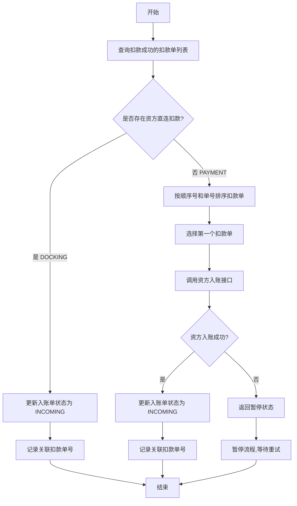
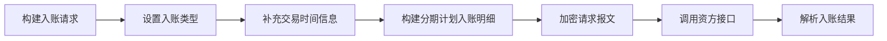

# PH170131 - 客账入账前通知资方入账

## 节点信息

| 属性 | 值 |
|------|-----|
| **节点ID** | node_ph170131 |
| **节点名称** | 客账入账前通知资方入账 |
| **处理器** | PH170131 |
| **节点类型** | PROCESS（处理器节点） |
| **所属流程** | [[重资产分期制还款异步子流程V401]] |
| **执行阶段** | 入账阶段 |
| **优先级** | P1（重要节点） |

## 功能说明

在客账入账前，先通知资方进行资方账户入账。该节点用于处理需要资方先入账的场景，特别是 Payment 渠道的扣款。

### 核心职责

1. **区分扣款渠道**：判断是否为资方直连扣款（DOCKING）或 Payment 渠道扣款
2. **资方入账通知**：对于 Payment 渠道，调用资方入账接口（doFundIncome）
3. **入账单状态更新**：更新入账单状态为 INCOMING（入账中）
4. **扣款单关联**：在入账单扩展信息中记录关联的扣款单号

### 适用场景

- **Payment 渠道扣款**：Payment 渠道扣款成功后，需要通知资方入账
- **资方直连扣款**：Docking 渠道扣款已在资方完成，无需再次入账
- **多方参与**：客账和资方账同时记账的场景

## 业务流程

### 主流程图

### 关键判断逻辑

#### 1. 渠道类型判断

**DOCKING 渠道（资方直连扣款）**：
- 扣款已在资方系统完成
- 资方账户已同步记账
- **处理策略**：跳过资方入账调用，直接更新入账单状态

**PAYMENT 渠道（第三方支付平台扣款）**：
- 扣款在第三方支付平台完成
- 资方账户尚未记账
- **处理策略**：必须调用资方入账接口通知资方

#### 2. 扣款单选择策略

当存在多笔扣款成功的扣款单时，按以下优先级选择：
1. **优先级1**：`deductSeqNo`（扣款顺序号）- 数值小的优先
2. **优先级2**：`deductBillNo`（扣款单编号）- 字典序小的优先

**业务含义**：选择最早发起的扣款单进行资方入账通知。

## 数据流转

### 输入参数

从 `RepayApplyContext` 上下文中获取：

| 参数 | 类型 | 说明 | 来源节点 |
|------|------|------|----------|
| currentRepaymentBillNo | String | 当前还款单编号 | PH170010V1 |
| currentIncomeBillNo | String | 当前入账单编号 | PH170130 |
| repayWay | RepayWay | 还款方式 | PH170010V1 |

从数据库查询扣款单数据：

| 字段 | 类型 | 说明 |
|------|------|------|
| deductStatus | DeductStatus | 扣款状态（需为 DEDUCT_SUCCESS） |
| payChannel | PayChannelEnum | 支付渠道（DOCKING 或 PAYMENT） |
| deductBillNo | String | 扣款单编号 |
| deductSeqNo | Integer | 扣款顺序号 |

### 输出参数

更新 `RepaymentIncomeBill` 入账单：

| 字段 | 类型 | 说明 |
|------|------|------|
| incomeStatus | IncomeBillStatusEnum | 入账状态更新为 INCOMING |
| extInfo.deductBillNo | String | 关联的扣款单编号 |

## 资方入账接口说明

### doFundIncome 核心逻辑

该接口用于通知资方进行账户入账（仅入账，无扣款功能）：

**关键参数**：
- **入账类型**：DOCKING 渠道为 ONLINE，PAYMENT 渠道为 OFFLINE
- **交易时间**：包含渠道申请时间和渠道最终确认时间
- **入账明细**：按分期计划构建本金、利息、费用明细

**异常处理**：
- 资方入账状态异常 → 返回 PAUSED，暂停流程等待重试
- 入账结果为 UNKNOWN → 默认视为 SUCCESS（容错处理）

## 节点依赖关系

### 上游依赖

| 节点 | 关系 | 说明 |
|------|------|------|
| PH170130 | 必须 | 提供当前入账单编号 |
| PH170021 | 必须 | 完成扣款，扣款单状态为 SUCCESS |
| PH170030 | 必须 | 获取扣款结果 |

### 下游依赖

| 节点 | 关系 | 说明 |
|------|------|------|
| PH170132 | 必须 | 获取资方入账明细 |
| PH170036V1 | 必须 | 客账入账 |

## 业务场景示例

### 场景1：Payment 渠道扣款

**业务背景**：用户通过第三方支付平台（如支付宝、微信）完成还款，需要通知资方入账。

**输入数据**：
- 还款单：RP001
- 扣款单：DB001（PAYMENT 渠道，扣款成功）
- 入账单：IB001（状态：INIT）

**处理流程**：
1. 检测到 Payment 渠道扣款
2. 调用资方入账接口 `doFundIncome()`
3. 资方确认入账成功

**输出结果**：
- 入账单状态：INIT → INCOMING
- 入账单扩展信息：关联扣款单号 DB001

### 场景2：资方直连扣款

**业务背景**：用户通过资方自有支付通道完成还款，资方已同步记账。

**输入数据**：
- 还款单：RP002
- 扣款单：DB002（DOCKING 渠道，扣款成功）
- 入账单：IB002（状态：INIT）

**处理流程**：
1. 检测到 Docking 渠道扣款
2. 跳过资方入账调用（资方已记账）
3. 直接更新入账单状态

**输出结果**：
- 入账单状态：INIT → INCOMING
- 入账单扩展信息：关联扣款单号 DB002

### 场景3：多笔扣款单场景

**业务背景**：存在多笔扣款尝试，最终成功一笔。

**输入数据**：
- 还款单：RP003
- 扣款单列表：
  - DB003-1（顺序号=1，PAYMENT，失败）
  - DB003-2（顺序号=2，PAYMENT，成功）
  - DB003-3（顺序号=2，PAYMENT，成功）

**处理流程**：
1. 筛选扣款成功的扣款单：DB003-2、DB003-3
2. 按顺序号和单号排序：DB003-2 排在前面
3. 选择第一个扣款单 DB003-2 进行资方入账

**输出结果**：
- 入账单关联扣款单号：DB003-2

## 异常处理机制

### 异常类型

| 异常场景 | 处理方式 | 业务影响 |
|----------|----------|----------|
| 资方入账状态异常 | 返回 PAUSED，暂停流程 | 流程暂停，等待人工介入或重试 |
| 扣款单列表为空 | 抛出异常 | 流程中断，需检查上游扣款节点 |
| 入账单更新失败 | 抛出异常 | 流程中断，需检查数据库状态 |

### 幂等性保证

- 该节点可重复执行
- 资方入账接口支持幂等（基于业务流水号去重）
- 入账单状态更新为 INCOMING 是幂等操作

## 监控与告警

### 关键监控指标

| 指标名称 | 说明 | 告警阈值 |
|----------|------|----------|
| fund_income_count | 资方入账调用次数 | - |
| fund_income_success | 资方入账成功次数 | - |
| fund_income_fail | 资方入账失败次数 | > 5/min |
| docking_deduct_count | 资方直连扣款数量 | - |
| process_duration | 节点处理耗时 | > 3s |

### 业务监控点

1. **资方入账成功率**：监控资方接口稳定性
2. **Payment vs Docking 比例**：分析扣款渠道分布
3. **入账单状态流转**：监控状态转换是否正常

## 注意事项

1. **渠道判断准确性**：必须准确区分 DOCKING 和 PAYMENT 渠道，避免重复入账或漏入账
2. **扣款单排序逻辑**：确保选择正确的扣款单进行入账，避免选择失败的扣款单
3. **状态更新一致性**：即使跳过资方入账（Docking 场景），也要更新入账单状态为 INCOMING
4. **扩展信息完整性**：必须在扩展信息中记录关联的扣款单号，用于后续对账
5. **幂等性保证**：节点可重复执行，接口调用需支持幂等
6. **上下游协调**：确保上游扣款节点已完成，下游入账节点能正确处理 INCOMING 状态

## 相关文档

- 重资产分期制还款异步子流程V401 - 主流程
- PH170130 - 筛选入账单
- PH170132 - 获取资方入账明细
- PH170036V1 - 客账入账
- BankGateWay接口文档 - 资方接口说明

## 标签

#资方入账 #入账前通知 #Payment渠道 #DOCKING渠道 #repayengine #重要节点