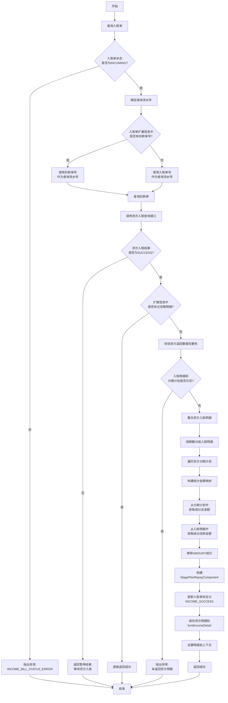
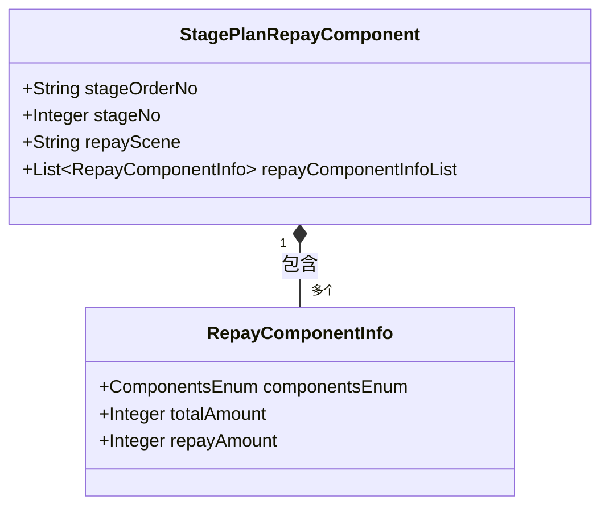
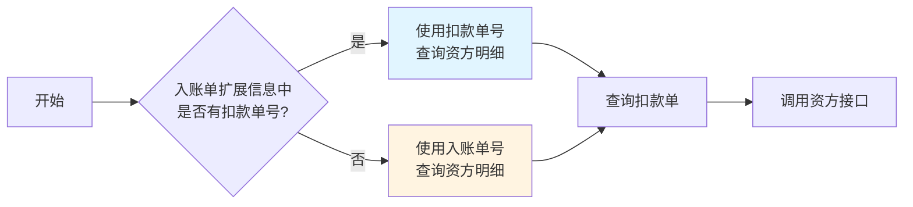
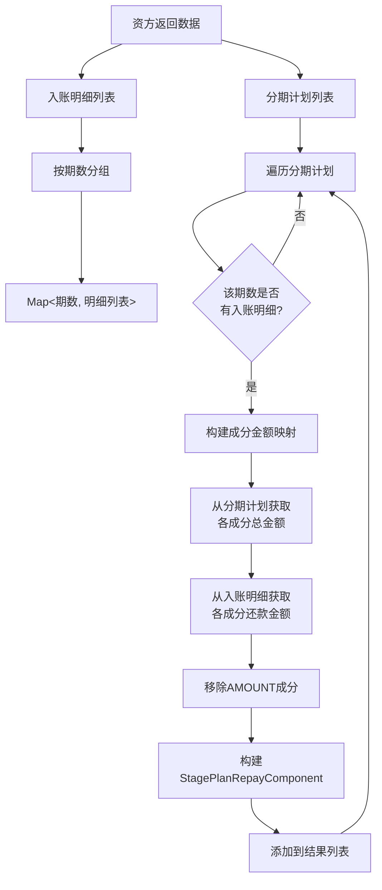

# PH170132 - 获取资方入账明细

## 节点信息

| 属性 | 值 |
|------|-----|
| **节点ID** | node_ph170132 |
| **节点名称** | 获取资方入账明细 |
| **处理器** | PH170132 |
| **节点类型** | PROCESS（处理器节点） |
| **所属流程** | [[重资产分期制还款异步子流程V401]] |
| **执行阶段** | 入账阶段 |
| **优先级** | P1（重要节点） |

## 功能说明

查询资方入账结果和明细，解析资方返回的入账金额按成分（本金、费用等）的分解，并更新入账单状态为 INCOME_SUCCESS，将资方入账明细保存到入账单中。

### 核心职责

1. **入账状态校验**：检查入账单状态是否为 INCOMING（入账中）
2. **资方查询**：调用资方接口查询入账结果和明细
3. **明细解析**：解析资方返回的金额明细（按期数和成分类型分组）
4. **数据整合**：整合资方入账明细和分期计划信息
5. **状态更新**：更新入账单状态为 INCOME_SUCCESS，保存资方明细

### 适用场景

- **资方入账查询**：需要获取资方账户的实际入账金额和明细
- **回灌场景**：全回灌、本息回灌等需要资方明细的场景
- **对账需求**：后续对账流程需要资方入账明细

## 处理流程



## 输入参数

### 上下文依赖

从 `RepayApplyContext` 中获取：

| 参数 | 类型 | 说明 | 来源 |
|------|------|------|------|
| currentIncomeBillNo | String | 当前入账单编号 | PH170130 |

### 入账单数据

从 `RepaymentIncomeBill` 中查询：

| 字段 | 类型 | 说明 |
|------|------|------|
| incomeBillNo | String | 入账单编号 |
| incomeStatus | IncomeBillStatusEnum | 入账状态（必须为 INCOMING） |
| repayScene | String | 还款场景 |
| extInfo.deductBillNo | String | 关联的扣款单编号（可选） |

### 扣款单数据

从 `DeductBill` 中查询（根据扣款单号或入账单号）：

| 字段 | 类型 | 说明 |
|------|------|------|
| deductBillNo | String | 扣款单编号/入账流水号 |

## 输出参数

### 入账单更新

更新 `RepaymentIncomeBill`：

| 字段 | 类型 | 说明 |
|------|------|------|
| incomeStatus | IncomeBillStatusEnum | 更新为 INCOME_SUCCESS |
| fundIncomeDetail | String | 资方入账明细（JSON 格式） |

### 上下文更新

| 字段 | 说明 |
|------|------|
| RepayApplyBo.stagePlanRepayComponentList | 资方入账明细列表 |

### StagePlanRepayComponent 结构



**字段说明**：

- `stageOrderNo`: 分期订单号
- `stageNo`: 期数
- `repayScene`: 还款场景
- `repayComponentInfoList`: 还款成分列表
  - `componentsEnum`: 成分类型（本金、费用等）
  - `totalAmount`: 分期计划总金额
  - `repayAmount`: 本次还款金额

## 核心逻辑详解

### 1. 流水号选择策略



**逻辑说明**：

- **资方扣款场景**：使用扣款单号作为查询流水号
- **非资方扣款场景**：使用入账单号作为查询流水号

### 2. 资方入账结果判断

| 入账结果 | 处理方式 | 说明 |
|----------|----------|------|
| SUCCESS | 继续处理 | 资方已成功入账 |
| PROCESSING/FAIL | 暂停流程 | 等待资方入账完成 |

### 3. 明细整合流程



**关键步骤**：

1. **数据校验**：确保资方返回了入账明细和分期计划
2. **期数分组**：将入账明细按期数分组，便于后续匹配
3. **成分整合**：
   - 从分期计划中获取各成分的总金额（totalAmount）
   - 从入账明细中获取各成分的还款金额（repayAmount）
4. **数据清洗**：移除 AMOUNT 成分（总金额成分不需要）

### 4. 忽略明细场景

当资方返回的扩展信息中标记 `ignoreRepayResult=true` 时，表示不需要资方明细，直接返回成功。

**适用场景**：

- 某些资方不返回详细明细
- 简单入账场景，无需明细解析

## 上下游依赖

### 上游节点

| 节点 | 关系 | 说明 |
|------|------|------|
| PH170131 | 必须 | 通知资方入账，状态变为 INCOMING |

### 下游节点

| 节点 | 关系 | 说明 |
|------|------|------|
| PH170036V1 | 必须 | 客账入账（使用资方明细） |
| PH170037 | 必须 | 获取入账结果 |

## 异常处理

### 异常类型

| 异常码 | 异常场景 | 处理方式 | 影响 |
|--------|----------|----------|------|
| INCOME_BILL_STATUS_ERROR | 入账单状态不是 INCOMING | 抛出客户端异常 | 流程终止 |
| ERROR | 资方未返回入账明细 | 抛出服务端异常 | 流程终止 |
| ERROR | 资方未返回分期计划明细 | 抛出服务端异常 | 流程终止 |

### 特殊处理

**资方未入账**：

- 不抛出异常，返回暂停结果
- 流程等待，资方入账后可重试
- 日志记录：`资方未入账,等待入账结果`

## 业务场景示例

### 场景1：正常获取资方明细

**输入数据**：

- 入账单号：IB001
- 入账状态：INCOMING
- 关联扣款单：DB001

**资方返回数据结构**：

- `transResult`: SUCCESS
- `amountDetailList`: 入账明细列表
  - 期数1：本金10000，费用200
- `bankStageOrderBo`: 分期订单信息
  - 订单号：SO001
  - 期数1计划：本金10000，费用200

**处理结果**：

- 入账单状态更新为：INCOME_SUCCESS
- fundIncomeDetail 保存资方明细 JSON
- 上下文设置 stagePlanRepayComponentList

### 场景2：资方未入账

**输入数据**：

- 入账单号：IB002
- 入账状态：INCOMING

**资方返回**：

- `transResult`: PROCESSING

**处理结果**：

- 流程暂停，等待资方入账
- 可重试，直到资方返回 SUCCESS

### 场景3：忽略明细场景

**输入数据**：

- 入账单号：IB003
- 入账状态：INCOMING

**资方返回**：

- `transResult`: SUCCESS
- `ext.ignoreRepayResult`: true

**处理结果**：

- 直接返回成功，不解析明细
- 入账单状态保持 INCOMING

## 实现位置

```
repayengine-service/src/main/java/cn/caijiajia/repayengine/service/repay/process/heavyasset/
└── RepayApplyBizFlowPH170132ServiceImpl.java

repayengine-service/src/main/java/cn/caijiajia/repayengine/service/performer/impl/
└── BankGateWayRepayPerformerImpl.java (资方接口调用)

repayengine-common/src/main/java/cn/caijiajia/repayengine/common/resp/
├── StagePlanRepayComponent.java
└── RepayComponentInfo.java
```

## 监控指标

| 指标名称 | 说明 | 告警阈值 |
|----------|------|----------|
| income_query_count | 资方入账查询次数 | - |
| income_query_success | 资方入账查询成功次数 | - |
| income_query_fail | 资方入账查询失败次数 | > 5/min |
| income_detail_empty | 资方明细为空次数 | > 10/min |
| income_bill_status_error | 入账单状态错误次数 | > 3/min |

## 注意事项

1. **状态校验**：必须校验入账单状态为 INCOMING，否则抛出异常
2. **流水号选择**：资方扣款时使用扣款单号，否则使用入账单号
3. **明细解析**：准确解析资方返回的金额明细，按期数和成分类型整合
4. **数据完整性**：必须校验资方返回的明细和分期计划不为空
5. **幂等性**：该节点可重复执行，资方接口应支持幂等查询
6. **忽略明细**：注意处理 ignoreRepayResult 标记，避免不必要的解析

## 相关文档

- [重资产分期制还款异步子流程V401](重资产分期制还款异步子流程V401.md) - 主流程
- [PH170131](PH170131.md) - 客账入账前通知资方入账
- [PH170036V1](PH170036V1.md) - 客账入账
- [BankGateWay接口文档](BankGateWay接口文档.md) - 资方接口说明

## 标签

#资方入账 #入账明细 #资方查询 #明细解析 #repayengine #重要节点