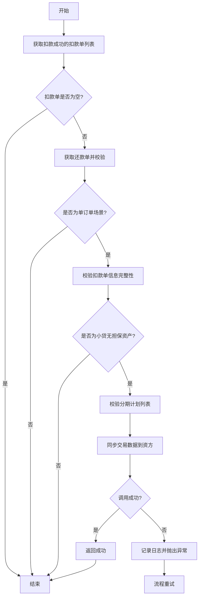
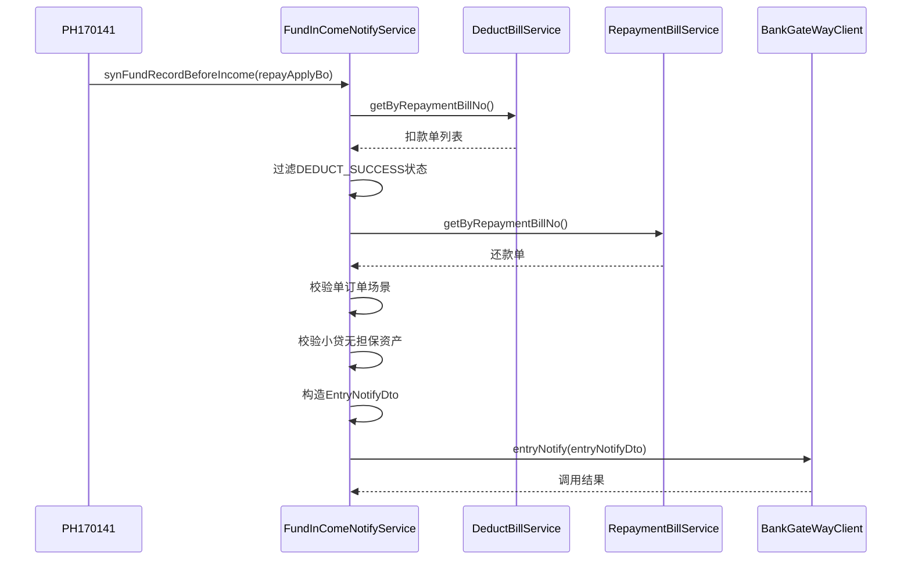

# PH170141 - 入账前同步记录到资方

## 节点信息

| 属性 | 值 |
|------|-----|
| **节点ID** | PH170141 |
| **节点名称** | 入账前小贷无担保同步记录 |
| **处理器** | RepayApplyBizFlowPH170141ServiceImpl |
| **节点类型** | PROCESS（处理器节点） |
| **所属流程** | 重资产分期制还款异步入账流程V401 |
| **执行阶段** | 入账前阶段 |
| **适用场景** | 单订单小贷无担保资产 |

## 业务功能

### 核心职责

在客账入账前，针对**单订单小贷无担保资产**的还款场景，将扣款单数据同步到资方系统。

### 业务价值

1. **前置通知**：在客账入账前建立与资方的数据链路
2. **单订单特化**：单订单场景在入账前完成同步，多订单场景延后到入账后（PH170241节点）
3. **资产隔离**：仅处理小贷无担保指定资金包的资产

### 适用场景

- **单订单场景**：还款单仅涉及一个还款订单
- **小贷无担保资产**：资产ID在灰度配置的`xdUnsecuredAssetList`中
- **扣款成功**：扣款单状态为`DEDUCT_SUCCESS`

## 处理逻辑

### 主流程



### 核心方法调用链



### 关键业务规则

#### 1. 扣款单筛选

- **状态过滤**：仅处理`DeductStatus.DEDUCT_SUCCESS`状态的扣款单
- **单订单假设**：单订单场景下取第一个扣款单即可

#### 2. 单订单场景判断

- 从还款单的分期计划中提取所有`stageOrderNo`
- 去重后数量为1即为单订单场景

#### 3. 小贷无担保资产判断

- 从扣款单扩展信息中获取`assetId`
- 判断`assetId`是否在灰度配置`xdUnsecuredAssetList`中

#### 4. 同步数据构造

构造`EntryNotifyDto`包含：
- **银行标识**：`assetBank.name()`
- **业务流水号**：`repaymentBillNo`
- **用户ID**：`uid`
- **还款金额**：`repayAmount`
- **分期计划列表**：转换为`EntryNotifyDto.StagePlanItem`
- **还款日期**：从扣款单扩展信息获取
- **扣款单列表**：转换为`EntryNotifyDto.DeductBillReq`

## 上下游依赖

### 上游节点

| 节点 | 关系 | 说明 |
|------|------|------|
| PH170130 | 必须 | 筛选入账单，提供入账单上下文 |

### 下游节点

| 节点       | 关系  | 说明          |
| -------- | --- | ----------- |
| PH170131 | 必须  | 客账入账前通知资方入账 |
| PH170132 | 必须  | 获取资方入账明细    |

### 关联节点

| 节点 | 关系 | 说明 |
|------|------|------|
| PH170241 | 互补 | 多订单入账后同步记录到资方 |

## 异常处理

| 异常场景 | 处理方式 | 影响 |
|----------|----------|------|
| 扣款单列表为空 | 直接返回，不抛异常 | 流程继续 |
| 还款单不存在 | 记录日志，直接返回 | 流程继续 |
| 扣款单信息不完整 | 记录日志，直接返回 | 流程继续 |
| 非小贷无担保资产 | 直接返回 | 流程继续 |
| 非单订单场景 | 直接返回 | 流程继续 |
| 分期计划为空 | 记录日志，直接返回 | 流程继续 |
| 资方接口调用失败 | 抛出异常 | 流程重试 |

### 异常处理策略

- **静默返回**：不满足前置条件时直接返回，不阻断流程
- **重试机制**：资方接口调用失败时抛出异常，由框架重试

## 实现细节

### 核心类

```
cn.caijiajia.repayengine.service.repay.process.heavyasset.RepayApplyBizFlowPH170141ServiceImpl
cn.caijiajia.repayengine.service.assetbank.FundInComeNotifyService
```

### 关键方法

#### 1. 节点入口方法

```java
// RepayApplyBizFlowPH170141ServiceImpl.process()
fundInComeNotifyService.synFundRecordBeforeIncome(repayContext.getBo());
```

#### 2. 同步服务方法

```java
// FundInComeNotifyService.synFundRecordBeforeIncome()
- getDeductSuccessDeductBills()       // 获取扣款成功的扣款单
- isSingleOrderScenario()             // 判断单订单场景
- isXdUnsecuredAsset()                // 判断小贷无担保资产
- syncTransData()                     // 同步交易数据
```

### 依赖服务

| 服务 | 用途 |
|------|------|
| DeductBillService | 查询扣款单 |
| RepaymentBillService | 查询还款单 |
| BankGateWayClient | 调用资方网关接口 |
| GrayApiConfigs | 灰度配置（小贷无担保资产列表） |

## 配置项

### 灰度配置

- **配置Key**: `xdUnsecuredAssetList`
- **配置类型**: List<String>
**说明**: 小贷无担保资产ID列表

## 业务场景对比

### PH170141 vs PH170241

| 维度 | PH170141 | PH170241 |
|------|----------|----------|
| **执行时机** | 入账前 | 入账后 |
| **适用场景** | 单订单 | 多订单 |
| **扣款单状态** | DEDUCT_SUCCESS | RECORD_SUCCESS |
| **数据来源** | 还款单分期计划 | 入账明细 |
| **金额计算** | 使用扣款单金额 | 使用入账后实际金额 |

## 注意事项

1. **幂等性**：资方同步接口应支持幂等调用
2. **时序要求**：必须在客账入账前执行
3. **场景隔离**：单订单在此节点处理，多订单延后到PH170241
4. **配置依赖**：依赖灰度配置`xdUnsecuredAssetList`
5. **异常容忍**：大部分前置校验失败时静默返回，不阻断流程

## 相关文档

- [[重资产分期制还款异步子流程V401]] - 主流程
- [[PH170130]] - 筛选入账单
- [[PH170131]] - 客账入账前通知资方入账
- [[PH170241]] - 入账后同步记录到资方
- [[资方入账通知机制]] - 资方通知整体设计

## 标签

#资方同步 #入账前通知 #小贷无担保 #单订单处理 #repayengine #V401