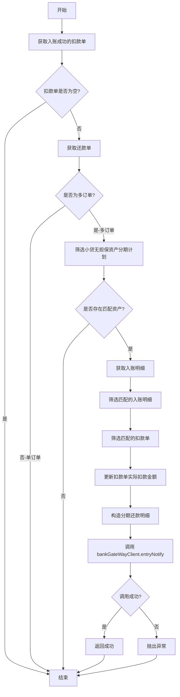

# PH170241 - 入账后同步记录到资方

## 节点信息

| 属性 | 值 |
|------|-----|
| **节点ID** | node_ph170241 |
| **节点名称** | 入账后同步记录到资方 |
| **处理器** | RepayApplyBizFlowPH170241ServiceImpl |
| **节点类型** | PROCESS（处理器节点） |
| **所属流程** | [[重资产分期制还款异步子流程V401]] |
| **执行阶段** | 入账后置阶段 |
| **优先级** | P2（次要节点） |

## 功能说明

在客账入账成功后，将入账结果同步到资方系统。该节点处理多订单场景下的小贷无担保资产入账后同步，与 [[PH170141]] 形成前后呼应，确保资方能够获取完整的还款流程数据。

### 核心职责

1. **多订单入账后同步**：处理多订单场景下的入账明细同步
2. **扣款单金额更新**：根据实际入账明细更新扣款单的实际扣款金额
3. **分期还款明细同步**：将分期还款明细同步到资方系统
4. **资产筛选**：仅处理小贷无担保指定资金包的资产

### 适用场景

- **多订单还款**：一次还款涉及多个订单的场景
- **小贷无担保资产**：仅处理配置在 `xdUnsecuredAssetList` 中的资产
- **入账后数据同步**：需要在入账完成后才能获取准确的分期还款明细

## 业务逻辑

### 处理流程



### 关键步骤

1. **获取入账成功的扣款单**
   - 状态为 `RECORD_SUCCESS` 的扣款单
   - 从 `t_deduct_bill` 表查询

2. **判断订单数量**
   - 单订单场景：在 [[PH170141]] 已处理，此处跳过
   - 多订单场景：继续处理

3. **筛选小贷无担保资产**
   - 根据 `assetId` 判断是否在 `grayApiConfigs.xdUnsecuredAssetList` 中
   - 只处理匹配的分期计划

4. **匹配入账明细**
   - 根据 `stagePlanNo` 匹配入账明细
   - 根据 `deductBillNo` 筛选扣款单

5. **更新扣款单金额**
   - 按 `deductBillNo` 维度统计入账总金额
   - 更新 `realDeductAmount` 字段

6. **构造同步数据**
   - 按 `stagePlanNo` 分组构造 `RepaymentStagePlanItem`
   - 包含：订单号、分期号、还款金额等

7. **调用资方接口**
   - 调用 `bankGateWayClient.entryNotify`
   - 同步交易数据到资方

## 数据流转

### 输入数据

| 数据项 | 来源 | 说明 |
|--------|------|------|
| repayApplyBo | 流程上下文 | 还款申请业务对象 |
| currentRepaymentBillNo | repayApplyBo | 当前还款单号 |
| inComeComponentList | repayApplyBo | 客账入账明细列表 |
| repaymentBillList | repayApplyBo | 还款单列表 |

### 输出数据

| 数据项 | 目标 | 说明 |
|--------|------|------|
| EntryNotifyDto | 资方系统 | 入账通知数据 |

### 关键数据结构

**EntryNotifyDto**
- `bank`: 资方银行
- `bizSerial`: 业务流水号（还款单号）
- `uid`: 用户ID
- `repayAmount`: 总还款金额
- `stagePlanItemList`: 分期还款明细列表
- `repayDate`: 还款日期
- `deductBills`: 扣款单列表

**RepaymentStagePlanItem**
- `stagePlanNo`: 分期计划号
- `stageOrderNo`: 订单号
- `stageNo`: 分期号
- `amount`: 还款金额
- `repaymentBillNo`: 还款单号

## 异常处理

### 异常场景

| 异常场景 | 处理方式 | 影响 |
|----------|----------|------|
| 扣款单为空 | 直接返回 | 无影响 |
| 单订单场景 | 直接返回 | 已在入账前处理 |
| 无匹配资产 | 直接返回 | 不属于处理范围 |
| 入账明细为空 | 抛出异常 | 流程重试 |
| 扣款单不匹配 | 抛出异常 | 流程重试 |
| 资方接口调用失败 | 抛出异常 | 流程重试 |

### 错误码

- `REPAY_QUERY_LOANCORE_INCOME_DETAIL_ERROR`: 查询入账明细失败

## 配置依赖

### 灰度配置

```java
// 小贷无担保资产列表
grayApiConfigs.getXdUnsecuredAssetList()
```

配置位置：`GrayApiConfigs.xdUnsecuredAssetList`

## 上下游依赖

### 前置节点

| 节点 | 关系 | 说明 |
|------|------|------|
| [[PH170036V1]] | 必须 | 客账入账完成 |
| [[PH170037]] | 必须 | 获取入账结果 |
| [[PH170130]] | 必须 | 入账循环控制 |

### 后置节点

| 节点 | 关系 | 说明 |
|------|------|------|
| [[PH170038]] | 必须 | 更新订单信息 |
| [[PH170069]] | 可选 | 结清返现记录 |

## 实现位置

```
repayengine-service/src/main/java/cn/caijiajia/repayengine/service/
├── repay/process/heavyasset/
│   └── RepayApplyBizFlowPH170241ServiceImpl.java  # 节点处理器
└── assetbank/
    └── FundInComeNotifyService.java               # 资方同步服务
        └── synFundRecordAfterIncome()             # 入账后同步方法
```

## 与 PH170141 的区别

| 维度 | PH170141（入账前） | PH170241（入账后） |
|------|-------------------|-------------------|
| **执行时机** | 扣款成功后、入账前 | 入账成功后 |
| **处理场景** | 单订单场景 | 多订单场景 |
| **扣款单状态** | DEDUCT_SUCCESS | RECORD_SUCCESS |
| **数据来源** | 还款单分期计划 | 客账入账明细 |
| **金额更新** | 无需更新 | 更新实际扣款金额 |

## 注意事项

1. **场景互斥**：单订单在 PH170141 处理，多订单在 PH170241 处理
2. **资产筛选**：仅处理配置在 `xdUnsecuredAssetList` 中的资产
3. **金额准确性**：必须在入账后才能获取准确的分期还款明细
4. **扣款单匹配**：根据入账明细中的 `deductBillNo` 筛选扣款单
5. **幂等性**：资方接口应支持幂等，避免重复同步

## 标签

#资方同步 #入账后通知 #多订单 #小贷无担保 #repayengine #次要节点