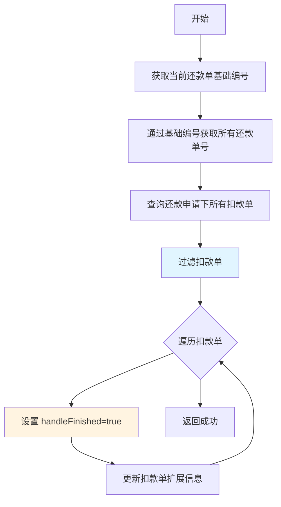
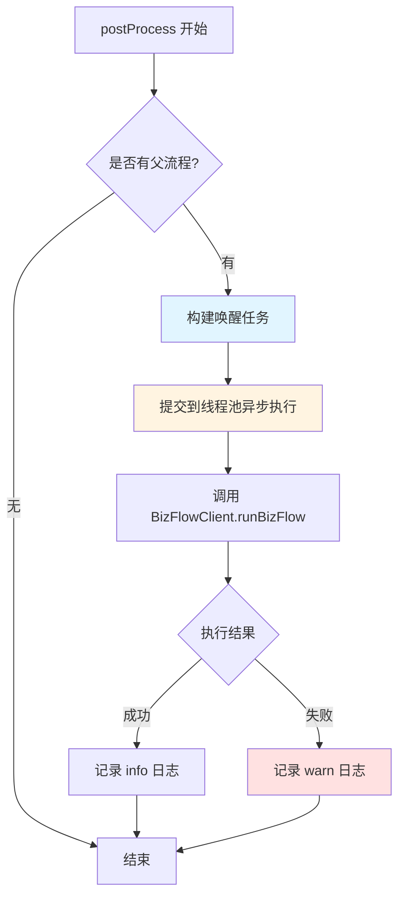

# PH170999V1 - 子流程结束节点

## 节点信息

| 属性 | 值 |
|------|-----|
| **节点ID** | PH170999V1 |
| **节点名称** | 子流程结束节点 |
| **处理器类** | RepayApplyBizFlowPH170999V1ServiceImpl |
| **节点类型** | 流程结束节点 |
| **所属流程** | 重资产分期制还款异步子流程V401 |
| **执行阶段** | ��流程收尾阶段 |

## 功能概述

子流程的终止节点，负责标记扣款单处理完成并唤醒父流程。该节点是父子流程协作的关键枢纽，确保子流程正常结束后父流程能够继续执行。

核心职责：
1. 标记已完成还款的扣款单为 `handleFinished=true`
2. 异步唤醒父流程继续执行
3. 保证子流程正常闭环

## 业务逻辑

### 主流程（process 方法）



**关键逻辑**：
1. 通过 `RepaymentBillUtils.getRepaymentBillListByBaseNo()` 获取当前基础编号对应的所有还款单号
2. 查询还款申请下的所有扣款单（`deductBillService.getByRepayApplyNo()`）
3. 双重过滤：
   - 扣款��的还款单号在当前还款单列表中
   - 扣款单状态为已完成还款（`deductStatus.isRepayFinished()`）
4. 标记扣款单 `handleFinished=true` 并更新到数据库

**与 PH170999 的差异**：
- PH170999：按 `currentRepaymentBillNo` 查询扣款单（单个还款单）
- PH170999V1：按 `currentRepaymentBaseBillNo` 获取所有关联还款单（批量处理）

### 后置流程（postProcess 方法）



**唤醒条件**：
- `parentBizKey` 不为空（存在父流程）
- `bizSerial` 不为空（业务流水号有效）

**唤醒机制**：
- 使用 `repayNotifyParentProcessExecutor` 线程池异步执行
- 调用 `BizFlowClient.runBizFlow()` 触发父流程
- 设置 `ignoreNextHandleTime=true` 立即执行

**异常容错**：
- 唤醒失败仅记录警告日志，不影响子流程结束
- 保证子流程能够正常完成

## 输入输出

### 输入参数

从 `RepayApplyContext` 获取：

| 参数 | 类型 | 说明 |
|------|------|------|
| repayApplyNo | String | 还款申请编号 |
| currentRepaymentBaseBillNo | String | 当前还款单基础编号 |
| repaymentBillList | List | 还款单列表 |
| parentBizKey | String | 父流程业务键 |
| bizSerial | String | 业务流水号 |

### 输出结果

1. **扣款单更新**：`DeductBillExtInfo.handleFinished` 设置为 `true`
2. **父流程唤醒**：通过 BizFlow 框架触发父流程继续执行

## 上下游关系

### 前置节点

| 节点 | 说明 |
|------|------|
| PH170130 | 入账循环完成（fundIncomeFinished=true） |
| PH170038 | 更新订单信息 |
| PH170069 | 结清返现记录（可选） |
| PH170075 | 优惠返现记录（可选） |

### 后续节点

无（流程终止节点）

## 异常处理

| 异常场景 | 处理方式 | 影响范围 |
|----------|----------|----------|
| 扣款单更新失败 | 抛出异常，流程重试 | 阻塞子流程结束 |
| 父流程唤醒失败 | 记录警告日志，继续执行 | 不影响子流程结束 |
| 线程池拒绝任务 | 记录警告日志 | 不影响子流程结束 |

## 业务场景

### 场景1：正常子流程结束

**输入**：
- 还款申请：RA001
- 还款单基础编号：RB001
- 关联还款单：RB001-01, RB001-02
- 扣款单：DB001（RB001-01，已完成）、DB002（RB001-02，已完成）
- 父流程：存在

**处理**：
1. 获取 RB001 对应的还款单号列表：[RB001-01, RB001-02]
2. 查询 RA001 下的所有扣款单
3. 过滤出 DB001、DB002（已完成还款）
4. 标记 DB001、DB002 的 `handleFinished=true`
5. 异步唤醒父流程

**输出**：
- 扣款单标记完成
- 父流程被唤醒继续执行

### 场景2：无父流程

**输入**：
- 还款申请：RA002
- 扣款单：DB003（已完成）
- 父流程：不存在

**处理**：
1. 标记 DB003 的 `handleFinished=true`
2. 跳过父流程唤醒逻辑

**输出**：
- 扣款单标记完成
- 子流程正常结束

## 技术细节

### 扣款单查询差异

| 版本 | 查询方法 | 查询维度 | 适用场景 |
|------|----------|----------|----------|
| PH170999 | `getByRepaymentBillNo()` | 单个还款单号 | 单还款单处理 |
| PH170999V1 | `getByRepayApplyNo()` | 还款申请编号 | 批量还款单处理 |

### 线程池配置

使用 `repayNotifyParentProcessExecutor` 线程池：
- 异步执行唤醒任务，避免阻塞主流程
- 失败���影响子流程结束

### 幂等性保证

- 重复执行仅重复标记 `handleFinished=true`，不影响业务正确性
- 扣款单状态过滤确保仅处理已完成的扣款单

## 注意事项

1. **扣款单过滤**：必须同时满足还款单号匹配和状态为已完成
2. **异步唤醒**：使用线程池异步执行，避免阻塞子流程
3. **异常容错**：唤醒父流程失败不影响子流程正常结束
4. **日志记录**：详细记录唤醒父流程的关键信息，便于问题排查

## 实现位置

```
repayengine-service/src/main/java/cn/caijiajia/repayengine/service/repay/
├── process/heavyasset/RepayApplyBizFlowPH170999V1ServiceImpl.java
└── task/RepayNotifyParentBizFlowTask.java
```

## 相关文档

- 重资产分期制还款异步子流程V401 - 主流程
- PH170130 - 筛选入账单
- BizFlow框架文档 - 父子流程协作机制

## 标签

#子流程结束 #父流程唤醒 #扣款单标记 #流程协作 #repayengine