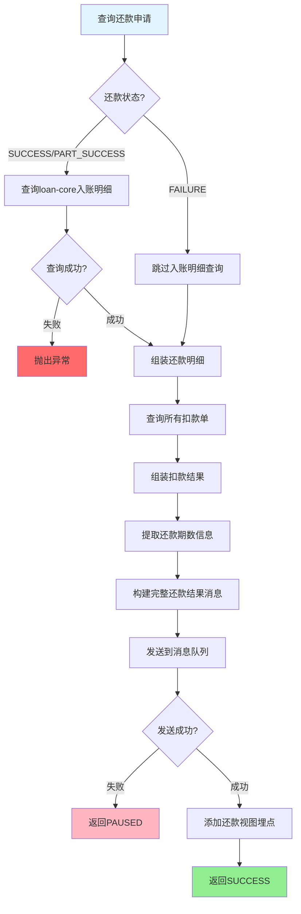

# PH180050 - 发送结果消息

## 基本信息

| 属性 | 值 |
|------|-----|
| **处理器代码** | PH180050 |
| **处理器名称** | 发送结果消息 |
| **节点类型** | PROCESS |
| **所属业务流** | [[重资产分期制还款异步主流程V401]] |
| **实现类** | RepayApplyBizFlowPH180050ServiceImpl |
| **代码位置** | repayengine-service/.../heavyasset/RepayApplyBizFlowPH180050ServiceImpl.java |

## 功能描述

发送还款结果消息通知。该节点负责查询入账明细，组装完整的还款结果消息，发送到消息队列，通知下游系统和用户。

### 核心功能
1. **入账明细查询**：从loan-core查询入账详情
2. **消息组装**：构建��整的还款结果消息
3. **消息发送**：发送到RabbitMQ消息队列
4. **埋点记录**：添加还款视图埋点

## 输入参数

| 参数名 | 参数代码 | 类型 | 必填 | 说明 |
|--------|----------|------|------|------|
| 还款申请号 | repayApplyNo | String | 是 | 还款申请标识 |

## 输出参数

| 参数名 | 参数代码 | 类型 | 说明 |
|--------|----------|------|------|
| 消息ID | messageId | String | 发送的消息标识 |
| 发送状态 | sendStatus | Boolean | 消息发送是否成功 |

## 业务处理流程



## 详细处理逻辑

### 步骤1：查询还款申请
- **查询**: 根据 `repayApplyNo` 查询还款申请（包含期数信息）
- **获取数据**:
  - 基本信息：uid、repayApplyNo、repayStatus 等
  - 期数信息：stagePlanItemList（包含 stageOrderNo、stagePlanNo）

### 步骤2：查询入账明细（成功/部分成功场景）
- **条件**: `repayStatus == SUCCESS || repayStatus == PART_SUCCESS`
- **调用**: `loanCoreQueryService.queryIncomeDetailsByRepayApplyNo()`
- **返回数据**: `List<StagePlanRepayComponent>` 包含：
  - 期数维度的入账明细
  - 各成分金额（本金、利息、费用等）
  - 扣款单关联信息
- **异常处理**: 如果查询失败或返回空，抛出异常
- **减免金额**: 如果存在提前结清减免，记录减免金额

### 步骤3：组装还款明细
基于入账明细和扣款单，构建 `List<PlanRepayDetail>`：

**包含字段**：
- 期数信息：orderNo、stagePlanNo
- 金额明细：
  - 各成分金额：principle（本金）、interest（利息）、fee（费用）、lateFee（逾期费）等
  - 变动金额：changePrinciple、changeInterest 等（拍拍贷API需求）
- 扣款信息：deductBillNo、deductStatus、repayChannel、payChannel
- 时间记录：
  - deductCreatedAt：扣款单创建时间
  - deductStartedAt：扣款开始时间
  - deductEndedAt：扣款结束时间
  - recordStartedAt：入账开始时间
  - recordEndedAt：入账结束时间

**聚合逻辑**：
- 按 `stagePlanNo` 聚合多个扣款单的金额
- 合并同一期数多笔扣款的成分金额

### 步骤4：组装扣款结果
基于扣款单列表，构建 `List<PayResultItem>`：

**按支付方式分组**：
```
PayType.BALANCE → 余额支付结果
PayType.BANK_CARD → 银行卡支付结果
PayType.ALIPAY_SDK → 支付宝支付结果
...
```

**每个支付方式统计**：
- successAmount：成功金额（RECORD_SUCCESS状态的扣款单）
- failureAmount：失败金额（RECORD_FAILED状态的扣款单）
- message：失败原因（取第一个失败扣款单的消息）
- repayChannel：还款渠道
- payInstrumentNo：支付工具编号

**排除逻辑**：
- 排除 `ABORTED`（已废弃）状态的扣款单

### 步骤5：提取期数信息
```
stageOrderNoList: [订单号1, 订单号2, ...]  // 去重
stagePlanNoList: [期数号1, ��数号2, ...]    // 去重
```

### 步骤6：构建完整还款结果消息
```
RepayApplyResultMsg {
    uid: 用户ID
    bizSerial: 业务流水号
    repayApplyNo: 还款申请号
    requestSource: 请求来源
    repayTag: 还款标签
    repayType: 还款类型
    repayWay: 还款方式
    repayChannel: 还款渠道（多个用|拼接）
    status: 还款状态
    successAmount: 成功金额
    failureAmount: 失败金额
    lockSerial: 锁定流水号
    message: 错误信息（多个用|拼接）
    extInfoMap: 扩展信息
    finishedTime: 完成时间
    repayApplySplit: 是否拆单（扣款单数量>1）
    payResultItemList: 分支付方式结果
    stageOrderNoList: 订单号列表
    stagePlanNoList: 期数号列表
    repayDetailList: 还款明细列表
    reduceAmount: 减免金额
}
```

### 步骤7：发送消息
- **调用**: `repayEngineProducer.sendRepayResultMsg()`
- **目标**: RabbitMQ消息队列
- **消费方**:
  - tradeorder：更新交易订单状态
  - repayfront：更新前台还款状态
  - 通知服务：发送短信/推送
- **异常处理**: 捕获发送异常，返回 PAUSED，等待重试

### 步骤8：添加埋点
```
repayFlowTraceProxy.dealRepayMsg()  // 还款处理埋点
repayFlowTraceProxy.resultMsg()     // 还款结果埋点
```

**用途**：
- 数据分析
- 用户行为追踪
- 性能监控

## 消息格式示例

### 成功消息
```json
{
  "uid": "user123",
  "repayApplyNo": "RA20240101001",
  "status": "SUCCESS",
  "successAmount": 100000,
  "failureAmount": 0,
  "repayChannel": "ALIPAY|",
  "payResultItemList": [
    {
      "payType": "ALIPAY_SDK",
      "successAmount": 100000,
      "failureAmount": 0,
      "repayChannel": "ALIPAY"
    }
  ],
  "repayDetailList": [
    {
      "stagePlanNo": "SP001",
      "repayAmount": 100000,
      "principle": 90000,
      "interest": 8000,
      "fee": 2000,
      "deductStatus": "RECORD_SUCCESS"
    }
  ],
  "reduceAmount": 0
}
```

### 失败消息
```json
{
  "uid": "user123",
  "repayApplyNo": "RA20240101001",
  "status": "FAILURE",
  "successAmount": 0,
  "failureAmount": 100000,
  "message": "余额不足|",
  "payResultItemList": [
    {
      "payType": "BALANCE",
      "successAmount": 0,
      "failureAmount": 100000,
      "message": "余额不足"
    }
  ]
}
```

## 成分金额统计

### 支持的成分类型
| 成分枚举 | 中文名称 | 字段名 |
|---------|---------|--------|
| PRINCIPAL | 本金 | principle |
| INTEREST | 利息 | interest |
| FEE | 费用 | fee |
| LATE_FEE | 逾期费 | lateFee |
| WARRANTY_FEE | 担保费 | warrantyFee |
| COMPOUND_INTEREST | 复利 | compoundInterest |
| EARLY_SETTLE_FEE | 提前结清费 | earlySettleFee |
| AMC_FEE | 资管费 | amcFee |

### 变动金额（拍拍贷API需求）
- changePrinciple：本金变动
- changeFee：费用变动
- changeInterest：利息变动
- changeWarrantyFee：担保费变动
- changeEarlySettleFee：提前结清费变动
- changeAmcFee：资管费变动

**用途**：记录减免、调整等变动金额

## 异常处理

### 失败场景
1. **入账明细查询失败**: loan-core异常或返回空
2. **消息发送失败**: RabbitMQ不可用或网络异常
3. **数据组装异常**: 扣款单状态异常

### 处理策略
- **查询失败**: 抛出异常，终止流程
- **发送失败**: 返回 PAUSED，等待重试
- **重试机制**: 继承全局重试策略（5次/30秒间隔）

### 失败影响
- 消息发送失败不影响还款结果（还款已完成）
- 可通过重试机制补发消息
- 如果最终失败，可人工补发或通过补偿任务处理

## 消息接收方

| 接收方 | 用途 | 处理逻辑 |
|--------|------|----------|
| tradeorder | 更新交易订单 | 更新订单状态、金额 |
| repayfront | 更新前台状态 | 刷新用户还款记录 |
| repayengine | 状态同步 | 内部状态同步 |
| 通知服务 | 用户通知 | 发送短信/推送 |

## 依赖服务

| 服务名 | 方法 | 用途 |
|--------|------|------|
| IRepayApplyService | getByRepayApplyNo | 查询还款申请 |
| LoanCoreQueryService | queryIncomeDetailsByRepayApplyNo | 查询入账明细 |
| IDeductBillService | getDeductBillList | 查询扣款单 |
| RepayEngineProducer | sendRepayResultMsg | 发送消息 |
| RepayFlowTraceProxy | dealRepayMsg/resultMsg | 添加埋点 |

## 前后置节点

| 节点名称 | 处理器 | 位置 | 说明 |
|----------|--------|------|------|
| 订单解锁 | [[PH170090]] | 前置 | 订单已解锁，可以通知结果 |
| 收尾节点 | [[PH999999]] | 后置 | 消息发送后进行流程清理 |

## 性能考虑

### 外部调用
- **loan-core查询**: HTTP调用，可能存在延迟
- **消息发送**: RabbitMQ发送，一般较快
- **优化建议**: 可考虑异步发送消息，减少流程阻塞

### 数据量
- **入账明细**: 提前还款场景可能较多
- **扣款单数量**: 多个还款单组场景较多
- **消息大小**: 需控制消息体大小，避免超限

## 监控指标

- 消息发送成功率
- loan-core查询耗时
- 消息组装耗时
- 消息发送耗时
- 各消费方消费延迟

## 相关文档
- [[��资产分期制还款异步主流程V401]]
- [[PH170090]]
- [[PH999999]]
- [[RepayApplyResultMsg]]
- [[LoanCoreQueryService]]

## 标签
#节点 #处理器 #消息发送 #结果通知 #还款 #PH180050