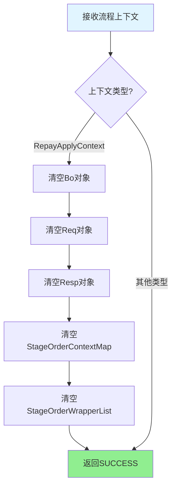

# PH999999 - 收尾节点

## 基本信息

| 属性 | 值 |
|------|-----|
| **处理器代码** | PH999999 |
| **处理器名称** | 收尾节点 |
| **节点类型** | PROCESS |
| **所属业务流** | [[重资产分期制还款异步主流程V401]] |
| **实现类** | RepayApplyBizFlowPH999999ServiceImpl |
| **代码位置** | repayengine-service/.../heavyasset/RepayApplyBizFlowPH999999ServiceImpl.java |

## 功能描述

流程收尾处理节点。该节点负责流程结束前的清理工作，主要是清理流程上下文中的大对象，释放内存资源。

### 核心功能
1. **上下文清理**：清空流程上下文中的业务对象
2. **内存释放**：释放大对象，避免内存泄露
3. **流程终结**：标记流程正常结束

## 输入参数

| 参数名 | 参数代码 | 类型 | 必填 | 说明 |
|--------|----------|------|------|------|
| 流程上下文 | processContext | ProcessContext | 是 | 完整的流程执行上下文 |

## 输出参数

无特殊输出，直接返回 SUCCESS。

## 业务处理流程



## 详细处理逻辑

### 步骤1：业务处理（空实现）
```
process(RepayApplyContext repayContext) {
    return createSuccessProcessResult();
}
```

**说明**：
- 主处理方法为空实现
- 直接返回成功
- 实际清理工作在 `refreshProcessContext()` 中执行

### 步骤2：上下文刷新（核心逻辑）
```
refreshProcessContext(ProcessContext<RepayContext> processContext) {
    RepayContext repayContext = processContext.getRequestParam();
    if (repayContext != null && repayContext instanceof RepayApplyContext) {
        ((RepayApplyContext)repayContext).setBo(null);
        ((RepayApplyContext)repayContext).setReq(null);
        ((RepayApplyContext)repayContext).setResp(null);
        ((RepayApplyContext)repayContext).setStageOrderContextMap(null);
        ((RepayApplyContext)repayContext).setStageOrderWrapperList(null);
    }
}
```

**清理对象**：
1. **Bo（Business Object）**: 业务对象，包含还款单、扣款单等信息
2. **Req（Request）**: 请求对象，包含用户输入参数
3. **Resp（Response）**: 响应对象，包含处理结果
4. **StageOrderContextMap**: 期数订单上下文映射表
5. **StageOrderWrapperList**: 期数订单包装列表

## 为什么需要清理

### 内存占用分析
| 对象 | 平均大小 | 数量 | 总大小估算 |
|------|----------|------|-----------|
| Bo | ~10KB | 1 | 10KB |
| 还款单列表 | ~1KB/条 | 5-20条 | 5-20KB |
| 扣款单列表 | ~1KB/条 | 5-20条 | 5-20KB |
| 期数上下文 | ~5KB/期 | 5-20期 | 25-100KB |
| 总计 | - | - | 45-150KB |

### 清理时机
- **流程执行中**: 上下文对象需要保留，供各节点使用
- **流程结束前**: 业务逻辑已完成，上下文对象不再需要
- **流程结束后**: 上下文对象由框架管理，可能存在一段时间才被GC

### 清理收益
1. **减少内存占用**: 特别是高并发场景
2. **加速GC**: 减少Full GC频率
3. **避免内存泄露**: 防止上下文对象长时间驻留

## 清理策略

### 安全清理
- **null赋值**: 不删除对象，只是解除引用
- **GC接管**: 由JVM垃圾回收器自动回收
- **无副作用**: 清理后不影响流程结果

### 选择性清理
只清理大对象，保留必要的元数据：
- **保留**: uid、bizSerial、repayApplyNo 等标识
- **清理**: 业务对象、列表数据等大对象

## 流程生命周期

```
1. 流程启动
   ↓
2. 初始化上下文
   ↓
3. 各节点处理（使用上下文）
   ↓
4. PH999999 - 清理上下文
   ↓
5. 流程结束
   ↓
6. 框架回收上下文对象
```

## 与其他节点的区别

### PH180050（发送消息）
- **职责**: 发送业务消息
- **上下文**: 需要读取上下文数据

### PH999999（收尾）
- **职责**: 清理上下文
- **上下文**: 不读取数据，只清理

## 异常处理

### 清理失败
- **概率**: 极低（仅赋null操作）
- **影响**: 不影响流程结果
- **处理**: 忽略异常，继续返回成功

### 无异常重试
该节点没有异常重试逻辑，因为：
- 操作简单，不会失败
- 失败不影响业务
- 重试无意义

## 设计模式

### 模板方法模式
```
AbstractRepayBizFlowServiceImpl {
    process()               // 业务处理（子类实现）
    refreshProcessContext() // 上下文刷新（子类可选实现）
}

RepayApplyBizFlowPH999999ServiceImpl {
    process()               // 空实现，直接返回成功
    refreshProcessContext() // 实现��理逻辑
}
```

### 钩子方法
`refreshProcessContext()` 是框架提供的钩子方法：
- **调用时机**: 节点处理完成后
- **用途**: 刷新或清理上下文
- **默认实现**: 空方法（不做任何处理）

## 最佳实践

### 1. 收尾节点的位置
- **必须是最后一个业务节点**: 在END节点之前
- **不能放在中间**: 避免清理后其他节点无法访问数据

### 2. 清理的粒度
- **清理大对象**: 列表、映射表
- **保留基础数据**: 标识符、状态码

### 3. 性能考虑
- **清理开销**: 可忽略（仅赋null）
- **GC收益**: 显著（特别是高并发场景）

## 监控指标

由于该节点逻辑简单，通常不需要专门监控。如果需要，可监控：
- 执行耗时（应该接近0）
- 执行成功率（应该100%）

## 前后置节点

| 节点名称 | 处理器 | 位置 | 说明 |
|----------|--------|------|------|
| 发送结果消息 | [[PH180050]] | 前置 | 消息发送完成后收尾 |
| 结束 | END | 后置 | 流程正式结束 |

## 相关文档
- [[重资产分期制还款异步主流程V401]]
- [[PH180050]]
- [[AbstractRepayBizFlowServiceImpl]]

## 标签
#节点 #处理器 #流程收尾 #资源清理 #还款 #PH999999