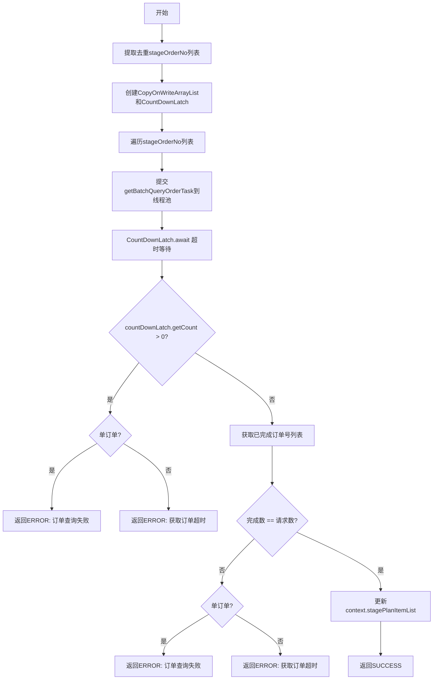

# PL040010 - 初始化轻资产分期信息

## 节点信息

| 属性 | 值 |
|------|-----|
| **处理器代码** | PL040010 |
| **节点名称** | 初始化轻资产分期信息 |
| **节点类型** | PROCESS |
| **所属流程** | [[轻资产还款受理流程同步主流程Vl3.1.0]] |
| **执行阶段** | 轻资产分期处理阶段 |
| **实现类** | RepayApplyBizFlowPL040010ServiceImpl |
| **优先级** | P0（核心节点） |

## 功能说明

从分期计划项中提取所有不重复的分期订单号，使用线程池并行查询各分期订单的详细信息，通过CountDownLatch协调并行任务并支持超时控制。

### 核心职责
1. **提取订单号**: 从StagePlanItemList中提取去重的stageOrderNo列表
2. **并行查询**: 通过线程池并行调用银行网关查询订单详情
3. **超时控制**: 使用CountDownLatch + 可配置超时时间等待所有查询完成
4. **结果校验**: 验证所有订单都已成功查询，更新上下文

### 适用场景
- 单订单轻资产还款：1个订单号，1个查询任务
- 多订单轻资产还款：N个订单号，N个并行查询任务

## 输入参数

| 参数名 | 参数代码 | 类型 | 来源/说明 |
|--------|----------|------|-----------|
| 分期计划项列表 | stagePlanItemList | List\<StagePlanItem\> | RepayApplyBo，包含stageOrderNo |

## 输出参数

| 参数名 | 参数代码 | 类型 | 说明 |
|--------|----------|------|------|
| 分期计划项列表(含订单详情) | stagePlanItemList | CopyOnWriteArrayList\<StagePlanItem\> | 查询后更新到RepayApplyBo |

## 处理流程



## 核心业务逻辑

### 1. 订单号提取

```
stagePlanItemList.stream()
  .map(StagePlanItem::getStageOrderNo)
  .distinct()
  .collect(Collectors.toList())
```

### 2. 并行查询

- **线程池**: `lightAssetSyncProcessExecutor`
- **任务工厂**: `repayBatchRunnableFactory.getBatchQueryOrderTask()`
- **结果收集**: `CopyOnWriteArrayList<StagePlanItem>` 线程安全列表
- **协调机制**: `CountDownLatch(stageOrderNoList.size())`

### 3. 超时控制

- **超时时间**: `configs.getLqueryDeductBillWaitMilliSeconds()` 毫秒
- **判断方式**: `countDownLatch.await()` 返回后检查 `getCount() > 0`

### 4. 结果校验

两级校验确保数据完整性：
1. CountDownLatch未归零 → 有任务超时
2. 已完成订单数 ≠ 请求订单数 → 部分查询失败

**错误码区分**：
- 单订单场景: `STAGE_ORDER_CAN_NOT_FOUND_FOR_QUERY`
- 多订单场景: `REPAY_LIGHT_ASSET_ORDER_ERROR`("获取订单超时")

## 异常处理

| 异常场景 | 错误类型 | 处理方式 | 影响 |
|----------|----------|----------|------|
| 查询超时（单订单） | - | 返回ERROR | STAGE_ORDER_CAN_NOT_FOUND_FOR_QUERY |
| 查询超时（多订单） | - | 返回ERROR | REPAY_LIGHT_ASSET_ORDER_ERROR |
| HTTP调用异常 | HttpClientException | 返回ERROR | 直接返回异常消息 |
| 其他异常 | Exception | 返回ERROR | 记录warn日志 |

## 线程池配置

### Bean名称
`lightAssetSyncProcessExecutor`

### 作用
轻资产同步流程中的并行查询任务执行

## 上游节点
- [[P000000]] - 预留空节点

## 下游节点
- [[PL040020]] - 轻资产拆分还款单

## 实现位置

```
repayengine-service/src/main/java/cn/caijiajia/repayengine/service/
└── repay/process/impl/
    └── RepayApplyBizFlowPL040010ServiceImpl.java  (90行)
```

## 相关文档
- [[轻资产还款受理流程同步主流程Vl3.1.0]] - 所属业务流
- [[轻资产还款异步主流程Vl3.1.0]] - 异步处理流程

## 标签
#节点 #轻资产 #并行查询 #订单初始化 #PL040010