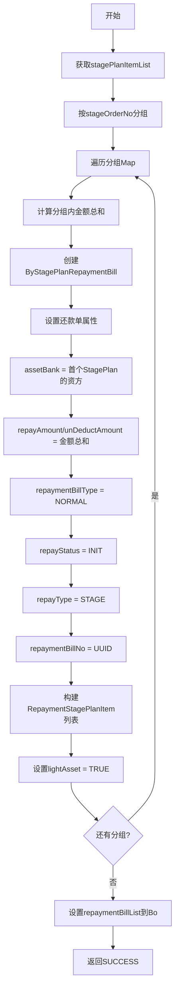

# PL040020 - 轻资产拆分还款单

## 节点信息

| 属性 | 值 |
|------|-----|
| **处理器代码** | PL040020 |
| **节点名称** | 轻资产拆分还款单 |
| **节点类型** | PROCESS |
| **所属流程** | [[轻资产还款受理流程同步主流程Vl3.1.0]] |
| **执行阶段** | 轻资产分期处理阶段 |
| **实现类** | RepayApplyBizFlowPL040020ServiceImpl |
| **优先级** | P1 |

## 功能说明

按分期订单号(stageOrderNo)分组分期计划项，为每组创建独立的还款单(ByStagePlanRepaymentBill)，计算各还款单金额，并标记轻资产属性。

### 核心职责
1. **分组**: 按stageOrderNo对stagePlanItemList进行分组
2. **创建还款单**: 为每个分组创建ByStagePlanRepaymentBill
3. **金额计算**: 还款金额 = 分组内所有分期金额之和
4. **属性设置**: 设置还款类型、状态、资方银行等
5. **轻资产标识**: 标记lightAsset=TRUE

### 适用场景
- 单订单还款：1个分组 → 1张还款单
- 多订单还款：N个分组 → N张还款单

## 输入参数

| 参数名 | 参数代码 | 类型 | 来源/说明 |
|--------|----------|------|-----------|
| 分期计划项列表 | stagePlanItemList | List\<StagePlanItem\> | RepayApplyBo |
| 还款申请号 | repayApplyNo | String | RepayApplyBo |
| 用户ID | uid | String | RepayApplyContext |

## 输出参数

| 参数名 | 参数代码 | 类型 | 说明 |
|--------|----------|------|------|
| 还款单列表 | repaymentBillList | List\<BaseRepaymentBill\> | 设置到RepayApplyBo |

## 处理流程



## 核心业务逻辑

### 1. 分组规则

```
stagePlanItemList.stream()
  .collect(Collectors.groupingBy(StagePlanItem::getStageOrderNo))
→ Map<String, List<StagePlanItem>>
```

一个stageOrderNo对应一个资方订单，一个资方订单生成一张还款单。

### 2. 还款单创建

每张还款单的属性初始化：

| 属性 | 值 | 说明 |
|------|-----|------|
| assetBank | 首条StagePlanItem的assetBank | 资方银行 |
| repayAmount | 分组内所有amount之和 | 还款金额 |
| unDeductAmount | = repayAmount | 未扣款金额 |
| repaymentBillType | NORMAL | 普通还款单 |
| splitAmount | 0 | 已拆分金额 |
| repayStatus | INIT | 初始状态 |
| repayType | STAGE | 分期还款 |
| repaymentBillNo | UUID | 唯一标识 |

### 3. 分期计划项关联

为每张还款单构建 `RepaymentStagePlanItem` 列表，包含：
- stageOrderNo（分期订单号）
- stagePlanNo（分期计划号）
- stageNo（期数）
- amount（金额）

### 4. 轻资产标识

```
byStagePlanRepaymentBill.fetchExtInfo().setLightAsset(Boolean.TRUE)
```

该标识用于后续流程区分轻资产/重资产处理逻辑。

## 异常处理

| 异常场景 | 错误类型 | 处理方式 | 影响 |
|----------|----------|----------|------|
| 创建还款单异常 | Exception | 返回PAUSED | 流程暂停等待重试 |

## 上游节点
- [[PL040010]] - 初始化轻资产分期信息

## 下游节点
- [[P000000]] - 预留空节点 → [[PL040030]] - 还款试算

## 实现位置

```
repayengine-service/src/main/java/cn/caijiajia/repayengine/service/
└── repay/process/impl/
    └── RepayApplyBizFlowPL040020ServiceImpl.java  (114行)
```

## 相关文档
- [[轻资产还款受理流程同步主流程Vl3.1.0]] - 所属业务流
- [[PL040010]] - 上游数据来源
- [[PL040030]] - 下游试算节点

## 标签
#节点 #轻资产 #还款单拆分 #PL040020