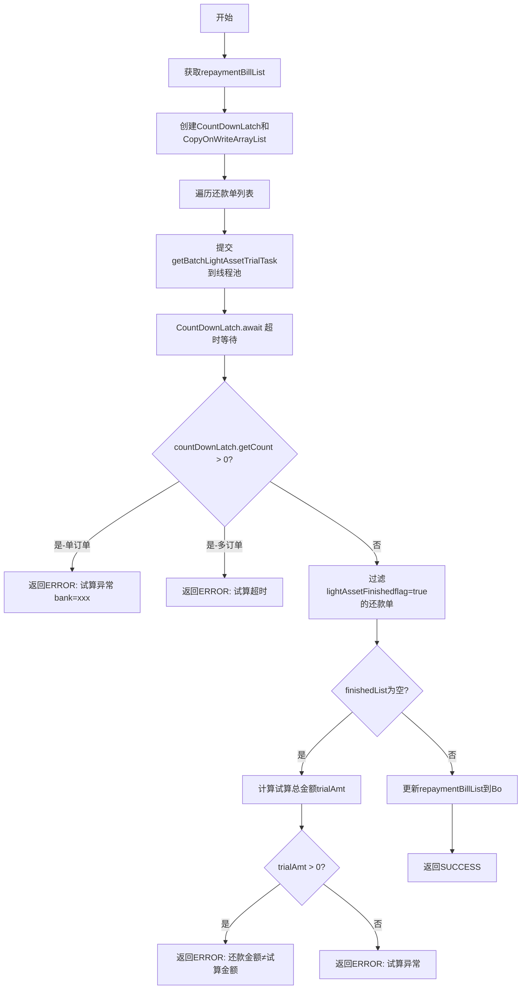

# PL040030 - 还款试算

## 节点信息

| 属性 | 值 |
|------|-----|
| **处理器代码** | PL040030 |
| **节点名称** | 还款试算 |
| **节点类型** | PROCESS |
| **所属流程** | [[轻资产还款受理流程同步主流程Vl3.1.0]] |
| **执行阶段** | 轻资产分期处理阶段 |
| **实现类** | RepayApplyBizFlowPL040030ServiceImpl |
| **优先级** | P0（核心节点） |

## 功能说明

并行调用资方试算接口对每张还款单进行还款试算，校验试算金额与用户请求还款金额的一致性。试算通过的还款单标记为已完成(lightAssetFinishedflag=true)。

### 核心职责
1. **并行试算**: 为每张还款单提交试算任务到线程池
2. **超时控制**: CountDownLatch + 可配置超时
3. **金额校验**: 试算金额与请求金额比对
4. **标记完成**: 试算通过设置lightAssetFinishedflag

### 适用场景
- 所有轻资产还款申请（单笔/多笔）

## 输入参数

| 参数名 | 参数代码 | 类型 | 来源/说明 |
|--------|----------|------|-----------|
| 还款单列表 | repaymentBillList | List\<BaseRepaymentBill\> | RepayApplyBo |
| 还款金额 | repayAmount | Integer | RepayApplyReq |

## 输出参数

| 参数名 | 参数代码 | 类型 | 说明 |
|--------|----------|------|------|
| 还款单列表(含试算结果) | repaymentBillList | CopyOnWriteArrayList | 更新到RepayApplyBo |

## 处理流程



## 核心业务逻辑

### 1. 并行试算

- **线程池**: `lightAssetSyncProcessExecutor`
- **任务工厂**: `repayBatchRunnableFactory.getBatchLightAssetTrialTask()`
- **参数**: repayContext, 单个还款单, countDownLatch
- 每个任务调用资方试算API，结果写入还款单的`DeductBillExtInfo.plansAmount`

### 2. 试算结果判定

任务完成后，试算成功的还款单标记 `lightAssetFinishedflag = true`，失败的保持为 false。

### 3. 金额校验

当所有试算均失败（finishedList为空）时：
- 汇总所有 `DeductBillExtInfo.plansAmount`
- 若trialAmt > 0：说明试算有返回但金额不匹配 → `REPAY_AMOUNT_NOT_EQUAL_REPAY_TRIAL_AMOUNT`
- 若trialAmt = 0：说明试算无有效返回 → "试算异常"

## 异常处理

| 异常场景 | 错误类型 | 处理方式 | 影响 |
|----------|----------|----------|------|
| 试算超时（单订单） | - | 返回ERROR | 银行级别错误消息 |
| 试算超时（多订单） | - | 返回ERROR | REPAY_LIGHT_ASSET_ORDER_ERROR |
| 金额不匹配 | - | 返回ERROR | REPAY_AMOUNT_NOT_EQUAL_REPAY_TRIAL_AMOUNT |
| 全部试算失败 | - | 返回ERROR | "试算异常" |
| 其他异常 | Exception | 返回ERROR | 记录warn日志 |

## 线程池配置

### Bean名称
`lightAssetSyncProcessExecutor`

### 作用
轻资产同步流程并行试算

## 上游节点
- [[P000000]] - 预留空节点（实际数据来自[[PL040020]]）

## 下游节点
- [[PL040040]] - 轻资产拆分扣款单准备

## 实现位置

```
repayengine-service/src/main/java/cn/caijiajia/repayengine/service/
└── repay/process/impl/
    └── RepayApplyBizFlowPL040030ServiceImpl.java  (89行)
```

## 相关文档
- [[轻资产还款受理流程同步主流程Vl3.1.0]] - 所属业务流
- [[PL040020]] - 上游还款单拆分
- [[PL040040]] - 下游预检节点

## 标签
#节点 #轻资产 #试算 #并行处理 #PL040030