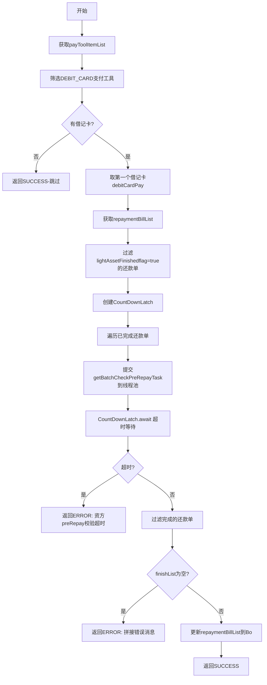

# PL040040 - 轻资产拆分扣款单准备

## 节点信息

| 属性 | 值 |
|------|-----|
| **处理器代码** | PL040040 |
| **节点名称** | 轻资产拆分扣款单准备 |
| **节点类型** | PROCESS |
| **所属流程** | [[轻资产还款受理流程同步主流程Vl3.1.0]] |
| **执行阶段** | 轻资产分期处理阶段 |
| **实现类** | RepayApplyBizFlowPL040040ServiceImpl |
| **优先级** | P1 |

## 功能说明

对借记卡(DEBIT_CARD)支付工具调用资方preRepay校验接口，验证是否可提前结清、是否支持拆分扣款、获取支付渠道等信息。如果没有借记卡支付工具则直接跳过。

### 核心职责
1. **筛选借记卡**: 从支付工具列表中过滤DEBIT_CARD类型
2. **并行校验**: 对已完成试算的还款单并行调用preRepay校验
3. **结果收集**: 收集校验错误信息
4. **条件跳过**: 无借记卡时直接返回成功

### 适用场景
- 使用借记卡支付的轻资产还款
- 混合支付中包含借记卡的场景

## 输入参数

| 参数名 | 参数代码 | 类型 | 来源/说明 |
|--------|----------|------|-----------|
| 支付工具列表 | payToolItemList | List\<PayToolItem\> | RepayApplyBo |
| 还款单列表 | repaymentBillList | List\<BaseRepaymentBill\> | RepayApplyBo |
| 还款方式 | repayWay | RepayWay | RepayApplyBo |

## 输出参数

| 参数名 | 参数代码 | 类型 | 说明 |
|--------|----------|------|------|
| 还款单列表(含preRepay结果) | repaymentBillList | CopyOnWriteArrayList | 更新到RepayApplyBo |

## 处理流程



## 核心业务逻辑

### 1. 借记卡筛选

```
payToolsHandler.getPayToolsByPayType(payToolItemList, PayType.DEBIT_CARD)
```

无借记卡时直接跳过——非银行卡支付（如微信、优惠券等）不需要资方preRepay校验。

### 2. 并行preRepay校验

- **线程池**: `lightAssetSyncProcessExecutor`
- **任务工厂**: `repayBatchRunnableFactory.getBatchCheckPreRepayTask()`
- **参数**: 还款单、借记卡工具、错误消息列表、countDownLatch、还款方式
- **只校验**: `lightAssetFinishedflag=true` 的还款单（试算通过的）

### 3. 错误消息收集

- `CopyOnWriteArrayList<String> errorMsgList` 收集各任务的错误信息
- 校验失败时拼接所有错误消息: `String.join(",", errorMsgList)`
- 默认消息: "资方preRepay校验异常"

## 异常处理

| 异常场景 | 错误类型 | 处理方式 | 影响 |
|----------|----------|----------|------|
| 无借记卡 | - | 返回SUCCESS | 跳过校验 |
| 校验超时 | - | 返回ERROR | REPAY_LIGHT_ASSET_ORDER_ERROR |
| 全部校验失败 | - | 返回ERROR | 拼接错误消息 |
| 其他异常 | Exception | 返回PAUSED | 流程暂停重试 |

## 线程池配置

### Bean名称
`lightAssetSyncProcessExecutor`

## 上游节点
- [[PL040030]] - 还款试算

## 下游节点
- [[PL040050]] - 拆扣款单

## 实现位置

```
repayengine-service/src/main/java/cn/caijiajia/repayengine/service/
└── repay/process/impl/
    └── RepayApplyBizFlowPL040040ServiceImpl.java  (109行)
```

## 相关文档
- [[轻资产还款受理流程同步主流程Vl3.1.0]] - 所属业务流
- [[PL040030]] - 上游试算
- [[PL040050]] - 下游拆扣款单

## 标签
#节点 #轻资产 #preRepay校验 #并行处理 #PL040040