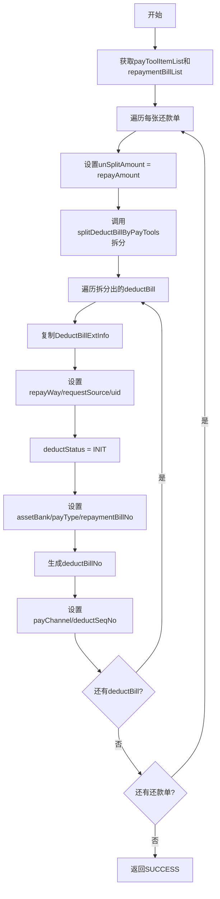

# PL040050 - 拆扣款单

## 节点信息

| 属性 | 值 |
|------|-----|
| **处理器代码** | PL040050 |
| **节点名称** | 拆扣款单 |
| **节点类型** | PROCESS |
| **所属流程** | [[轻资产还款受理流程同步主流程Vl3.1.0]] |
| **执行阶段** | 轻资产分期处理阶段 |
| **实现类** | RepayApplyBizFlowPL040050ServiceImpl |
| **优先级** | P0（核心节点） |

## 功能说明

根据支付工具列表和各工具的限额，将还款单金额拆分为多张扣款单。每张扣款单对应一个支付工具，设置支付渠道、扣款状态等属性。

### 核心职责
1. **金额拆分**: 按支付工具限额分配还款金额到多张扣款单
2. **支付工具映射**: 根据PayType创建对应类型的PayToolItem
3. **支付渠道映射**: 根据PayType确定PayChannel
4. **扣款单号生成**: 微信/线下使用工具号，其他使用UUID
5. **属性初始化**: 设置扣款状态、序号、资方等信息

### 适用场景
- 单支付工具还款：1张扣款单
- 多支付工具混合还款：N张扣款单（按限额分配）

## 输入参数

| 参数名 | 参数代码 | 类型 | 来源/说明 |
|--------|----------|------|-----------|
| 支付工具列表 | payToolItemList | List\<PayToolItem\> | RepayApplyBo |
| 还款单列表 | repaymentBillList | List\<BaseRepaymentBill\> | RepayApplyBo |

## 输出参数

| 参数名 | 参数代码 | 类型 | 说明 |
|--------|----------|------|------|
| 扣款单列表 | deductBillList | List\<BaseDeductBill\> | 挂载在每张还款单下 |

## 处理流程



## 核心业务逻辑

### 1. 金额分配算法

```
对每个支付工具:
  IF 工具限额=0 OR 剩余未拆金额=0 THEN 跳过
  IF 工具限额 >= 剩余金额 THEN
    扣款单金额 = 剩余金额, 剩余金额 = 0
  ELSE
    扣款单金额 = 工具限额, 剩余金额 -= 工具限额
```

按支付工具列表顺序依次分配，直到金额分完或工具用尽。

### 2. 支付工具类型映射

| PayType | 工具类 | 特殊属性 |
|---------|--------|----------|
| DEBIT_CARD | DebitCardPayTool | bankName, cardNo |
| COUPON_PAY | CouponPayTool | payInstrumentNo |
| DEDUCT_PAY | DeductPayTool | payInstrumentNo |
| WECHAT_PAY | WeChatPayTool | payInstrumentNo |
| AO_OFFLINE_PAY | AoOfflinePayTool | payInstrumentNo |
| BGW_OFFLINE_PAY | BGWOfflinePayTool | bizSerial |
| OVER_PAY / BALANCE_PAY | OverPayTool | payInstrumentNo |
| TOUTIAO_PAY | OuterPayTool | payInstrumentNo |

### 3. 支付渠道映射

| PayType | PayChannel | 说明 |
|---------|------------|------|
| WECHAT_PAY | PAYMENT | 微信支付 |
| AO_OFFLINE_PAY | PAYMENT | 线下支付 |
| OVER_PAY | ACCOUNT_BALANCE | 余额支付 |
| COUPON_PAY / DEDUCT_PAY | COUPON | 优惠券/减免 |
| DEBIT_CARD | DOCKING 或 PAYMENT | 根据repayChannel决定 |
| TOUTIAO_PAY | TOUTIAO | 头条支付 |
| BGW_OFFLINE_PAY | DOCKING_OFFLINE | 银行网关线下 |
| 其他 | SYSTEM | 默认 |

### 4. 扣款单号生成规则

| PayType | 生成方式 |
|---------|----------|
| WECHAT_PAY | payInstrumentNo（支付工具号） |
| AO_OFFLINE_PAY | payInstrumentNo（支付工具号） |
| 其他 | UUID.randomUUID() |

### 5. 扣款单属性初始化

每张扣款单的初始属性：
- `deductStatus` = INIT
- `realDeductAmount` = 0
- `deductBillType` = NORMAL
- `incomeSerialNo` = deductBillNo（初始值与扣款单号相同）
- `deductSeqNo` = 递增序号（从1开始）

## 异常处理

| 异常场景 | 错误类型 | 处理方式 | 影响 |
|----------|----------|----------|------|
| 拆分异常 | Exception | 抛出异常 | 流程中断 |
| 不支持的支付类型 | - | getPayTool返回null | 跳过该工具 |

## 上游节点
- [[PL040040]] - 轻资产拆分扣款单准备

## 下游节点
- [[PL040999]] - 保存还款单与扣款单

## 实现位置

```
repayengine-service/src/main/java/cn/caijiajia/repayengine/service/
└── repay/process/impl/
    └── RepayApplyBizFlowPL040050ServiceImpl.java  (265行)
```

## 设计考虑

### 1. 为什么按支付工具列表顺序分配？
支付工具列表的顺序体现了优先级，高优先级的支付工具先被分配金额，确保用户偏好的支付方式优先使用。

### 2. 为什么微信和线下支付使用payInstrumentNo作为扣款单号？
这些支付方式的支付流水号由前端生成，需要保持一致性以便后续查询和对账。

## 相关文档
- [[轻资产还款受理流程同步主流程Vl3.1.0]] - 所属业务流
- [[PL040040]] - 上游preRepay校验
- [[PL040999]] - 下游持久化

## 标签
#节点 #轻资产 #扣款单拆分 #支付工具 #PL040050