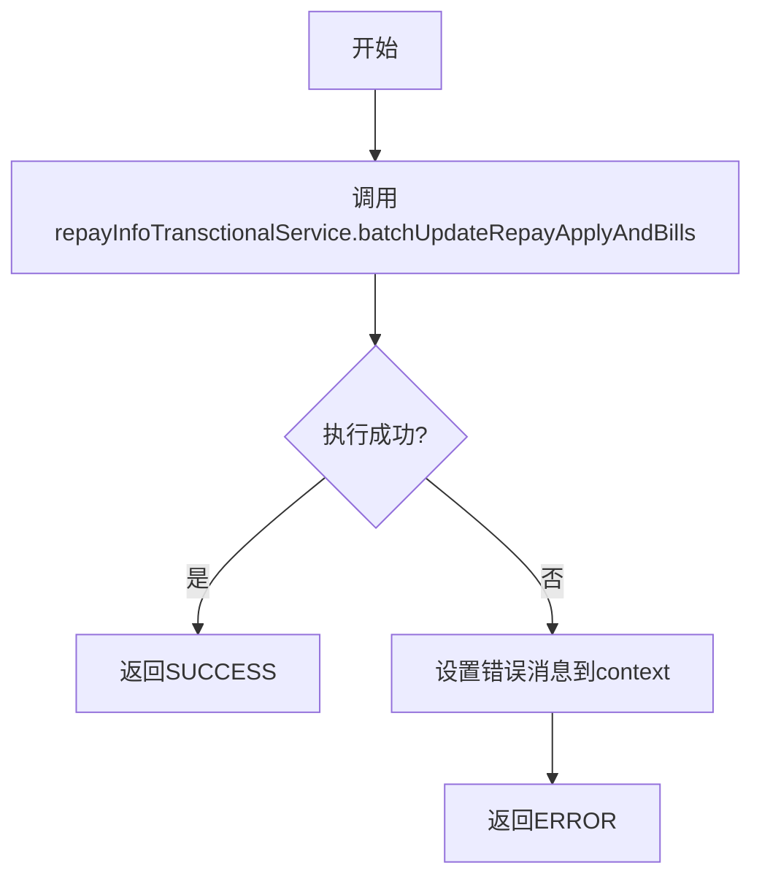

# PL040999 - 保存还款单与扣款单

## 节点信息

| 属性 | 值 |
|------|-----|
| **处理器代码** | PL040999 |
| **节点名称** | 保存还款单与扣款单 |
| **节点类型** | PROCESS |
| **所属流程** | [[轻资产还款受理流程同步主流程Vl3.1.0]] |
| **执行阶段** | 数据持久化阶段 |
| **实现类** | RepayApplyBizFlowPL040999ServiceImpl |
| **优先级** | P0（核心节点） |

## 功能说明

将还款单和扣款单数据事务性地持久化到数据库。通过独立的事务控制方法确保数据一致性。

### 核心职责
1. **事务持久化**: 在单个事务中批量保存还款单和扣款单
2. **数据一致性**: 确保还款单与扣款单同时写入或同时回滚

## 输入参数

| 参数名 | 参数代码 | 类型 | 来源/说明 |
|--------|----------|------|-----------|
| 还款上下文 | repayContext | RepayApplyContext | 包含还款单和扣款单数据 |

## 输出参数

| 参数名 | 参数代码 | 类型 | 说明 |
|--------|----------|------|------|
| 无 | - | - | 数据持久化到数据库 |

## 处理流程



## 核心业务逻辑

### 事务控制

```
repayInfoTransctionalService.batchUpdateRepayApplyAndBills(repayContext)
```

- 该方法通过 `@Transactional` 注解控制事务
- 批量保存还款单（t_repayment_bill）和扣款单（t_deduct_bill）
- 同时更新还款申请（t_repay_apply）的关联信息

## 异常处理

| 异常场景 | 错误类型 | 处理方式 | 影响 |
|----------|----------|----------|------|
| 数据库写入异常 | Exception | 事务回滚，返回ERROR | 设置context.message |

## 上游节点
- [[PL040050]] - 拆扣款单

## 下游节点
- [[PL060010]] - 轻资产锁定分期

## 实现位置

```
repayengine-service/src/main/java/cn/caijiajia/repayengine/service/
└── repay/process/impl/
    └── RepayApplyBizFlowPL040999ServiceImpl.java  (53行)
```

## 相关文档
- [[轻资产还款受理流程同步主流程Vl3.1.0]] - 所属业务流

## 标签
#节点 #轻资产 #数据持久化 #事务 #PL040999