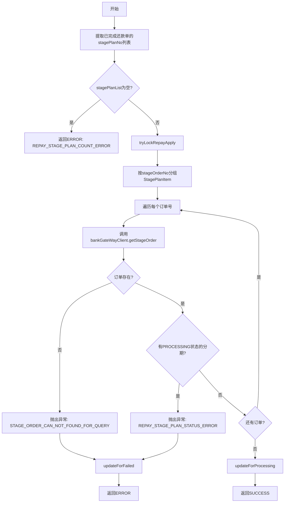
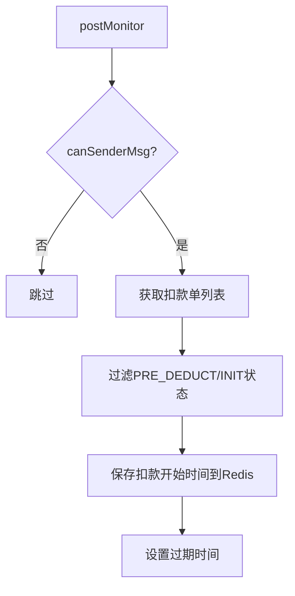

# PL060010 - 轻资产锁定分期

## 节点信息

| 属性 | 值 |
|------|-----|
| **处理器代码** | PL060010 |
| **节点名称** | 轻资产锁定分期 |
| **节点类型** | PROCESS |
| **所属流程** | [[轻资产还款受理流程同步主流程Vl3.1.0]] |
| **执行阶段** | 锁定与异步触发阶段 |
| **实现类** | RepayApplyBizFlowPL060010ServiceImpl |
| **优先级** | P0（核心节点） |

## 功能说明

调用银行网关锁定资方分期订单，确保分期计划不会被其他还款请求并发操作。锁定成功后更新还款申请状态为PROCESSING，并发送扣款监控消息。

### 核心职责
1. **分期计划校验**: 验证待锁定的分期计划不为空
2. **状态校验**: 检查分期订单是否已在PROCESSING状态
3. **锁定分期**: 调用银行网关获取并校验订单状态
4. **状态更新**: 更新还款申请为PROCESSING
5. **监控上报**: 保存扣款操作时间到Redis，发送监控消息

## 输入参数

| 参数名 | 参数代码 | 类型 | 来源/说明 |
|--------|----------|------|-----------|
| 还款单列表 | repaymentBillList | List\<BaseRepaymentBill\> | RepayApplyBo |
| 分期计划项列表 | stagePlanItemList | List\<StagePlanItem\> | RepayApplyBo |
| 用户ID | uid | String | RepayApplyContext |

## 处理流程



## 核心业务逻辑

### 1. 分期计划提取

从 `lightAssetFinishedflag=true` 的还款单中提取所有 `stagePlanNo`：

```
repaymentBillList.stream()
  .filter(BaseRepaymentBill::getLightAssetFinishedflag)
  .map(BaseRepaymentBill::getStagePlanItemList)
  .flatMap(Collection::stream)
  .map(RepaymentStagePlanItem::getStagePlanNo)
  .collect(Collectors.toList())
```

### 2. 锁定逻辑（tryLockRepayApply）

按 `stageOrderNo` 分组后逐订单校验：
1. 调用 `bankGateWayClient.getStageOrder()` 查询资方订单
2. 校验订单存在且有分期计划
3. 检查是否有分期处于 `PROCESSING` 状态（已有其他还款在处理）
4. 任一校验失败则抛出异常

### 3. 状态更新

- 锁定成功: `repayDataService.updateForProcessing(repayApplyNo)` → 状态变为PROCESSING
- 锁定失败: `repayDataService.updateForFailed(repayApplyNo, message)` → 状态变为FAILED

### 4. 监控上报（postMonitor）



- Redis Key: `REPAYENGNE_REPAY_DEDUCTBILL_START_TIME_{deductBillNo}`
- 过期时间: `configs.getDeductOperationSaveTime()`

## 外部服务

| 服务 | 方法 | 用途 |
|------|------|------|
| BankGateWayClient | getStageOrder | 查询资方订单状态 |
| RedisService | setDeductBillOperationTime | 缓存扣款操作时间 |
| RepayEngineProducer | canSenderMsg | 判断是否发送监控消息 |
| IRepayDataService | updateForProcessing/Failed | 更新还款申请状态 |
| IDeductBillService | getDeductBillList | 获取扣款单列表 |

## 异常处理

| 异常场景 | 错误类型 | 处理方式 | 影响 |
|----------|----------|----------|------|
| 分期计划为空 | - | 返回ERROR | REPAY_STAGE_PLAN_COUNT_ERROR |
| 订单未找到 | CjjServerException | 返回ERROR + updateForFailed | STAGE_ORDER_CAN_NOT_FOUND_FOR_QUERY |
| 订单已在处理中 | CjjServerException | 返回ERROR + updateForFailed | REPAY_STAGE_PLAN_STATUS_ERROR |
| HTTP调用异常 | HttpClientException | 返回ERROR + updateForFailed | 网络或服务异常 |
| 监控上报异常 | Exception | 记录warn日志 | 不影响主流程 |

## 上游节点
- [[PL040999]] - 保存还款单与扣款单

## 下游节点
- [[P000000]] - 预留空节点 → [[PL060999]] - 异步处理还款流程

## 实现位置

```
repayengine-service/src/main/java/cn/caijiajia/repayengine/service/
└── repay/process/impl/
    └── RepayApplyBizFlowPL060010ServiceImpl.java  (144行)
```

## 相关文档
- [[轻资产还款受理流程同步主流程Vl3.1.0]] - 所属业务流
- [[PL040999]] - 上游持久化
- [[PL060999]] - 下游异步触发

## 标签
#节点 #轻资产 #锁定分期 #银行网关 #PL060010