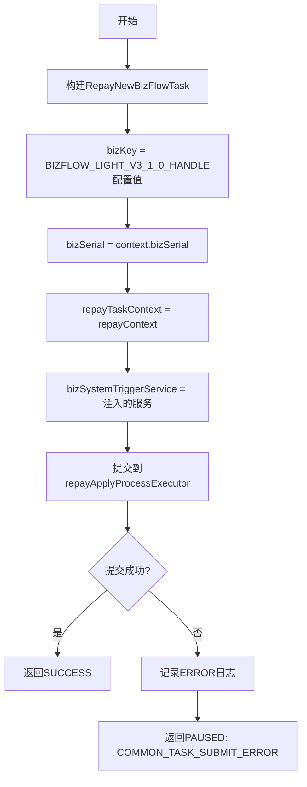

# PL060999 - 异步处理还款流程

## 节点信息

| 属性 | 值 |
|------|-----|
| **处理器代码** | PL060999 |
| **节点名称** | 异步处理还款流程 |
| **节点类型** | PROCESS |
| **所属流程** | [[轻资产还款受理流程同步主流程Vl3.1.0]] |
| **执行阶段** | 锁定与异步触发阶段 |
| **实现类** | RepayApplyBizFlowPL060999ServiceImpl |
| **优先级** | P0（核心节点） |

## 功能说明

创建异步任务并提交到线程池，触发轻资产异步扣款主流程（BIZFLOW_LIGHT_V3_1_0_HANDLE）。同步主流程在此节点后立即返回响应，后续扣款和入账由异步流程处理。

### 核心职责
1. **任务创建**: 构建RepayNewBizFlowTask
2. **异步提交**: 提交到repayApplyProcessExecutor线程池
3. **异常降级**: 提交失败时返回PAUSED

## 输入参数

| 参数名 | 参数代码 | 类型 | 来源/说明 |
|--------|----------|------|-----------|
| 还款上下文 | repayContext | RepayApplyContext | 完整的还款上下文 |
| 业务流水号 | bizSerial | String | RepayApplyContext |

## 输出参数

| 参数名 | 参数代码 | 类型 | 说明 |
|--------|----------|------|------|
| 无 | - | - | 异步任务启动，不等待返回 |

## 处理流程



## 核心业务逻辑

### 1. 任务创建

```
RepayNewBizFlowTask.builder()
  .bizKey(configFunctions.getBizFlowBizkey(BIZFLOW_LIGHT_V3_1_0_HANDLE))
  .bizSerial(repayContext.getBizSerial())
  .repayTaskContext(repayContext)
  .bizSystemTriggerService(bizSystemTriggerService)
  .build()
```

**bizKey**: 通过 `configFunctions` 读取配置的异步流程Key，对应轻资产还款异步主流程。

### 2. 异步提交

- **线程池**: `repayApplyProcessExecutor`
- **提交方式**: `execute()` 非阻塞提交
- **执行内容**: RepayNewBizFlowTask.run() → 调用 bizSystemTriggerService 触发BizFlow异步流程

### 3. 同步与异步边界

此节点是同步主流程和异步处理流程的分界点：
- **同步流程**（到此结束）: 参数校验 → 保存申请 → 拆单 → 试算 → 锁定 → **异步提交**
- **异步流程**（由此启动）: 扣款执行 → 入账 → 资方通知 → 后置处理

## 异常处理

| 异常场景 | 错误类型 | 处理方式 | 影响 |
|----------|----------|----------|------|
| 线程池拒绝/满 | CjjServerException | 返回PAUSED | 流程暂停重试 |
| 任务提交成功 | - | 返回SUCCESS | 继续到P026000 |

## 线程池配置

### Bean名称
`repayApplyProcessExecutor`

### 作用
还款申请异步处理专用线程池

## 上游节点
- [[P000000]] - 预留空节点（实际数据来自[[PL060010]]）

## 下游节点
- [[P026000]] - 组织返回报文

## 实现位置

```
repayengine-service/src/main/java/cn/caijiajia/repayengine/service/
└── repay/process/impl/
    └── RepayApplyBizFlowPL060999ServiceImpl.java  (72行)
```

## 设计考虑

### 为什么在此节点启动异步流程而不是直接执行？
- 同步请求需要快速返回，避免用户长时间等待
- 扣款和入账涉及外部服务调用，耗时不确定
- 异步处理支持重试和补偿机制

## 相关文档
- [[轻资产还款受理流程同步主流程Vl3.1.0]] - 所属业务流
- [[轻资产还款异步主流程Vl3.1.0]] - 被触��的异步流程
- [[PL060010]] - 上游锁定节点
- [[P026000]] - 下游响应节点

## 标签
#节点 #轻资产 #异步触发 #任务提交 #PL060999