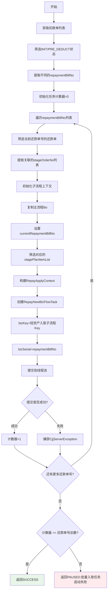

# PL070001 - 发起异步流程并发扣款

## 节点信息

| 属性 | 值 |
|------|-----|
| **处理器代码** | PL070001 |
| **节点名称** | 发起异步流程并发扣款 |
| **节点类型** | PROCESS |
| **所属流程** | [[轻资产还款异步主流程Vl3.1.0]] |
| **执行阶段** | 主流程分发阶段 |
| **实现类** | RepayApplyBizFlowPL070001ServiceImpl |
| **优先级** | P0（核心节点） |

## 功能说明

按还款单号(repaymentBillNo)分组，为每个分组异步启动独立的入账子流程，实现并行扣款和入账处理。

### 核心职责
1. **获取扣款单**: 查询还款申请关联的扣款单（INIT/PRE_DEDUCT状态）
2. **还款单分组**: 按repaymentBillNo提取不同的还款单号
3. **子流程上下文初始化**: 为每个还款单号构建独立的RepayApplyContext
4. **异步任务创建**: 构建RepayNewBizFlowTask对象
5. **任务提交**: 提交到线程池异步执行
6. **结果校验**: 验证所有分组是否都成功启动子流程

## 输入参数

| 参数名 | 参数代码 | 类型 | 来源 | 说明 |
|--------|----------|------|------|------|
| 还款申请号 | repayApplyNo | String | RepayApplyBo | 还款申请唯一标识 |
| 还款单列表 | repaymentBillList | List | RepayApplyBo | 所有还款单（含阶段计划） |
| 阶段计划列表 | stagePlanItemList | List | RepayApplyBo | 所有阶段计划项 |

## 输出参数

| 参数名 | 类型 | 说明 |
|--------|------|------|
| ProcessResult | SUCCESS/PAUSED | 成功=所有任务提交成功；暂停=部分提交失败 |

## 处理流程



## 核心业务逻辑

### 1. 扣款单筛选

**数据来源**: `deductBillService.getDeductBillList(repayApplyNo, null)`

**筛选条件**: 扣款单状态为 `INIT` 或 `PRE_DEDUCT`

**提取逻辑**: 从筛选后的扣款单中提取不同的 `repaymentBillNo`（去重）

### 2. 子流程上下文初始化

**方法**: `initSubRepayApplyContext()`

**构建步骤**:
- 通过 `BeanUtils.copyProperties()` 复制主流程Bo
- 设置 `currentRepaymentBillNo`: 当前处理的还款单号
- 设置 `subBizSerial`: 等于repaymentBillNo（用于追踪）
- 筛选 `stagePlanItemList`: 仅保留当前还款单关联的阶段计划项
- 保留原有的扣款单列表、支付工具列表、试算响应等

### 3. 异步任务提交

**任务类**: `RepayNewBizFlowTask`

**构建参数**:
- `bizKey`: 通过 `configFunctions.getBizFlowBizkey(BIZFLOW_LIGHT_V3_1_0_INCOME)` 动态获取
- `bizSerial`: `repaymentBillNo`（子流程业务流水号）
- `repayTaskContext`: 子流程上下文对象
- `bizSystemTriggerService`: 业务流触发服务

**线程池**: `repayBatchIncomeProcessExecutor`

**提交方式**: 异步非阻塞，主流程不等待子流程执行

### 4. 结果校验

```
IF 还款单号列表不为空 AND 计数器 != 还款单号数量 THEN
    返回 PAUSED: "批量入账任务启动失败"
ELSE
    返回 SUCCESS
END IF
```

## 服务依赖

| 依赖 | 类型 | 用途 |
|------|------|------|
| IDeductBillService | Service | 查询扣款单列表 |
| repayBatchIncomeProcessExecutor | ThreadPoolTaskExecutor | 异步执行入账子流程 |
| BizSystemTriggerService | Service | 触发业务流执行 |
| ConfigFunctions | Configuration | 动态获取子流程bizKey |
| BizFlowClient | Client | 业务流编排客户端 |

## 异常处理

| 异常场景 | 错���类型 | 处理方式 | 影响 |
|----------|----------|----------|------|
| 线程池队列已满 | CjjServerException | 记录错误，继续提交 | 计数器不增加 |
| 上下文初始化失败 | RuntimeException | 异常上抛 | 触发节点重试 |
| 部分任务提交失败 | - | 返回PAUSED | 触发节点重试(最多10次,间隔120s) |

## 与重资产PH170005V1的对比

| 维度 | PL070001(轻资产) | PH170005V1(重资产) |
|------|-----------------|-------------------|
| 分组依据 | repaymentBillNo（扣款单关联） | repaymentBillBaseNo（还款单基础号） |
| 数据筛选 | 先查扣款单再关联还款单 | 直接按还款单分组 |
| 子流程Key | 动态配置获取 | 硬编码常量 |
| 上下文传递 | 筛选stagePlanItemList | 传递全量repaymentBillList |
| 线程池 | repayBatchIncomeProcessExecutor（共用） | repayBatchIncomeProcessExecutor（共用） |

## 上游节点
- 系统触发 (TRIGGER_METHOD)

## 下游节点
- [[PL070029]] - 等待扣款结果

## 实现位置

```bash
repayengine-service/src/main/java/cn/caijiajia/repayengine/service/
└── repay/process/impl/
    └── RepayApplyBizFlowPL070001ServiceImpl.java
```

## 标签
#节点 #异步子流程 #并行处理 #任务分发 #PL070001 #轻资产