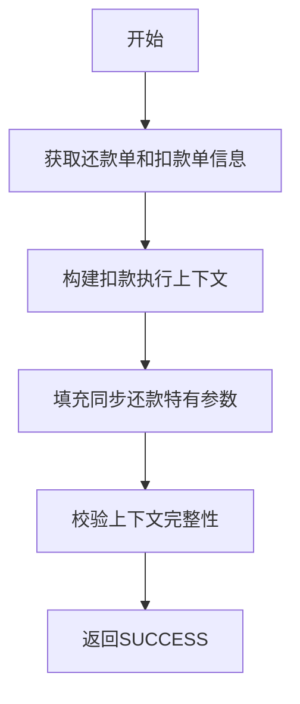

# PL070001_SYNC - 轻资产同步还款上下文填充

## 节点信息

| 属性 | 值 |
|------|-----|
| **处理器代码** | PL070001_SYNC |
| **节点名称** | 轻资产同步还款上下文填充 |
| **节点类型** | PROCESS |
| **所属流程** | [[轻资产同步还款提交流程]] |
| **执行阶段** | 同步扣款执行阶段 |

## 功能说明

为轻资产同步还款场景填充扣款执行所需的上下文信息。该节点是同步还款流程特有的上下文初始化节点（区别于异步流程的 [[PL070001]]），负责在扣款执行前将必要的业务数据注入到流程上下文中，确保后续扣款节点（PL070012、PL070021）能够正确获取所需参数。

### 核心职责
1. **上下文填充**: 将还款单、扣款单等业务数据填充到扣款执行上下文
2. **同步场景适配**: 针对同步还款场景做特殊的上下文处理，区别于异步批量场景
3. **数据校验**: 确保扣款前的上下文数据完整性

## 处理流程

## 核心业务逻辑

### 1. 上下文数据填充
- 从流程变量中获取已生成的还款单列表和扣款单列表
- 构建扣款执行所需的上下文对象
- 注入同步还款场景标识，区别于异步批量处理

### 2. 同步场景适配
- 同步还款场景下，扣款为即时发起，不走异步任务队列
- 填充同步扣款特有的参数（如即时回调标识等）

## 异常处理

| 异常场景 | 处理方式 |
|----------|----------|
| 上下文数据缺失 | 抛出异常，终止流程 |
| 数据校验失败 | 抛出异常，终止流程 |

## 相关文档
- [[轻资产同步还款提交流程]] - 所属业务流
- [[PL060010]] - 上游节点（轻资产锁定分期）
- [[PL070012]] - 下游节点（扣款前置事件）
- [[PL070001]] - 异步还款场景的上下文填充节点（对照参考）

## 标签
#节点 #上下文填充 #同步还款 #PL070001_SYNC
