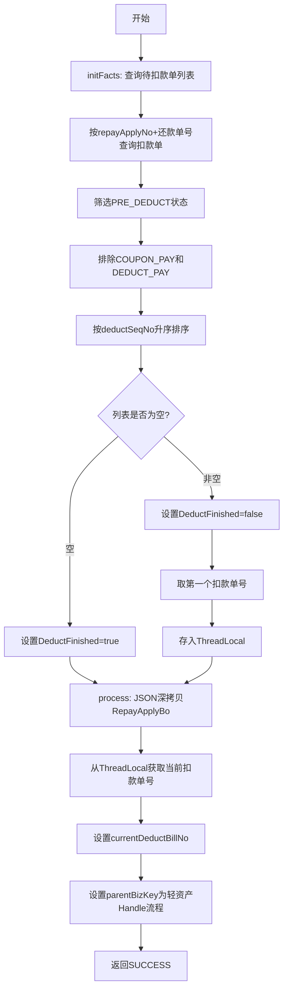

# PL070012 - 轻资产扣款前置事件

## 节点信息

| 属性 | 值 |
|------|-----|
| **处理器代码** | PL070012 |
| **节点名称** | 轻资产扣款前置事件 |
| **节点类型** | PROCESS |
| **所属流程** | [[轻资产还款批量入账流程Vl3.1.0]] |
| **执行阶段** | 扣款前置阶段 |
| **实现类** | RepayApplyBizFlowPL070012ServiceImpl |
| **优先级** | P0（核心节点，循环入口） |

## 功能说明

作为轻资产批量入账流程的**循环入口节点**，每次执行时从扣款单列表中筛选一个待扣款单，设置到上下文中供后续节点使用。通过 `DeductFinished` 流程变量控制循环终止。

### 核心职责
1. **扣款单筛选**: 查询 `PRE_DEDUCT` 状态的扣款单
2. **过滤非实扣类型**: 排除优惠券(COUPON_PAY)和折扣(DEDUCT_PAY)类型
3. **排序取首**: 按扣款顺序号排序，取第一个待扣款单
4. **设置循环控制变量**: 无待扣款单时设置 `DeductFinished=true` 终止循环
5. **上下文初始化**: 通过JSON深拷贝RepayApplyBo避免线程共享变量问题

## 处理流程



## 核心业务逻辑

### 1. initFacts - 初始化流程控制参数

**触发时机**: 在process方法前由bizflow框架调用

**核心逻辑**:
- 通过 `deductBillService.getDeductBillList(repayApplyNo, repaymentBillNo)` 查询扣款单
- 筛选条件：`DeductStatus.PRE_DEDUCT` 且非 `COUPON_PAY`/`DEDUCT_PAY`
- 按 `deductSeqNo` 升序排序
- 结果写入流程Facts：`DeductFinished = unDeductBillList.isEmpty()`
- 将当前扣款单号写入ThreadLocal供process使用

**风险提示**: 注释中明确指出——如果后续流程处理不当导致扣款单状态没有变成非PRE_DEDUCT状态，将造成子流程无限循环死锁，最终打爆数据库。

### 2. process - 主处理逻辑

**核心逻辑**:
- 通过JSON序列化/反序列化深拷贝 `RepayApplyBo`，避免子线程变量共享问题
- 从ThreadLocal获取当前待处理的扣款单号，设置到Bo对象
- 设置 `parentBizKey` 为 `BIZFLOW_LIGHT_V3_1_0_HANDLE`（轻资产Handle主流程的bizKey）
- 返回SUCCESS

## 输入参数

| 参数名 | 参数代码 | 类型 | 来源 | 说明 |
|--------|----------|------|------|------|
| 还款申请号 | repayApplyNo | String | RepayApplyBo | 还款申请单号 |
| 还款单号 | subBizSerial | String | RepayContext | 当前处理的还款单号 |

## 输出参数

| 参数名 | 参数代码 | 类型 | 说明 |
|--------|----------|------|------|
| 扣款完成标志 | DeductFinished | Boolean | Facts变量，控制循环终止 |
| 当前扣款单号 | currentDeductBillNo | String | 写入RepayApplyBo |
| 父流程bizKey | parentBizKey | String | 轻资产Handle主流程Key |

## 上游节点

- 系统触发 (TRIGGER_METHOD)
- 条件判断（失败话术） - 循环回来时的入口

## 下游节点

- 条件判断（排他网关）- 根据DeductFinished决定走扣款流程还是入账流程

## 异常处理

| 异常场景 | 处理方式 | 影响 |
|----------|----------|------|
| 查询扣款单异常 | 全局重试策略（5次/60秒） | 流程暂停 |
| JSON深拷贝异常 | 抛出异常，全局重试 | 流程暂停 |
| ThreadLocal为空 | 正常场景不会出现 | - |

## 实现位置

```bash
repayengine-service/src/main/java/cn/caijiajia/repayengine/service/
└── repay/process/impl/
    └── RepayApplyBizFlowPL070012ServiceImpl.java  # 106行
```

## 设计考虑

### 为什么使用JSON深拷贝而不是BeanUtils.copyProperties?
- 子线程场景下需要完全隔离对象引用，避免并发修改
- JSON深拷贝能处理嵌套对象的深拷贝
- 使用 `DisableCircularReferenceDetect` 避免循环引用问题

### 为什么使用ThreadLocal传递扣款单号?
- initFacts和process是两个不同的回调方法
- ThreadLocal保证同一线程内数据隔离
- 避免通过Facts传递复杂对象

## 相关文档

- [[轻资产还款批量入账流程Vl3.1.0]] - 所属业务流
- [[PL070021]] - 下游扣款执行节点
- [[P070030]] - 下游扣款结果确认节点

## 标签

#节点 #轻资产 #扣款前置 #循环入口 #PL070012