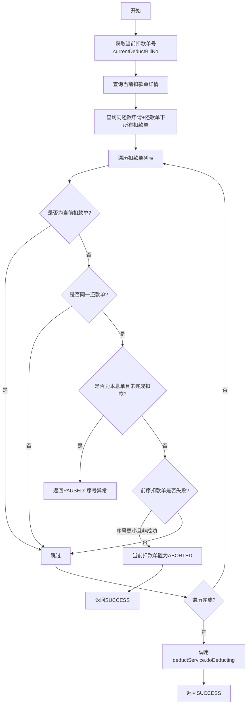

# PL070021 - 轻资产发起扣款事件

## 节点信息

| 属性 | 值 |
|------|-----|
| **处理器代码** | PL070021 |
| **节点名称** | 轻资产发起扣款事件 |
| **节点类型** | PROCESS |
| **所属流程** | [[轻资产还款批量入账流程Vl3.1.0]] |
| **执行阶段** | 扣款执行阶段 |
| **实现类** | RepayApplyBizFlowPL070021ServiceImpl |
| **优先级** | P0（核心扣款节点） |

## 功能说明

执行当前扣款单的扣款操作。在扣款前会校验同一还款单维度下的扣款顺序约束，确保前序扣款单已完成后才能执行当前扣款。

### 核心职责
1. **扣款顺序校验**: 检查同还款单下前序扣款单是否已完成
2. **本息单检查**: 确保本息扣款单已完成才能执行后续扣款
3. **级联废弃**: 前序扣款失败时将当前扣款单置为ABORTED
4. **执行扣款**: 调用DeductService.doDeducting执行实际扣款

## 处理流程



## 核心业务逻辑

### 1. 扣款顺序校验

遍历同还款申请+同还款单下的所有扣款单，执行以下校验：
- **本息单优先**: 如果存在 `PRINCIPAL_INTEREST` 类型的扣款单尚未完成扣款（`!isDeductFinished()`），返回PAUSED等待
- **序号约束**: 如果同还款单下存在序号更小（`deductSeqNo < currentDeductBill.deductSeqNo`）且扣款状态非成功的扣款单，将当前扣款单标记为 `ABORTED`

### 2. 级联废弃机制

当前序扣款单失败时：
- 调用 `deductBillService.updateFailureAmountAndStatusAndExtInfo` 将当前扣款单状态更新为 `ABORTED`
- 返回SUCCESS（不是PAUSED），流程继续执行后续节点
- 这是一种"快速失败"策略，不重试也不阻塞

### 3. 执行扣款

校验通过后调用 `deductService.doDeducting(currentDeductBill)` 发起扣款请求。

## 输入参数

| 参数名 | 参数代码 | 类型 | 来源 | 说明 |
|--------|----------|------|------|------|
| 当前扣款单号 | currentDeductBillNo | String | RepayApplyBo | 由PL070012设置 |
| 还款申请号 | repayApplyNo | String | RepayApplyBo | 还款申请单号 |
| 还款单号 | subBizSerial | String | RepayContext | 当前还款单号 |

## 输出参数

| 参数名 | 参数代码 | 类型 | 说明 |
|--------|----------|------|------|
| 无 | - | - | 扣款为异步操作，结果由P070030确认 |

## 上游节点

- 条件判断（排他网关）- DeductFinished == false 分支

## 下游节点

- [[P070030]] - 扣款结果确认事件

## 异常处理

| 异常场景 | 处理方式 | 影响 |
|----------|----------|------|
| 前序本息单未完成 | 返回PAUSED | 流程暂停重试 |
| 前序扣款单失败 | 当前单置为ABORTED，返回SUCCESS | 流程继续 |
| deductService调用异常 | 全局重试策略（5次/60秒） | 流程暂停 |

## 实现位置

```bash
repayengine-service/src/main/java/cn/caijiajia/repayengine/service/
└── repay/process/impl/
    └── RepayApplyBizFlowPL070021ServiceImpl.java  # 88行
```

## 相关文档

- [[轻资产还款批量入账流程Vl3.1.0]] - 所属业务流
- [[PL070012]] - 上游扣款前置节点
- [[P070030]] - 下游扣款结果确认节点

## 标签

#节点 #轻资产 #扣款执行 #顺序校验 #PL070021