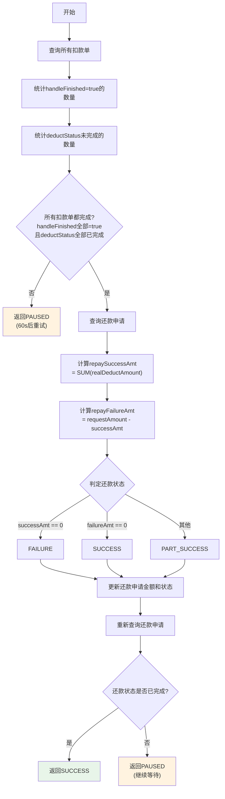

# PL070029 - 等待扣款结果

## 节点信息

| 属性 | 值 |
|------|-----|
| **处理器代码** | PL070029 |
| **节点名称** | 等待扣款结果 |
| **节点类型** | PROCESS |
| **所属流程** | [[轻资产还款异步主流程Vl3.1.0]] |
| **执行阶段** | 主流程等待阶段 |
| **实现类** | RepayApplyBizFlowPL070029ServiceImpl |
| **优先级** | P0（核心节点） |

## 功能说明

轮询等待所有入账子流程的扣款单处理完成，汇总计算还款成功/失败金额，并更新还款申请的最终状态。

### 核心职责
1. **扣款完成检查**: 查询所有扣款单的handleFinished和deductStatus
2. **未完成则暂停**: 返回PAUSED，由业务流框架触发重试（间隔60s）
3. **金额汇总**: 计算还款成功金额和失败金额
4. **状态判定**: 根据金额判定SUCCESS/PART_SUCCESS/FAILURE
5. **更新还款申请**: 写入最终金额和状态

## 输入参数

| 参数名 | 参数代码 | 类型 | 来源 | 说明 |
|--------|----------|------|------|------|
| 还款申请号 | repayApplyNo | String | RepayApplyBo | 还款申请唯一标识 |
| 还款金额 | repayAmount | Integer | Request | 原始请求的还款金额 |

## 输出参数

| 参数名 | 类型 | 说明 |
|--------|------|------|
| ProcessResult | SUCCESS/PAUSED | 成功=所有扣款完成并更新状态；暂停=仍有未完成扣款单 |

## 处理流程



## 核心业务逻辑

### 1. 扣款完成性检查

**查询**: `deductBillService.getByRepayApplyNo(repayApplyNo)`

**完成判定条件**（两个条件都必须满足）:
- `handleFinished == true`: 扣款操作已结束（来自扣款单扩展信息）
- `deductStatus.isRepayFinished() == true`: 扣款状态已到达终态

**未完成处理**: 返回 `PAUSED`，错误码 `UNFINISHED_REPAY_OR_DEDUCT_STATUS`

### 2. 金额汇总计算

```
repaySuccessAmt = deductBillList.stream()
    .map(DeductBill::getRealDeductAmount)
    .reduce(0, IntegerUtil::add)

repayFailureAmt = requestRepayAmount - repaySuccessAmt
```

使用 `IntegerUtil.add()` 进行安全的整数加法运算。

### 3. 还款状态判定

| 条件 | 状态 | 说明 |
|------|------|------|
| repaySuccessAmt == 0 | FAILURE | 全部失败 |
| repayFailureAmt == 0 | SUCCESS | 全部成功 |
| 其他 | PART_SUCCESS | 部分成功 |

### 4. 更新还款申请

**调用**: `repayApplyService.updateRepayApplyAmountAndStatus()`

**更新字段**:
- repayAmount: 原始还款金额
- repaySuccessAmount: 实际扣款成功金额
- repayStatus: 最终还款状态

### 5. 二次校验

更新后重新查询还款申请，确认状态已变更为终态。若未到终态则继续PAUSED等待。

## 服务依赖

| 依赖 | 类型 | 用途 |
|------|------|------|
| IDeductBillService | Service | 查询扣款单列表及状态 |
| IRepayApplyService | Service | 查询/更新还款申请 |

## 轮询机制说明

本节点是一个**轮询等待节点**，利用业务流框架的重试机制实现：

```
重试次数: 999次
重试间隔: 60秒
最大等待时间: 999 * 60s ≈ 16.5小时
```

**工作原理**: 每次执行检查扣款单状态，未完成则返回PAUSED触发重试，已完成则汇总结果返回SUCCESS。

## 异常处理

| 异常场景 | 处理方式 | 影响 |
|----------|----------|------|
| 扣款单未全部完成 | 返回PAUSED | 60s后重试 |
| 金额更新失败 | 异常上抛 | 触发节点重试 |
| 二次校验状态未变更 | 返回PAUSED | 继续等待 |

## 上游节点
- [[PL070001]] - 发起异步流程并发扣款

## 下游节点
- [[PL070070]] - 还款交易解锁

## 实现位置

```bash
repayengine-service/src/main/java/cn/caijiajia/repayengine/service/
└── repay/process/impl/
    └── RepayApplyBizFlowPL070029ServiceImpl.java
```

## 标签
#节点 #等待扣款 #轮询 #状态汇总 #PL070029 #轻资产