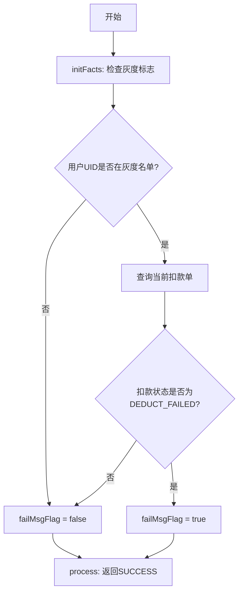

# PL070032 - 扣款后处理

## 节点信息

| 属性 | 值 |
|------|-----|
| **处理器代码** | PL070032 |
| **节点名称** | 扣款后处理 |
| **节点类型** | PROCESS |
| **所属流程** | [[轻资产还款批量入账流程Vl3.1.0]] |
| **执行阶段** | 扣款后处理阶段 |
| **实现类** | RepayApplyBizFlowPL070032ServiceImpl |
| **注册方式** | @Process注解 |
| **异常策略** | IGNORE (忽略错误) |

## 功能说明

扣款完成后的处理节点，主要职责是检查当前用户是否在扣款失败话术策略的灰度范围内，并设置 `failMsgFlag` 流程变量控制是否进入话术策略子流程。

### 核心职责
1. **灰度检查**: 检查当前用户UID是否在话术策略灰度名单中
2. **扣款状态检查**: 只有扣款失败场景才需要话术策略
3. **设置流程变量**: 将 `failMsgFlag` 写入流程Facts

## 处理流程



## 核心业务逻辑

### initFacts - 灰度检查与标志设置

通过 `RepayDeductFailMsgService.checkGrayHengine()` 实现：

1. **灰度名单检查**: 调用 `configFunctions.checkDeductFailMsgGrayUid(uid)` 检查用户是否在灰度范围
2. **扣款失败检查**: 如果在灰度范围内，查询当前扣款单状态
3. **设置标志**:
   - 灰度内 + 扣款失败 → `failMsgFlag = true`
   - 其他情况 → `failMsgFlag = false`

### process - 主处理逻辑

- 无实际业务逻辑，直接返回SUCCESS
- 核心逻辑在initFacts中完成

## 输入参数

| 参数名 | 参数代码 | 类型 | 来源 | 说明 |
|--------|----------|------|------|------|
| 用户ID | uid | String | RepayApplyContext | 用于灰度名单检查 |
| 当前扣款单号 | currentDeductBillNo | String | RepayApplyBo | 用于查询扣款状态 |

## 输出参数

| 参数名 | 参数代码 | 类型 | 说明 |
|--------|----------|------|------|
| 失败话术标志 | failMsgFlag | Boolean | Facts变量，控制是否进入话术子流程 |

## 上游节点

- [[P070030]] - 扣款结果确认事件

## 下游节点

- 条件判断（排他网关）- 根据failMsgFlag决定走话术子流程还是回到PL070012

## 实现位置

```bash
repayengine-service/src/main/java/cn/caijiajia/repayengine/service/
└── repay/process/impl/
    └── RepayApplyBizFlowPL070032ServiceImpl.java  # 65行
```

## 相关文档

- [[轻资产还款批量入账流程Vl3.1.0]] - 所属业务流
- [[P070030]] - 上游扣款结果确认节点
- [[扣款失败话术策略子流程]] - 话术策略处理

## 标签

#节点 #扣款后处理 #灰度控制 #话术策略 #PL070032