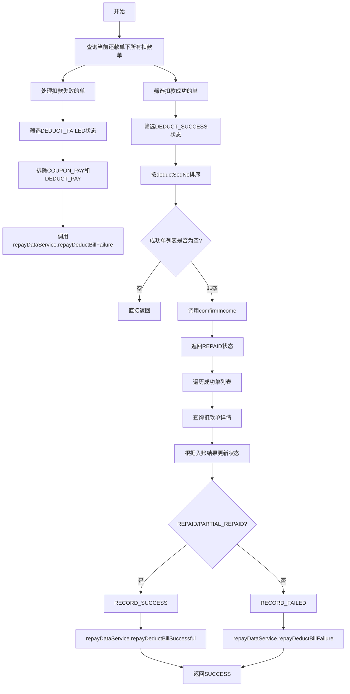

# PL070038 - 轻资产还款入账事件

## 节点信息

| 属性 | 值 |
|------|-----|
| **处理器代码** | PL070038 |
| **节点名称** | 轻资产还款入账事件 |
| **节点类型** | PROCESS |
| **所属流程** | [[轻资产还款批量入账流程Vl3.1.0]] |
| **执行阶段** | 入账阶段 |
| **实现类** | RepayApplyBizFlowPL070038ServiceImpl |
| **优先级** | P0（核心入账节点） |
| **异常策略** | 重试999次，间隔60秒 |

## 功能说明

处理轻资产还款的入账逻辑。将扣款成功的扣款单进行入账确认，扣款失败的标记为入账失败。

### 核心职责
1. **失败单处理**: 将扣款失败的非优惠券类扣款单标记为入账失败
2. **成功单筛选**: 筛选扣款成功的扣款单
3. **入账确认**: 调用confirmIncome确认入账（轻资产直接返回REPAID）
4. **结果更新**: 根据入账结果更新扣款单状态为RECORD_SUCCESS或RECORD_FAILED

## 处理流程



## 核心业务逻辑

### 1. 失败扣款单处理

```
deductBillList
  .filter(DEDUCT_FAILED)
  .filter(!COUPON_PAY)
  .filter(!DEDUCT_PAY)
  .forEach(repayDataService.repayDeductBillFailure)
```

- 只处理非优惠券/折扣券类型的失败扣款单
- 优惠券/折扣券失败不需要特殊处理

### 2. 入账确认

**轻资产特性**: `comfirmIncome()` 方法直接返回 `RepayIncomeResp(repayStatus=REPAID)`，因为轻资产的入账由资方自行处理，还款引擎只需标记状态。

### 3. 入账结果更新

根据入账状态分类处理：
- **REPAID / PARTIAL_REPAID / PARTIAL_REPAYING**: 设置为 `RECORD_SUCCESS`，调用 `repayDataService.repayDeductBillSuccessful`
- **其他状态**: 设置为 `RECORD_FAILED`，调用 `repayDataService.repayDeductBillFailure`

## 输入参数

| 参数名 | 参数代码 | 类型 | 来源 | 说明 |
|--------|----------|------|------|------|
| 还款申请号 | repayApplyNo | String | RepayApplyBo | 还款申请单号 |
| 还款单号 | subBizSerial | String | RepayContext | 当前还款单号 |

## 输出参数

| 参数名 | 参数代码 | 类型 | 说明 |
|--------|----------|------|------|
| 无 | - | - | 通过更新扣款单状态影响后续节点 |

## 上游节点

- [[P000000]] - 预留空节点

## 下游节点

- [[PL070085]] - 轻资产额度同步

## 异常处理

| 异常场景 | 处理方式 | 影响 |
|----------|----------|------|
| CjjServerException | 返回PAUSED | 流程暂停重试（999次） |
| CjjClientException | 返回PAUSED | 流程暂停重试（999次） |
| repayDataService调用异常 | 向上抛出 | 由全局策略处理 |

## 实现位置

```bash
repayengine-service/src/main/java/cn/caijiajia/repayengine/service/
└── repay/process/impl/
    └── RepayApplyBizFlowPL070038ServiceImpl.java  # 166行
```

## 设计考虑

### 为什么轻资产的comfirmIncome直接返回REPAID?
轻资产场景下，入账由资方侧完成，还款引擎不需要主动调用入账接口。扣款成功即等同于入账成功，这与重资产需要客账入账、资方入账等多步骤不同。

### 为什么重试999次?
入账是关键操作，不能轻易放弃。999次重试（间隔60秒）约等于16.6小时的重试窗口，通常足够等待下游服务恢复。

## 相关文档

- [[轻资产还款批量入账流程Vl3.1.0]] - 所属业务流
- [[PL070085]] - 下游额度同步节点
- [[P070999]] - 入账后置事件

## 标签

#节点 #轻资产 #还款入账 #核心节点 #PL070038