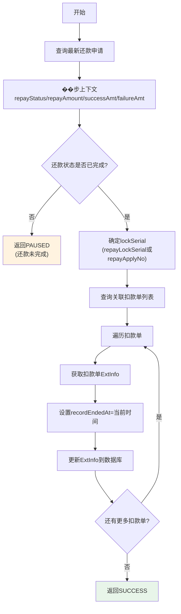

# PL070070 - 还款交易解锁

## 节点信息

| 属性 | 值 |
|------|-----|
| **处理器代码** | PL070070 |
| **节点名称** | 还款交易解锁 |
| **节点类型** | PROCESS |
| **所属流程** | [[轻资产还款异步主流程Vl3.1.0]] |
| **执行阶段** | 主流程后置阶段 |
| **实现类** | RepayApplyBizFlowPL070070ServiceImpl |
| **优先级** | P1 |

## 功能说明

还款完成后，更新所有关联扣款单的结束时间（recordEndedAt），标记扣款记录已完结。

### 核心职责
1. **同步还款状态**: 从数据库获取最新的还款申请状态和金额
2. **完成性校验**: 校验还款是否已到终态
3. **更新结束时间**: 为每个扣款单设置recordEndedAt

## 输入参数

| 参数名 | 参数代码 | 类型 | 来源 | 说明 |
|--------|----------|------|------|------|
| 还款申请号 | repayApplyNo | String | RepayApplyBo | 还款申请唯一标识 |
| 锁定流水号 | repayLockSerial | String | RepayApplyBo | 可选，用于查询扣款单 |

## 输出参数

| 参数名 | 类型 | 说明 |
|--------|------|------|
| ProcessResult | SUCCESS/PAUSED | 成功=所有扣款单已更新；暂停=还款未到终态 |

## 处理流程



## 核心业务逻辑

### 1. 状态同步

从数据库获取最新的还款申请信息，更新到上下文中：
- `repayStatus`: 还款状态
- `repayAmount`: 还款金额
- `repaySuccessAmount`: 成功金额
- `repayFailureAmount`: 失败金额

### 2. 完成性校验

**校验**: `repayStatus.isFinished()`

若还款未完成，返回PAUSED等待。正常情况下不会出现（上游PL070029已确认完成），作为防御性检查。

### 3. 扣款单结束标记

**锁定流水号确定**:
```
lockSerial = repayLockSerial != null ? repayLockSerial : repayApplyNo
```

**查询**: `deductBillService.getByRepayApplyNo(lockSerial)`

**更新操作**（对每个扣款单）:
```
extInfo = deductBillService.getExtInfo(deductBill)
extInfo.setRecordEndedAt(LocalDateTime.now())
deductBillService.updateExtInfo(deductBill, extInfo, REPAY_ENGINE)
```

**recordEndedAt含义**: 标记扣款记录在系统中的结算完成时间。

## 服务依赖

| 依赖 | 类型 | 用途 |
|------|------|------|
| IRepayApplyService | Service | 查询还款申请最新状态 |
| IDeductBillService | Service | 查询扣款单、更新ExtInfo |
| RedisService | Service | Redis缓存操作 |
| IRepaymentBillService | Service | 还款单服务 |

## 异常处理

| 异常场景 | 处理方式 | 影响 |
|----------|----------|------|
| 还款未完成 | 返回PAUSED | 等待重试 |
| ExtInfo更新失败 | 异常上抛 | 触发节点重试(最多60次,间隔60s) |
| 最终失败 | IGNORE | 解锁失败不阻塞流程 |

**注意**: 该节点异常最终状态为IGNORE，即使60次重试后仍失败也不会阻塞流程继续。

## 上游节点
- [[PL070029]] - 等待扣款结果

## 下游节点
- [[PL070080]] - 发送结果消息

## 实现位置

```bash
repayengine-service/src/main/java/cn/caijiajia/repayengine/service/
└── repay/process/impl/
    └── RepayApplyBizFlowPL070070ServiceImpl.java
```

## 标签
#节点 #交易解锁 #后置处理 #PL070070 #轻资产