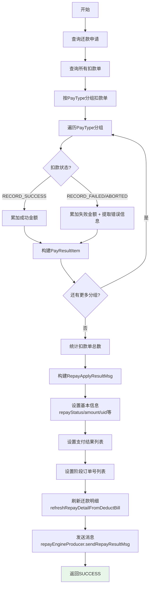

# PL070080 - 发送结果消息

## 节点信息

| 属性        | 值                                    |
| --------- | ------------------------------------ |
| **处理器代码** | PL070080                             |
| **节点名称**  | 发送结果消息                               |
| **节点类型**  | PROCESS                              |
| **所属流程**  | [[轻资产还款异步主流程Vl3.1.0]]                |
| **执行阶段**  | 主流程通知阶段                              |
| **实现类**   | RepayApplyBizFlowPL070080ServiceImpl |
| **优先级**   | P0（核心节点）                             |

## 功能说明

汇总还款结果，按支付方式(PayType)分组统计成功/失败金额，构建还款结果消息并发送到下游系统。

### 核心职责
1. **扣款结果聚合**: 按PayType分组统计扣款成功/失败金额
2. **消息构建**: 组装RepayApplyResultMsg完整消息体
3. **明细刷新**: 从扣款单反推还款明细
4. **消息发送**: 通过Producer发送还款结果消息

## 输入参数

| 参数名 | 参数代码 | 类型 | 来源 | 说明 |
|--------|----------|------|------|------|
| 还款申请号 | repayApplyNo | String | RepayApplyBo | 还款申请唯一标识 |
| 还款单列表 | repaymentBillList | List | RepayApplyBo | 包含阶段计划信息 |

## 输出参数

| 参数名 | 类型 | 说明 |
|--------|------|------|
| ProcessResult | SUCCESS | 消息发送成功 |

## 处理流程



## 核心业务逻辑

### 1. 扣款结果按PayType聚合

**分组**: `deductBillList.stream().collect(groupingBy(PayType))`

**每组统计**:

| 扣款状态 | 操作 |
|----------|------|
| RECORD_SUCCESS | 累加到successAmount |
| RECORD_FAILED | 累加到failureAmount，提取错误信息 |
| ABORTED | 累加到failureAmount |

**输出**: `List<PayResultItem>`，每个PayType一条记录，包含：
- payType: 支付方式
- successAmount: 该方式下成功金额
- failureAmount: 该方式下失败金额
- message: 错误信息（仅失败时）
- repayChannel: 还款渠道
- payInstrumentNo: 支付工具编号

### 2. 消息体构建

**消息类**: `RepayApplyResultMsg`

**核心字段**:

| 字段 | 来源 | 说明 |
|------|------|------|
| repayStatus | RepayApply | 还款最终状态 |
| repaySuccessAmount | RepayApply | 成功金额 |
| repayFailureAmount | RepayApply | 失败金额 |
| uid | RepayApplyBo | 用户ID |
| bizSerial | RepayApplyBo | 业务流水号 |
| repayApplyNo | RepayApplyBo | 还款申请号 |
| lockSerial | RepayApply | 锁定流水号 |
| finishedAt | RepayApply | 完成时间 |
| splitFlag | 计算得出 | 是否拆单(扣款单数>1) |
| payResultItemList | 聚合计算 | 按PayType的结果列表 |
| firstMessage | 扣款单 | 第一个错误信息 |
| repayChannel | 扣款单 | 还款渠道 |
| stageOrderNoList | RepaymentBill | 阶段订单号列表(去重) |
| stagePlanNoList | StagePlanItem | 阶段计划编号列表(去重) |
| repayDetailList | 刷新得出 | 还款明细列表 |

### 3. 还款明细刷新

**调用**: `repayApplySubmitService.refreshRepayDetailFromDeductBill(deductBillList)`

**功能**: 从扣款单反推生成详细的还款计划明细项，用于下游系统展示和对账。

### 4. 消息发送

**调用**: `repayEngineProducer.sendRepayResultMsg(repayApplyResultMsg)`

**目标**: 通过消息中间件发送到下游消费者（如轻资产系统、对账系统等）

## 服务依赖

| 依赖 | 类型 | 用途 |
|------|------|------|
| IRepayApplyService | Service | 查询还款申请 |
| IDeductBillService | Service | 查询扣款单列表 |
| RepayEngineProducer | Producer | 发送还款结果消息 |
| RepayApplySubmitServiceImpl | Service | 刷新还款明细 |
| CouponClient | Client | 优惠券客户端（声明但未使用） |
| DeductService | Service | 扣款服务（声明但未使用） |

## 异常处理

| 异常场景 | 处理方式 | 影响 |
|----------|----------|------|
| 消息发送失败 | 异常上抛 | 触发节点重试(最多100次,间隔60s) |
| 最终失败 | PAUSED | 消息必须发送成功，否则暂停等待人工介入 |

## 上游节点
- [[PL070070]] - 还款交易解锁

## 下游节点
- [[P000000]] - 预留空节点

## 实现位置

```bash
repayengine-service/src/main/java/cn/caijiajia/repayengine/service/
└── repay/process/impl/
    └── RepayApplyBizFlowPL070080ServiceImpl.java
```

## 标签
#节点 #结果通知 #消息发送 #PL070080 #轻资产