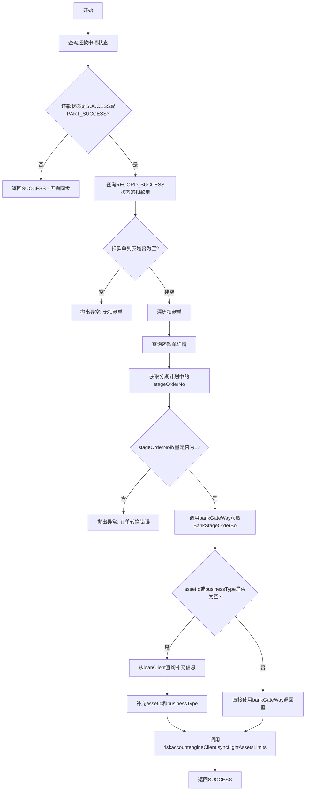

# PL070085 - 轻资产额度同步

## 节点信息

| 属性 | 值 |
|------|-----|
| **处理器代码** | PL070085 |
| **节点名称** | 轻资产额度同步 |
| **节点类型** | PROCESS |
| **所属流程** | [[轻资产还款批量入账流程Vl3.1.0]] |
| **执行阶段** | ���度同步阶段 |
| **实现类** | RepayApplyBizFlowPL070085ServiceImpl |
| **优先级** | P1（还款后置处理） |
| **异常策略** | 重试10次，间隔60秒，失败后IGNORE |

## 功能说明

还款成功后将额度信息同步到风控引擎(riskaccountengine)，用于更新轻资产的可用额度。

### 核心职责
1. **还款状态检查**: 仅在还款SUCCESS或PART_SUCCESS时执行
2. **成功单筛选**: 筛选RECORD_SUCCESS状态的扣款单
3. **资方订单查询**: 通过bankGateWay获取分期订单信息
4. **额度同步**: 调用riskaccountengineClient同步轻资产额度

## 处理流程



## 核心业务逻辑

### 1. 还款状态检查

只有还款成功或部分成功时才需要同步额度：
- `RepayStatus.SUCCESS` - 全额还款成功
- `RepayStatus.PART_SUCCESS` - 部分还款成功

### 2. 获取资方订单信息

通过以下步骤获取BankStageOrderBo：
1. 从扣款单关联的还款单中获取 `stagePlanItemList`
2. 提取 `stageOrderNo`（要求唯一，否则抛异常）
3. 调用 `bankGateWayClient.getStageOrder` 获取资方订单详情

### 3. assetId兜底逻辑

轻资产场景下，大多数资方没有返回 `assetId` 信息。兼容逻辑：
- 如果bankGateWay返回的 `assetId` 或 `businessType` 为空
- 通过 `loanClient.getOrderDetailByConditions` 从loan服务查询补充
- 如果loan服务也查不到，使用 `bank` 字段作为兜底assetId

### 4. 额度同步

调用 `riskaccountengineClient.syncLightAssetsLimits(uid, bank, assetId)` 同步额度。

## 输入参数

| 参数名 | 参数代码 | 类型 | 来源 | 说明 |
|--------|----------|------|------|------|
| 还款申请号 | repayApplyNo | String | RepayApplyBo | 还款申请单号 |
| 还款单号 | subBizSerial | String | RepayContext | 当前还款单号 |

## 输出参数

| 参数名 | 参数代码 | 类型 | 说明 |
|--------|----------|------|------|
| 无 | - | - | 额度同步为外部服务调用 |

## 外部服务依赖

| 服务 | 方法 | 用途 |
|------|------|------|
| bankGateWayClient | getStageOrder | 查询资方分期订单详情 |
| loanClient | getOrderDetailByConditions | 兜底查询assetId |
| riskaccountengineClient | syncLightAssetsLimits | 同步轻资产额度 |

## 上游节点

- [[PL070038]] - 还款入账事件

## 下游节点

- [[P000000]] - 预留空节点

## 异常处理

| 异常场景 | 处理方式 | 影响 |
|----------|----------|------|
| 无扣款单 | 抛出CjjClientException | 重试10次后忽略 |
| stageOrder数量不为1 | 抛出CjjClientException | 重试10次后忽略 |
| bankStageOrderBo为null | 抛出CjjClientException | 重试10次后忽略 |
| syncLightAssetsLimits异常 | 返回PAUSED | 重试10次后忽略 |

**注意**: 此节点异常策略为 `IGNORE`，即重试10次后若仍失败，不会阻塞流程继续。额度同步非关键路径。

## 实现位置

```bash
repayengine-service/src/main/java/cn/caijiajia/repayengine/service/
└── repay/process/impl/
    └── RepayApplyBizFlowPL070085ServiceImpl.java  # 143行
```

## 相关文档

- [[轻资产还款批量入账流程Vl3.1.0]] - 所属业务流
- [[PL070038]] - 上游入账节点
- [[P070999]] - 入账后置事件

## 标签

#节点 #轻资产 #额度同步 #风控引擎 #PL070085