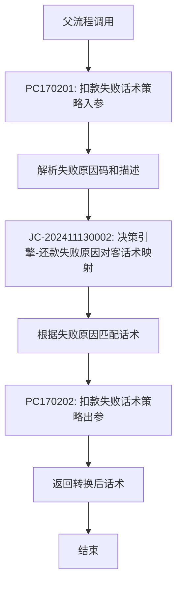

# 扣款失败话术策略子流程

## 基本信息

| 属性         | 值                                    |
| ---------- | ------------------------------------ |
| **业务流名称**  | 扣款失败话术策略子流程                          |
| **业务流KEY** | PF-subflow-2024-11-131731484799121   |
| **计划代码**   | f24d7c54-fa89-42ae-a6b5-28fa99e95819 |
| **平台代码**   | tradebiz                             |
| **场景代码**   | BIZ_SCENE_TECH_HKYQ                  |
| **状态**     | ONLINE                               |
| **运行模式**   | STATEFUL (有状态)                       |
| **触发类型**   | PARENT_CALL (父流程调用)                  |
| **调用位置**   | [[重资产分期制还款异步子流程V401]]、[[轻资产还款批量入账流程Vl3.1.0]] |
| **触发条件**   | `failMsgFlag == true`                |
| **创建时间**   | 2024-11-13                           |
| **描述**     | 扣款失败时根据失败原因和用户特征选择合适的失败话术            |

## 业务流程概述

当扣款失败时,通过策略引擎分析失败原因、用户特征等因素,智能选择合适的失败提示话术,优化用户体验,提升还款转化率。

### 核心功能
1. **失败原因分析**: 解析扣款失败的具体原因码
2. **用户特征识别**: 分析用户会员等级、历史还款情况等
3. **话术策略选择**: 调用决策引擎选择最优话术
4. **话术转换**: 将技术性错误信息转换为用户友好的提示文案

## 流程变量

| 变量名 | 变量代码 | 类型 | 来源 | 说明 |
|--------|----------|------|------|------|
| 用户ID | uid | string | INPUT_CUSTOM | 用户唯一标识 |
| 扣款失败标志 | failMsgFlag | boolean | INPUT_CUSTOM | true表示需要策略转换话术 |
| 扣款单编号 | deductBillNo | string | INPUT_CUSTOM | 失败的扣款单编号 |
| 失败原因码 | failCode | string | INPUT_CUSTOM | 原始失败原因码 |
| 失败原因描述 | failMsg | string | INPUT_CUSTOM | 原始失败原因描述 |
| 转换后话术 | convertedMsg | string | OUTPUT | 优化后的失败提示文案 |

## 流程节点详情

### 1. 开始节点

#### node_1731485087159_973121 - 开始
- **节点类型**: START
- **节点名称**: 开始
- **触发类型**: PARENT_CALL
- **说明**: 子流程入口,由父流程调用时触发,接收父流程传递的扣款失败信息

### 2. 入参处理阶段

#### node_1731485091872_580903 - 扣款失败话术策略入参
- **节点类型**: PROCESS
- **处理器**: [[PC170201]]
- **节点名称**: 扣款失败话术策略入参
- **功能**:
  - 接收并解析父流程传递的扣款失败上下文信息
  - 提取失败原因码(failCode)和失败原因描述(failMsg)
  - 提取用户ID、扣款单号等基础信息
  - 准备决策引擎所需的输入参数

### 3. 决策引擎阶段

#### node_1731485098156_272599 - 还款失败原因对客话术映射
- **节点类型**: NEWRULES (决策引擎)
- **决策引擎**: HENGINE
- **规则KEY**: JC-202411130002
- **规则名称**: 还款失败原因对客话术映射
- **功能**:
  - 基于失败原因码(failCode)匹配对应的用户友好话术
  - 根据预配置的业务规则映射技术性错误到用户可理解的提示文案
  - 可能结合用户特征(会员等级、历史还款情况等)优化话术
  - 返回转换后的话术内容

### 4. 出参处理阶段

#### node_1731485093372_83209 - 扣款失败话术策略出参
- **节点类型**: PROCESS
- **处理器**: [[PC170202]]
- **节点名称**: 扣款失败话术策略出参
- **功能**:
  - 接收决策引擎返回的话术结果
  - 格式化输出参数结构
  - 将转换后的话术(convertedMsg)写入上下文供父流程使用
  - 可能记录话术转换日志用于后续效果分析

### 5. 结束节点

#### node_1731485095338_245333 - 结束
- **节点类型**: END
- **节点名称**: 结束
- **返回结果**: 转换后的失败话术文案(convertedMsg)

## 输入参数

| 参数名 | 参数代码 | 类型 | 必填 | 说明 | 来源 |
|--------|----------|------|------|------|------|
| 用户ID | uid | string | 是 | 用户唯一标识 | 父流程上下文 |
| 扣款单编号 | deductBillNo | string | 是 | 失败的扣款单编号 | 父流程上下文 |
| 失败原因码 | failCode | string | 是 | 原始失败原因码 | 父流程上下文 |
| 失败原因描述 | failMsg | string | 是 | 原始失败原因描述 | 父流程上下文 |
| 支付渠道 | payChannel | string | 否 | 扣款支付渠道 | 父流程上下文 |
| 还款金额 | repayAmount | integer | 否 | 尝试还款金额 | 父流程上下文 |

## 输出参数

| 参数名 | 参数代码 | 类型 | 说明 |
|--------|----------|------|------|
| 转换后话术 | convertedMsg | string | 优化后的失败提示文案 |
| 话术模板ID | templateId | string | 使用的话术模板标识 |
| 决策结果 | decisionResult | object | 决策引擎的完整返回 |

## 处理流程图



## 话术策略规则

### 失败原因分类

| 失败类型 | 原因码示例 | 话术策略 |
|----------|------------|----------|
| 余额不足 | INSUFFICIENT_BALANCE | 提示具体缺少金额,引导充值 |
| 银行卡状态异常 | CARD_STATUS_ERROR | 提示检查银行卡状态,引导更换 |
| 网络超时 | NETWORK_TIMEOUT | 安抚情绪,引导稍后重试 |
| 密码错误 | PASSWORD_ERROR | 提示核对密码,引导修改 |
| 限额限制 | LIMIT_EXCEEDED | 提示单笔/单日限额,引导分批还款 |
| 系统异常 | SYSTEM_ERROR | 安抚情绪,告知技术团队处理中 |

### 用户特征维度

| 维度 | 取值 | 话术差异 |
|------|------|----------|
| 会员等级 | VIP/普通 | VIP用户更礼貌、提供专属服务引导 |
| 历史还款 | 良好/一般/差 | 良好用户更信任、差用户更严肃 |
| 失败次数 | 首次/多次 | 首次安抚、多次引导客服 |
| 时间段 | 工作日/周末/深夜 | 不同时段提供不同的响应时效承诺 |

### 话术模板示例

```json
{
  "templates": [
    {
      "templateId": "T001",
      "scenario": "余额不足-VIP用户-首次失败",
      "content": "尊敬的VIP用户,您的账户余额不足${deficitAmount}元,为避免影响信用,建议您尽快充值后重试。如需帮助,专属客服随时为您服务。"
    },
    {
      "templateId": "T002",
      "scenario": "余额不足-普通用户-多次失败",
      "content": "您的账户余额不足${deficitAmount}元,这是您第${failCount}次还款失败。请及时充值,避免产生逾期费用。"
    },
    {
      "templateId": "T003",
      "scenario": "网络超时-所有用户",
      "content": "网络不太稳定,扣款未成功,请稍后重试。您的钱包很安全,请放心。"
    }
  ]
}
```

## 调用关系

### 上游调用方
- [[重资产分期制还款异步子流程V401]] - 父流程,在扣款失败时通过 `failMsgFlag == true` 条件触发本子流程
- [[轻资产还款批量入账流程Vl3.1.0]] - 父流程,在PL070032节点检查灰度后通过 `failMsgFlag == true` 条件触发本子流程

### 被调用方
- 决策引擎 (HENGINE) - 话术策略决策 (规则KEY: JC-202411130002)
- 用户服务 (user-service) - 用户特征查询
- 模板服务 (template-service) - 话术模板获取

### 下游节点(父流程后续处理)
本子流程返回 `convertedMsg` 后,父流程继续执行以下节点:
- [[PH170075]] - 优惠返现记录(分期级别)
- [[PH170069]] - 结清返现记录(订单级别)
- [[PH170999V1]] - 子流程结束节点
- [[PH170241]] - 入账后同步记录到资方

### 数据流转
- **输入**: 从父流程接收 `uid`, `deductBillNo`, `failCode`, `failMsg`, `payChannel`, `repayAmount`
- **输出**: 向父流程返回 `convertedMsg` (转换后的用户友好话术), `templateId`, `decisionResult`
- **触发时序**: 在扣款失败确认后立即执行,在返现记录、同步资方等后置节点之前完成

## 异常处理

### 异常策略
- **全局异常**: 使用默认话术,不中断父流程
- **决策引擎异常**: 降级到规则匹配
- **模板服务异常**: 使用内置默认话术
- **用户服务异常**: 使用默认用户特征

### 降级方案

```
决策引擎调用失败
  ↓
规则引擎降级匹配
  ↓
规则匹配失败
  ↓
使用失败原因码映射表
  ↓
映射表无匹配
  ↓
返回通用默认话术
```

## 监控指标

### 关键指标

| 指标名称 | 说明 | 告警阈值 |
|----------|------|----------|
| 子流程调用量 | 话术转换总次数 | - |
| 决策引擎成功率 | 决策引擎调用成功比例 | < 95% |
| 话术转换耗时 | P99耗时 | > 500ms |
| 降级次数 | 使用降级方案的次数 | > 100/hour |
| 默认话术使用率 | 使用默认话术的比例 | > 20% |

### 业务指标

| 指标名称 | 说明 | 监控目标 |
|----------|------|----------|
| 话术转换后重试率 | 看到新话术后的重试比例 | 提升 |
| 客服咨询率 | 看到话术后仍咨询客服的比例 | 降低 |
| 用户满意度 | 通过话术优化后的满意度 | 提升 |

## 实现位置

```
repayengine-service/src/main/java/cn/caijiajia/repayengine/service/repay/process/subflow/
└── (话术策略相关处理器,待确认具体类名)

repayengine-service/src/main/java/cn/caijiajia/repayengine/service/msg/
└── FailMsgConvertService.java (推测)

repayengine-common/src/main/java/cn/caijiajia/repayengine/common/constant/
└── CommonConst.java (包含 DEDUCT_FAIL_MSG_GRAY_FLAG 常量)
```

## 效果评估

### A/B测试方案
- **对照组**: 使用原始技术性错���提示
- **实验组**: 使用智能话术策略
- **观察指标**: 重试率、客服咨询率、还款成功率

### 预期效果
- **重试率提升**: 20% → 35%
- **客服咨询率下降**: 15% → 8%
- **用户满意度提升**: 3.5分 → 4.2分 (5分制)

## 版本历史

| 版本 | 主要变更 | 时间 |
|------|----------|------|
| V1.0 | 初始版本,基础话术转换 | 2024-11-13 |

## 相关文档

- [[重资产分期制还款异步子流程V401]] - 父流程
- [[还款失败话术优化策略]] - 话术策略设计
- [[用户体验优化]] - 整体用户体验优化方案
- [[决策引擎接入指南]] - HENGINE决策引擎使用文档

## 优化建议

### 已实现
1. ✅ 基于决策引擎的智能话术选择
2. ✅ 多维度用户特征分析
3. ✅ 降级容错机制

### 待优化
1. ⏳ 引入机器学习模型,动态优化话术效果
2. ⏳ 支持多语言话术(繁体中文、英文等)
3. ⏳ 个性化话术推荐(基于用户历史偏好)
4. ⏳ 实时话术效果反馈与自动优化

## 注意事项

1. **性能要求**: 子流程执行耗时需控制在500ms内,避免影响主流程
2. **容错性**: 任何异常都不应导致父流程失败,必须返回默认话术
3. **灰度控制**: 通过 `failMsgFlag` 标志控制���度范围
4. **话术审核**: 所有话术模板需经过法务和用户体验团队审核
5. **敏感信息**: 话术中不得包含用户敏感信息(完整银行卡号、身份证等)
6. **效果追踪**: 需记录每次话术转换,用于后续效果分析

## 标签

#子流程 #话术策略 #扣款失败 #用户体验 #决策引擎 #智能转换 #repayengine