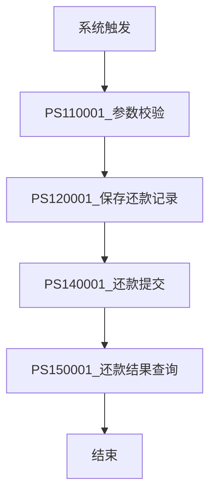

# 出让订单还款流程V1

## 基本信息

| 属性         | 值                                      |
| ---------- | -------------------------------------- |
| **业务流名称**  | 出让订单还款流程                               |
| **业务流KEY** | PF-tradebiz-sold_repay_apply_v1        |
| **版本号**    | 1                                      |
| **平台代码**   | tradebiz                               |
| **场景代码**   | BIZ_SCENE_TECH_HKYQ                    |
| **计划代码**   | 442778fd-057b-4a5a-9d7e-a1ec28788f06   |
| **状态**     | ONLINE                                 |
| **运行模式**   | STATEFUL (有状态)                         |
| **触发类型**   | SYSTEM_TRIGGER (系统触发)                  |
| **负责人UID** | 6693576e-d197-44a3-bdc6-19cee6f77d45   |
| **创建人**    | 王涛涛                                    |
| **更新人**    | 王涛涛                                    |
| **描述**     | 出让订单还款流程                               |
| **生效时间**   | 1999-01-01 至 2037-01-01                |

## 业务流程概述

出让订单还款流程，主要处理出让类订单的还款业务，流程包括参数校验、保存还款记录、还款提交和还款结果查询。

### 核心功能
1. **参数校验**: 还款入参校验
2. **保存还款记录**: 持久化还款业务数据
3. **还款提交**: 发起还款请求
4. **还款结果查询**: 查询还款执行结果

## 流程变量

| 变量名 | 变量代码 | 类型 | 来源 | 说明 |
|--------|----------|------|------|------|
| 用户ID | uid | string | INPUT_CUSTOM | - |

## 触发上下文

creditpay, debitaccountengine, lendengine, hbapplycollector, applycenter, hbloandeal, tradeorder, repayfront, repayengine, reconciliation, repayenginea, payment, paymentengine, accountsettlement

## 流程节点详情

### 1. 开始节点

#### bf18a808 - 系统触发
- **节点类型**: TRIGGER_METHOD
- **节点名称**: 系统触发
- **触发类型**: SYSTEM_TRIGGER

### 2. 参数校验阶段

#### d84e42b5 - PS110001_参数校验
- **节点类型**: PROCESS
- **处理器**: PS110001
- **异常策略**: 默认(全局策略)
- **关联**: [[PS110001]]

### 3. 保存还款记录阶段

#### 7d7167a0 - PS120001_保存还款记录
- **节点类型**: PROCESS
- **处理器**: PS120001
- **异常策略**: 默认(全局策略)
- **关联**: [[PS120001]]

### 4. 还款提交阶段

#### 2ec26876 - PS140001_还款提交
- **节点类型**: PROCESS
- **处理器**: PS140001
- **异常策略**: 默认(全局策略)
- **关联**: [[PS140001]]

### 5. 还款结果查询阶段

#### 289a6a3d - PS150001_还款结果查询
- **节点类型**: PROCESS
- **处理器**: PS150001
- **异常策略**: 重试1次，间隔60秒，失败后暂停
- **关联**: [[PS150001]]

### 6. 结束节点

#### 5e19b867 - 结束
- **节点类型**: END
- **说明**: 流程结束

## 流程图

## 异常处理策略

### 全局异常策略
- **重试类型**: normal
- **重试次数**: 5次
- **重试间隔**: 60秒
- **失败后状态**: ERROR (错误)

### 特殊异常处理
1. **还款结果查询(PS150001)**: 重试1次，间隔60秒，失败后暂停(PAUSED)

### 存储策略
- **执行记录保存**: SIMPLE
- **节点记录保存**: SIMPLE

## 子流程关联

无子流程

## 决策节点

无决策节点

## 节点关联索引

### 处理器节点
- [[PS110001]] - 参数校验
- [[PS120001]] - 保存还款记录
- [[PS140001]] - 还款提交
- [[PS150001]] - 还款结果查询

## 相关文档
- [[出让订单还款业务流程]]
- [[还款业务流程]]

## 标签

#业务流 #还款 #出让订单 #V1 #tradebiz
