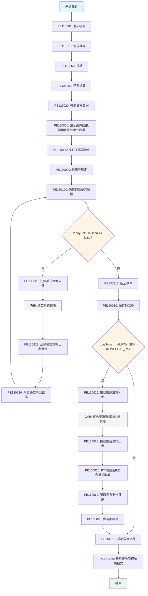
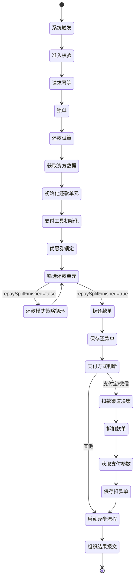

# 账期制V400还款同步流程

## 业务流信息

| 属性 | 值 |
|------|-----|
| **业务流代码** | PF-tradebiz-repayapply_enjoypay_ve400 |
| **业务流名称** | 账期制V400还款同步流程 |
| **流程类型** | PLAN (主流程) |
| **运行模式** | STATELESS (无状态) |
| **触发方式** | SYSTEM_TRIGGER (系统触发) |
| **所属平台** | tradebiz (交易流程平台) |
| **业务场景** | BIZ_SCENE_TECH_HKYQ_STATELESS |
| **版本** | 1 |
| **状态** | ONLINE |
| **创建人** | 吴清武 |
| **创建时间** | 2024-05-14 |

## 功能说明

账期制V400还款同步流程负责处理还享花(账期制)产品的还款受理阶段,完成准入校验、幂等控制、还款试算、还款单拆分、扣款渠道决策、扣款单生成等核心业务逻辑,并异步启动后续入账流程。

### 核心职责
1. **准入校验**: 验证还款申请参数合法性和金额一致性
2. **幂等控制**: 确保还款请求的幂等性
3. **锁单**: 锁定待还款的分期计划
4. **还款试算**: 计算还款金额、费用、优惠
5. **获取资方数据**: 集成资金账数据
6. **支付工具初始化**: 初始化优惠券、溢缴款等支付工具
7. **还款模式策略**: 决策还款拆分策略
8. **还款单生成**: 按决策结果拆分还款单
9. **扣款渠道决策**: 选择扣款渠道
10. **扣款单生成**: 生成扣款单并启动异步流程

### 适用场景

- **正常还款**: 按期还款处理
- **提前结清**: 提前还清所有欠款
- **逾期还款**: 逾期后补缴还款
- **部分还款**: 部分金额还款

## 流程图



## 输入参数

| 参数名 | 参数代码 | 类型 | 说明 |
|--------|----------|------|------|
| 还款模式策略执行是否结束 | repaySplitFinished | Boolean | 标识还款拆分策略是否执行完成 |
| 支付方式 | payType | String | 支付方式(ALIPAY_SDK/WECHAT_PAY等) |
| 用户ID | uid | String | 用户唯一标识 |
| 还款金额 | repayAmount | Integer | 还款金额(单位:分) |
| 账期号列表 | billNoList | List<String> | 待还款的账期号列表 |
| 分期还款申请列表 | stageRepayApplyList | List | 指定分期计划的还款申请 |
| 支付工具列表 | payToolList | List<PayTool> | 支付方式列表(优惠券/溢缴款/三方支付) |

## 输出参数

| 参数名 | 参数代码 | 类型 | 说明 |
|--------|----------|------|------|
| 还款申请号 | repayApplyNo | String | 还款申请唯一标识 |
| 还款受理结果 | - | Object | 还款受理结果报文 |

## 流程节点列表

| 序号 | 节点代码 | 节点名称 | 节点类型 | 说明 |
|------|----------|----------|----------|------|
| 1 | SYSTEM_TRIGGER | 系统触发 | TRIGGER | 流程入口 |
| 2 | PE110001 | 准入校验 | PROCESS | 验证还款申请参数合法性 |
| 3 | PE110010 | 请求幂等 | PROCESS | 确保还款请求幂等性 |
| 4 | PE110060 | 锁单 | PROCESS | 锁定待还款的分期计划 |
| 5 | PE120001 | 还款试算 | PROCESS | 计算还款金额、费用、优惠 |
| 6 | PE120020 | 获取资方数据 | PROCESS | 集成资金账数据 |
| 7 | PE120006 | 整合试算结果,初始化还款单元数据 | PROCESS | 整合试算结果并初始化还款单元 |
| 8 | PE130080 | 支付工具初始化 | PROCESS | 初始化优惠券、溢缴款等 |
| 9 | PE130090 | 优惠券锁定 | PROCESS | 锁定使用的优惠券 |
| 10 | PE130100 | 筛选还款单元数据 | PROCESS | 筛选待处理的还款单元 |
| 11 | LOGIC_JUDGE | 是否完成还款模式策略 | DECISION | 判断还款拆分是否完成 |
| 12 | PE130626 | 还款模式策略入参 | PROCESS | 构建决策入参 |
| 13 | NEWRULES | 还款模式策略 | DECISION | 决策还款拆分策略 |
| 14 | PE130628 | 还款模式策略出参聚合 | PROCESS | 聚合决策结果 |
| 15 | PE130630 | 聚合还款单元数据 | PROCESS | 聚合还款单元数据 |
| 16 | PE130817 | 拆还款单 | PROCESS | 按决策拆分还款单 |
| 17 | PE150010 | 保存还款单 | PROCESS | 保存还款单到数据库 |
| 18 | LOGIC_JUDGE | 微信支付宝支付 | DECISION | 判断支付方式 |
| 19 | PE160026 | 扣款渠道决策入参 | PROCESS | 构建扣款渠道决策入参 |
| 20 | NEWRULES | 还款渠道选择路由新策略 | DECISION | 决策扣款渠道 |
| 21 | PE160028 | 扣款渠道决策出参 | PROCESS | 处理决策结果 |
| 22 | PE160030 | BY决策结果聚合拆扣款单 | PROCESS | 按决策结果拆分扣款单 |
| 23 | PE160060 | 获取三方支付参数 | PROCESS | 获取三方支付参数 |
| 24 | PE160090 | 保存扣款单 | PROCESS | 保存扣款单到数据库 |
| 25 | PE161010 | 启动异步流程 | PROCESS | 启动异步入账流程 |
| 26 | PE161060 | 组织还款受理结果报文 | PROCESS | 构建还款受理结果 |
| 27 | END | 结束 | END | 流程结束 |

## 关键决策点

### 决策1: 还款模式策略执行是否结束

**决策代码**: LOGIC_JUDGE (node_1715668679777_44678)
**判断条件**: `repaySplitFinished == false`

**分支逻辑**:
- **条件满足** (repaySplitFinished == false): 进入还款模式策略决策循环
- **条件不满足** (repaySplitFinished == true 或其他): 拆分完成,生成还款单

**业务含义**:
- `repaySplitFinished == false`: 还款拆分策略未完成,需要继续执行决策
- `repaySplitFinished == true`: 还款拆分策略已完成,可以生成还款单

**决策规则**:
- **决策Key**: JC-202405140001
- **决策名称**: 还款模式策略
- **决策类型**: HENGINE (规则引擎)
- **决策版本**: 1

### 决策2: 支付方式判断

**决策代码**: LOGIC_JUDGE (node_1715669067392_221694)
**判断条件**: `payType == ALIPAY_SDK OR payType == WECHAT_PAY`

**分支逻辑**:
- **条件满足** (支付宝或微信支付): 执行扣款渠道决策
- **条件不满足** (其他支付方式): 直接启动异步流程

**业务含义**:
- 支付宝/微信支付需要通过决策选择扣款渠道
- 其他支付方式(如银行卡代扣)直接使用默认渠道

**决策规则**:
- **决策Key**: JC-202405140002
- **决策名称**: 还款渠道选择路由新策略
- **决策类型**: HENGINE (规则引擎)
- **决策版本**: 1

## 关联子流程

### 子流程: 账期制V400还款异步流程

| 属性 | 值 |
|------|-----|
| **子流程代码** | PF-tradebiz-repayhandle_enjoypay_ve400 |
| **子流程名称** | 账期制V400还款异步流程 |
| **子流程类型** | PLAN (主流程) |
| **触发方式** | 异步触发 |
| **执行方式** | 异步执行(主流程不等待) |

**子流程职责**:
- 筛选还款单
- 执行还款入账子流程
- 更新全局入账明细
- 恢复额度
- 入账结果推送台账
- 结清返现
- 订单解锁
- 优惠券消费
- 发送结果消息

**详细文档**: [[账期制V400还款异步流程]]

## 全局变量

| 变量名 | 变量代码 | 类型 | 默认值 | 说明 |
|--------|----------|------|--------|------|
| 获取变量为空标志 | FETCH_VARIABLE_NULL | String | D#999 | 标识变量获取是否为空 |

## 异常处理策略

| 策略项 | 配置值 | 说明 |
|--------|--------|------|
| **运行异常策略** | default | 默认异常处理 |
| **无路径异常策略** | success | 无路径时视为成功 |
| **决策异常策略** | ignore | 决策异常时忽略 |

## 业务逻辑详解

### 1. 准入校验 (PE110001)

**核心逻辑**:
1. 验证支付工具金额合法性(必须>0)
2. 验证支付方式字段完整性
3. 检查是否仅使用优惠券/折扣券还款(不支持)
4. 计算所有支付工具的总金额
5. 校验总金额是否等于还款申请金额

**校验规则**:
- 支付金额必须 > 0
- 支付方式不能为空
- 不支持仅使用优惠券/折扣券还款
- 支付工具总金额 == 还款申请金额

**异常处理**:
- 金额不一致 → 抛出 `REPAY_APPLY_SUBMIT_AMOUNT_ERROR`
- 支付金额 <= 0 → 抛出 `REPAY_AMOUNT_CAN_NOT_BE_LESS_THAN_ZERO`
- 支付方式为空 → 抛出 `REPAY_PAY_TOOL_ERROR`
- 仅优惠券 → 抛出 `REPAY_PAY_TYPE_COUPON_ONLY_NOT_SUPPORT`

**详细文档**: [[PE110001]]

### 2. 请求幂等 (PE110010)

**核心逻辑**:
1. 检查是否存在相同的还款申请
2. 如果存在,返回已有的还款申请号
3. 如果不存在,生成新的还款申请号

**幂等依据**:
- 用户ID (uid)
- 业务流水号 (bizSerial)
- 还款金额 (repayAmount)

**详细文档**: [[PE110010]]

### 3. 锁单 (PE110060)

**核心逻辑**:
1. 解析请求中的分期还款申请列表
2. 按订单号分组分期计划号
3. 计算还款方式(自动扣款/手动扣款/线下还款)
4. 调用核心系统锁定分期计划

**锁单参数**:
- uid: 用户ID
- billCycleList: 账期号列表
- stagePlanNoByOrderNoMap: 订单号→分期计划号映射
- repayApplyNo: 还款申请号
- repayAmount: 还款金额
- deductType: 扣款类型

**异常处理**:
- 锁单失败 → 返回 ERROR
- 分期计划状态异常 → 返回 ERROR

**详细文档**: [[PE110060]]

### 4. 还款试算 (PE120001)

**核心逻辑**:
1. 初始化还款试算对象(RepayTrialBoV3)
2. 更新账期号到扩展域
3. 调用底层算费系统进行还款试算
4. 校验试算结果参数(还款场景不能为空)
5. 根据试算结果更新订单信息
6. 解析还款试算结果
7. 选择用户指定的支付方式组合
8. 获取各订单的非优惠券支付方式
9. 保存还款试算结果

**试算对象初始化**:
- uid: 用户ID
- bizSerial: 业务流水号
- repayApplyNo: 还款申请号
- repayDate: 还款日期
- billNoList: 账期号列表
- businessTypeList: 业务类型列表(ENJOY_PAY/FUN_PAY)
- stageOrderStatusList: 订单状态列表(LENDING/EXCEED)
- repayWay: 还款方式
- repayCategory: 还款类别
- repayReqAmount: 还款金额
- repayCouponKey: 优惠券Key

**支付工具处理**:
- 优惠券: 获取优惠券信息,验证状态,设置优惠券Key
- 溢缴款: 获取溢缴款账户,验证账户号,以账户余额为准

**试算结果保存**:
- 保存试算结果到数据库
- 更新还款申请单扩展域

**详细文档**: [[PE120001]]

### 5. 获取资方数据 (PE120020)

**核心逻辑**:
1. 从StageOrderContext中提取所有分期计划
2. 遍历还款试算计划组件
3. 提取分期订单号和分期计划号
4. 调用银行网关获取资方分期订单数据
5. 提取资方分期计划数据
6. 更新StagePlanContext中的资方状态字段:
   - claimed: 资方是否已认领(fundPreStatus == "1")
   - fundPayOff: 资方是否已结清(fundStatus == PAY_OFF)

**资方数据集成**:
- 获取BankStageOrderBo列表
- 提取BankStagePlanBo映射
- 更新分期计划上下文

**异常处理**:
- 捕获异常,记录错误日志
- 返回 ERROR 状态

**详细文档**: [[PE120020]]

### 6. 整合试算结果,初始化还款单元数据 (PE120006)

**核心逻辑**:
1. 整合还款试算结果
2. 初始化还款单元数据结构
3. 构建还款单元列表(RepaymentBillHandleForDcp)

**详细文档**: [[PE120006]]

### 7. 支付工具初始化 (PE130080)

**核心逻辑**:
1. 初始化优惠券支付工具
2. 初始化溢缴款支付工具
3. 初始化三方支付工具
4. 设置支付工具优先级

**详细文档**: [[PE130080]]

### 8. 优惠券锁定 (PE130090)

**核心逻辑**:
1. 获取优惠券信息
2. 调用优惠券服务锁定优惠券
3. 更新优惠券状态为锁定

**锁定条件**:
- 用户使用了优惠券
- 优惠券状态为可用

**详细文档**: [[PE130090]]

### 9. 筛选还款单元数据 (PE130100)

**核心逻辑**:
1. 获取还款单元列表
2. 筛选待处理的还款单元
3. 设置全局变量 repaySplitFinished

**筛选规则**:
- 存在待处理还款单元 → repaySplitFinished = false
- 不存在待处理还款单元 → repaySplitFinished = true

**详细文档**: [[PE130100]]

### 10. 还款模式策略入参 (PE130626)

**核心逻辑**:
1. 构建还款模式策略决策入参
2. 提取还款单元关键信息
3. 构建决策上下文

**决策入参**:
- 还款金额
- 还款方式
- 订单信息
- 分期计划信息
- 支付工具信息

**详细文档**: [[PE130626]]

### 11. 还款模式策略 (决策)

**决策规则**:
- **决策Key**: JC-202405140001
- **决策名称**: 还款模式策略
- **决策类型**: HENGINE
- **工作空间**: PRODUCT_OP/HK

**决策逻辑**:
- 根据还款金额、订单状态、支付工具等因素
- 决定还款单的拆分策略
- 返回还款模式(如:正常还款、提前结清、部分还款等)

**详细文档**: [[还款模式策略决策]]

### 12. 还款模式策略出参聚合 (PE130628)

**核心逻辑**:
1. 接收决策结果
2. 聚合各还款单元的决策结果
3. 更新还款单元数据

**详细文档**: [[PE130628]]

### 13. 聚合还款单元数据 (PE130630)

**核心逻辑**:
1. 聚合所有还款单元数据
2. 更新全局还款单元列表
3. 设置 repaySplitFinished 标志

**详细文档**: [[PE130630]]

### 14. 拆还款单 (PE130817)

**核心逻辑**:
1. 根据决策结果拆分还款单
2. 生成还款单列表
3. 设置还款单金额、期数、还款模式

**拆分规则**:
- 按决策结果拆分
- 每个还款单对应一个还款单元
- 还款单金额 = 该还款单元的应还金额

**详细文档**: [[PE130817]]

### 15. 保存还款单 (PE150010)

**核心逻辑**:
1. 保存还款单到数据库
2. 更新还款申请单状态
3. 关联还款单和还款申请单

**保存内容**:
- 还款单号
- 还款金额
- 还款期数
- 还款模式
- 还款状态

**详细文档**: [[PE150010]]

### 16. 扣款渠道决策入参 (PE160026)

**核心逻辑**:
1. 构建扣款渠道决策入参
2. 提取支付方式、金额等信息
3. 构建决策上下文

**决策入参**:
- 支付方式(payType)
- 还款金额
- 用户信息
- 订单信息

**详细文档**: [[PE160026]]

### 17. 还款渠道选择路由新策略 (决策)

**决策规则**:
- **决策Key**: JC-202405140002
- **决策名称**: 还款渠道选择路由新策略
- **决策类型**: HENGINE
- **工作空间**: PRODUCT_OP/HK

**决策逻辑**:
- 根据支付方式、金额、用户画像等因素
- 选择最优的扣款渠道
- 返回渠道编码、渠道优先级等

**决策条件**:
- 支付方式为 ALIPAY_SDK 或 WECHAT_PAY

**详细文档**: [[还款渠道选择路由新策略决策]]

### 18. 扣款渠道决策出参 (PE160028)

**核心逻辑**:
1. 接收决策结果
2. 解析扣款渠道信息
3. 更新扣款单数据

**决策结果**:
- 渠道编码
- 渠道优先级
- 渠道限额
- 渠道费率

**详细文档**: [[PE160028]]

### 19. BY决策结果聚合拆扣款单 (PE160030)

**核心逻辑**:
1. 根据决策结果拆分扣款单
2. 聚合相同渠道的扣款单
3. 生成扣款单列表

**拆分规则**:
- 按渠道拆分
- 按金额限制拆分
- 按优先级排序

**详细文档**: [[PE160030]]

### 20. 获取三方支付参数 (PE160060)

**核心逻辑**:
1. 获取支付宝/微信支付参数
2. 调用三方支付服务获取预支付参数
3. 构建支付请求参数

**获取内容**:
- 预支付交易会话标识
- 支付参数
- 签名

**详细文档**: [[PE160060]]

### 21. 保存扣款单 (PE160090)

**核心逻辑**:
1. 保存扣款单到数据库
2. 关联扣款单和还款单
3. 更新扣款单状态

**保存内容**:
- 扣款单号
- 扣款金额
- 扣款渠道
- 扣款状态
- 关联还款单号

**详细文档**: [[PE160090]]

### 22. 启动异步流程 (PE161010)

**核心逻辑**:
1. 构建异步流程触发参数
2. 异步启动账期制V400还款异步流程
3. 主流程不等待,立即返回

**异步流程**:
- 流程代码: PF-tradebiz-repayhandle_enjoypay_ve400
- 流程名称: 账期制V400还款异步流程
- 触发方式: 系统触发
- 执行方式: 异步执行

**详细文档**: [[PE161010]]

### 23. 组织还款受理结果报文 (PE161060)

**核心逻辑**:
1. 构建还款受理结果报文
2. 组装还款申请号、还款金额、扣款单列表
3. 返回给调用方

**结果报文**:
- 还款申请号
- 还款金额
- 还款状态
- 扣款单列表
- 支付参数(如有)

**详细文档**: [[PE161060]]

## 状态流转



## 监控指标

### 业务指标
- **还款受理成功率**: 成功受理数 / 总申请数
- **还款试算准确率**: 试算金额与实际金额一致的比率
- **决策执行率**: 决策执行次数 / 总流程数
- **平均处理时长**: 流程开始到结束的平均耗时
- **支付方式分布**: 支付宝/微信/其他支付方式的比例

### 技术指标
- **节点执行成功率**: 各节点成功数 / 总执行数
- **决策命中率**: 决策命中数 / 决策执行数
- **异常率**: 异常数 / 总执行数
- **幂等命中率**: 幂等命中数 / 总请求数
- **锁单成功率**: 锁单成功数 / 锁单请求数

## 性能优化

### 1. 幂等控制
- **策略**: 基于业务流水号幂等
- **效果**: 避免重复还款

### 2. 锁单优化
- **策略**: 批量锁单,减少数据库交互
- **效果**: 提高锁单效率

### 3. 还款试算缓存
- **策略**: 缓存试算结果,避免重复计算
- **效果**: 减少算费系统调用

### 4. 决策引擎优化
- **策略**: 使用规则引擎,动态配置决策规则
- **效果**: 快速响应业务变化

### 5. 异步流程
- **策略**: 同步受理,异步入账
- **效果**: 提高用户体验,快速响应

## 相关文档

### 主流程
- [[账期制V400还款异步流程]] - 异步流程设计

### 节点文档
- [[PE110001]] - 准入校验
- [[PE110010]] - 请求幂等
- [[PE110060]] - 锁单
- [[PE120001]] - 还款试算
- [[PE120020]] - 获取资方数据
- [[PE120006]] - 整合试算结果
- [[PE130080]] - 支付工具初始化
- [[PE130090]] - 优惠券锁定
- [[PE130100]] - 筛选还款单元
- [[PE130626]] - 还款模式策略入参
- [[PE130628]] - 还款模式策略出参聚合
- [[PE130630]] - 聚合还款单元数据
- [[PE130817]] - 拆还款单
- [[PE150010]] - 保存还款单
- [[PE160026]] - 扣款渠道决策入参
- [[PE160028]] - 扣款渠道决策出参
- [[PE160030]] - 拆扣款单
- [[PE160060]] - 获取三方支付参数
- [[PE160090]] - 保存扣款单
- [[PE161010]] - 启动异步流程
- [[PE161060]] - 组织还款受理结果报文

### 决策文档
- [[还款模式策略决策]] - JC-202405140001
- [[还款渠道选择路由新策略决策]] - JC-202405140002

### 设计文档
- [[账期制还款业务流程]]
- [[还款单拆分规则]]
- [[扣款渠道选择规则]]

## 实现位置

```bash
repayengine-common/src/main/java/cn/caijiajia/repayengine/common/constant/
└── BizFlowConstants.java  # 业务流常量定义

repayengine-service/src/main/java/cn/caijiajia/repayengine/service/repay/process/dcp/
├── RepayApplyBizFlowPE110001ServiceImpl.java  # 准入校验
├── RepayApplyBizFlowPE110060ServiceImpl.java  # 锁单
├── RepayApplyBizFlowPE120001ServiceImpl.java  # 还款试算
├── RepayApplyBizFlowPE120020ServiceImpl.java  # 获取资方数据
├── RepayApplyBizFlowPE120006ServiceImpl.java  # 整合试算结果
├── RepayApplyBizFlowPE130080ServiceImpl.java  # 支付工具初始化
├── RepayApplyBizFlowPE130090ServiceImpl.java  # 优惠券锁定
├── RepayApplyBizFlowPE130100ServiceImpl.java  # 筛选还款单元
├── RepayApplyBizFlowPE130626ServiceImpl.java  # 还款模式策略入参
├── RepayApplyBizFlowPE130628ServiceImpl.java  # 还款模式策略出参聚合
├── RepayApplyBizFlowPE130630ServiceImpl.java  # 聚合还款单元数据
├── RepayApplyBizFlowPE130817ServiceImpl.java  # 拆还款单
├── RepayApplyBizFlowPE150010ServiceImpl.java  # 保存还款单
├── RepayApplyBizFlowPE160026ServiceImpl.java  # 扣款渠道决策入参
├── RepayApplyBizFlowPE160028ServiceImpl.java  # 扣款渠道决策出参
├── RepayApplyBizFlowPE160030ServiceImpl.java  # 拆扣款单
├── RepayApplyBizFlowPE160060ServiceImpl.java  # 获取三方支付参数
├── RepayApplyBizFlowPE160090ServiceImpl.java  # 保存扣款单
├── RepayApplyBizFlowPE161010ServiceImpl.java  # 启动异步流程
└── RepayApplyBizFlowPE161060ServiceImpl.java  # 组织还款受理结果报文
```

## 标签

#业务流 #账期制 #同步流程 #还款受理 #VE400