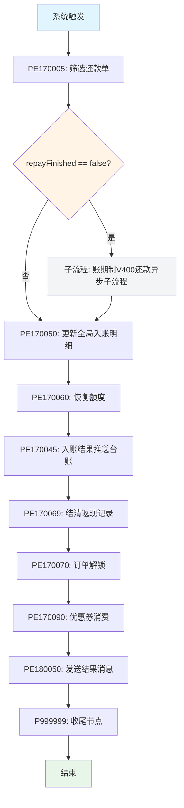
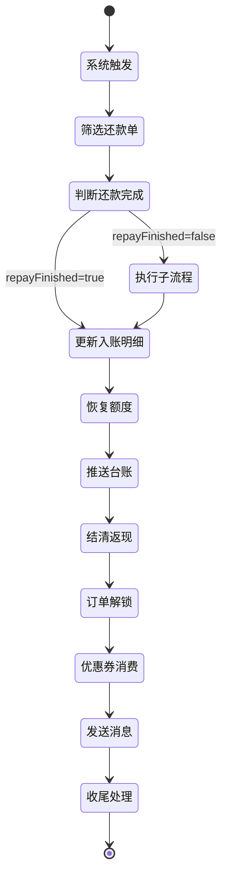

# 账期制V400还款异步流程

## 业务流信息

| 属性 | 值 |
|------|-----|
| **业务流代码** | PF-tradebiz-repayhandle_enjoypay_ve400 |
| **业务流名称** | 账期制V400还款异步流程 |
| **流程类型** | PLAN (主流程) |
| **运行模式** | STATEFUL (有状态) |
| **触发方式** | SYSTEM_TRIGGER (系统触发) |
| **所属平台** | tradebiz (交易流程平台) |
| **业务场景** | BIZ_SCENE_TECH_HKYQ |
| **版本** | 1 |
| **状态** | ONLINE |
| **创建人** | 吴清武 |
| **创建时间** | 2024-05-14 |

## 功能说明

账期制V400还款异步流程负责处理还享花(账期制)产品的还款后续处理,包括还款子流程调度、入账明细更新、额度恢复、台账推送、订单解锁等核心业务逻辑。

### 核心职责
1. **还款单筛选**: 筛选待处理的还款单
2. **子流程调度**: 根据还款完成状态决定是否启动子流程
3. **入账明细更新**: 汇总更新全局入账明细
4. **额度恢复**: 恢复用户可用额度
5. **台账推送**: 将入账结果推送至台账系统
6. **结清返现**: 处理结清后的返现逻辑
7. **订单解锁**: 释放订单锁定状态
8. **优惠券消费**: 标记优惠券已使用
9. **结果通知**: 发送还款结果消息

### 适用场景

- **正常还款**: 按期还款处理
- **提前结清**: 提前还清所有欠款
- **逾期还款**: 逾期后补缴还款
- **部分还款**: 部分金额还款

## 流程图



## 输入参数

| 参数名 | 参数代码 | 类型 | 说明 |
|--------|----------|------|------|
| 还款子流程完成标志 | repayFinished | Boolean | 标识还款子流程是否完成 |
| 用户ID | uid | String | 用户唯一标识 |

## 输出参数

| 参数名 | 参数代码 | 类型 | 说明 |
|--------|----------|------|------|
| 无 | - | - | 流程执行完成,无特定输出 |

## 流程节点列表

| 序号 | 节点代码 | 节点名称 | 节点类型 | 说明 |
|------|----------|----------|----------|------|
| 1 | SYSTEM_TRIGGER | 系统触发 | TRIGGER | 流程入口 |
| 2 | PE170005 | 筛选还款单 | PROCESS | 筛选待处理的还款单 |
| 3 | LOGIC_JUDGE | 条件判断 | DECISION | 判断还款子流程是否完成 |
| 4 | PF-subflow-repayincome_enjoypay_ve400 | 账期制V400还款异步子流程 | SUBFLOW | 执行还款入账子流程 |
| 5 | PE170050 | 更新全局入账明细 | PROCESS | 汇总更新入账明细 |
| 6 | PE170060 | 恢复额度 | PROCESS | 恢复用户可用额度 |
| 7 | PE170045 | 入账结果推送台账 | PROCESS | 推送至台账系统 |
| 8 | PE170069 | 结清返现记录 | PROCESS | 处理结清返现 |
| 9 | PE170070 | 订单解锁 | PROCESS | 释放订单锁定 |
| 10 | PE170090 | 优惠券消费 | PROCESS | 标记优惠券已使用 |
| 11 | PE180050 | 发送结果消息 | PROCESS | 发送还款结果通知 |
| 12 | P999999 | 收尾节点 | PROCESS | 流程收尾处理 |
| 13 | END | 结束 | END | 流程结束 |

## 关键决策点

### 决策1: 还款子流程完成判断

**决策代码**: LOGIC_JUDGE
**判断条件**: `repayFinished == false`

**分支逻辑**:
- **条件满足** (repayFinished == false): 进入子流程执行扣款和入账
- **条件不满足** (repayFinished == true 或其他): 跳过子流程,直接更新入账明细

**业务含义**:
- `repayFinished == false`: 还款子流程未完成,需要执行扣款和入账逻辑
- `repayFinished == true`: 还款子流程已完成(可能由同步流程完成),直接进入后置处理

## 关联子流程

### 子流程: 账期制V400还款异步子流程

| 属性 | 值 |
|------|-----|
| **子流程代码** | PF-subflow-repayincome_enjoypay_ve400 |
| **子流程名称** | 账期制V400还款异步子流程 |
| **子流程类型** | SUBFLOW |
| **触发条件** | repayFinished == false |
| **执行方式** | 同步调用(主流程等待子流程完成) |

**子流程职责**:
- 执行扣款逻辑
- 客账入账
- 资方入账
- 清分试算
- 生成入账单
- 扣款结果处理

**详细文档**: [[账期制V400还款异步子流程]]

## 全局变量

| 变量名 | 变量代码 | 类型 | 默认值 | 说明 |
|--------|----------|------|--------|------|
| 获取变量为空标志 | FETCH_VARIABLE_NULL | String | D#999 | 标识变量获取是否为空 |

## 异常处理策略

| 策略项 | 配置值 | 说明 |
|--------|--------|------|
| **重试次数** | 5次 | 流程执行失败后重试次数 |
| **重试间隔** | 30秒 | 每次重试的间隔时间 |
| **重试类型** | normal | 正常重试 |
| **结束状态** | PAUSED | 重试失败后的流程状态 |
| **操作类型** | retry | 重试操作 |

## 业务逻辑详解

### 1. 筛选还款单 (PE170005)

**核心逻辑**:
1. 获取扣款单列表
2. 计算还款单序列
3. 判断是否还有待处理的还款单
4. 如果没有待处理还款单:
   - 将未处理的还款单置为废弃
   - 更新还款申请单状态和金额
5. 设置全局变量 `repayFinished`

**关键判断**:
- 存在待处理还款单 → `repayFinished = false` → 进入子流程
- 不存在待处理还款单 → `repayFinished = true` → 跳过子流程

**详细文档**: [[PE170005]]

### 2. 更新全局入账明细 (PE170050)

**核心逻辑**:
1. 查询扣款单列表
2. 筛选入账成功的扣款单 (`DeductStatus.RECORD_SUCCESS`)
3. 调用核心系统查询入账明细
4. 汇总计算提前结清总金额
5. 更新入账明细到还款申请单
6. 更新减免金额

**前置条件**:
- 存在入账成功的扣款单

**详细文档**: [[PE170050]]

### 3. 恢复额度 (PE170060)

**核心逻辑**:
1. 查询扣款单列表
2. 筛选入账成功的扣款单
3. 如果没有入账成功的扣款单,直接返回成功
4. 调用额度服务恢复用户额度
5. 捕获异常,返回 PAUSED 状态

**异常处理**:
- 额度恢复失败 → 流程暂定 → 重试

**详细文档**: [[PE170060]]

### 4. 入账结果推送台账 (PE170045)

**核心逻辑**:
1. 筛选多分账且入账成功的扣款单
2. 查询清分明细
3. 校验推送前置条件
4. 查询分期订单信息
5. 构建台账推送请求
6. 推送至台账系统

**推送条件**:
- 扣款单状态为 `RECORD_SUCCESS`
- 扣款单的 `multiShare` 扩展信息为 `true`

**详细文档**: [[PE170045]]

### 5. 结清返现记录 (PE170069)

**核心逻辑**:
1. 查询分期订单和还款计划
2. 判断是否结清
3. 如果结清,调用费用计算器进行返现试算
4. 生成返现账单
5. 调用核心系统执行返现

**返现条件**:
- 所有分期订单状态为已结清
- 符合返现规则

**详细文档**: [[PE170069]]

### 6. 订单解锁 (PE170070)

**核心逻辑**:
1. 查询还款申请单
2. 调用订单服务解锁订单
3. 释放订单锁定状态

**目的**:
- 允许用户进行下一次还款
- 释放订单资源

**详细文档**: [[PE170070]]

### 7. 优惠券消费 (PE170090)

**核心逻辑**:
1. 获取优惠券信息
2. 调用优惠券服务标记已使用
3. 更新优惠券状态

**前提条件**:
- 还款过程中使用了优惠券

**详细文档**: [[PE170090]]

### 8. 发送结果消息 (PE180050)

**核心逻辑**:
1. 构建还款结果消息
2. 发送至消息队列
3. 通知下游系统

**消息内容**:
- 还款申请号
- 还款金额
- 还款状态
- 还款时间

**详细文档**: [[PE180050]]

### 9. 收尾节点 (P999999)

**核心逻辑**:
1. 清理流程上下文
2. 释放临时资源
3. 记录流程结束日志

**详细文档**: [[P999999]]

## 状态流转



## 监控指标

### 业务指标
- **还款成功率**: 成功还款数 / 总还款数
- **子流程执行率**: 进入子流程数 / 总流程数
- **平均处理时长**: 流程开始到结束的平均耗时
- **重试率**: 重试次数 / 总执行次数

### 技术指标
- **节点执行成功率**: 各节点成功数 / 总执行数
- **异常率**: 异常数 / 总执行数
- **PAUSED 率**: 暂定次数 / 总执行次数
- **子流程平均耗时**: 子流程执行的平均时间

## 性能优化

### 1. 子流程调度优化
- **策略**: 仅在必要时执行子流程
- **效果**: 减少不必要的扣款和入账操作

### 2. 批量查询优化
- **策略**: 批量查询扣款单、订单信息
- **效果**: 减少数据库查询次数

### 3. 异常重试机制
- **策略**: 失败后自动重试,最多5次
- **效果**: 提高流程成功率

## 相关文档

### 主流程
- [[账期制V400还款同步流程]] - 同步流程设计

### 子流程
- [[账期制V400还款异步子流程]] - 子流程详细设计

### 节点文档
- [[PE170005]]
- [[PE170050]]
- [[PE170060]]
- [[PE170045]]
- [[PE170069]]
- [[PE170070]]
- [[PE170090]]
- [[PE180050]]
- [[P999999]]

### 设计文档
- [[账期制还款业务流程]]
- [[还款单拆分规则]]
- [[扣款入账流程]]

## 实现位置

```bash
repayengine-common/src/main/java/cn/caijiajia/repayengine/common/constant/
└── BizFlowConstants.java  # 业务流常量定义 (line 51)

repayengine-service/src/main/java/cn/caijiajia/repayengine/service/repay/process/dcp/
├── RepayApplyBizFlowPE170005ServiceImpl.java  # 筛选还款单
├── RepayApplyBizFlowPE170050ServiceImpl.java  # 更新全局入账明细
├── RepayApplyBizFlowPE170060ServiceImpl.java  # 恢复额度
├── RepayApplyBizFlowPE170045ServiceImpl.java  # 入账结果推送台账
├── RepayApplyBizFlowPE170069ServiceImpl.java  # 结清返现记录
├── RepayApplyBizFlowPE170070ServiceImpl.java  # 订单解锁
├── RepayApplyBizFlowPE170090ServiceImpl.java  # 优惠券消费
└── RepayApplyBizFlowPE180050ServiceImpl.java  # 发送结果消息
```

## 标签

#业务流 #账期制 #异步流程 #还款处理 #VE400
