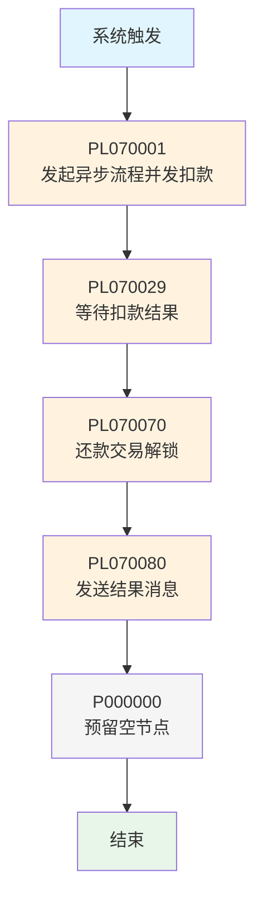

# 轻资产还款处理流程-异步主流程-Vl3.1.0

## 基本信息

| 属性         | 值                                                        |
| ---------- | -------------------------------------------------------- |
| **业务流名称**  | 轻资产还款处理流程-异步主流程-Vl3.1.0_迁移                              |
| **业务流KEY** | PF-tradebizRepayEngine_RepayHandle_LightAsset_Vl3.1.0_migrate |
| **版本号**    | 3                                                        |
| **平台代码**   | tradebiz                                                 |
| **场景代码**   | BIZ_SCENE_TECH_HKYQ                                     |
| **计划代码**   | tradebizRepayEngine_RepayHandle_LightAsset_Vl3.1.0_migrate |
| **状态**     | ONLINE                                                   |
| **运行模式**   | STATEFUL (有状态)                                           |
| **触发类型**   | SYSTEM_TRIGGER (系统触发)                                    |
| **负责人**    | 余以召                                                      |
| **创建人**    | 吴清武                                                      |
| **更新人**    | 牛慧慧                                                      |
| **描述**     | 轻资产还款处理流程-异步主流程-Vl3.1.0                                 |
| **生效时间**   | 1999-01-01 至 2037-01-01                                  |

## 业务流程概述

轻资产还款的异步主流程，负责协调整个轻资产还款的扣款和入账过程。主流程采用**分发-等待-汇总**模式：先并发启动多个入账子流程，然后等待所有子流程扣款完成，最后汇总结果并发送通知。

### 核心功能
1. **并发扣款分发**：按还款单分组，启动并行入账子流程
2. **等待扣款结果**：轮询等待所有扣款单处理完成
3. **交易解锁**：还款完成后更新扣款单结束时间
4. **结果通知**：汇总还款结果并发送消息

### 触发上下文

可被以下系统触发：
accountsettlement, applycenter, assemblingengine, couponfront, creditpay, debitaccountengine, hbapplycollector, hbloandeal, lendengine, payment, paymentengine, reconciliation, repayengine, repayenginea, repayfront, tradeorder

## 流程节点详情

### 1. 开始节点

#### nodeKey94124358trigger_method - 系统触发
- **节点类型**: TRIGGER_METHOD
- **节点名称**: 系统触发
- **触发类型**: SYSTEM_TRIGGER

### 2. 并发扣款阶段

#### nodeKey94124358 - 发起异步流程并发扣款
- **节点类型**: PROCESS
- **处理器**: PL070001
- **功能**: 按还款单号分组，为每组启动独立的入账子流程，并行执行扣款
- **异常策略**: 重试10次，间隔120秒，最终SUCCESS
- **关联**: [[PL070001]]

### 3. 等待结果阶段

#### nodeKey42512891 - 等待扣款结果
- **节点类型**: PROCESS
- **处理器**: PL070029
- **功能**: 轮询等待所有扣款单处理完成，汇总计算还款成功/失败金额，更新还款申请状态
- **异常策略**: 重试999次，间隔60秒，最终PAUSED
- **关联**: [[PL070029]]

### 4. 解锁阶段

#### nodeKey51286057 - 还款交易解锁
- **节点类型**: PROCESS
- **处理器**: PL070070
- **功能**: 还款完成后，更新所有扣款单的结束时间(recordEndedAt)
- **异常策略**: 重试60次，间隔60秒，最终IGNORE
- **关联**: [[PL070070]]

### 5. 通知阶段

#### nodeKey59132625 - 发送结果消息
- **节点类型**: PROCESS
- **处理器**: PL070080
- **功能**: 汇总还款结果（按支付方式分组），构建RepayApplyResultMsg并发送
- **异常策略**: 重试100次，间隔60秒，最终PAUSED
- **关联**: [[PL070080]]

### 6. 预留节点

#### nodeKey3213044 - 预留空节点
- **节点类型**: PROCESS
- **处理器**: P000000
- **功能**: 可重用空节点，占位符，不含业务逻辑
- **异常策略**: 重试999次，间隔60秒，最终PAUSED
- **关联**: [[P000000]]

### 7. 结束节点

#### nodeKey85942312 - 结束
- **节点类型**: END
- **说明**: 流程结束

## 流程图



### 流程时序说明

```
系统触发
  ↓
PL070001: 发起异步流程并发扣款
  ├─ 获取扣款单(INIT/PRE_DEDUCT状态)
  ├─ 按repaymentBillNo分组
  ├─ 为每组创建子流程上下文
  ├─ 提交到repayBatchIncomeProcessExecutor线程池
  └─ 校验所有任务是否成功提交
  ↓
PL070029: 等待扣款结果 (轮询节点)
  ├─ 查询所有扣款单
  ├─ 检查handleFinished和deductStatus
  ├─ 未完成 → PAUSED(触发重试,间隔60s)
  └─ 已完成 → 汇总金额,更新还款状态
  ↓
PL070070: 还款交易解锁
  ├─ 校验还款是否完成
  └─ 更新扣款单recordEndedAt时间
  ↓
PL070080: 发送结果消息
  ├─ 按PayType分组汇总扣款结果
  ├─ 构建RepayApplyResultMsg
  └─ 发送消息到下游系统
  ↓
P000000: 预留空节点 (直接通过)
  ↓
结束
```

## 异常处理策略

### 全局异常策略
- **重试类型**: normal
- **重试次数**: 999次
- **重试间隔**: 60秒
- **失败后状态**: PAUSED (暂停)

### 节点级异常策略

| 节点 | 处理器 | 重试次数 | 间隔(秒) | 最终状态 | 说明 |
|------|--------|---------|---------|---------|------|
| 发起并发扣款 | PL070001 | 10 | 120 | SUCCESS | 启动失败可重试，最终放行 |
| 等待扣款结果 | PL070029 | 999 | 60 | PAUSED | 长期轮询等待，约16.5小时 |
| 还款交易解锁 | PL070070 | 60 | 60 | IGNORE | 解锁失败可忽略 |
| 发送结果消息 | PL070080 | 100 | 60 | PAUSED | 消息必须发送成功 |
| 预留空节点 | P000000 | 999 | 60 | PAUSED | 空节点，不会失败 |

## 子流程关联

| 子流程名称 | 子流程KEY | 触发方式 | 说明 |
|-----------|----------|---------|------|
| 轻资产入账子流程 | BIZFLOW_LIGHT_V3_1_0_INCOME (configFunctions动态获取) | PL070001异步提交 | 每个还款单号启动一个子流程并行处理 |

## 节点关联索引

### 处理器节点
- [[PL070001]] - 发起异步流程并发扣款
- [[PL070029]] - 等待扣款结果
- [[PL070070]] - 还款交易解锁
- [[PL070080]] - 发送结果消息
- [[P000000]] - 预留空节点

### 运行日志策略
- **采集比例**: 100%
- **节点保存**: DETAIL (详细)
- **执行保存**: DETAIL (详细)

## 与重资产流程的对比

| 维度 | 轻资产主流程(本流程) | 重资产子流程(V401) |
|------|-------------------|------------------|
| 节点数量 | 5个处理器节点 | 26个处理器节点 |
| 决策节点 | 无 | 4个条件判断 + 1个决策引擎 |
| 子流程 | 无嵌套子流程 | 1个子流程(失败话术策略) |
| 复杂度 | 简单线性流程 | 多分支复杂流程 |
| 扣款方式 | 并发子流程扣款 | 流程内直接扣款 |
| 入账方式 | 子流程内完成 | 流程内直接入账 |

## 相关文档
- [[轻资产还款业务流程]]
- [[还款业务流程]]
- [[轻资产还款批量入账流程Vl3.1.0]]

## 标签
#业务流 #还款 #轻资产 #Vl3.1.0 #异步主流程 #tradebiz