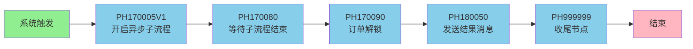

# 重资产分期制还款异步主流程V401

## 基本信息

| 属性 | 值 |
|------|-----|
| **业务流名称** | 重资产分期制还款异步主流程V401 |
| **业务流KEY** | PF-tradebiz-repayhandle_orderpay_vh401 |
| **版本号** | 1 |
| **平台代码** | tradebiz |
| **场景代码** | BIZ_SCENE_TECH_HKYQ |
| **计划代码** | 490bd54f-e725-4a74-a42f-4117a6a6a0e8 |
| **状态** | ONLINE |
| **运行模式** | STATEFUL (有状态) |
| **触发类型** | SYSTEM_TRIGGER (系统触发) |
| **负责人UID** | cfaf36bd-3c98-45ef-aed5-8c8b80990e51 |
| **创建人** | 吴清武 |
| **更新人** | 吴清武 |
| **创建时间** | 2024-05-23 |
| **描述** | 重资产分期制还款异步主流程V401初始化 |
| **生效时间** | 1999-01-01 至 2037-01-01 |

## 业务流程概述

重资产分期制还款的异步主流程，负责编排和协调整个还款流程，包括开启异步子流程、等待子流程结束、订单解锁、发送结果消息等核心环节。

### 核心功能
1. **流程编排**：开启并协调异步子流程执行
2. **状态管理**：等待子流程结束，跟踪流程状态
3. **订单管理**：子流程完成后解锁订单
4. **结果通知**：发送还款结果消息

## 流程变量

| 变量名 | 变量代码 | 类型 | 来源 | 说明 |
|--------|----------|------|------|------|
| 用户ID | uid | string | INPUT_CUSTOM | 还款用户标识 |

### 全局变量配置
- **实时获取**: NO
- **空值处理**: `D#999` (使用默认值 999)

## 流程节点详情

### 1. 开始节点

#### node_1694068919705_266722 - 系统触发
- **节点类型**: TRIGGER_METHOD
- **节点名称**: 系统触发
- **触发类型**: SYSTEM_TRIGGER
- **触发上下文**: creditpay, debitaccountengine, lendengine, hbapplycollector, applycenter, hbloandeal, assemblingengine, couponfront, tradeorder, repayfront, repayengine, reconciliation, repayenginea, payment, paymentengine, accountsettlement
- **位置**: (-410, -390)

### 2. 异步子流程启动阶段

#### node_1694068928226_325118 - PH170005-开启异步子流程
- **节点类型**: PROCESS
- **处理器**: PH170005V1
- **版本**: V1
- **功能**: 开启异步子流程，启动 [[重资产分期制还款异步子流程V401]]
- **异常策略**: 使用默认策略
- **位置**: (-139, -390)
- **关联**: [[PH170005V1]]

### 3. 流程同步阶段

#### node_1694068932507_149134 - PH170080-等待子流程结束
- **节点类型**: PROCESS
- **处理器**: PH170080
- **功能**: 等待异步子流程执行完成
- **异常策略**: 使用默认策略
- **位置**: (123, -390)
- **关联**: [[PH170080]]

### 4. 后置处理阶段

#### node_1694068939774_481957 - PH170090-订单解锁
- **节点类型**: PROCESS
- **处理器**: PH170090
- **功能**: 子流程结束后，解锁还款订单
- **异常策略**: 使用默认策略
- **位置**: (396, -390)
- **关联**: [[PH170090]]

#### node_1694068947256_250409 - PH180050-发送结果消息
- **节点类型**: PROCESS
- **处理器**: PH180050
- **功能**: 发送还款结果消息通知
- **异常策略**: 使用默认策略
- **位置**: (700, -390)
- **关联**: [[PH180050]]

### 5. 流程收尾阶段

#### node_1694068950940_761974 - PH999999-收尾节点
- **节点类型**: PROCESS
- **处理器**: PH999999
- **功能**: 流程收尾处理
- **异常策略**: 使用默认策略
- **位置**: (990, -390)
- **关联**: [[PH999999]]

### 6. 结束节点

#### node_1694068960674_605055 - 结束
- **节点类型**: END
- **节点名称**: 结束
- **位置**: (1277, -390)

## 流程图



## 异常处理策略

### 全局异常策略
- **重试类型**: normal
- **重试次数**: 5次
- **重试间隔**: 30秒
- **失败后状态**: PAUSED (暂停)

### 节点异常策略
所有 PROCESS 节点均使用默认异常处理策略。

## 数据存储策略

### 执行存储
- **策略**: SIMPLE (简单存储)

### 节点存储
- **策略**: SIMPLE (简单存储)

## 相关子流程

| 子流程名称 | 子流程KEY | 调用节点 | 说明 |
|-----------|----------|----------|------|
| [[重资产分期制还款异步子流程V401]] | PF-tradebiz-repayincome_orderpay_vh401 | PH170005V1 | 由主流程开启的异步子流程，负责扣款、入账等核心业务 |

## 流程执行流程

```
1. 系统触发（各业务系统调用）
   ↓
2. PH170005V1 - 开启异步子流程
   └─> 启动 repayincome_orderpay_vh401 子流程
   ↓
3. PH170080 - 等待子流程结束
   └─> 阻塞等待子流程完成
   ↓
4. PH170090 - 订单解锁
   └─> 释放订单锁定状态
   ↓
5. PH180050 - 发送结果消息
   └─> 通知还款结果
   ↓
6. PH999999 - 收尾节点
   └─> 流程清理工作
   ↓
7. 结束
```

## 节点关联索引

### 处理器节点
- [[PH170005V1]] - 开启异步子流程
- [[PH170080]] - 等待子流程结束
- [[PH170090]] - 订单解锁
- [[PH180050]] - 发送结果消息
- [[PH999999]] - 收尾节点

## 相关文档
- [[重资产分期制还款异步子流程V401]]
- [[重资产还款业务流程]]
- [[还款业务流程]]
- [[分期制还款]]

## 标签
#业务流 #还款 #重资产 #分期制 #V401 #异步主流程 #tradebiz