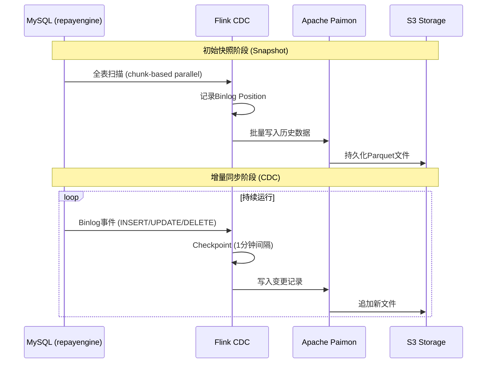
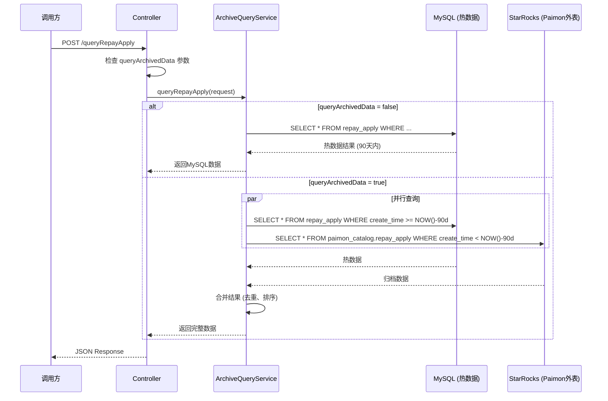

# RE大表治理产品需求文档 (PRD)

> 来源: Wiki 技术设计 416145103
> 版本: v1.0
> 日期: 2026-02-06

---

## 目录

- [1. 引言](#1-引言)
  - [1.1 基本信息](#11-基本信息)
  - [1.2 需求背景](#12-需求背景)
  - [1.3 业务价值](#13-业务价值)
  - [1.4 范围](#14-范围)
- [2. 需求概述](#2-需求概述)
  - [2.1 产品功能](#21-产品功能)
  - [2.2 业务流程图](#22-业务流程图)
- [3. 功能详情](#3-功能详情)
- [4. 数据需求](#4-数据需求)
- [5. 其他](#5-其他)

---

## 1. 引言

### 1.1 *基本信息

| 项目 | 内容 | 项目 | 内容 |
|------|------|------|------|
| **需求提交人** | _待定_ | **需求所属部门** | _还款引擎团队_ |
| **期望上线时间** | ☐ 正常排期 | **说明** | _技术优化需求_ |
| **BR链接** | | | |
| **REQ链接** | | | |

### 1.2 *需求背景

RepayEngine系统当前存在严重的**大表治理**问题：

#### 问题陈述

1. **存储成本高昂**: 23张大表共占用 **7.58 TB** 存储空间
2. **OnlineDDL困难**: 大表导致DDL操作极其困难，影响线上业务
3. **查询性能下降**: 大表查询响应慢，影响用户体验
4. **扩展性受限**: 存储和查询性能成为系统瓶颈

#### 大表现状

**repayengine数据库** (5.967 TB):

| 表名 | 大小 | 当前保留策略 | 问题 |
|------|------|--------------|------|
| deduct_bill | 2.661 TB | 终态数据保留2年 | 最大表，DDL耗时数小时 |
| repay_apply | 718 GB | 终态数据保留2年 | 查询频繁，响应慢 |
| repayment_bill | 445 GB | 保留2年 | 联表查询性能差 |
| repay_apply_stage_plan_item | 410 GB | 保留2年 | - |
| repayment_stage_plan_item | 369 GB | 保留2年 | - |
| repay_trial_bill | 295 GB | 保留15天 | - |
| repay_apply_pay_item | 273 GB | 保留2年 | - |
| clearing_bill | 211 GB | TBD | - |
| repayment_income_bill | 240 GB | TBD | - |
| refund_bill | 40 GB | TBD | - |

**repayenginea数据库** (1.613 TB):

| 表名 | 大小 | 当前保留策略 | 问题 |
|------|------|--------------|------|
| deduct_bill | 644.6 GB | 失败保留60天 | - |
| repay_trial_bill | 417.8 GB | TBD | - |
| repay_apply | 240.7 GB | 失败保留60天 | - |
| repayment_bill | 105.4 GB | 保留60天 | - |
| repay_apply_stage_plan_item | 70.1 GB | 保留60天 | - |
| repayment_stage_plan_item | 66.4 GB | 保留60天 | - |
| repay_apply_pay_item | 57.9 GB | TBD | - |
| repayment_income_bill | 10.2 GB | TBD | - |

**总计**: 7.58 TB

#### 接口调用影响

**总计 458万次/天**:

1. **RepayApplyController.repayApplyResult** - 244万次/天，QPS-450 🔴
   - 涉及表: `deduct_bill`，`repayment_stage_plan_item`，`repayment_bill`
   - 调用方: accountingoperation(最高流量)

2. **DataManageController** - 188万次/天
   - queryDeductBill: 50万次/天，QPS-100
   - queryRepayApply: 130万次/天，QPS-250
   - queryRebackInfo: 7.5万次/天
   - queryRefundBill: 5.3千次/天

**主要调用方**:
- accountingoperation (244万次) - 🔴 CRITICAL
- tradeorder (126万次+) - 🔴 CRITICAL
- telmarketcore (33万次+)
- collectionchannel (21万次+)
- channelcore (24万次+)

### 1.3 *业务价值

| 序号 | 价值类型 | 价值描述 | 价值指标 | 测算方式 | 备注 |
|------|----------|----------|----------|----------|------|
| 1 | 成本 | 降低存储成本，预计节省存储空间 | 预计节省 5TB+ | 23张大表共7.58TB，归档后热数据保留90天 | |
| 2 | 效率 | 提升DDL操作效率 | DDL耗时从数小时降低到分钟级 | 热数据表大幅缩小 | |
| 3 | 性能 | 提升查询性能 | 查询延迟降低50%+ | 热数据表数据量减少 | |
| 4 | 可维护性 | 解决大表维护困难问题 | 支持正常OnlineDDL | 归档历史数据 | |

### 1.4 *范围

#### 功能范围

**核心功能**：
- 数据归档方案设计（MySQL -> Paimon）
- 查询接口改造支持归档数据查询
- 数据清理调度任务

**平台/渠道**：O端（运营后台）、API（服务间调用）

#### 技术范围

| 组件 | 选型 | 说明 |
|------|------|------|
| 数据湖格式 | Apache Paimon | 流式优先，支持CDC，自动Schema演进 |
| 存储层 | S3/MinIO | 低成本，高可靠性，对象存储 |
| 文件格式 | Parquet + Zstd | 70-85%压缩率，列式存储优化查询 |
| CDC管道 | Apache Flink 3.x | 生产成熟，Exactly-Once保证 |
| 查询引擎 | StarRocks 3.1+ | MySQL协议兼容，支持Paimon外表 |

---

## 2. 需求概述

### 2.1 *产品功能

采用**冷热数据分离**的架构思路：

1. **热数据** (MySQL): 保留90天，支持OLTP业务
2. **冷数据** (Paimon): 归档所有历史数据，支持OLAP查询
3. **统一查询**: 通过StarRocks外表实现对MySQL和Paimon的联邦查询

| 序号 | 功能模块 | 概述 | 优先级 |
|------|----------|------|--------|
| 1 | Flink CDC数据同步 | 实时同步MySQL数据到Paimon数据湖 | P0 |
| 2 | 查询接口改造 | DataManageController接口新增queryArchivedData参数 | P0 |
| 3 | queryDeductBill接口改造 | 新增uid字段支持归档查询 | P0 |
| 4 | ArchiveQueryService | 双数据源查询路由逻辑 | P0 |
| 5 | 多数据源配置 | MySQL + StarRocks双数据源配置 | P0 |
| 6 | 数据清理调度任务 | 定期清理MySQL中90天前的热数据 | P1 |

### 2.2 业务流程图

#### 数据归档流程



#### 查询流程



---

## 3. 功能详情

### 3.1 接口改造

#### 3.1.1 *用户故事

**作为** 运营后台用户
**我希望可以** 查询历史归档的还款数据
**以便** 进行完整的数据分析和问题排查

#### 3.1.2 功能描述

**核心变更**:
1. ✅ **uid必传**: queryArchivedData=true时，uid必须传值(利用分区裁剪)
2. ✅ **queryArchivedData参数**: 新增参数控制是否查询归档数据，默认false
3. ✅ **兼容性**: 默认不查询归档，不影响现有调用方

**需要改造的接口**:

| 接口 | Controller | Request | uid必传状态 | 改造优先级 |
|------|-----------|---------|-----------|-----------|
| 1. 查询还款申请记录 | DataManageController.queryRepayApply | QueryRepayApplyReq | ✅ 已有 | P0 |
| 2. 查询扣款处理记录 | DataManageController.queryDeductBill | QueryDeductBillReq | ❌ **无uid** | **P0** ⚠️ |
| 3. 查询提前结清返现记录 | DataManageController.queryRefundBill | QueryRefundBillReq | ✅ 已有 | P1 |
| 4. 查询返现信息 | DataManageController.queryRebackInfo | QueryRebackInfoReq | ✅ 已有 | P1 |
| 5. 查询还款申请结果 | RepayApplyController.repayApplyResult | RepayApplyQueryRequest | ❌ 无uid | P2 |

**强制校验规则**:
```java
// queryArchivedData=true时，uid必须传值
if (Boolean.TRUE.equals(req.getQueryArchivedData()) && StringUtils.isBlank(req.getUid())) {
    throw new IllegalArgumentException("查询归档数据时，uid不能为空");
}
```

---

### 3.2 queryDeductBill接口改造 ⚠️ **重点改造**

#### 3.2.1 *用户故事

**作为** 调用方系统
**我希望可以** 通过uid查询完整的扣款记录（包括归档数据）
**以便** 获取用户完整的历史扣款信息

#### 3.2.2 功能描述

**当前状态**: ❌ QueryDeductBillReq **无uid字段**，需新增

**请求参数** (QueryDeductBillReq):

| 字段名 | 类型 | 必填 | 说明 | 默认值 |
|--------|------|------|------|--------|
| **uid** | String | **queryArchivedData=true时必填** | **✅ 新增: 用户ID** | - |
| repayApplyNo | String | 否 | 流水号 | - |
| repayApplyNoList | List\<String\> | 否 | 流水号列表 | - |
| queryArchivedData | Boolean | 否 | **是否查询归档数据(需uid)** | false |

**接口评估**:

| 指标 | 说明 |
|------|------|
| **预估最高QPS** | 500 |
| **请求体大小** | ~500B |
| **响应体大小** | ~50KB (分页) |
| **熔断降级** | 如StarRocks不可用，返回MySQL热数据 + 告警 |
| **变更影响** | 兼容性变更，queryArchivedData默认false |

---

### 3.3 ArchiveQueryService 服务层

#### 3.3.1 *用户故事

**作为** 系统开发者
**我希望可以** 通过统一的服务层查询热数据和归档数据
**以便** 简化查询逻辑并保证数据一致性

#### 3.3.2 功能描述

**核心职责**:
1. ✅ uid必传校验(queryArchivedData=true时)
2. ✅ 查询路由逻辑(MySQL vs MySQL+StarRocks)
3. ✅ 分区裁剪优化(按uid前8位)

**查询路由策略**:

| 查询条件 | 路由策略 | 说明 |
|---------|---------|------|
| uid存在 + queryArchivedData=true | MySQL + StarRocks | 利用分区+分桶裁剪，性能优 |
| uid存在 + queryArchivedData=false | MySQL only | 仅查询热数据 |
| uid不存在 + queryArchivedData=true | ❌ 抛异常 | **强制要求uid** |
| 按时间范围查询(无uid) | MySQL only | ⚠️ 不查归档数据 |

**查询性能对比**:

| 查询场景 | 分区扫描数 | Bucket扫描数 | 查询延迟 | 推荐度 |
|---------|-----------|-------------|---------|--------|
| **按uid查询** | 1个分区 | 1个bucket | < 100ms | ✅ 强烈推荐 |
| 按时间范围查询(有uid) | 1个分区 | 1个bucket | < 200ms | ✅ 推荐 |
| 按时间范围查询(无uid) | 全部分区 | 全部bucket | > 5秒 | ❌ 不推荐 |

---

### 3.4 多数据源配置

#### 3.4.1 功能描述

**数据源配置**:

| 数据源 | 用途 | 连接池大小 | 超时时间 |
|--------|------|-----------|---------|
| MySQL | 热数据查询(90天内) | 20 | 30s |
| StarRocks | 归档数据查询 | 10 | 30s |

---

## 4. 数据需求

### 4.1 数据需求

暂无

### 4.2 埋点需求

暂无

---

## 5. 其他

### 5.1 验收案例

测试一站式平台已于12.1上线，请按如下步骤操作：

1. 【Jira】提交REQ
2. 【[测试一站式平台](http://metersphere.dmz.prod.caijj.net/#/track/dashboard)】创建产品用例

### 5.2 非功能/数据需求

#### 5.2.1 灰度需求

| 序号 | 灰度规则 | 预计开启日期 | 通过标准 |
|------|----------|--------------|----------|
| 1 | queryArchivedData参数默认false，不影响现有调用 | 待定 | 现有接口功能正常 |
| 2 | 开启部分调用方使用归档查询功能 | 待定 | 归档查询功能正常 |
| 3 | 全量开放 | 待定 | 未发现重大bug |

#### 5.2.2 可用性需求

| 功能名 | 功能分级 |
|--------|---------|
| 热数据查询(MySQL) | A级（默认可用性：99.9%） |
| 归档数据查询(StarRocks) | C级（默认可用性：99%） |

**熔断降级策略**: 如StarRocks不可用，自动降级到MySQL查询

#### 5.2.3 性能需求

| 功能 | 响应时间 | 吞吐量 | 说明 |
|------|----------|--------|------|
| 热数据查询(MySQL) | < 100ms | 500 QPS | 现有性能标准 |
| 归档数据查询(StarRocks+Paimon) | < 200ms | 100 QPS | 按uid分区裁剪 |
| 双数据源合并查询 | < 300ms | 50 QPS | 并行查询+合并 |

#### 5.2.4 安全需求

- 数据访问权限：仅授权用户可查询归档数据
- 数据脱敏：敏感字段在归档查询时需脱敏处理

#### 5.2.5 兼容性需求

- 接口向后兼容：新增参数默认值保证现有调用方不受影响
- 数据格式兼容：归档数据格式与热数据格式保持一致

#### 5.2.6 运营需求

- 监控告警：StarRocks查询失败、延迟过高需告警
- 数据一致性校验：定期校验MySQL与Paimon数据一致性

---

## 附录

### 术语表

| 术语 | 解释 |
|------|------|
| **Paimon** | Apache Paimon，一种流式数据湖存储格式，采用LSM-tree架构 |
| **StarRocks** | StarRocks，一款MPP架构的分析型数据库，支持外表查询 |
| **Flink CDC** | Apache Flink的Change Data Capture组件，用于实时捕获数据库变更 |
| **CDC** | Change Data Capture，变更数据捕获技术 |
| **LSM-tree** | Log-Structured Merge-tree，一种优化的写性能的索引结构 |
| **Exactly-Once** | 精确一次语义，保证数据不丢失不重复 |
| **Schema Evolution** | Schema演进，自动适应表结构变化 |
| **External Catalog** | 外部目录，StarRocks访问Paimon数据的接口 |

### 相关文档

- Wiki 技术设计: 页面ID 416145103
- 数字产品门户: [需求管理](http://moka.dmz.prod.caijj.net/productportalui/#/portal/products)

---

*文档来源: Wiki 页面 416145103*
*生成时间: 2026-03-26*
