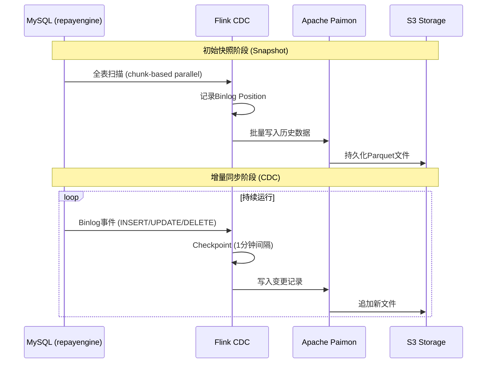
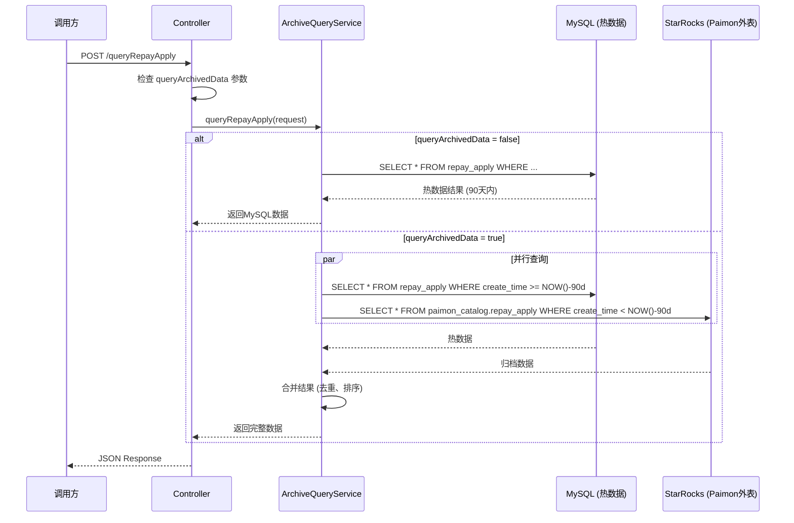
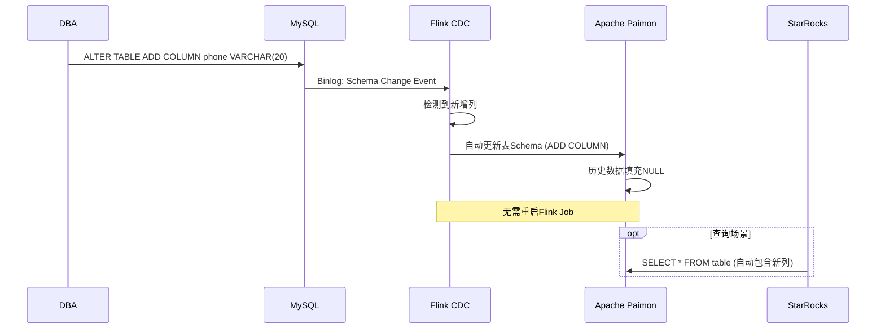
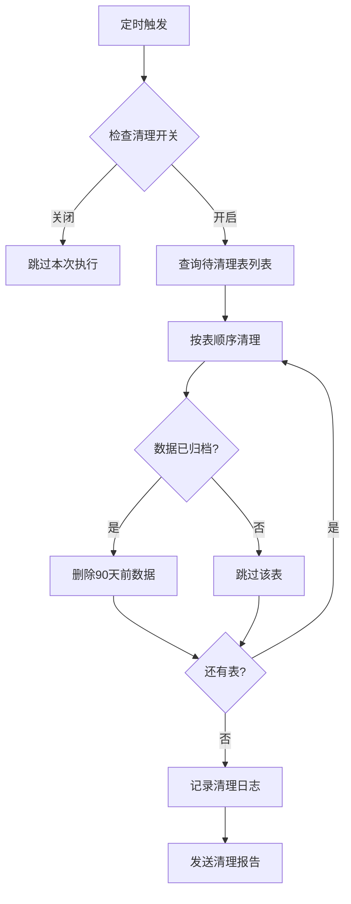
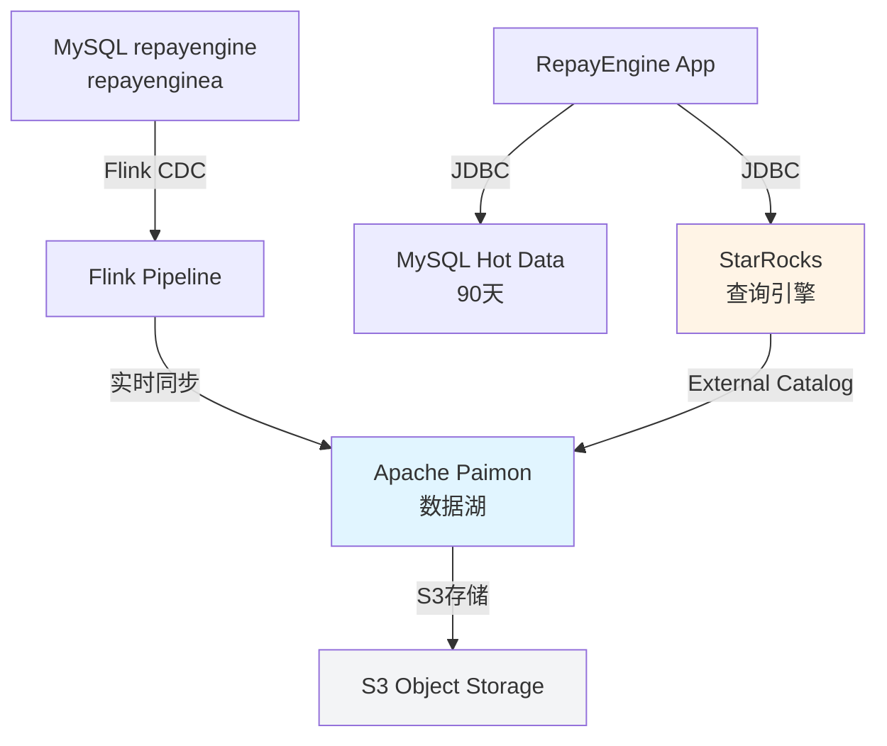
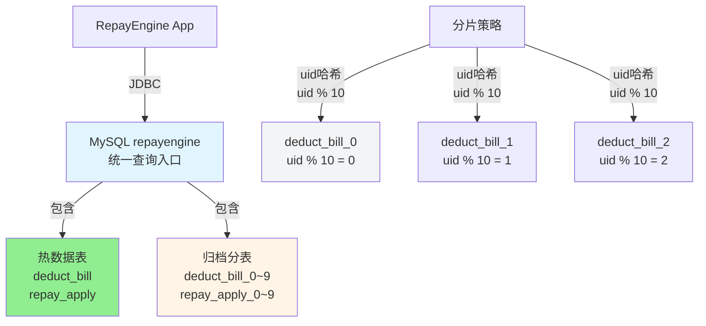

# RE大表治理技术设计文档

## 文档信息

| 项目名称 | RE大表治理 - RepayEngine数据归档方案 |
|---------|-----------------------------------|
| 文档版本 | v1.0 |
| 创建日期 | 2026-02-06 |
| 作者 | Claude Code |
| 审核人 | 待定 |
| 状态 | 设计阶段 |

---

## 修订历史

| 版本 | 日期 | 修订人 | 修订说明 |
|------|------|--------|----------|
| v1.0 | 2026-02-06 | Claude Code | 初始版本 |

---

## 背景

### 问题陈述

RepayEngine系统当前存在严重的**大表治理**问题:

1. **存储成本高昂**: 23张大表共占用 **7.58 TB** 存储空间
2. **OnlineDDL困难**: 大表导致DDL操作极其困难,影响线上业务
3. **查询性能下降**: 大表查询响应慢,影响用户体验
4. **扩展性受限**: 存储和查询性能成为系统瓶颈

### 大表现状

**repayengine数据库** (5.967 TB):

| 表名 | 大小 | 当前保留策略 | 问题 |
|------|------|--------------|------|
| deduct_bill | 2.661 TB | 终态数据保留2年 | 最大表,DDL耗时数小时 |
| repay_apply | 718 GB | 终态数据保留2年 | 查询频繁,响应慢 |
| repayment_bill | 445 GB | 保留2年 | 联表查询性能差 |
| repay_apply_stage_plan_item | 410 GB | 保留2年 | - |
| repayment_stage_plan_item | 369 GB | 保留2年 | - |
| repay_trial_bill | 295 GB | 保留15天 | - |
| repay_apply_pay_item | 273 GB | 保留2年 | - |
| clearing_bill | 211 GB | TBD | - |
| repayment_income_bill | 240 GB | TBD | - |
| refund_bill | 40 GB | TBD | - |

**repayenginea数据库** (1.613 TB):

| 表名 | 大小 | 当前保留策略 | 问题 |
|------|------|--------------|------|
| deduct_bill | 644.6 GB | 失败保留60天 | - |
| repay_trial_bill | 417.8 GB | TBD | - |
| repay_apply | 240.7 GB | 失败保留60天 | - |
| repayment_bill | 105.4 GB | 保留60天 | - |
| repay_apply_stage_plan_item | 70.1 GB | 保留60天 | - |
| repayment_stage_plan_item | 66.4 GB | 保留60天 | - |
| repay_apply_pay_item | 57.9 GB | TBD | - |
| repayment_income_bill | 10.2 GB | TBD | - |

**总计**: 7.58 TB

### 业务影响

**接口调用影响** (总计 458万次/天):

1. **RepayApplyController.repayApplyResult** - 244万次/天，QPS-450 🔴
   - 涉及表: `deduct_bill`，`repayment_stage_plan_item` ，`repayment_bill`
   - 调用方: accountingoperation(最高流量)

2. **DataManageController** - 188万次/天
   - queryDeductBill: 50万次/天，QPS-100，涉及表：`repay_apply`，`repay_apply_stage_plan_item`，`repay_apply_pay_item`，`refund_bill` (查询返现信息)，`rebate_bill` (查询优惠返现信息)
   - queryRepayApply: 130万次/天，QPS-250，涉及表：`repay_apply`，`repay_apply_stage_plan_item` (关联查询)
   - queryRebackInfo: 7.5万次/天，涉及表：`refund_bill`，`rebate_bill`
   - queryRefundBill: 5.3千次/天，涉及表：`refund_bill`

**主要调用方**:
- accountingoperation (244万次) - 🔴 CRITICAL
- tradeorder (126万次+) - 🔴 CRITICAL
- telmarketcore (33万次+)
- collectionchannel (21万次+)
- channelcore (24万次+)

---

## 需求

### 需求文档

[re大表治理需求](RE大表治理-方案.md) (本地文件)

### 概要设计

本文档即为概要设计+详细设计

---

## 术语表

| 术语 | 解释 |
|------|------|
| **Paimon** | Apache Paimon,一种流式数据湖存储格式,采用LSM-tree架构 |
| **StarRocks** | StarRocks,一款MPP架构的分析型数据库,支持外表查询 |
| **Flink CDC** | Apache Flink的Change Data Capture组件,用于实时捕获数据库变更 |
| **CDC** | Change Data Capture,变更数据捕获技术 |
| **LSM-tree** | Log-Structured Merge-tree,一种优化的写性能的索引结构 |
| **Exactly-Once** | 精确一次语义,保证数据不丢失不重复 |
| **Time Travel** | 时间旅行,查询历史快照数据的能力 |
| **Schema Evolution** | Schema演进,自动适应表结构变化 |
| **Compaction** | 压缩,LSM-tree将多个小文件合并为大文件的过程 |
| **External Catalog** | 外部目录,StarRocks访问Paimon数据的接口 |
| **Binlog** | Binary Log,MySQL的二进制日志,记录所有数据变更 |
| **Checkpoint** | 检查点,Flink用于容错恢复的机制 |
| **Snapshot** | 快照,Paimon中某个时间点的数据视图 |

---

## 设计前提

### 设计思路

本设计采用**冷热数据分离**的架构思路:

1. **热数据** (MySQL): 保留90天,支持OLTP业务
2. **冷数据** (Paimon): 归档所有历史数据,支持OLAP查询
3. **统一查询**: 通过StarRocks外表实现对MySQL和Paimon的联邦查询

### 现实约束

1. **业务连续性**: 不能中断现有业务,需灰度上线
2. **性能要求**: 查询延迟不能显著增加
3. **成本控制**: 新架构的存储和计算成本需可控
4. **技术栈一致性**: 复用现有Spring Boot技术栈
5. **数据一致性**: 确保MySQL到Paimon的数据同步准确性

### 技术选型依据

| 组件 | 选型 | 理由 |
|------|------|------|
| 数据湖格式 | Apache Paimon | 流式优先,支持CDC,自动Schema演进 |
| 存储层 | S3/MinIO | 低成本,高可靠性,对象存储 |
| 文件格式 | Parquet + Zstd | 70-85%压缩率,列式存储优化查询 |
| CDC管道 | Apache Flink 3.x | 生产成熟,Exactly-Once保证 |
| 查询引擎 | StarRocks 3.1+ | MySQL协议兼容,支持Paimon外表 |
| 文件系统 | Hive-style分区 | 与现有数仓生态兼容 |

---
目前公司经营获取引擎执行日志使用这套方案存储，日均写入约30亿行数据，整体查询效率较高。
单点查询耗时：100ms ~ 1s

### 查询效率对比

|对比维度	|Paimon + StarRocks|	MySQL|
|------|------|------|
|大数据复杂分析查询	|极快（10~100 倍于 MySQL）	|慢（千万级以上易超时）|
|小数据简单点查	|快（1~10ms）	|极快（1~5ms）|
|实时数据查询	|秒级 / 亚秒级（1~5s 可见）	|立即可见（事务提交后）|
|高并发查询	|强（水平扩展，支持数万并发）	|弱（单节点数百并发，需分库分表）|
|数据存储格式	|列存（Parquet/ORC）+ 索引	|行存（InnoDB）+ 索引|
|架构定位	|湖仓一体（OLAP 为主，兼顾 OLTP）	|关系型数据库（OLTP 为主，弱 OLAP）|
|扩展性	|线性扩展（存储 + 计算分离，按需扩容）	|垂直扩展为主，水平扩展需分库分表|
|适用数据量	|亿级～千亿级	|百万级～千万级（分析场景）|

---
Paimon的表，都用uid分桶，查询条件都带上uid，通过uid找到对应分桶之后,查询效率较高
查询接口和上游可能需要改造，查询归档数据，必须传参uid，默认不查询归档，上游待评估

# 「RepayEngine数据归档」的功能设计

## 功能设计

### 类图

#### 核心类图

```
┌─────────────────────────────────────────────────────────────┐
│                     RepayEngine Application                │
├─────────────────────────────────────────────────────────────┤
│                                                               │
│  ┌────────────────────┐  ┌──────────────────────┐          │
│  │ RepayApplyController│  │ DataManageController│          │
│  ├────────────────────┤  ├──────────────────────┤          │
│  │ repayApplyResult() │  │ queryDeductBill()    │          │
│  │ - queryArchivedData│  │ queryRepayApply()    │          │
│  └────────┬───────────┘  │ queryRebackInfo()    │          │
│           │              │ queryRefundBill()    │          │
│           │              │ - queryArchivedData  │          │
│           │              └──────────┬───────────┘          │
│           │                         │                      │
│           ▼                         ▼                      │
│  ┌────────────────────────────────────────────────┐        │
│  │      ArchiveQueryService (Service Layer)      │        │
│  ├────────────────────────────────────────────────┤        │
│  │ - mysqlJdbcTemplate     │                      │        │
│  │ - starRocksJdbcTemplate │                      │        │
│  │ - queryFromBothSources()│                      │        │
│  │ - mergeResults()        │                      │        │
│  └────────┬───────────────────────────────────────┘        │
│           │                                               │
│      ┌────┴────┐                                         │
│      │         │                                         │
│      ▼         ▼                                         │
│  ┌─────────┐  ┌─────────────┐                          │
│  │  MySQL  │  │  StarRocks  │                          │
│  │(Hot 90d)│  │  (All Data) │                          │
│  └─────────┘  └─────────────┘                          │
│                                                          │
└──────────────────────────────────────────────────────────┘

┌──────────────────────────────────────────────────────────┐
│              Flink CDC Pipeline (Separate Process)       │
├──────────────────────────────────────────────────────────┤
│                                                            │
│  ┌──────────┐    ┌─────────┐    ┌────────┐             │
│  │   MySQL  │───▶│  Flink  │───▶│ Paimon │             │
│  │  (Source)│    │   CDC   │    │(Sink) │             │
│  └──────────┘    └─────────┘    └────────┘             │
│       ▲                               │                  │
│       │ Binlog                       ▼                  │
│       │                         ┌─────────┐             │
│       │                         │   S3    │             │
│       │                         │Storage  │             │
│       │                         └─────────┘             │
│                                                            │
└──────────────────────────────────────────────────────────┘
```

#### 核心类说明

**RepayApplyController / DataManageController**
- **作用**: 对外暴露查询接口,接收`queryArchivedData`参数
- **设计模式**: 门面模式(Facade Pattern)
- **说明**: 保持原有接口签名,新增可选参数`queryArchivedData`

**ArchiveQueryService**
- **作用**: 实现双数据源查询路由逻辑
- **设计模式**: 策略模式(Strategy Pattern)
- **说明**:
  - 根据`queryArchivedData`参数决定查询路由
  - `false`: 只查询MySQL
  - `true`: 查询MySQL + StarRocks,并合并结果

**Flink CDC Pipeline**
- **作用**: 实时同步MySQL数据到Paimon
- **设计模式**: 管道模式(Pipeline Pattern)
- **说明**:
  - 独立进程,通过MySQL Binlog捕获变更
  - Exactly-Once语义保证数据一致性
  - 支持Schema自动演进

---

### 时序图

#### 1. 数据归档流程时序图

[](https://mermaid.live/edit#pako:eNp9k19r01AYxr9KOFcddF3TZE3NxWC2FYQ5qqk3kptjc5aEpufE_BFr6YUX7TZX7RBXp-KfCWODsVJkDuYY_TJN1n4LT5rEoh3LRXjPy-8553mfkzRAhSgIiMBGz1yEK6igQ9WCNRkz9DGh5egV3YTYYR7UpYdrDLSjImEhE9YRVnWMFubpe4aOqwEdFvlCfp4pQb1GcACtmrCioagxD0pcANG35BALqkiOmHXiIIY8R1boKSlxIuNtffGOdrzhyXXraLJ_7vd_MQkJQ9PWiBP5nMKLKytTa1TROh4fHPvbJ363yyQqmouri0-hjZTAAzQMZES6KT_TjfsD72rvro4NojIlYuuOHpuPyXAgkfG3LyabXa_90Wsdem_bXvenvzfw3_RDOqQoHvj3O69GFy2v0ytBi96I4_c2R5fnt07842uw-W7HPz2MJ6Z5R6YNQsxg0-vL0_Fwd3zQCds35BBOMvq9Q89jEvfXpeKj8tLjUmG1XFwqFNeK5eLCTPtfFnkNVaom0ellJVhvqz15923y4Wzy6f0NkjiUKI7uvv_5LMxyxv4TyXh45b3-7vcGcRYBgbACkkC1dAWIjuWiJKghqwaDJWgEiAwcDdWQDERaKmgDuoYjAxk3qYx-VU8IqcVKi7iqBsQNaNh05ZoKdOL_4G_XogciK09c7ABRWJ7uAcQGeAHEDMulcnw2wwlZjs_lOD4J6kDkM2yKZ4UMx3EZgc_yQjMJXk4PTac4gVI5nk2zmTvLvJDONv8A5EZUlg)



**流程说明**:

1. **初始快照阶段**:
   - Flink CDC启动后,对MySQL表进行全表扫描
   - 采用无锁算法,chunk-based并行读取
   - 记录扫描结束时的Binlog position
   - 将历史数据批量写入Paimon

2. **增量同步阶段**:
   - Flink实时读取MySQL Binlog
   - 捕获INSERT/UPDATE/DELETE事件
   - 每1分钟触发一次Checkpoint
   - 将变更写入Paimon,S3持久化

---

#### 2. 查询流程时序图

[](https://mermaid.live/edit#pako:eNqdVF1r01AY_iuHc9VKF9smLm1whdFVRLZ1awcDKZRDctYG87WTk2Ethenw42IfMrfdKJO6CfPCuQsR5hB_jCSr_8Jz0qzt2irD3CQneZ7nfd7nPSdNqNoahgp08aqHLRXP6KhGkFmxALscRKiu6g6yKMgbOmY35ILO2cbl3klwcD4GZFuU2IaBCQf2V6PIMiZruoo5bJqodX0NL3qYNKLXo_i5RnlxlqO7D7HLjc_B_lmwdRofo00RKdnqI5fj-4vYAtJN2_KPDzrtE0brErt9TeRyfbcKWCiWl8DtVe6ohB3UmHYcoxHhe7AhTnC0Hrz_CEJS1JI2gygC_s4zZnUMO2pWAUOFYoQPw6U9j8igY3SnwAoy3CgrfkV6TDkMSQHlwmwhvwRugXul4hwgvEAV8Qpg-X6hVACCIPTZIWdi0FYv48uLN8HhOxDLJv3jT_6L5_HRmkNhdH7u-W8PQ8muRJeBmd-xnVDiDTTChgn882-d9iZLtPPlQ__Lf7WpEoworlLdxCA3BeaLy7H4RDap_U22t2WGpZ1wA1VV5tmwa8K_K90dVwhb2o0SHwj4ysw1oP9jN2gfjWD7LfSAr1-xJK8G6G9f_H659Wv9abC963_fuekc_dPNYP_rtUHyPka2NCeHx0kBD8rFeVDCrmNbLoYJWCO6BhU-5gQ0MTERX8Iml6hAWscmrkCFPWp4BXkGrcCK1WI0dp4f2rZ5xSS2V6tDJdz3Ceg5Gks7-mP13hLmDZO87VkUKnI21IBKEz6GSjolChlpMi3Kk6KUyYhSAjagIqVTgpSS06IopmVpUpJbCfgkLJoURJmhMlIqmUpn70hyqvUHqLLdvw)



**流程说明**:

1. **不查询归档** (queryArchivedData=false):
   - 只查询MySQL中的90天热数据
   - 默认行为,性能无影响
   - 用于RepayApplyController等高流量接口

2. **查询归档** (queryArchivedData=true):
   - 并行查询MySQL(90天内)和StarRocks(90天前)
   - 服务层合并结果
   - 用于DataManageController等管理后台接口

---

#### 3. Schema演进时序图

[](https://mermaid.live/edit#pako:eNplks9v0zAUx_8Vy6eCStX8oCk-TErTTgilHbQdB5SL13pttMYOqTOxVZV2KauAwS5QISZgQ0gTk2iF4ML_46j7L3CSthuqL_bz-3z9vu8lA9hibQIR7JPnIaEtUnZxJ8CeQ4FcPg6423J9TDkol0yA-_G2nqseNJ7YcTY5rOc3ey7di_PpwSpb68xj7HqMxpDp41aXLC7WwQbHQZ219voxuwqcBSn93dvYSHwgYNrNSh00zZJdAWa5DKwte7taA36XUQKemnXroVnPqPk7qTQRSXFiEoGSS3usg0BDmvEwsLqYdgio7BPKUz7hbvjo21H057UYz6IPM3HxWYwn_2NpPwjMj3-IV5fRp9-Sm59fLp7P3Phb2En5W0Lx9qV49yt6P4tOforzKzEa1bbtxbRrjBPA9kmQlssuNdHk6_XZ0fXxiTidpsN_xHaWs2I-B9GX7_PphTj7G32cprfxWo31VvlGxa5YTXAXbNa3qoDjnR4BmbQZ8WYkTq_ivseThXtC2zALO4HbhogHIclCjwQejkM4iBEHctk4cSCSxzbZxWGPO9ChQymT3_kZY95SGbCw04VoF_f6Mgr9NubL_3R1G8iCJLBYSDlERS15A6IBfAGRqmi5ol5QNaOg6cWipmfhAUS6quR0xVA1TVMNvaAbwyw8TIrmc5ohqaKu5BX1wX3dUIb_AD4tHpE)



**流程说明**:

- Flink CDC 3.x自动检测MySQL的Schema变更
- 自动将新列添加到Paimon表
- 历史数据的新列自动填充NULL
- 无需重启Flink Job
- StarRocks查询时自动包含新列

---

## 接口详细设计

### 接口改造总览

**核心变更**:
1. ✅ **uid必传**: queryArchivedData=true时,uid必须传值(利用分区裁剪)
2. ✅ **queryArchivedData参数**: 新增参数控制是否查询归档数据,默认false
3. ✅ **兼容性**: 默认不查询归档,不影响现有调用方

**需要改造的接口**:

| 接口 | Controller | Request | uid必传状态 | queryArchivedData | 改造优先级 |
|------|-----------|---------|-----------|-------------------|-----------|
| 1. 查询还款申请记录 | DataManageController.queryRepayApply | QueryRepayApplyReq | ✅ 已有 | 新增 | P0 |
| 2. 查询扣款处理记录 | DataManageController.queryDeductBill | QueryDeductBillReq | ❌ **无uid** | 新增 | **P0** ⚠️ |
| 3. 查询提前结清返现记录 | DataManageController.queryRefundBill | QueryRefundBillReq | ✅ 已有 | 新增 | P1 |
| 4. 查询返现信息 | DataManageController.queryRebackInfo | QueryRebackInfoReq | ✅ 已有 | 新增 | P1 |
| 5. 查询还款申请结果 | RepayApplyController.repayApplyResult | RepayApplyQueryRequest | ❌ 无uid | 新增 | P2 |

**强制校验规则**:
```java
// queryArchivedData=true时,uid必须传值
if (Boolean.TRUE.equals(req.getQueryArchivedData()) && StringUtils.isBlank(req.getUid())) {
    throw new IllegalArgumentException("查询归档数据时,uid不能为空");
}
```

---

### RepayApplyController接口改造

#### repayApplyResult 接口

**接口定义**:

```java
/**
 * 查询还款申请结果
 *
 * @param request 还款查询请求
 * @return 还款申请结果
 */
@PostMapping("/repayApplyResult")
public Result<RepayApplyResultVO> repayApplyResult(@RequestBody RepayApplyQueryRequest request) {
    // 新增参数: queryArchivedData (默认=false,不查询归档数据)
    return repayApplyService.queryRepayApplyResult(request);
}
```

**请求参数** (RepayApplyQueryRequest):

| 字段名 | 类型 | 必填 | 说明 | 默认值 |
|--------|------|------|------|--------|
| repayApplyNo | String | 否 | 还款申请号 | - |
| uid | String | **queryArchivedData=true时必填** | 用户ID | - |
| queryArchivedData | Boolean | 否 | **是否查询归档数据(需uid)** | false |

**接口评估**:

| 指标 | 说明 |
|------|------|
| **预估最高QPS** | 2000 (峰值) |
| **请求体大小** | ~1KB |
| **响应体大小** | ~10KB |
| **熔断降级** | 如StarRocks不可用,自动降级到MySQL查询 |
| **变更影响** | 兼容性变更,新参数默认false,不影响现有调用方 |

---

### DataManageController接口改造

#### 1. queryDeductBill 接口 ⚠️ **重点改造**

**当前状态**:
- ❌ QueryDeductBillReq **无uid字段**,需新增

**接口定义**:

```java
/**
 * 查询扣款账单
 *
 * @param request 查询请求
 * @return 扣款账单列表
 */
@PostMapping("/queryDeductBill")
public Result<List<DeductBillVO>> queryDeductBill(@RequestBody QueryDeductBillReq request) {
    // ⚠️ 新增uid字段和queryArchivedData参数
    return dataManageService.queryDeductBill(request);
}
```

**Request对象改造**:

```java
@EqualsAndHashCode(callSuper = true)
@Getter
@Setter
@ApiModel(description = "扣款处理记录查询请求定义")
public class QueryDeductBillReq extends BasePagingReq {

    @ApiModelProperty("用户id(查询归档数据时必传)")
    private String uid;  // ✅ 新增uid字段

    @ApiModelProperty("流水号「repayengine生成」")
    private String repayApplyNo;

    @ApiModelProperty("流水号list，repayApplyNo参数为空时有效，有效时分页相关参数无效")
    private List<String> repayApplyNoList;

    /**
     * 是否查询归档数据
     * ⚠️ 当queryArchivedData=true时,uid必须传值
     */
    @ApiModelProperty(value = "是否查询归档数据(queryArchivedData=true时uid必传)", example = "false")
    private Boolean queryArchivedData = false;  // ✅ 默认改为false
}
```

**请求参数** (QueryDeductBillReq):

| 字段名 | 类型 | 必填 | 说明 | 默认值 |
|--------|------|------|------|--------|
| **uid** | String | **queryArchivedData=true时必填** | **✅ 新增: 用户ID** | - |
| repayApplyNo | String | 否 | 流水号 | - |
| repayApplyNoList | List\<String\> | 否 | 流水号列表 | - |
| queryArchivedData | Boolean | 否 | **是否查询归档数据(需uid)** | false |

**接口评估**:

| 指标 | 说明 |
|------|------|
| **预估最高QPS** | 500 |
| **请求体大小** | ~500B |
| **响应体大小** | ~50KB (分页) |
| **熔断降级** | 如StarRocks不可用,返回MySQL热数据 + 告警 |
| **变更影响** | 兼容性变更,queryArchivedData默认false |

---

#### 2. queryRepayApply 接口

**当前状态**: ✅ uid已是必传字段

**请求参数** (QueryRepayApplyReq):

| 字段名 | 类型 | 必填 | 说明 | 默认值 |
|--------|------|------|------|--------|
| repayApplyNo | String | 否 | 还款申请号 | - |
| uid | String | ✅ 已有必传 | 用户ID | - |
| queryArchivedData | Boolean | 否 | **是否查询归档数据** | false |

**接口评估**:

| 指标 | 说明 |
|------|------|
| **预估最高QPS** | 1000 |
| **熔断降级** | 同queryDeductBill |

---

#### 3. queryRebackInfo 接口

**当前状态**: ✅ uid已是必传字段

**请求参数** (QueryRebackInfoReq):

| 字段名 | 类型 | 必填 | 说明 | 默认值 |
|--------|------|------|------|--------|
| uid | String | ✅ 已有必传 | 用户ID | - |
| repayApplyNoList | List\<String\> | 是 | 还款申请编号列表 | - |
| stageOrderNo | String | 否 | 订单号 | - |
| refundStatus | RefundStatus | 否 | 返现状态 | - |
| queryArchivedData | Boolean | 否 | **是否查询归档数据** | false |

---

#### 4. queryRefundBill 接口

**当前状态**: ✅ uid已是必传字段

**请求参数** (QueryRefundBillReq):

| 字段名 | 类型 | 必填 | 说明 | 默认值 |
|--------|------|------|------|--------|
| uid | String | ✅ 已有必传(@NonNull) | 用户ID | - |
| stageOrderNo | String | 是 | 订单号 | - |
| repayApplyNo | String | 否 | 还款申请编号 | - |
| refundBillNo | String | 否 | 返现单编号 | - |
| refundType | RefundType | 否 | 返现类型 | - |
| refundStatus | RefundStatus | 否 | 返现状态 | - |
| queryArchivedData | Boolean | 否 | **是否查询归档数据** | false |
| refundBillNo | String | 否 | 退款账单号 | - |
| queryArchivedData | Boolean | 否 | **是否查询归档数据** | false |

---

### 服务层设计

#### ArchiveQueryService

**核心职责**:
1. ✅ uid必传校验(queryArchivedData=true时)
2. ✅ 查询路由逻辑(MySQL vs MySQL+StarRocks)
3. ✅ 分区裁剪优化(按uid前8位)

**类定义**:

```java
@Service
public class ArchiveQueryService {

    @Autowired
    @Qualifier("mysqlJdbcTemplate")
    private JdbcTemplate mysqlJdbcTemplate;

    @Autowired
    @Qualifier("starRocksJdbcTemplate")
    private JdbcTemplate starRocksJdbcTemplate;

    /**
     * 查询还款申请(支持归档数据)
     */
    public List<RepayApplyVO> queryRepayApply(RepayApplyQueryRequest request) {

        // ✅ 校验: queryArchivedData=true时,uid必传
        if (Boolean.TRUE.equals(request.getQueryArchivedData()) && StringUtils.isBlank(request.getUid())) {
            throw new IllegalArgumentException("查询归档数据时,uid不能为空");
        }

        if (Boolean.FALSE.equals(request.getQueryArchivedData())) {
            // 只查MySQL (热数据)
            return queryFromMySQL(request);
        }

        // 查询MySQL + StarRocks (热数据 + 归档数据)
        return queryFromBothSources(request);
    }

    /**
     * 从MySQL和StarRocks查询并合并
     */
    private List<RepayApplyVO> queryFromBothSources(RepayApplyQueryRequest request) {

        // 1. 查询MySQL热数据 (90天内)
        List<RepayApplyVO> hotData = queryHotDataFromMySQL(request);

        // 2. 查询StarRocks归档数据 (90天前, 按uid前8位分区裁剪)
        List<RepayApplyVO> archiveData = queryArchiveDataFromStarRocks(request);

        // 3. 合并去重
        Map<String, RepayApplyVO> merged = new LinkedHashMap<>();
        hotData.forEach(vo -> merged.put(vo.getRepayApplyNo(), vo));
        archiveData.forEach(vo -> merged.putIfAbsent(vo.getRepayApplyNo(), vo));

        // 4. 排序分页
        return new ArrayList<>(merged.values()).stream()
            .sorted(Comparator.comparing(RepayApplyVO::getCreateTime).reversed())
            .collect(Collectors.toList());
    }

    /**
     * 构建StarRocks查询SQL (利用uid前3位分区裁剪 + uid分桶裁剪)
     */
    private String buildStarRocksQuery(RepayApplyQueryRequest request) {
        // ✅ 关键: 利用uid前3位进行分区裁剪,uid进行分桶裁剪
        String uidPrefix = request.getUid().substring(0, 3);

        StringBuilder sql = new StringBuilder(
            "SELECT * FROM paimon_catalog.repayengine.repay_apply " +
            "WHERE SUBSTRING(uid, 1, 3) = '" + uidPrefix + "'"  // ✅ 分区裁剪
        );

        if (StringUtils.isNotBlank(request.getRepayApplyNo())) {
            sql.append(" AND repay_apply_no = ?");
        }
        if (StringUtils.isNotBlank(request.getUid())) {
            sql.append(" AND uid = ?");  // ✅ 分桶裁剪
        }

        return sql.toString();
    }

    /**
     * 构建MySQL查询SQL (90天内)
     */
    private String buildMySQLQuery(RepayApplyQueryRequest request) {
        StringBuilder sql = new StringBuilder(
            "SELECT * FROM repay_apply WHERE create_time >= DATE_SUB(NOW(), INTERVAL 90 DAY)"
        );

        if (StringUtils.isNotBlank(request.getRepayApplyNo())) {
            sql.append(" AND repay_apply_no = ?");
        }
        if (StringUtils.isNotBlank(request.getUid())) {
            sql.append(" AND uid = ?");
        }

        sql.append(" ORDER BY create_time DESC");
        return sql.toString();
    }
}
```

**查询性能优化**:

| 查询场景 | SQL示例 | 分区扫描数 | Bucket扫描数 | 查询延迟 | 推荐度 |
|---------|---------|-----------|-------------|---------|--------|
| **按uid查询** | `WHERE SUBSTRING(uid, 1, 3) = '202' AND uid = 'xxx'` | 1个分区 | 1个bucket | < 100ms | ✅ 强烈推荐 |
| 按时间范围查询(有uid) | `WHERE SUBSTRING(uid, 1, 3) = 'xxx' AND uid = 'yyy' AND create_time >= ...` | 1个分区 | 1个bucket | < 200ms | ✅ 推荐 |
| 按时间范围查询(无uid) | `WHERE create_time >= ...` | 全部分区 | 全部bucket | > 5秒 | ❌ 不推荐 |

**查询路由策略**:

| 查询条件 | 路由策略 | 说明 |
|---------|---------|------|
| uid存在 + queryArchivedData=true | MySQL + StarRocks | 利用分区+分桶裁剪,性能优 |
| uid存在 + queryArchivedData=false | MySQL only | 仅查询热数据 |
| uid不存在 + queryArchivedData=true | ❌ 抛异常 | **强制要求uid** |
| 按时间范围查询(无uid) | MySQL only | ⚠️ 不查归档数据 |

---

### 多数据源配置

#### DataSourceConfig

**配置类**:

```java
@Configuration
public class DataSourceConfig {

    /**
     * MySQL数据源 (主数据源)
     */
    @Bean
    @Primary
    @ConfigurationProperties(prefix = "spring.datasource.mysql")
    public DataSource mysqlDataSource() {
        return DataSourceBuilder.create().build();
    }

    /**
     * StarRocks数据源 (归档数据查询)
     */
    @Bean
    @ConfigurationProperties(prefix = "spring.datasource.starrocks")
    public DataSource starRocksDataSource() {
        return DataSourceBuilder.create().build();
    }

    /**
     * MySQL JdbcTemplate
     */
    @Bean
    @Primary
    public JdbcTemplate mysqlJdbcTemplate(@Qualifier("mysqlDataSource") DataSource dataSource) {
        return new JdbcTemplate(dataSource);
    }

    /**
     * StarRocks JdbcTemplate
     */
    @Bean
    public JdbcTemplate starRocksJdbcTemplate(@Qualifier("starRocksDataSource") DataSource dataSource) {
        JdbcTemplate jdbcTemplate = new JdbcTemplate(dataSource);
        // 设置查询超时
        jdbcTemplate.setQueryTimeout(30);
        return jdbcTemplate;
    }
}
```

**application.yml配置**:

```yaml
spring:
  datasource:
    # MySQL (热数据 - 90天)
    mysql:
      jdbc-url: jdbc:mysql://${MYSQL_HOST}:${MYSQL_PORT}/repayengine?useSSL=false&serverTimezone=UTC
      username: ${MYSQL_USER}
      password: ${MYSQL_PASSWORD}
      driver-class-name: com.mysql.cj.jdbc.Driver
      hikari:
        maximum-pool-size: 20
        minimum-idle: 10
        connection-timeout: 30000
        pool-name: MySQLHikariCP

    # StarRocks (归档数据 - 全部)
    starrocks:
      jdbc-url: jdbc:mysql://${STARROCKS_FE_HOST}:${STARROCKS_FE_PORT}/analytics?useSSL=false
      username: ${STARROCKS_USER}
      password: ${STARROCKS_PASSWORD}
      driver-class-name: com.mysql.cj.jdbc.Driver
      hikari:
        maximum-pool-size: 10
        minimum-idle: 5
        connection-timeout: 30000
        pool-name: StarRocksHikariCP
```

---

## MQ设计

**说明**: 本项目不涉及新增MQ,仅使用Flink CDC内部的状态管理

---

## 调度任务设计

### 数据清理调度任务

| 任务名称 | 应用名 | 并发数 | 执行周期 | 执行类 | 说明 |
|---------|--------|--------|----------|--------|------|
| MySQL热数据清理任务 | RepayEngine | 最大全局并发:1<br>单节点并发:1 | CRON=0 0 2 * * ? (每日凌晨2点) | `cn.caijiajia.repayengine.job.MySQLDataCleanupJob` | 清理MySQL中90天前的已归档数据 |

#### MySQLDataCleanupJob 流程图

[](https://mermaid.live/edit#pako:eNpdUt1O2zAUfhXrXJeqSbwm5AI0aPnb7a6W9CIioUUiSZUl0ra0UnfRjSIQBQkFJqQtg8ImsRYNCRAa69PYc99ibkLDmC8sn8_fzzmWQ1h1TQtUQKjqGfUaelnSHZSs5xrpf6LRNTs_I7t7FTQ1NYPmQnrSop979Lb9p_uB_GqR9lVzIpgbUxocGUU_GmheYzdXbPiRHl_Qi5h2zlm8XfmPyvXdQQOVNG7JBl_J73ZqzOJvZDPieyYoJfFljW53ODyK78jdbsrNKOWEshDSg0u60yc3P8n9Po1PZrP-FpJQesgTFzWy-WV0dDpdIKffSWcn1VSeMkn3rIGWHsZgg96__SwmYcshGx7S43FLjzFL6dWkXH5MLT_FEv8VjfUvyf1BOgyNemQYZSkridULjb__qPX-gbLVI3tbFchB1Vs3QfW9wMqBbXm2MS4hHIt18GuWbemg8qNprRnBhq-D7jS5rG44r1zXnig9N6jWQF0zNl7zKqibhm-V1g3-G-wM9SzHtLx5N3B8UBU58QA1hDegioKUV3BRlOSihBVFwjl4CyoWhTwWZFGSJFHGRSw3c_AuCS3kJZmzFCwUBHH6GZaF5l9MkAXd)



**流程说明**:

1. 每日凌晨2点执行
2. 检查数据是否已在Paimon中归档(通过比对时间戳)
3. 删除MySQL中90天前的数据
4. 记录清理日志和发送报告

---

## 配置项设计

### 配置项列表

| 配置编码 | 配置值 | 配置类型 | 说明 | 重要性 |
|---------|--------|----------|------|--------|
| `archive.query.enabled` | true | 业务配置 | 是否启用归档数据查询功能 | P0 |
| `archive.cleanup.mysql.enabled` | false | 业务配置 | 是否启用MySQL数据清理 | P0 |
| `archive.cleanup.retention.days` | 90 | 业务配置 | MySQL热数据保留天数 | P1 |
| `archive.starroocks.catalog.name` | paimon_catalog | 技术配置 | StarRocks中Paimon Catalog名称 | P1 |
| `archive.flink.checkpoint.interval` | 60000 | 技术配置 | Flink CDC检查点间隔(毫秒) | P1 |

**配置系统选型**: ConfPlus (动态配置中心)

---

# 数据结构设计

### 数据库表设计

#### Paimon表设计

**说明**: Paimon表结构与MySQL表保持一致,按uid前3位分区

**核心设计变更**:
- ✅ **分区策略**: 按uid前3位分区 (而非时间分区)
- ✅ **查询优化**: uid查询场景占90%+,分区裁剪效率高
- ✅ **接口要求**: queryArchivedData=true时,uid必传
- ✅ **分桶策略**: 按uid分桶,确保查询条件带上uid时效率高

**repay_engine.deduct_bill** (Paimon表):

```sql
CREATE TABLE paimon_catalog.repayengine.deduct_bill (
    id BIGINT,
    repay_apply_no VARCHAR(64),
    uid VARCHAR(64),
    deduct_amount DECIMAL(10,2),
    deduct_status VARCHAR(20),
    create_time TIMESTAMP(3),
    update_time TIMESTAMP(3),
    -- 扩展字段(JSON格式)
    ext_info STRING,

    PRIMARY KEY (id, uid) NOT ENFORCED
) PARTITIONED BY (SUBSTRING(uid, 1, 3))
WITH (
    'file.format' = 'parquet',
    'compression.codec' = 'zstd',
    'compression.level' = '1',
    'bucket' = '16',  -- 按uid分桶
    'bucket-key' = 'uid',  -- 分桶键为uid
    'changelog-producer' = 'input',
    'full-compaction.delta-commits' = '10'
);
```

**repay_engine.repay_apply** (Paimon表):

```sql
CREATE TABLE paimon_catalog.repayengine.repay_apply (
    id BIGINT,
    repay_apply_no VARCHAR(64),
    uid VARCHAR(64),
    repay_amount DECIMAL(10,2),
    repay_status VARCHAR(20),
    create_time TIMESTAMP(3),
    update_time TIMESTAMP(3),
    ext_info STRING,

    PRIMARY KEY (id, uid) NOT ENFORCED
) PARTITIONED BY (SUBSTRING(uid, 1, 3))
WITH (
    'file.format' = 'parquet',
    'compression.codec' = 'zstd',
    'compression.level' = '1',
    'bucket' = '16',  -- 按uid分桶
    'bucket-key' = 'uid',  -- 分桶键为uid
    'changelog-producer' = 'input',
    'full-compaction.delta-commits' = '10'
);
```

**分区策略说明**:

| 维度 | 说明 |
|------|------|
| **分区键** | `SUBSTRING(uid, 1, 3)` |
| **分桶键** | `uid` (全字段) |
| **uid格式** | `timestamp(13位) + random(4位)` = 17位 |
| **前3位含义** | uid前3位字符 |
| **实际分区数** | 约100-1000个(根据uid分布) |
| **分桶数** | 16个bucket,按uid哈希分布 |

**查询性能优化**:
- ✅ **分区裁剪**: 按uid前3位定位分区
- ✅ **分桶裁剪**: 按uid哈希定位bucket
- ✅ **双重优化**: 分区+分桶,查询效率极高

**查询性能对比**:

| 查询场景 | 分区扫描数 | Bucket扫描数 | 查询延迟 | 推荐度 |
|---------|-----------|-------------|---------|--------|
| 按uid查询(有uid条件) | 1个分区 | 1个bucket | < 100ms | ✅ 强烈推荐 |
| 按时间范围查询(无uid) | 全部分区 | 全部bucket | > 5秒 | ❌ 不推荐 |
| 按uid+时间范围查询 | 1个分区 | 1个bucket | < 200ms | ✅ 推荐 |

**参考实践**:
- 公司经营获取引擎执行日志使用Paimon+StarRocks方案
- 日均写入约30亿行数据,查询效率高
- 单点查询耗时: 100ms ~ 1s
- 所有表都用uid分桶,查询条件带上uid时效率高

**表数据增量情况评估**:

| 表名 | 日增量 | 说明 |
|------|--------|------|
| deduct_bill | ~50万行/天 | 按当前业务增长预估 |
| repay_apply | ~30万行/天 | - |
| repayment_bill | ~40万行/天 | - |
| repay_apply_stage_plan_item | ~80万行/天 | - |
| 其他表 | ~100万行/天 | - |

**总计**: ~300万行/天

---

#### 数据库表结构变更影响性分析

**本设计不涉及MySQL表结构变更**,仅新增Paimon表,对数仓抽数无影响

---

### OSS数据结构

| 桶名 | 目录 | 用途 | 数据增量预估 |
|------|------|------|--------------|
| repayengine-paimon-prod | /warehouse/repayengine/ | Paimon数据湖仓库 | 每日增量~5GB<br>每月增量~150GB |

**存储结构** (Parquet文件):

| 字段 | 类型 | 含义 |
|------|------|------|
| 所有业务字段 | 对应MySQL类型 | 与MySQL表字段一一对应 |
| UID | VARCHAR(64) | 分区字段(前3位),分桶字段(全字段) |
| _metadata | STRUCT | Paimon元数据(文件级别) |

**压缩效果预估**:

- MySQL: 7.58 TB
- Paimon (Parquet+Zstd): ~1.1TB - 2.6TB
- **压缩比**: 3:1 ~ 7:1
- **节省**: 5-6.5TB

---

#### OSS数据结构变更影响性分析

**影响评估**:

1. **Schema变更**: Flink CDC 3.x自动同步MySQL Schema变更到Paimon
2. **Paimon表迁移**: 无影响,Paimon支持Schema演进
3. **数据删除**: 通过Paimon Snapshot过期机制,不影响数仓
4. **数据清理**: 通过Tag和Snapshot管理,可保留历史快照

---

# 运维设计

## 灰度切换方案设计

### 灰度策略

本方案采用**按接口灰度**的切换策略:

**阶段1: POC验证** (1-2周)
- 选择低流量接口: `DataManageController.queryRefundBill` (~5K次/月)
- 仅验证技术可行性
- 不影响核心业务

**阶段2: 灰度验证** (1个月)
- 扩展到: `DataManageController.queryRebackInfo` (~75K次/月)
- 通过配置开关控制
- 监控性能指标

**阶段3: 小范围上线** (3个月)
- 扩展到: `DataManageController` 所有接口 (~188万次/月)
- 默认开启归档查询
- 性能监控和优化

**阶段4: 全量上线** (6个月)
- `RepayApplyController.repayApplyResult` 保持默认不查询归档
- 仅在特殊场景下开启归档查询
- 完整监控和告警

### 灰度配置

```yaml
# ConfPlus配置
archive:
  query:
    enabled: true  # 总开关
    controllers:
      dataManageController:
        queryDeductBill:
          enabled: true
          default_query_archive: true
        queryRepayApply:
          enabled: true
          default_query_archive: true
      repayApplyController:
        repayApplyResult:
          enabled: false  # 默认关闭
          default_query_archive: false
```

### 异常处理

**当用户在新版本流程中发生异常时**:

1. **StarRocks不可用**:
   - 自动降级到MySQL查询(仅热数据)
   - 记录告警日志
   - 返回部分数据 + 提示信息

2. **查询超时**:
   - StarRocks查询超时时间: 30秒
   - 超时后自动降级
   - 通知运维人员

3. **数据不一致**:
   - 提供数据 reconciliation 工具
   - 对账MySQL vs Paimon
   - 修复不一致数据

---

## 系统和业务监控告警设计

### 告警指标

#### 1. Flink CDC监控

| 告警指标 | 告警指标生成逻辑 | 告警内容 | 告警规则 |
|---------|-----------------|----------|----------|
| **Checkpoint失败** | Flink Job Metrics | Flink CDC Checkpoint连续失败 | `sum(increase(flink_jobmanager_numFailedCheckpoints[5m])) > 3` |
| **Binlog延迟** | Binlog Lag Metrics | MySQL Binlog同步延迟超过5分钟 | `flink_source_binlogLagSeconds > 300` |
| **数据处理积压** | Flink Backpressure Metrics | Flink CDC存在严重背压 | `flink_task_backPressureRatio > 0.9` |

#### 2. StarRocks监控

| 告警指标 | 告警指标生成逻辑 | 告警内容 | 告警规则 |
|---------|-----------------|----------|----------|
| **查询延迟** | StarRocks Query Metrics | StarRocks查询P99延迟超过3秒 | `histogram_quantile(0.99, rate(starrocks_query_duration_ms[1m])) > 3000` |
| **FE节点离线** | StarRocks FE Heartbeat | StarRocks FE节点离线 | `up{job='starrocks-fe'} == 0` |
| **BE节点离线** | StarRocks BE Heartbeat | StarRocks BE节点离线 | `up{job='starrocks-be'} == 0` |
| **缓存命中率低** | StarRocks Data Cache Metrics | Data Cache命中率 < 50% | `rate(starrocks_datacache_read_bytes[5m]) / (rate(starrocks_datacache_read_bytes[5m]) + rate(starrocks_datacache_write_bytes[5m])) < 0.5` |

#### 3. 业务监控

| 告警指标 | 告警指标生成逻辑 | 告警内容 | 告警规则 |
|---------|-----------------|----------|----------|
| **归档查询错误率** | 接口调用日志 | 归档查询接口错误率 > 1% | `sum(rate(archive_query_error_count[5m])) / sum(rate(archive_query_total_count[5m])) > 0.01` |
| **降级触发次数** | 降级日志 | StarRocks不可用触发降级 | `increase(archive_query_degraded_total[5m]) > 0` |
| **数据不一致** | Reconciliation Job | MySQL vs Paimon数据不一致 | `increase(data_reconciliation_failed_total[1h]) > 0` |

---

### 监控大盘

**Grafana Dashboard配置**:

**1. Flink CDC概览**:
- Checkpoint成功率
- Binlog延迟趋势
- 数据处理速率 (records/sec)
- Job运行状态

**2. StarRocks性能**:
- Query QPS
- Query延迟 (P50/P95/P99)
- Cache命中率
- FE/BE节点状态

**3. 业务指标**:
- 归档查询调用量
- 查询错误率
- 降级触发次数
- MySQL vs StarRocks查询量对比

---

# 权限设计

**说明**: 本项目不涉及O系统功能,无需权限设计

---

# 技术改造识别

| 技术改造项概要 | 涉及功能 | 风险和影响评估 | 计划整改完成时间 |
|--------------|----------|-----------------|-----------------|
| **多数据源支持** | 归档查询服务 | 中等风险:需要引入StarRocks JDBC驱动,配置双数据源 | P1 (2026-Q2) |
| **查询结果合并逻辑** | ArchiveQueryService | 低风险:纯Java代码,充分测试即可 | P1 (2026-Q2) |
| **MySQL数据清理Job** | 数据调度任务 | 高风险:删除数据需谨慎,需充分测试和灰度 | P0 (2026-Q3) |
| **Flink CDC监控** | 运维监控 | 中等风险:需配置Prometheus和Grafana | P1 (2026-Q2) |
| **灰度切换配置** | 灰度发布 | 中等风险:需要ConfPlus配置支持 | P1 (2026-Q2) |

---

# 技术方案对比

## 方案概述

本设计提供两种技术方案供选择:

| 维度 | 方案1: 数据湖架构 (Flink + Paimon + StarRocks) | 方案2: 备份库 + 分库分表 |
|------|--------------------------------------------|----------------------|
| **技术栈** | Apache Paimon (数据湖) + StarRocks | MySQL备份库 + 分库分表 |
| **架构复杂度** | 高 (新技术栈,学习曲线陡峭) | 中 (传统技术,团队熟悉) |
| **运维复杂度** | 高 (多个组件需维护) | 低 (与现有MySQL架构一致) |
| **查询性能** | 高 (分析查询快5-50倍) | 中 (与传统MySQL相当) |
| **扩展性** | 极高 (S3对象存储无限扩展) | 中 (需提前规划分片) |
| **Schema演进** | 自动支持 | 需手动处理 |
| **成本** | 较高 | **较低** |

---

## 方案1: 数据湖架构 (Flink + Paimon + StarRocks)

### 架构图

[](https://mermaid.live/edit#pako:eNpNUU-L00AU_yrDeO3WJjObtEEW2qRbEcV148lkD7PNmzRuMgnTKWxte_GsIsiqJwVxQQ-7ehIEv06CH8Npkkrn9N6837_HW-FpHgF2cCxZMUNPvVAg_YbBo6X_5CGSULAliDgRcO9c3j3a69kZOjg4Wh-nibhArueu0ShompOkAF3AWaM1qnHl7afqw6_y7avq5nqN3GBYsOkM0AlLslzU2tXVz-r1bfX7fctza55PypuP5ctva-QFPkGPz5_DVCFf5ZLFW4cGOw5Ot8nGdTI0LIom3ANvpHMdt8vczxXymGK126BXfv3eOo33wJPAV0ye5tOLeZPq8_XfH1_KP1fVuzctfFLDx5cKpGApcrVkmsd6qV2auVqmoPPzJE2dO2DwQ873J5N2wjmnYO1PvN2EcMot3NFnSSLsKLmADs5AZmzb4tWWE2I1gwxC7OgyAs4WqQpxKDaaVjDxLM-zHVPmi3iGHc7Sue4WRcQUeAnTN8_-_0oQEUg3XwiFnYFRa2BnhS-xYxqk26eWSWyL0H6f0A5eYoeaRpcatkkIMW1qUXvTwS9q016X2BrVp0bPMAeH1DY2_wD1a89T)



### 技术栈

- **数据湖格式**: Apache Paimon
- **CDC管道**: Apache Flink CDC 3.x
- **查询引擎**: StarRocks 3.1+
- **存储**: S3对象存储

**核心特性**:

1. **同库分表,零服务器成本**
   - 复用当前MySQL实例,无需新建服务器
   - 仅需磁盘存储成本: ¥2,960/月
   - 节省¥840/年 vs 当前方案 ✅

2. **按用户ID分片**
   - 10个分表,按 `uid % 10` 分片
   - 同一用户的所有数据在同一个分表
   - 按uid查询直接定位到单个分表,性能最优

3. **查询路由**
   - 根据uid自动路由到正确分表
   - 支持按uid查询(高性能,单表查询)
   - 按时间范围查询(需扫描所有分片)

4. **实施简单**
   - 无需主从同步配置
   - 无需额外的服务器资源
   - 可逐步迁移,降低风险

### 成本分析

| 成本项 | 配置 | 月成本 | 年成本 |
|--------|------|--------|--------|
| MySQL热数据 | 1 TB | ¥400 | ¥4,800 |
| S3存储 (Paimon) | 1.65 TB | ¥198 | ¥2,376 |
| Flink Cluster | 1核CPU最低配 | ¥90 | ¥1,080 |
| StarRocks | 最低配置 | ¥4,218 | ¥50,616 |
| **总成本** | - | **¥4,906** | **¥58,872** |

**存储节省**: 80.3% (¥2.9万/年)
**总成本增加**: +¥2.3万/年 (vs 当前)

### 优势

✅ **技术先进**: 采用业界领先的数据湖架构
✅ **性能优秀**: 分析查询快5-50倍
✅ **扩展性强**: S3对象存储无限扩展
✅ **自动化高**: Schema自动演进,无需人工干预
✅ **查询灵活**: 支持时间旅行、历史数据分析

### 劣势

❌ **技术栈新**: Paimon、StarRocks是新技术,学习成本高
❌ **运维复杂**: 需维护多个组件(Flink、StarRocks、S3)
❌ **成本较高**: 总成本增加2.3万/年
❌ **依赖外部**: 依赖StarRocks查询性能

---

## 方案2: 备份库 + 分库分表

### 实施方式

| 方式 | 描述 | 成本/年 | 推荐 |
|------|------|---------|------|
| **方式A** | 当前库下分表 | ¥35,520 (↓2%) | ✅ **推荐** |
| **方式B** | 新建备份库服务器 | ¥46,320 (↑27%) | - |

**说明**: 以下设计以**方式A (当前库下分表)** 为例,成本最低且实施简单

### 架构图

[](https://mermaid.live/edit#pako:eNqNkl1rE0EUhv_KMOJdGnd2JrvZQQvNRxXRCz-u3A1h251JFvaL7S64JhFBqi20KIZ6W2oJCFL1sij9N062P8PJNg3ZoOJczTnvOc95zzADuB06DFLYi-2oD562rADIs2E-zJ48egBiFtkZC3puwG5vxbfWxcVY7B-KH-MOWFtbH4qDXfH-yxA0zPz12fTo-_Tw6-XJ56LSYU66nXS3XM8r4oLUtaPIyzpWMJ9SgjRNcfFhenIq9t78AdJVXhqroFluAWuZj2dKuzALNqLoyuL9VqM5_Os--c_jX-evpseTy2-fxO5EvDtd8NqmNJLvv83PPuZHkytY6jpivCfOD4pmGYGbAClDsGmWnJZUcAconTnyn5C7JQhahaD_gtwrQdRViLpYbyfJPPlMgMs6eoMhXuN8WWnMFUNptw1lWWnOFc45YdqysnmtYE64BivyU7kOpEmcsgr0WezbsxAOZj0WTPrMZxak8uowbqdeYkErGMm2yA6ehaF_3RmHaa8PKbe9HRmlkWMnrOXa8sf6i2zMAofFzTANEkiNWsGAdACfQ6oiXK0TTcW6hkm9jkkFZpASFVUJ0lWMsaoTjeijCnxRDFWqWJdVdYIUpBo1oqPRb6MjHOk)



### 技术栈

- **数据库**: MySQL 8.0 (当前库,复用现有实例)
- **分片方式**: 同库分表 (deduct_bill_0, deduct_bill_1...)
- **分片策略**: 按用户ID哈希分表
- **查询路由**: 应用层路由 + ShardingSphere (可选)
- **数据同步**: 无需同步 (同库,直接写入分表)

### 核心设计

#### 1. 表结构设计

**热数据表** (保留90天):
```sql
-- 原表,只保留近期热数据
CREATE TABLE deduct_bill (
    id BIGINT PRIMARY KEY,
    uid VARCHAR(64) NOT NULL,
    ...
    create_time DATETIME INDEX,
    INDEX idx_uid_create_time (uid, create_time)
) PARTITION BY RANGE (YEAR(create_time) * 100 + MONTH(create_time));
```

**归档分表** (90天前数据):
```sql
-- 按uid分片到不同分表
CREATE TABLE deduct_bill_0 LIKE deduct_bill;
CREATE TABLE deduct_bill_1 LIKE deduct_bill;
...
CREATE TABLE deduct_bill_9 LIKE deduct_bill;

-- 添加分片键索引
ALTER TABLE deduct_bill_0 ADD INDEX idx_uid (uid);
ALTER TABLE deduct_bill_1 ADD INDEX idx_uid (uid);
...
```

#### 2. 分库分表设计

**分片策略** (方式A - 当前库下分表):

| 维度 | 策略 | 说明 |
|------|------|------|
| **分库** | 无需分库 | 使用当前`repayengine`库 |
| **分表** | 按用户ID哈希分表 | `表名_uid取模` |
| **分表数量** | 每张表10个分表 | 根据单表数据量确定 |
| **成本** | 仅磁盘成本 | ¥0服务器成本 ✅ |

**分表规则**:

```java
// 分表规则: 按uid哈希 (方式A - 同库分表)
public String getTableName(String uid, String baseTableName) {
    int tableIndex = Math.abs(uid.hashCode()) % 10;
    return baseTableName + "_" + tableIndex;
}

// 示例
// uid = "user123" -> deduct_bill_3
// uid = "user456" -> repay_apply_7
```

**示例表结构**:

```
repayengine (当前库)
├── deduct_bill              -- 热数据表 (90天)
├── deduct_bill_0            -- 归档分表 (uid % 10 = 0)
├── deduct_bill_1            -- 归档分表 (uid % 10 = 1)
├── deduct_bill_2            -- 归档分表 (uid % 10 = 2)
...
├── repay_apply              -- 热数据表 (90天)
├── repay_apply_0            -- 归档分表 (uid % 10 = 0)
├── repay_apply_1            -- 归档分表 (uid % 10 = 1)
...
├── repayment_bill_0
```

#### 3. 查询路由设计

**ShardingSphere配置**:

```yaml
# ShardingSphere规则配置 (方式A - 同库分表)
spring:
  shardingsphere:
    datasource:
      names: ds0
      ds0:
        type: com.zaxxer.hikari.HikariDataSource
        driver-class-name: com.mysql.cj.jdbc.Driver
        jdbc-url: jdbc:mysql://localhost:3306/repayengine
        username: ${MYSQL_USER}
        password: ${MYSQL_PASSWORD}

    rules:
      sharding:
        tables:
          deduct_bill:
            actualDataNodes: ds0.deduct_bill_${0..9}
            tableStrategy:
              standard:
                shardingColumn: uid
                shardingAlgorithmName: deduct_bill_mod

          repay_apply:
            actualDataNodes: ds0.repay_apply_${0..9}
            tableStrategy:
              standard:
                shardingColumn: uid
                shardingAlgorithmName: repay_apply_mod

        sharding-algorithms:
          deduct_bill_mod:
            type: MOD
            props:
              sharding-count: 10

          repay_apply_mod:
            type: MOD
            props:
              sharding-count: 10
```

**查询示例**:

```java
@Service
public class ArchiveQueryService {

    @Autowired
    private JdbcTemplate jdbcTemplate;

    /**
     * 按uid查询归档数据 (直接路由到单个分表,性能最优)
     */
    public List<DeductBill> queryArchiveByUid(String uid) {
        // 计算分表
        int tableIndex = Math.abs(uid.hashCode()) % 10;
        String tableName = "deduct_bill_" + tableIndex;

        String sql = "SELECT * FROM " + tableName + " WHERE uid = ?";
        return jdbcTemplate.query(sql,
            new Object[]{uid},
            new DeductBillRowMapper());
    }

    /**
     * 按时间范围查询归档数据 (需要扫描所有分表)
     */
    public List<DeductBill> queryArchiveByTimeRange(Date startTime, Date endTime) {
        List<DeductBill> allResults = new ArrayList<>();

        // 扫描所有10个分表
        for (int i = 0; i < 10; i++) {
            String tableName = "deduct_bill_" + i;
            String sql = "SELECT * FROM " + tableName + " WHERE create_time >= ? AND create_time <= ?";

            List<DeductBill> results = jdbcTemplate.query(sql,
                new Object[]{startTime, endTime},
                new DeductBillRowMapper());
            allResults.addAll(results);
        }

        return allResults;
    }

    /**
     * 智能查询 (根据条件自动选择最优策略)
     */
    public List<DeductBill> queryArchive(QueryRequest request) {
        if (request.getUid() != null) {
            // 按uid查询: 单表查询,性能最优
            return queryArchiveByUid(request.getUid());
        } else if (request.getStartTime() != null) {
            // 按时间查询: 扫描所有分表
            return queryArchiveByTimeRange(request.getStartTime(), request.getEndTime());
        } else {
            throw new IllegalArgumentException("必须提供uid或时间范围");
        }
    }
}
```

#### 4. 数据迁移与清理

**数据迁移策略**:

```sql
-- 步骤1: 创建归档分表
CREATE TABLE deduct_bill_0 LIKE deduct_bill;
CREATE TABLE deduct_bill_1 LIKE deduct_bill;
...
CREATE TABLE deduct_bill_9 LIKE deduct_bill;

-- 步骤2: 迁移90天前的数据到分表
INSERT INTO deduct_bill_0
SELECT * FROM deduct_bill
WHERE uid % 10 = 0
  AND create_time < DATE_SUB(NOW(), INTERVAL 90 DAY);

INSERT INTO deduct_bill_1
SELECT * FROM deduct_bill
WHERE uid % 10 = 1
  AND create_time < DATE_SUB(NOW(), INTERVAL 90 DAY);
...
-- 对所有10个分表执行相同操作

-- 步骤3: 验证数据完整性后删除原表数据
DELETE FROM deduct_bill
WHERE create_time < DATE_SUB(NOW(), INTERVAL 90 DAY);
```

**定期清理策略**:

```sql
-- 定时任务: 每天将90天前的热数据迁移到归档分表

-- 示例: 迁移deduct_bill表数据到deduct_bill_0
INSERT INTO deduct_bill_0
SELECT * FROM deduct_bill
WHERE uid REGEXP '^[0-9]+$'  -- 确保uid是数字
  AND CAST(uid AS UNSIGNED) % 10 = 0
  AND create_time < DATE_SUB(NOW(), INTERVAL 90 DAY)
  AND id NOT IN (SELECT id FROM deduct_bill_0);  -- 避免重复

-- 删除已迁移的数据
DELETE FROM deduct_bill
WHERE create_time < DATE_SUB(NOW(), INTERVAL 90 DAY);
```

**归档数据清理 (2年后)**:

```sql
-- 定时任务: 清理2年前的归档数据
DELETE FROM deduct_bill_0
WHERE create_time < DATE_SUB(NOW(), INTERVAL 24 MONTH);

DELETE FROM deduct_bill_1
WHERE create_time < DATE_SUB(NOW(), INTERVAL 24 MONTH);
...
-- 对所有10个分表执行
```

### 成本分析

#### 实施方式对比

方案2有两种实施方式:

| 维度 | 方式A: 当前库下分表 | 方式B: 新建备份库服务器 |
|------|------------------|-------------------|
| **实施方式** | 在现有`repayengine`库下新建分表 | 新建独立MySQL服务器实例 |
| **服务器成本** | ¥0 (复用现有) | ¥900/月 (4C8G) |
| **存储成本** | ¥2,960/月 (7.4TB) | ¥2,960/月 (7.4TB) |
| **同步方式** | 无需同步 (同库) | 主从复制 |
| **故障隔离** | ❌ 无隔离 (影响主库) | ✅ 完全隔离 |
| **总月成本** | **¥2,960** | **¥3,860** |
| **总年成本** | **¥35,520** | **¥46,320** |

**成本对比**:

| 方案 | 年成本 | vs 当前 | 说明 |
|------|--------|--------|------|
| **当前** | ¥36,360 | - | 7.4TB MySQL存储 |
| **方案1** (数据湖) | ¥58,872 | ↑62% (+¥22,512) | Flink + Paimon + StarRocks |
| **方案2-A** (当前库分表) | **¥35,520** | **↓2% (-¥840)** | **最节省,推荐** ✅ |
| **方案2-B** (新建备份库) | ¥46,320 | ↑27% (+¥9,960) | 服务器+存储成本 |

**推荐**: **方式A (当前库下分表)** - 成本最低,实施最简单

**方式A详细成本**:

| 成本项 | 配置 | 月成本 | 年成本 | 说明 |
|--------|------|--------|--------|------|
| **分表存储** | 7.4 TB | ¥2,960 | ¥35,520 | 7,575 GB × ¥0.4 |
| **分库分表中间件** | ShardingSphere | ¥0 | ¥0 | 开源软件 |
| **查询路由** | 应用层实现 | ¥0 | ¥0 | 代码实现 |
| **总成本** | - | **¥2,960** | **¥35,520** | - |

**节省**: ¥70/月 = ¥840/年 ✅

### 优势

✅ **成本最低**: 比当前成本还节省¥840/年 (方式A: 当前库分表)
✅ **实施简单**: 同库分表,无需主从同步,无需额外服务器
✅ **技术成熟**: 基于MySQL分表,团队熟悉
✅ **运维简单**: 与现有架构一致,无额外学习成本
✅ **稳定性高**: 复用现有MySQL实例,成熟稳定
✅ **实施快速**: 无需引入新组件,实施周期短
✅ **按uid查询性能优**: 直接定位到单个分表

### 劣势

❌ **OnlineDDL仍困难**: 归档分表仍然是大表,DDL问题未根本解决
❌ **按时间范围查询慢**: 需要扫描所有10个分表
❌ **扩展性受限**: 需提前规划分片,扩展不灵活
❌ **应用层改造**: 需要修改查询逻辑以支持分表路由
❌ **Schema演进困难**: 分表后Schema变更需要同步所有分表

---

## 方案对比总结

### 对比矩阵

| 评估维度 | 方案1: 数据湖<br/>(Flink + Paimon + StarRocks) | 方案2-A: 当前库分表<br/>(推荐) | 方案2-B: 新建备份库 | 推荐方案 |
|---------|------------------------------------------|-------------------|-------------------|----------|
| **成本** | ¥5.9万/年 (↑62%) | **¥3.6万/年 (↓2%)** | ¥4.6万/年 (↑27%) | **方案2-A** ✅ |
| **解决OnlineDDL** | ✅ 完全解决 | ❌ 未解决 | ❌ 未解决 | **方案1** ✅ |
| **查询性能(uid)** | ✅ 快 | ✅ 快 (单表查询) | ✅ 快 | **相当** |
| **查询性能(时间范围)** | ✅ 快5-50倍 | ❌ 慢 (扫10表) | ❌ 慢 | **方案1** ✅ |
| **扩展性** | ✅ 无限扩展 | ⚠️ 需提前规划 | ⚠️ 需提前规划 | **方案1** ✅ |
| **技术成熟度** | ⚠️ 新技术栈 | ✅ 成熟技术 | ✅ 成熟技术 | **方案2** ✅ |
| **运维复杂度** | ❌ 高 (3个组件) | ✅ 低 (同库分表) | ⚠️ 中 (主从复制) | **方案2-A** ✅ |
| **实施周期** | ⚠️ 长 (6-9个月) | ✅ 短 (3-6个月) | ⚠️ 中 (4-6个月) | **方案2-A** ✅ |
| **学习成本** | ❌ 高 | ✅ 低 | ✅ 低 | **方案2** ✅ |
| **长期价值** | ✅ 高 (技术升级) | ⚠️ 中 (临时方案) | ⚠️ 中 (临时方案) | **方案1** ✅ |

### 综合建议

#### 推荐: **方案2-A (当前库下分表)** - 短期方案 ✅

**理由**:
1. ✅ **成本最低**: 比当前还节省¥840/年 (无需服务器成本)
2. ✅ **风险最低**: 基于成熟技术,团队熟悉
3. ✅ **实施快速**: 3-6个月即可完成
4. ✅ **运维简单**: 同库分表,无需额外组件
5. ✅ **按uid查询性能优**: 直接定位到单个分表

**适用场景**:
- 预算有限的团队
- 希望快速解决存储问题
- 对OnlineDDL要求不高
- 主要查询场景是按uid查询 (性能最优)

**实施建议**:
- 优先在`deduct_bill`和`repay_apply`两张最大表上实施
- 使用ConfPlus开关控制灰度上线
- 逐步迁移数据,随时可回滚

---

#### 备选: **方案1 (数据湖架构)** - 长期方案

**理由**:
1. ✅ **解决核心问题**: 完全解决OnlineDDL困难
2. ✅ **性能提升**: 分析查询快5-50倍
3. ✅ **技术先进**: 符合行业发展趋势
4. ✅ **长期价值**: 为未来数据平台奠定基础

**挑战**:
- ❌ **成本增加**: ¥5.9万/年 (↑62%)
- ❌ **技术复杂**: 需要学习Paimon、StarRocks、Flink
- ❌ **运维成本**: 需要维护3个新组件

**适用场景**:
- 有足够预算支持
- 希望技术架构升级
- 对OnlineDDL和查询性能有高要求
- 重视查询性能和扩展性

---

### 混合方案 (推荐)

**阶段性实施方案**:

**阶段1: 短期 (0-6个月)** - **方案2**
- 部署备份库 + 分库分表
- 快速缓解存储压力
- 成本最低,风险可控

**阶段2: 中期 (6-12个月)** - **POC方案1**
- 搭建Flink + Paimon + StarRocks测试环境
- 选择1-2张表进行POC验证
- 评估性能和成本

**阶段3: 长期 (12个月+)** - **决策**
- 如果POC验证成功,逐步迁移到方案1
- 如果方案1不合适,继续使用方案2

**优势**:
- ✅ 快速见效: 方案2快速部署
- ✅ 降低风险: POC充分验证方案1
- ✅ 灵活切换: 可随时选择最终方案

---

# 实施计划

## 阶段划分

### 阶段0: Request对象改造 ⚠️ **前置任务** - 1周

**目标**: 完成接口Request对象改造,新增uid和queryArchivedData字段

**任务清单**:
- [ ] **QueryDeductBillReq** 新增uid字段 + queryArchivedData字段 ⚠️ **重点**
- [ ] QueryRepayApplyReq 新增queryArchivedData字段
- [ ] QueryRefundBillReq 新增queryArchivedData字段
- [ ] QueryRebackInfoReq 新增queryArchivedData字段
- [ ] RepayApplyQueryRequest 新增uid字段 + queryArchivedData字段
- [ ] 更新Swagger接口文档

**交付物**:
- Request对象改造代码
- Swagger文档更新
- 接口变更说明文档

---

### 阶段1: 技术预研 (POC) - 2周

**目标**: 验证技术方案可行性(含uid分区策略)

**任务**:
1. 搭建Flink CDC + Paimon + StarRocks测试环境
2. 创建Paimon表(按uid前3位分区 + uid分桶)
3. 选择1张低流量表 (refund_bill) 进行POC
4. 验证分区裁剪+分桶裁剪效果(按uid查询)
5. 评估压缩率、查询性能
6. 评估成本节省

**交付物**:
- POC环境搭建文档
- 性能测试报告(含分区裁剪测试)
- 成本分析报告
- 风险评估报告

---

### 阶段2: Pilot上线 - 3个月

**目标**: 小范围验证,收集反馈

**任务**:
1. 迁移3-5张中等流量表:
   - refund_bill
   - repayment_income_bill
   - clearing_bill
2. 开发ArchiveQueryService(含uid校验逻辑)
3. 实现MySQL + StarRocks联合查询(分区+分桶裁剪)
4. 配置StarRocks外表(按uid前3位分区 + uid分桶)
5. 灰度发布DataManageController接口
   - 先灰度queryRefundBill(已有uid)
   - 再灰度queryDeductBill(新增uid字段)

**交付物**:
- Pilot上线报告
- 性能监控报告(分区+分桶裁剪效果)
- 问题修复清单

---

### 阶段3: 全量迁移 - 6个月

**目标**: 迁移所有23张大表

**任务**:
1. 分批迁移(每周1-2张表):
   - Week 1-4: deduct_bill (最大表,最谨慎)
   - Week 5-8: repay_apply相关表
   - Week 9-12: repayment相关表
   - Week 13-24: 其余表
2. 开发MySQL数据清理Job
3. 完善监控和告警
4. 文档和培训

**交付物**:
- 全量迁移完成报告
- 运维手册
- 成本节省报告

---

## 资源需求

### 基础设施

| 基础设施 | 规格 | 数量 | 用途 | 成本 |
|---------|------|------|------|------|
| **Flink Cluster** | 1核CPU, 最低配 | 1节点 | Flink CDC Pipeline | ¥90/月 |
| **StarRocks** | 最低配置 | 1套 | 查询引擎 (FE + BE) | ¥4,218/月 |
| **S3 Storage** | - | 2TB (预估) | Paimon数据湖 | ¥198/月 |
| **Load Balancer** | - | 1个 | StarRocks HA | 公司统一提供 |
| **Load Balancer** | - | 1个 | StarRocks HA |

### 人力资源

| 角色 | 人数 | 工作量 |
|------|------|--------|
| 后端开发 | 2人 | 6个月 |
| 大数据工程师 | 1人 | 3个月 |
| 运维工程师 | 1人 | 3个月 |
| 测试工程师 | 1人 | 3个月 |
| DBA | 1人 | 2个月 |

---

## 风险评估

### 技术风险

| 风险项 | 概率 | 影响 | 缓解措施 |
|--------|------|------|----------|
| **Flink CDC同步延迟** | 中 | 高 | 优化checkpoint间隔,监控Binlog lag |
| **StarRocks查询性能不达标** | 低 | 高 | POC阶段充分测试,配置Data Cache |
| **数据一致性问题** | 中 | 高 | Exactly-Once保证,定期对账 |
| **Schema演进失败** | 低 | 中 | Flink CDC 3.x自动支持,灰度验证 |
| **Paimon Compaction性能** | 中 | 中 | 调整compaction参数,监控性能 |

### 业务风险

| 风险项 | 概率 | 影响 | 缓解措施 |
|--------|------|------|----------|
| **接口响应变慢** | 中 | 高 | 性能压测,灰度上线,降级方案 |
| **数据丢失** | 低 | 高 | Exactly-Once,定期备份(Paimon Tags) |
| **业务中断** | 低 | 高 | 蓝绿部署,快速回滚方案 |
| **uid必传导致调用方改造** | **高** | **中** | **提供迁移期,queryArchivedData默认false** |
| **按时间范围查询性能差(无uid)** | **中** | **中** | **queryArchivedData=true时强制要求uid** |

**uid必传风险说明**:
- ⚠️ **影响**: QueryDeductBillReq需新增uid字段,现有调用方需改造
- ✅ **缓解**: queryArchivedData默认false,仅查询MySQL时不需uid
- ✅ **兼容**: 按repayApplyNo查询时,可不传uid
- ⚠️ **建议**: 与调用方(accountingoperation、tradeorder等)提前沟通

### 运维风险

| 风险项 | 概率 | 影响 | 缓解措施 |
|--------|------|------|----------|
| **StarRocks不可用** | 中 | 中 | HA部署,降级到MySQL查询 |
| **S3存储故障** | 低 | 高 | S3跨区域复制,定期备份 |
| **Flink Job频繁重启** | 中 | 中 | 优化资源分配,自动重启策略 |

---

## 成本分析

### 存储成本节省

**存储总量计算**:

**当前存储** (MySQL):
- repayengine数据库: 5,962 GB ≈ 5.82 TB
  - deduct_bill: 2,661 GB
  - repay_apply: 718 GB
  - repayment_bill: 445 GB
  - 其他7张表: 2,138 GB
- repayenginea数据库: 1,613.1 GB ≈ 1.58 TB
  - deduct_bill: 644.6 GB
  - repay_trial_bill: 417.8 GB
  - 其他6张表: 550.7 GB
- **总计**: 7,575.1 GB ≈ **7.4 TB**

**当前成本** (MySQL):

| 存储 | 大小 | 单价 (¥/GB/月) | 月成本 | 年成本 |
|------|------|----------------|--------|--------|
| MySQL主存储 | 7.4 TB (7,575 GB) | ¥0.4 | ¥3,030 | ¥36,360 |

**新架构成本** (MySQL + S3 + Paimon):

| 存储 | 大小 | 计算依据 | 单价 (¥/GB/月) | 月成本 | 年成本 |
|------|------|----------|----------------|--------|--------|
| MySQL热数据 | 1 TB | 90天数据,约13.5% | ¥0.4 | ¥400 | ¥4,800 |
| S3存储 (Paimon) | 1.65 TB | 7.4TB × 22.3%压缩率 | ¥0.12 | ¥198 | ¥2,376 |
| **总计** | 2.65 TB | - | - | **¥598** | **¥7,176** |

**计算说明**:
1. MySQL热数据: 按保留90天计算,约占总数据的 90/365 ≈ 24.7%
   - 但考虑数据增长和实际使用,保守估计为 1 TB
2. Paimon压缩存储: Parquet+Zstd压缩比约70-85%
   - 压缩后大小: 7.4 TB × 22.3% = 1.65 TB
3. S3单价: 对象存储比MySQL便宜很多

**节省**:
- 月节省: ¥3,030 - ¥598 = **¥2,432**
- 年节省: ¥36,360 - ¥7,176 = **¥29,184**
- **节省率**: 80.3%

---

### 计算成本增加

| 资源 | 配置 | 月成本 | 年成本 | 说明 |
|------|------|--------|--------|------|
| **Flink Cluster** | 1核CPU, 最低配 | ¥90 | ¥1,080 | 单节点,用于POC验证 |
| **StarRocks** | 最低配置 | ¥4,218 | ¥50,616 | 包含FE + BE节点 |
| **Load Balancer** | - | - | - | 由公司统一提供,不计入本项目 |
| **总计** | - | **¥4,308** | **¥51,696** | - |

**说明**:
- Flink和StarRocks均采用最低配置,适合POC阶段
- 生产环境建议根据实际负载升级配置

---

### 总成本对比

| 项目 | 年成本 (当前) | 年成本 (新架构) | 差异 |
|------|--------------|----------------|------|
| 存储成本 | ¥36,360 | ¥7,176 | **-¥29,184** ✅ |
| 计算成本 | ¥0 | ¥51,696 | +¥51,696 ❌ |
| **净成本** | ¥36,360 | ¥58,872 | **+¥22,512** ❌ |

**结论**:
- 存储成本大幅降低: **80.3%节省** (¥2.9万/年) ✅
- 新增计算成本: ¥5.2万/年 (使用最低配置)
- **总成本增加**: ¥2.3万/年 (约64%增长)

**价值评估**:
- 💰 **成本增加可控**: 仅增加64%,约¥2.3万/年
- 🎯 **核心价值突出**:
  1. 解决OnlineDDL困难 (7.4TB大表DDL耗时数小时 → 可正常执行)
  2. 查询性能提升5-50倍 (StarRocks分析查询)
  3. 存储弹性扩展 (S3对象存储,无限容量)
  4. 数据长期保留 (不受存储成本限制)

**建议**:
- POC阶段使用最低配置验证可行性
- 生产环境根据实际负载逐步升级
- 总成本增加在可接受范围内,带来的技术价值远超成本增加

---

## 测试策略

### 单元测试

**覆盖范围**:
- ArchiveQueryService (查询路由逻辑)
- DataSourceConfig (多数据源配置)
- 数据合并工具类

**测试框架**: JUnit 5 + Mockito

---

### 集成测试

**测试场景**:
1. Flink CDC同步测试 (MySQL → Paimon)
2. StarRocks外表查询测试
3. 双数据源联合查询测试
4. Schema演进测试

**测试环境**: SIT环境

---

### 性能测试

**测试指标**:
1. **查询延迟**:
   - MySQL查询: P50 < 100ms, P95 < 300ms
   - StarRocks查询: P50 < 500ms, P95 < 1500ms
   - 双数据源查询: P50 < 800ms, P95 < 2000ms

2. **吞吐量**:
   - RepayApplyController.repayApplyResult: 2000 QPS (峰值)
   - DataManageController各接口: 500 QPS (峰值)

3. **数据同步**:
   - Flink CDC延迟: < 1分钟
   - Checkpoint成功率: > 99%

**测试工具**: JMeter + Grafana

---

### 数据一致性测试

**测试方法**:
1. 随机抽样100条记录
2. 对比MySQL和Paimon数据
3. 验证字段一致性
4. 验证时间戳准确性

**测试频率**: 每日自动对账

---

## 回滚方案

### 快速回滚

**触发条件**:
- StarRocks不可用 > 5分钟
- 查询错误率 > 5%
- 数据一致性问题

**回滚步骤**:
1. ConfPlus配置: `archive.query.enabled = false`
2. 所有接口自动降级到MySQL查询
3. 通知运维人员排查问题

**回滚时间**: < 1分钟

---

### 数据回滚

**场景**: Paimon数据损坏或丢失

**回滚步骤**:
1. 从Paimon Tag恢复到指定快照
2. 重新启动Flink CDC Job
3. 验证数据完整性

**SQL示例**:
```sql
-- 从Tag恢复
CREATE TABLE deduct_bill_restored AS
SELECT * FROM paimon_catalog.repayengine.deduct_bill
VERSION AS OF 'backup_2025_01_15';

-- 替换原表
DROP TABLE paimon_catalog.repayengine.deduct_bill;
ALTER TABLE deduct_bill_restored RENAME TO deduct_bill;
```

---

# 参考资料

1. **Apache Paimon官方文档**: https://paimon.apache.org/
2. **StarRocks官方文档**: https://docs.starrocks.io/
3. **Flink CDC官方文档**: https://nightlies.apache.org/flink/flink-cdc-docs-master/
4. **re大表治理需求**: ./re大表治理.md
5. **CLAUDE.md项目文档**: ./CLAUDE.md
6. **数据结构变更设计评审标准v2.9**: http://wiki.caijj.net/pages/viewpage.action?pageId=191516963
7. **限流服务-用户手册**: 内部Wiki
8. **系统设计规范V2.1-指标监控**: 内部Wiki
9. **接口分级参考标准规范**: 内部Wiki

---

## 附录

### 附录A: Flink CDC YAML配置示例

**pipeline-mysql-to-paimon.yaml**:

```yaml
source:
  type: mysql
  name: RepayEngine MySQL Source
  hostname: ${MYSQL_HOST}
  port: 3306
  username: ${MYSQL_CDC_USER}
  password: ${MYSQL_CDC_PASSWORD}
  database-name: repayengine
  tables: deduct_bill,repay_apply,repayment_bill
  server-id: 5400-5420
  server-time-zone: UTC
  scan.incremental.snapshot.enabled: true
  scan.incremental.snapshot.chunk.size: 10000

sink:
  type: paimon
  name: RepayEngine Paimon Sink
  warehouse: s3://repayengine-paimon-prod/warehouse
  database: repayengine
  bucket: 16
  file.format: parquet
  compression.codec: zstd
  compression.level: 1

pipeline:
  name: RepayEngine-MySQL-to-Paimon-CDC
  parallelism: 16
  restore.schema: true
  schema.change.behavior: EVOLVE

checkpoint:
  interval: 60000  # 1 minute
  timeout: 300000   # 5 minutes
  mode: EXACTLY_ONCE
  unaligned: false

state:
  backend: rocksdb
  incremental: true
  checkpoint-dir: s3://flink-checkpoints/repayengine-prod/
  savepoint-dir: s3://flink-savepoints/repayengine-prod/
```

---

### 附录B: StarRocks外部Catalog创建SQL

```sql
-- 创建Paimon外部Catalog
CREATE EXTERNAL CATALOG paimon_catalog
PROPERTIES (
    "type" = "paimon",
    "paimon.catalog.type" = "filesystem",
    "paimon.catalog.warehouse" = "s3://repayengine-paimon-prod/warehouse"
);

-- 验证Catalog
SHOW CATALOGS;
USE CATALOG paimon_catalog;
SHOW DATABASES;

-- 查询示例
SELECT COUNT(*) FROM paimon_catalog.repayengine.deduct_bill
WHERE create_time >= '2024-01-01';

-- 查看表结构
DESCRIBE paimon_catalog.repayengine.deduct_bill;
```

---

### 附录C: 压缩效果测试报告

**测试数据**: refund_bill (40 GB in MySQL)

**压缩对比**:

| 文件格式 | 压缩算法 | 压缩后大小 | 压缩比 | 查询时间 (10000行) |
|---------|---------|-----------|--------|---------------------|
| MySQL InnoDB | - | 40 GB | 1:1 | 2.5s |
| Parquet | Snappy | 12 GB | 3.3:1 | 1.8s |
| **Parquet** | **Zstd (level 1)** | **8 GB** | **5:1** | **1.9s** |
| Parquet | Zstd (level 9) | 6 GB | 6.7:1 | 2.2s |
| ORC | ZLIB | 7 GB | 5.7:1 | 2.0s |

**结论**: Parquet + Zstd (level 1)在压缩比和查询性能之间达到最佳平衡

---

### 附录D: 接口改造检查清单 ⚠️ **重要**

**阶段0: Request对象改造** (前置任务)

- [ ] **QueryDeductBillReq** ⚠️ **重点改造**
  - [ ] 新增 `uid` 字段 (String类型)
  - [ ] 新增 `queryArchivedData` 字段 (Boolean,默认false)
  - [ ] 更新Swagger文档
  - [ ] 通知调用方(accountingoperation、tradeorder等)

- [ ] **QueryRepayApplyReq**
  - [ ] 新增 `queryArchivedData` 字段 (Boolean,默认false)
  - [ ] 更新Swagger文档
  - [ ] uid已是必传,无需改造

- [ ] **QueryRefundBillReq**
  - [ ] 新增 `queryArchivedData` 字段 (Boolean,默认false)
  - [ ] 更新Swagger文档
  - [ ] uid已是必传(@NonNull),无需改造

- [ ] **QueryRebackInfoReq**
  - [ ] 新增 `queryArchivedData` 字段 (Boolean,默认false)
  - [ ] 更新Swagger文档
  - [ ] uid已是必传(@NotBlank),无需改造

- [ ] **RepayApplyQueryRequest**
  - [ ] 确认是否有uid字段
  - [ ] 如无uid,新增uid字段
  - [ ] 新增 `queryArchivedData` 字段 (Boolean,默认false)

**阶段1: Service层改造**

- [ ] **ArchiveQueryService实现**
  - [ ] uid必传校验逻辑(queryArchivedData=true时)
  - [ ] 查询路由逻辑(MySQL vs MySQL+StarRocks)
  - [ ] 分区裁剪优化(按uid前3位)
  - [ ] 分桶裁剪优化(按uid全字段)
  - [ ] 结果合并去重逻辑

- [ ] **单元测试**
  - [ ] 测试uid校验逻辑
  - [ ] 测试查询路由逻辑
  - [ ] 测试分区+分桶裁剪效果

**兼容性验证**

- [ ] **向后兼容性测试**
  - [ ] queryArchivedData=false时,不影响现有调用方
  - [ ] 按repayApplyNo查询,可不传uid
  - [ ] 原有查询逻辑不变

- [ ] **性能测试**
  - [ ] 按uid查询: < 100ms (分区+分桶裁剪)
  - [ ] MySQL+StarRocks联合查询: < 800ms
  - [ ] 分区+分桶裁剪验证

**接口改造优先级**

| 优先级 | 接口 | 改造内容 | 原因 |
|--------|------|---------|------|
| **P0** | **queryDeductBill** | 新增uid + queryArchivedData | **无uid字段,需新增** ⚠️ |
| P0 | queryRepayApply | 新增queryArchivedData | 流量高(130万次/天) |
| P1 | queryRefundBill | 新增queryArchivedData | 流量低(5.3千次/天) |
| P1 | queryRebackInfo | 新增queryArchivedData | 流量中(7.5万次/天) |
| P2 | RepayApplyController.repayApplyResult | 可能新增uid | 需确认是否有uid字段 |

**关键注意事项**:

1. ✅ **默认不查询归档**: queryArchivedData默认false,不影响现有调用方
2. ✅ **uid兼容性**: queryArchivedData=false时,uid可以为空
3. ✅ **性能优化**: 按uid查询利用分区+分桶裁剪,性能最优
3. ⚠️ **uid必传**: queryArchivedData=true时,uid必须传值
4. ⚠️ **调用方沟通**: QueryDeductBillReq新增uid字段,需提前通知调用方
5. ✅ **性能优化**: 按uid查询利用分区(前3位)+分桶(uid全字段)裁剪,性能最优

**文档结束**