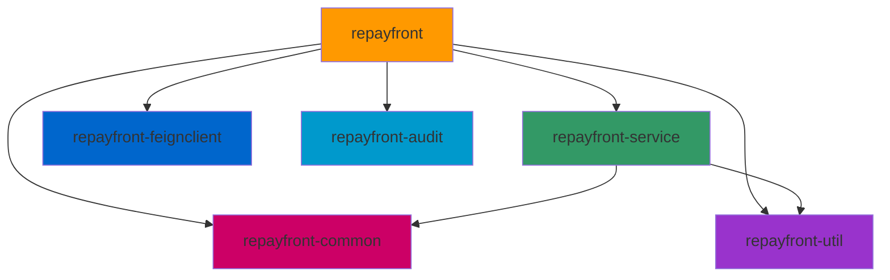

# 还款前置校验系统 - 项目工程结构

## 概述

还款前置校验系统（repayfront）是信贷系统的核心组件，负责在用户还款前进行各种校验操作，确保还款流程的合规性和安全性。

## Maven 模块结构

项目采用 Maven 多模块架构，包含以下 6 个模块：

```
repayfront-parent (root)
├── repayfront-common        # 公共模块
├── repayfront-feignclient   # Feign 客户端
├── repayfront               # 主应用模块
├── repayfront-service       # 服务层
├── repayfront-audit         # 审计模块
└── repayfront-util          # 工具模块
```

## 模块依赖关系



## 各模块职责

### 1. repayfront（主应用模块）

**职责：** 应用的入口和对外接口层

**主要包结构：**
```
cn.caijiajia.repayfront
├── controller          # 控制器层
├── consumer            # MQ 消费者
└── domain              # 领域对象
    └── dto             # 数据传输对象
        └── repayaudit  # 还款审计相关 DTO
```

**核心类：**
- `RepayFrontController` - 还款前置校验控制器
- `RepayAuditController` - 还款审计控制器
- `RepayPolicyController` - 还款策略控制器

### 2. repayfront-service（服务层）

**职责：** 核心业务逻辑实现

**主要包结构：**
```
cn.caijiajia.repayfront
├── service             # 服务接口
│   └── impl           # 服务实现
│       ├── graycheckmode     # 灰度检查模式
│       ├── repayrulequery    # 还款规则查询
│       └── repayruleeval     # 还款规则评估
├── mapping             # MyBatis Mapper
├── config              # 配置类
└── util                # 工具类
```

**核心服务接口：**
- `IClearRepayService` - 清偿还款服务
- `IGrayCheckModeService` - 灰度检查模式服务
- `IRepayBizFlowService` - 还款业务流程服务
- `IRepayOrderService` - 还款订单服务
- `IRepayRuleConfigService` - 还款规则配置服务
- `IRepayRuleEvaluationService` - 还款规则评估服务
- `IRepayRuleQueryService` - 还款规则查询服务
- `IRepayRuleService` - 还款规则服务
- `IRepayToolService` - 还款工具服务

**核心服务实现：**
- `MultiClearRepayService` - 多笔清偿还款服务
- `SingleClearRepayService` - 单笔清偿还款服务
- `RepayCommonService` - 还款公共服务

### 3. repayfront-common（公共模块）

**职责：** 公共类和共享组件

**主要包结构：**
```
cn.caijiajia.repayfront.common
├── vo                  # 视图对象
├── enums               # 枚举类
├── resp                # 响应对象
│   ├── repayaudit      # 还款审计响应
│   └── repaytool       # 还款工具响应
├── req                 # 请求对象
│   ├── repayaudit      # 还款审计请求
│   └── paging          # 分页请求
└── constant            # 常量类
```

### 4. repayfront-feignclient（Feign 客户端）

**职责：** 外部服务调用的 Feign 客户端

**主要包结构：**
```
cn.caijiajia.repayfront.feignclient
```

### 5. repayfront-audit（审计模块）

**职责：** 还款审计相关功能

**主要包结构：**
```
cn.caijiajia.repayfront.audit
├── dto                 # 数据传输对象
│   ├── bpm             # BPM 流程相关
│   ├── mgr             # 管理相关
│   └── repay           # 还款相关
├── util                # 工具类
└── constants           # 常量类
```

### 6. repayfront-util（工具模块）

**职责：** 通用工具和中间件集成

**主要包结构：**
```
cn.caijiajia.repayfront.middleware
├── bizflow             # 业务流程中间件
├── magic               # Magic 配置中心中间件
├── bpm                 # BPM 流程中间件
└── mq                  # MQ 消息中间件
    └── producer        # 消息生产者
```

## 主要依赖服务

### 外部 Feign 客户端

- focusloancore-gateway - 贷款核心网关
- assemblingengine-configclient - 组装引擎配置
- cardengine-common - 卡引擎
- repayengine-common - 还款引擎
- channelcoreconfig - 渠道核心配置
- riskaccountengine - 风控账户引擎
- payment - 支付
- fundwall - 资金墙

### 核心依赖库

- **Guava 28.2-jre** - Google 核心库
- **Apache Commons** - 工具库（lang3, io, collections4, text）
- **ModelMapper 2.3.6** - 对象映射
- **MapStruct 1.5.3.Final** - 映射处理器
- **Lombok** - 代码简化
- **MyBatis Dynamic SQL 1.1.4** - 动态 SQL
- **Swagger 2.9.2** - API 文档

## 数据库配置

- **数据库名称：** repayfront
- **数据库类型：** MySQL / TiDB
- **连接方式：** JDBC，支持 Unicode 和 UTF-8 编码
- **事务管理：** 已启用

## 关键配置

### 线程池配置（业务流程）
- 核心线程数：50
- 最大线程数：50
- 队列容量：1000
- 保持存活时间：300 秒

### 分布式锁
- 配置方式：Redis
- 实现方式：RedisPlus

## 技术栈

- **后端框架：** Spring Boot
- **微服务：** Spring Cloud + Feign
- **持久层：** MyBatis
- **API 文档：** Swagger
- **消息队列：** MQ
- **缓存：** Redis
- **流程引擎：** BPM
- **配置中心：** Magic

## 代码规范

遵循阿里巴巴 Java 开发规范：
- 类名：大驼峰（PascalCase）
- 方法/变量名：小驼峰（camelCase）
- 常量：全大写下划线分隔（UPPER_SNAKE_CASE）

## 安全要求

- 敏感数据加密存储
- 不在日志中输出敏感信息（用户信息、账户信息等）
- 参数校验和防 SQL 注入
- API 接口鉴权
- 数据库访问权限控制
